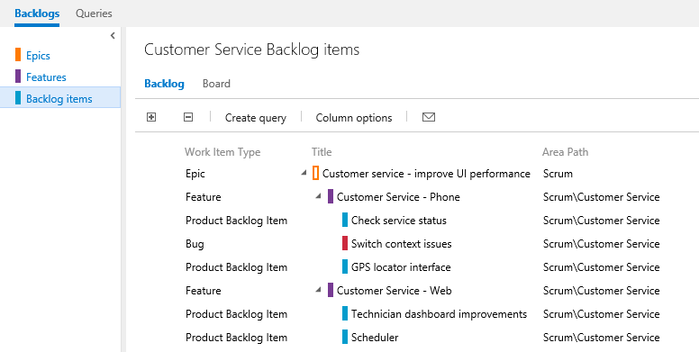
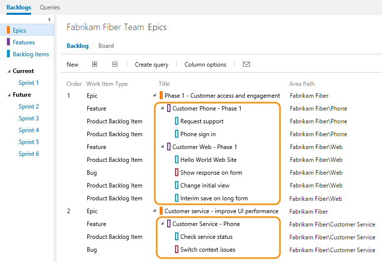
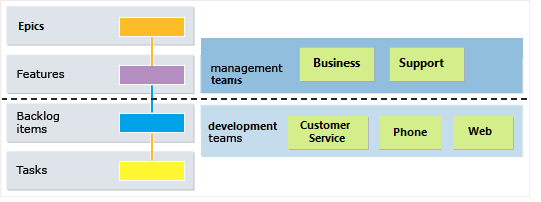

---
title: Organize your backlog
titleSuffix: VSTS & TFS
description:  Organize your backlog by mapping backlog items to features, and features to epics in Visual Studio Team Services & Team Foundation Server  
ms.technology: devops-agile
ms.prod: devops
ms.assetid: DD78C7B9-A6B5-4596-9ADB-281578E615E2  
ms.manager: douge
ms.author: kaelli
author: KathrynEE
ms.topic: conceptual
ms.date: 05/10/2017
--- 

# Work with multi-team ownership of backlog items  

[!INCLUDE [temp](../_shared/dev15-version-header.md)]

When you have several teams, your hierarchical views may show items that belong to other teams.  

Your team's product backlog lists only those items whose area path matches those your team has subscribed to. For details, see [Set team defaults](../../organizations/settings/set-team-defaults.md). However, if you show parents, 
you'll see the parent epic of the features and backlog items, even if the epic or feature is owned by another team. 
Items that are owned by other teams appear with hollow-filled bars.  

  

Here's another example that shows the Epics backlog for the Fabrikam Fiber team. 
Drilling down, you can see all the backlog items and features, even though they 
belong to one of three different teams - Customer Service, Phone, and Web.  
 
  

From these views, you can reparent items, both those that you own and those owned by other teams. 
However, you can't reorder items that another team owns.  

This enables management teams to focus on high level features and epics, and development teams 
to focus on just those backlog items they're responsible to deliver. 

To make this work for you, you'll need to [add teams and set their area paths](../scale/multiple-teams.md). 
For example, you can create a team structure similar to this one with two management and three development teams.

To learn more about hierarchical team and backlog structures, see [Portfolio management](../scale/portfolio-management.md).

## Related articles

- [Define features and epics](define-features-epics.md)
- [Organize your backlog](organize-backlog.md)
- [Backlogs, boards, and plans](backlogs-boards-plans.md)  
- [Select backlog navigation levels for your team](../customize/select-backlog-navigation-levels.md)  