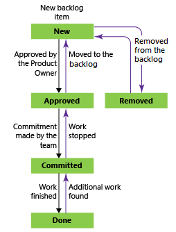
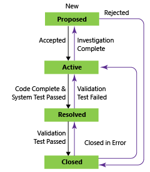

# Workflow states and state categories

All workflows consist of states, transitions, and reasons. A transition supports forward and backward movement among two states. When you add a custom state, the system automatically adds transitions from the custom state to all other inherited states (except for Removed).  

Each state belongs to a state category (previously referred to as a metastate). State categories support the Agile tool backlog and board views. 

 
## Workflow states

Workflow states define how a work item progresses upon its creation to closure. For example, the four main states defined for the User Story (Agile process) define a progression of four states, from New, Active, Resolved, to Closed. (The Removed state supports removing a work item from appearing on the backlog; to learn more, see [Move, change, or delete work items](../backlogs/remove-delete-work-items.md#remove).)

The natural progressions and regressions of the user story, product backlog item, and requirement WITs are as shown.  

User Story (Agile)

Product backlog item (Scrum)

Requirement (CMMI)

  
## State categories

State categories, on the other hand, determine how Agile planning tools and select dashboard widgets treat each workflow state. The state categories used by the backlogs, boards and widgets are Proposed, In Progress, and Complete.

Here's how the default, inherited states map to the state categories for all three system processes plus test case management WITs. The workflow states for Test Case, Test Design, and Test Suite are the same across all three system processes. 

<table valign="top" width="100%">
<tr>
<th width="30%">Categories</th>
<th width="14%">Agile</th>
<th width="14%">Scrum</th>
<th width="16%">CMMI</th>
<th width="16%">Test WITs </th>
</tr>
<tr valign="top" >
<td>**Proposed:** Assign to states associated with newly added work items that should appear on the backlog. The first column on the Kanban or task board maps to a Proposed state. </td> 
<td>New</td> 
<td>New Approved To Do (Task) </td> 
<td>Proposed </td> 
<td>Design (Test Case) </td> 
</tr>
<tr valign="top" >
<td>**In Progress:** Assign to states that represent active work. Work items assigned to states mapped to this category will appear in the backlog (unless you choose to hide them) and make up the middle columns on the Kanban boards. </td> 
<td>Active Resolved (Epic, Feature, User Story)</td> 
<td>Committed Open (Impediment)</td> 
<td>Active Resolved (Epic, Feature, Requirement, Task)</td> 
<td>Active (Test Plan) In Planning (Test Suite) In Progress (Test Suite) Ready (Test Case) </td> 
</tr>
<tr valign="top" >
<td>**Resolved:** Assign to states that represent a solution has been implemented, but are not yet verified. Generally these states apply to bug WITs. Work items in a Resolved state appear on the backlog by default. The Agile tools treat the Resolved state category exactly the same as the In Progress state category. </td> 
<td>Resolved (Bug)</td> 
<td>n/a</td> 
<td>Resolved (Bug, Issue, Review, Risk)</td> 
<td>n/a </td> 
</tr>
<tr valign="top" >
<td>**Completed:** Assigned to states that represent work has finished. Work items whose state is in this category don't appear on the backlog and do appear in the last column of the Kanban board. Note that you can't modify states in this category nor can you add states to this category.</td> 
<td>Closed </td> 
<td>Done </td> 
<td>Closed </td> 
<td>Closed (Test Case) Completed (Test Suite) Inactive (Test Plan)</td> 
</tr>
<tr valign="top" >
<td>**Removed:** Assigned to the Removed state. Work items in a state mapped to the Removed category are hidden from the backlog and board experiences.

<blockquote>**Note:** You should avoid using the Removed state and Removed state category as they are in the process of being deprecated.  Instead, you should [Delete work items](../backlogs/remove-delete-work-items.md) to remove them from the backlog. </td> 
<td>Removed </td> 
<td>Removed</td> 
<td>n/a</td> 
<td>n/a</td> 
</tr>
</table>  

## When to add a State versus a Kanban column

Both States and Kanban columns are used to track the status of work. Workflow states are shared across a team project while Kanban columns are shared within a team. Only project collection admins can add custom states, while team admins can add Kanban columns.  

Add custom states when you want all teams to track the status according to the business workflow adopted by the organization. By customizing the process, you automatically customize the team projects and WITs that reference that process. 

Also, by adding custom states to support those workflow states that several teams want to track, you avoid the confusion that can arise when team's create a query based on a Kanban column. Because each team can customize the Kanban board columns and swimlanes, the values assigned to work items which appear on different boards may not be the same. The primary work around for this issue is to maintain single ownership of work items by team area path. Another work around is to formalize the columns by adding custom states which can be shared across teams. 

##Related notes

- [Lead Time and Cycle Time control charts (widgets)](../../report/guidance/cycle-time-and-lead-time.md)
- [Customize a workflow for a process (Inheritance process model)](../process/customize-process-workflow.md)
- [Change the workflow for a work item type](../reference/change-workflow-wit.md)
- [ProcessConfiguration XML element reference](../reference/process-configuration-xml-element.md)
- [Customize your work tracking experience](../customize/customize-work.md) 