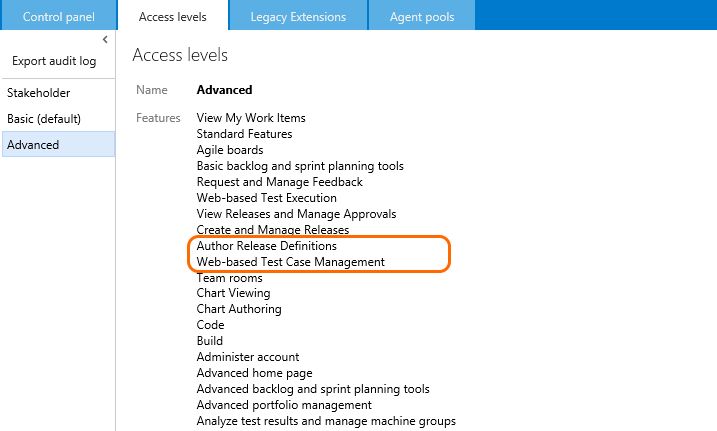
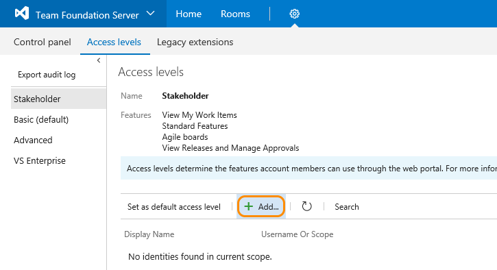

# Change access levels

**TFS 2017 | TFS 2015 | TFS 2013**  


>[!IMPORTANT]  
>This topic applies to managing access levels for team projects defined on an on-premises Team Foundation Server (TFS). To manage access levels for Team Services, see [Manage users and access in Visual Studio Team Services](../../setup-admin/team-services/add-account-users-assign-access-levels-team-services.md). For Team Services feature availability, see the [Visual Studio Team Services Feature Matrix](https://www.visualstudio.com/pricing/visual-studio-online-feature-matrix-vs).

To connect and use the functions and features that TFS provides, users must be added to a group with the appropriate permissions. To use select web portal features, they must also belong to the access level that enables access to that feature.

When you add a user or group to a team or team project, they're automatically granted access to those features supported by the default access level, which is Basic. This provides most users all the features they need. For a simplified overview of the permissions assigned to the most common groups&#151;Readers, Contributors, and Project Administrators&#151;as well as the Stakeholder access group, see [Permissions and access](../../setup-admin/permissions-access.md).  

Make sure to set each user's access level based on what you've purchased for that user. Basic access includes all Stakeholder features. Advanced and Visual Enterprise access levels include all Basic features. In the images provided below (click &#x25BC; to view), the circled features indicate the features made available from the previous access level.

<ul>
<li>Assign <a data-toggle="collapse" href="#basic-access">**Basic** &#x25BC;</a>, the default access level, to users with a TFS client access license (CAL).
Basic provides access to most features, except for Test.
All Visual Studio subscriptions and paid Team Services users include a TFS CAL.
Find out more about licensing from the [Team Foundation Server pricing page](https://www.visualstudio.com/team-services/tfs-pricing).   
<div class="collapse" id="basic-access">
  		
</div>
</li>

<li>Assign <a data-toggle="collapse" href="#stakeholder-access">**Stakeholder** &#x25BC;</a> access to those users who need to enter bugs, view backlogs, boards, charts, and dashboards, but who don't have a TFS CAL.
<div class="collapse" id="stakeholder-access">
  		
</div>
Stakeholder access is free. Stakeholders can also view releases and manage release approvals.
See [Stakeholder access](work-as-a-stakeholder.md) for details of features available to stakeholders.
</li>

<li>For <u>TFS 2013 and TFS 2015 versions</u>, Assign <a data-toggle="collapse" href="#advanced-access">**Advanced** &#x25BC;</a> access to those users for whom you've purchased the full Test feature set. Here are the purchasing options:  
<div class="collapse" id="advanced-access">
  		
</div>
<ul>
<li>Higher-level Visual Studio subscriptions: Visual Studio Test Professional, Visual Studio Enterprise, or MSDN platform subscriptions.
		These include a TFS CAL plus the rights to access the full set of Test features. </li>
<li>A paid Visual Studio Team Services user (which includes a TFS CAL) plus the [Test Manager extension](#test-manager).</li>
</ul>
</li>

<li>For <u>TFS 2017.2</u>, Assign <a data-toggle="collapse" href="#advanced-access-2017-2">**Advanced** &#x25BC;</a> access to those users for whom you've purchased MSDN Platform or Visual Studio Test Professional subscriptions. These include a TFS CAL plus the rights to access Test Manager. To learn more, see [Get extensions for TFS, Assign paid extension access to users](../../marketplace/get-tfs-extensions.md#assign-extension).
<div class="collapse" id="advanced-access-2017-2">

</div>
<blockquote>**Note**: The **Advanced** access level will be deprecated for future versions of TFS. Use the **VS Enterprise** access level only for active Visual Studio Enterprise subscribers. For MSDN Platforms and Visual Studio Test Professional with MSDN subscribers needing access to the Test hub, assign them to the Advanced access level and the Test Manager extension. </blockquote>
</li>

<li>For <u>TFS 2017 versions</u>, Assign <a data-toggle="collapse" href="#vs-enterprise-access">**VS Enterprise** &#x25BC;</a> access to those users for whom you've purchased Visual Studio Enterprise. These include a TFS CAL plus the rights to access VS Enterprise features. (For users with MSDN subscriptions or Test Professional, assign the Basic access level and the Test Manager extension.) To learn more, see [Get extensions for TFS, Assign paid extension access to users](../../marketplace/get-tfs-extensions.md#assign-extension). For example, for users with Visual Studio Test Professional or Visual Studio Enterprise, assign them [access to the Test Manager extension](../../marketplace/get-tfs-extensions.md#assign-extension).
<div class="collapse" id="vs-enterprise-access">
  		
</div>
</li>


</ul>

<a id="manage-access" >  </a>
## Manage access

You manage access levels for all collections defined on the application tier for TFS. The default access level you set applies to all team projects defined for all collections. Users or groups that you add to teams, team projects, or collections are granted the access level that you set as the default. To change the access level for a specific group or user, you add them specifically to one of the other, non-default access levels.

<a id="add-user" >  </a>
### Set the access level for a user or group  

>[!IMPORTANT]  
>Even if you set a user or group's access level, you must add them to a team project collection or team project for them to connect to TFS and access features available through a supported client or the web portal.  

If you're managing access for a large group of users, a best practice is to first create either a [Windows group or TFS group](../../setup-admin/tfs/admin/setup-ad-groups.md) and add individuals to those groups.

>[!NOTE]  
>The images you see from your web portal may differ from the images you see in this topic. These differences result from updates made to your on-premises TFS. However, the basic functionality available to you remains the same unless explicitly mentioned.  

From a user context, open the admin context by clicking the  gear Settings icon. The tabs and pages available differ depending on which admin context you access.

<div style="background-color: #f2f0ee;padding-top:10px;padding-bottom:10px;">

<ul class="nav nav-pills" style="padding-right:15px;padding-left:15px;padding-bottom:5px;vertical-align:top;font-size:18px;">

<li style="float:left;" data-toggle="collapse" data-target="#admin-intro">Change access level</li>

<li style="float: right;"><a style="max-width: 374px;min-width: 120px;vertical-align: top;background-color:#AEAEAE;margin: 0px 0px 0px 8px;min-width:50px;color: #fff;border: solid 2px #AEAEAE;border-radius: 0;padding: 2px 6px 0px 6px;outline-style:none;height:32px;font-size:14px;font-weight:400" data-toggle="pill" href="#tfs-admin-intro-2015">TFS 2015, TFS 2013</a></li>

<li style="float: right;"><a style="max-width: 374px;min-width: 120px;vertical-align: top;background-color:#AEAEAE;margin: 0px 0px 0px 8px;min-width:50px;color: #fff;border: solid 2px #AEAEAE;border-radius: 0;padding: 2px 6px 0px 6px;outline-style:none;height:32px;font-size:14px;font-weight:400" data-toggle="pill" href="#tfs-admin-intro-2017">TFS 2017</a></li>


</ul>

<div id="admin-intro" class="tab-content collapse in fade" style="background-color: #ffffff;margin-left:5px;margin-right:5px;padding: 5px 5px 5px 5px;">


<div id="tfs-admin-intro-2017" class="tab-pane fade in active">
<ol>
<li><p>From the web portal home page for a team project (for example, ```http://MyServer:8080/tfs/DefaultCollection/MyProject/```), open the Server Settings administration context.</p>  

  
</li>
<li>
<p>From the Access levels page, select the access level you want to manage. For example, here we click Add to add a group to Stakeholder access.</p>  

	

<p>If you don't see the Access levels tab, you aren't a TFS administrator and don't have permission. [Here's how to get permissions](../../setup-admin/add-administrator-tfs.md).</p>  
</li>
</ol>  
</div>


<div id="tfs-admin-intro-2015" class="tab-pane fade">

<ol>
<li>
<p>From the web portal home page for a team project (for example, ```http://MyServer:8080/tfs/DefaultCollection/MyProject/```), open the administration context.</p>  


</li>
<li>
<p>From the Access levels page, select the access level you want to manage. For example, here we add a group to Stakeholder access.</p>  

	

<p>If you don't see the Access levels tab, you aren't a TFS administrator and don't have permission. [Here's how to get permissions](../../setup-admin/add-administrator-tfs.md).</p>  
</li>

</ol>


</div>


</div>
</div>


<a id="set-default" >  </a>
### Change the default access level

Change the default access level to match the access you have licenses for. If you change the default access level to Stakeholder, all users not explicitly added to the Basic or Advanced level will be limited to the features provided through Stakeholder access.

>[!IMPORTANT]  
>Service accounts are added to the default access level. If you set Stakeholder as the default access level, you must add the TFS service accounts to the Basic or Advanced group.    

You set an access level from its page. Click Set as default access level as shown.

  


<a id="export-audit-log" >  </a>
### List users and groups who have access  

You can get a list of users and groups that have access to the server by exporting the audit log. The audit log also indicates which access level has been granted.   

1. From the Access levels page, export the audit log.  

	  

2. Save the audit log .csv file which is downloaded to a folder.  

3. You can open the file in Excel and determine the access level assigned to each group or user.

<a id="guide-features-access" >  </a>
##Guide to features and access levels

You can learn more about each of the features you have access to from the following topics. Basic  includes all features supported by Stakeholder, and Advanced includes access to all features supported by Basic.

<div style="float:left;width:240px;margin:3px">
<p style="font-weight:bold;padding-bottom:0px;text-align:center;">Stakeholder access<sup> 1</sup></p>
<ul style="padding-left:10px;font-size:90%">
 <li style="margin-bottom:2px">View My [Work items](../backlogs/add-work-items.md)</li>
 <li style="margin-bottom:2px">Standard features: [Dashboards](../../report/dashboards.md) & [Queries](../track/using-queries.md)<sup> 2</sup></li>
 <li style="margin-bottom:2px">Agile boards: [Backlogs](../backlogs/create-your-backlog.md), [Kanban](../kanban/kanban-basics.md) & [Task](../scrum/task-board.md) <sup> 3</sup></li>
 <li style="margin-bottom:2px">[View releases and manage approvals](../../build/actions/view-manage-releases.md)<sup> 4</sup></li>
</ul>
</div>

<div style="float:left;width:240px;margin:3px">
<p style="font-weight:bold;padding-bottom:0px;text-align:center;">Basic access<sup> 5</sup></p>
<ul style="padding-left:30px;font-size:90%">
 <li style="margin-bottom:2px">[Basic & Advanced backlog and sprint planning tools](../scrum/sprint-planning.md)</li>
 <li style="margin-bottom:2px">[Request and manage feedback](get-feedback.md)<sup> 6</sup></li>
 <li style="margin-bottom:2px">[Chart viewing & Chart authoring](../../report/charts.md)</li>
 <li style="margin-bottom:2px">Code: [Git](../../git/overview.md) and [TFVC](../../tfvc/overview.md)</li>
 <li style="margin-bottom:2px">[Build](../../build/overview.md)</li>
 <li style="margin-bottom:2px">[Administer account](#administer-account)<sup> 7</sup></li>
 <li style="margin-bottom:2px">[Advanced home page](../../reference/markdown-guidance.md)<sup> 8</sup></li>
 <li style="margin-bottom:2px">[Web-based test execution](../../test/manual-exploratory-testing/getting-started/run-manual-tests.md)
 <li style="margin-bottom:2px">[Create and manage releases](../../build/actions/create-deploy-releases.md)<sup> 4</sup></li>
 <li style="margin-bottom:2px">[Author release definitions](../../build/concepts/definitions/release/index.md)<sup> 4</sup></li>
 <li style="margin-bottom:2px">[Advanced portfolio management](../backlogs/define-features-epics.md)</li>
 <li style="margin-bottom:2px">[Team rooms](../../collaborate/collaborate-in-a-team-room.md)</li>
 <li style="margin-bottom:2px">[Analyze test results and manage machine groups](https://msdn.microsoft.com/library/dd286743.aspx)</li>

</ul>
</div>

<div style="float:left;width:240px;margin:3px">
<p style="font-weight:bold;padding-bottom:0px;text-align:center;">Advanced access<br/>(TFS 2017, TFS 2015, TFS 2013)</p>
<ul style="padding-left:30px;font-size:90%">
 <li style="margin-bottom:2px">[Web-based test case management](../../test/manual-exploratory-testing/getting-started/create-a-test-plan.md)<sup> 9</sup></li>
</ul>
<blockquote>Advanced access will be deprecated in future versions of TFS.</blockquote>
<p style="font-weight:bold;padding-bottom:0px;text-align:center;">VS Enterprise (TFS 2017)</p>
<ul style="padding-left:30px;font-size:90%">
 <li style="margin-bottom:2px">Microsoft published TFS Extensions<sup> 10</sup></li>
</ul>


</div>

<div style="clear:left;font-size:100%">
</div>

####Notes:
1.	With Stakeholder access, users can create and modify all work items, and can create and save queries on all work items under their My Queries folder. (This is a change from Limited access in which users could create and modify only those work items that they created and query and view work items they created.)
Also, stakeholders can create and modify work items using Team Foundation clients such as Visual Studio Community, Microsoft Excel, Microsoft Project, and Microsoft Feedback Client.
2.	Standard features include access to the Home and Work hubs.
3. 	Includes all backlogs and boards, including product, portfolio, and sprint backlogs and Kanban and sprint task boards. Can add work items to backlogs, which appear at the bottom of the list. Can't reorder items on the page or use some other features. See [Stakeholder access](work-as-a-stakeholder.md) for details.
4. 	Server-client version of Release Management that shipped with TFS 2013 and TFS 2015 required users to have an Advanced access level to author release definitions. Integrated web-based version of Release Management shipped with TFS 2015 as [preview](../../build/concepts/licensing/concurrent-pipelines-tfs.md#tfs_before_2017), and only required Basic access level for all tasks. Integrated web-based version of Release Management that ships with TFS 2017 is available to all users with Basic access level.
5.	Basic access allows you to access the Code, Build, and Test hubs in addition to the Home and Work hubs.
6.	Request and manage feedback is now available within the Basic access level when you [upgrade your application server to TFS 2015 Update 1 or later version](https://www.visualstudio.com/downloads/download-visual-studio-vs).
7.	You can open the Admin context and view and modify settings provided you are a team, project, or project collection administrator. See [Administer account features](#administer-account).
8.	Advanced home page allows you to configure and view the Welcome page in addition to team dashboards.  
9.	You can [purchase Test Manager extensions and assign to user accounts](#test-manager) to gain full access to web-based Test case management tools.
10.	With VS Enterprise access, users have access to any fee-based, Marketplace extension published by Microsoft Marketplace extension published by Microsoft that is included for active Visual Studio Enterprise subscribers. Examples include [Package Management](https://marketplace.visualstudio.com/items?itemName=ms.feed) (which is also free for 5 users who are not Visual Studio Enterprise subscribers) and [Test Manager](https://marketplace.visualstudio.com/items?itemName=ms.vss-testmanager-web).    


<a id="grant-permissions"  >  </a>  
## Permissions versus access levels  

As previously mentioned, setting the access level for  users or groups doesn't provide them access to a team project or the web portal. Only users or groups added to a team or TFS group can connect to a team project and the web portal. Make sure your users have both the permissions and the access level they need. You do this by making sure they're [added to the team project](../../setup-admin/add-users.md) or as a [team member](../scale/multiple-teams.md#add-team-members).

TFS controls access through these three inter-connected functional areas:

-   **Access level management** controls access to features provided via the web portal, the web application for TFS. Based on  what has been purchased for a user, administrators set the user's access  level to Basic, Advanced, or Stakeholder (previously labeled Standard, Full, and Limited).

-   **Membership management** supports adding individual Windows user accounts and groups to default TFS groups. Also, you can create TFS groups. Each default TFS group is associated with a set of default permissions. All users added to any TFS group are added to the Valid Users group. A valid user is someone who can connect to the team project.

-   **Permission management** controls access to specific functional tasks at different levels of the system. Object-level permissions set permissions on a file, folder, build definition, or a shared query. Permission settings correspond to **Allow**, **Deny**, **Inherited allow**, **Inherited deny**, and **Not set**.

Each functional area uses groups to simplify management across the deployment. You add users and groups through the TFS web service administration pages. Permissions are automatically set based on the TFS group that you add users to, or based on the object, project, collection, or server level to which you add groups. On the other hand, access level management controls access for all users and groups at the server level.

  

You can create local groups or Active Directory (AD) [groups to manage your users](../../setup-admin/tfs/admin/setup-ad-groups.md). If you decide to use groups, make sure that membership in those groups is limited to TFS users. Because group membership can be altered by their owners at any time, if those owners did not consider TFS when they created those groups, their changes to membership can cause unwanted side effects within TFS.  

Here's what you need to know about permission settings:  

-   **Allow** or **Deny** explicitly grants or restricts users from performing specific tasks, and are usually inherited from group membership.  

-   **Not set** implicitly denies users the ability to perform tasks that require that permission, but allows membership in a group that does have that permission set to take precedence, also known as **Inherited allow** and **Inherited deny**.  

-   For most groups and almost all permissions, **Deny** trumps **Allow**. If a user belongs to two groups, and one of them has a specific permission set to **Deny**, that user will not be able to perform tasks that require that permission even if they belong to a group that has that permission set to **Allow**.  

    For members of the **Project Collection Administrators** or **Team Foundation Administrators** groups, Deny doesn't trump Allow. Permissions assigned to these groups take precedent over any Deny set within any other group to which that member might belong.

-   Changing a permission for a group changes that permission for all users who are granted that permission through their membership in that group. In other words, depending on the size of the group, you might affect the ability of hundreds of users to do their jobs by changing just one permission. So make sure you understand the impact before you make a change.

Two useful tips for understanding the effects of change: The **Member of** tab shows the groups that an individual user or group belongs to. You can also hover over an inherited permission, and a **Why?** icon will appear. If you choose it, a dialog box will open with more information.

  

## Related notes

To learn all about what's new in TFS, see [What's new](../../whats-new.md).

To get started, manage permissions, or learn more about features made available through access to TFS, see these topics:    

<div style="float:left;width:180px;margin:3px;font-size:90%">
<p style="font-weight:bold;padding-bottom:0px;text-align:center;font-size:90%">Get started</p>
- [Work in the web portal](../../connect/work-web-portal.md)   
- [Team Services](../../setup-admin/get-started.md#account-setup)   
- [TFS](../../setup-admin/get-started.md#team-foundation-server)   
- [Git](../../git/overview.md)  
- [TFVC](../../tfvc/overview.md)   
</div>


<div style="float:left;width:180px;margin:3px;font-size:90%">
<p style="font-weight:bold;padding-bottom:0px;text-align:center;font-size:90%">Manage permissions</p>
- [Permissions & access](../../setup-admin/permissions-access.md)  
- [Add team members](../scale/multiple-teams.md#add-team-members)  
- [Restrict access to features](../../setup-admin/restrict-access-tfs.md)  
- [Permissions reference](../../setup-admin/permissions.md)  
</div>

<div style="float:left;width:180px;margin:3px;font-size:90%">
<p style="font-weight:bold;padding-bottom:0px;text-align:center;font-size:90%">Plan and track work</p>
- [Agile project management](../agile-project-management.md)  
- [Agile tools overview](../overview.md)  
- [Backlogs, boards, and plans](../backlogs-boards-plans.md)  
- [Dashboards and reports](../../report/overview.md)   
- [Configure features after an upgrade](../customize/configure-features-after-upgrade.md)  
</div>


<div style="float:left;width:180px;margin:3px;font-size:90%">
<p style="font-weight:bold;padding-bottom:0px;text-align:center;font-size:90%">Build,  test, release</p>
- [Build](../../build/overview.md)  
- [Test](../../test/index.md)  
- [Release](../../build/concepts/definitions/release/index.md)  
</div>

<div style="clear:left;font-size:100%">
</div>


<a id="administer-account" >  </a>

Within the admin context, there are several hubs which support administrating features at the team, project, or project collection level. You can learn more from these resources:

<div style="float:left;width:180px;margin:3px;font-size:90%">
<p style="font-weight:bold;padding-bottom:0px;text-align:center;font-size:90%">Project collection level</p>
- [Create team project](../../setup-admin/create-team-project.md)   
- [Delete team project](../../setup-admin/delete-team-project.md)   
- [Security, permissions](../../setup-admin/permissions.md#collection)   
- [Build settings](../../build/concepts/policies/retention.md)   
- [Agent queues](../../build/concepts/agents/pools-queues.md)    

</div>

<div style="float:left;width:180px;margin:3px;font-size:90%">
<p style="font-weight:bold;padding-bottom:0px;text-align:center;font-size:90%">Team project and team level</p>
- [Overview, teams](../scale/multiple-teams.md)   
- [Areas, Iterations](../customize/modify-areas-iterations.md)   
- [Security, permissions](../../setup-admin/permissions.md#project_test)   
- [Alerts](../track/alerts-and-notifications.md)    
- [Service Hooks](../../service-hooks/get-started.md)   

</div>

<div style="clear:left;font-size:100%">
</div>


<a id="test-manager"  >  </a>
###Access to the Test hub and Marketplace extensions

Full access to the Test hub requires Advanced (TFS 2015) or VS Enterprise (TFS 2017) access . Visual Studio Test Professional plus the Test hub features in the TFS web portal are managed through Visual Studio Team Services, Azure billing services, and purchase of Test Manager extensions from the Marketplace.  

To learn how to grant access to an extensions, see [Get extensions for TFS](../../marketplace/get-tfs-extensions.md).  

### What features are accessible to users who belong to two different groups?
If a user belongs to a group that has Basic access and another group that has Advanced access, the user has access to all features available through Advanced, which is a superset of Basic.

### Service account access  
[TFS service accounts](../../setup-admin/tfs/admin/service-accounts-dependencies-tfs.md) are added to the default access level. If you make Stakeholder the default access level, you must set the TFS service accounts to Basic or Advanced/VS Enterprise access.  

Service accounts don't require a TFS CAL or other purchase.  
