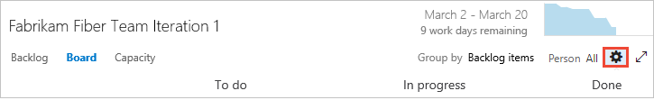

# Customize cards  

[!INCLUDE [temp](../_shared/dev15-version-header.md)]  

While many work tracking views show up as lists&mdash;such as your backlogs and queries&mdash;board views display cards. Information rich cards not only provide at-a-glance info of interest to you and your team, they also provide a way for you to update a field without opening the work item. And, with style rules, you can highlight those work items with select colors based on the criteria you set.  

Each card corresponds to a work item which you use to share information, track status, and assign work. 

In this example, the bug work item type (WIT) shows all the core fields, three additional fields, and tags. Also, To make severity 1 bugs stand out, a styling rule has been added to cause the card to display as yellow.  

<table>
<tbody valign="top">
<tr>
<td>
In this example, the following customizations have been set for the bug work item type (WIT):
<ul>
<li>Show all core fields: ID, Assigned To, Story Points, Tags </li>
<li>Show three additional fields: State, Changed By, and Changed Date</li>
<li>Apply tag colors</li> 
<li>Apply styling rule to display bugs with Severity=1 as yellow and bold and underline the Title field</li>  
</ul>
</td>
<td width="460px">

</td>
</tr>
</tbody>
</table>

You can either increase or simplify the information that displays on your cards. It all depends on what's of interest to your team. Does your team like to refer to work items by their ID? Do they want to see estimates? Do they want to highlight work items according to set criteria? Or, will just the bare bones of title and assignment suffice? 

Your best bet is to show fields on cards based on what your team frequently refers to or updates when using the Kanban and task boards. If you're new to working with these tools, see [Kanban basics](../../Work/kanban/kanban-basics.md) and [Sprint planning](../scrum/sprint-planning.md). 


[!INCLUDE [temp](../_shared/feature-availability-simple.md)]

<table width="80%">
<tr>
<th width="20%">Option </th>
<th width="20%">VSTS</th>
<th width="20%">TFS 2015 </th>
<th width="20%">TFS 2015.1,2 </th>
<th width="20%">TFS 2017 </th>
</tr>


<tr>
<td align="left">[Fields](#fields)</td>
<td></td>
<td></td>
<td></td>
<td></td>
</tr>

<tr>
<td align="left">[Styles](#styles)</td>
<td></td>
<td>   </td>
<td></td>
<td></td>
</tr>

<tr>
<td align="left">[Tag colors](#color-tags)</td>
<td></td>
<td>   </td>
<td></td>
<td></td>
</tr>

<tr>
<td align="left">[Annotations](#annotations)</td>
<td></td>
<td>   </td>
<td>   </td>
<td></td>
</tr>

<tr>
<td align="left">[Tests](#tests)</td>
<td></td>
<td>   </td>
<td>   </td>
<td></td>
</tr>


</table>


<a id="fields"></a>
## Add fields and update them from the board
Using the board views provides you with quick and easy ways to update work items as work progresses. Making daily or frequent updates helps everyone on your team stay in sync with what's been done and what needs doing next. 

To update status of a work item, you simply drag-and-drop cards to a different column. To change the order or stack ranking of a work item, you drag a card up or down within a column. 

For example, on the Kanban board, moving the card from Analyze to Develop updates the corresponding State field. In this case, the State field updates from Approved to Committed. 


Another handy feature is to simply update a field without having to open the work item. You can update most fields shown on the card. Here we reassign a requirement. 


This quick update feature is particularly useful when you need to update a number of work items at once. For example, you can add estimates for backlog items on the Kanban board or update remaining work on the task board. 

To change the title, click the pencil icon in the upper-right corner. To add tags, double-click the work item to open it. And, just a reminder, you can't change the IDs for a work work item, not from the card and not from within the form. 

To customize cards on the Kanban board, see [Change how cards display on the Kanban board](#kanban-board). To customize task board cards, see [Change how cards display on the task board](#task-board).  

<a id="styles"></a>
## Highlight work items based on custom criteria 

>[!NOTE]  
><b>Feature availability: </b>This feature is supported from VSTS or the web portal for TFS 2015.1 or later version. 

With styling rules, you can cause cards to change color when their corresponding work items meet criteria that you set. Here, we highlight severity 1 bugs by having the cards display as yellow. 


### Example styling rules 
What rules should you apply to highlight work items? Here are a few examples and their associated criteria . 


| Work items | Criteria |
|------------|------------|
| High priority items | ```Priority = 1``` |
| High effort items | ```Effort > 20 ``` or ```Story Points > 20 ``` |
| Stale items unchanged in the last 5 days | ```Changed Date > @Today-5``` |
|Title contains a key word | ```Title Contains Yes``` |
|Severity 1 bugs | ```Severity = 1 - Critical   AND   Work Item Type = Bug``` |
|High value business items | ```Business Value > 50``` |
|Items assigned to specific feature area  | ```Area Path Under Fabrikam Fiber\Phone``` |
|Contains specific tag   | ```Tags Contain RTM``` |
|Blocked tasks (Scrum process only) | ```Blocked = Yes``` |


<a id="kanban-board">  </a>

## Change how cards display on the Kanban board

As a first step, you'll see that you can change the card display for each work item type (WIT) that shows up on your Kanban board. 

1. From your Kanban board, open Settings (for on-premises TFS, choose Cards).   

	  

	If you're not a team admin, [get added as one](../scale/add-team-administrator.md). Only team and project admins can customize cards. Learn more about accessing and using your Kanban board from [Kanban basics](../kanban/kanban-basics.md).  

2. Select the WIT you want to customize. Different WITs may present different options for customization.   

	Here we choose User Story. Your choices will vary based on the following:   
	<ul>
	<li>You connect to VSTS or an on-premises TFS</li>
	<li>[Process](../work-items/guidance/choose-process.md) used to create your team project</li>
	<li>Whether your team has chosen to [treat bugs like requirements or like tasks](show-bugs-on-backlog.md) </li>

	**Card field options:** <br/>
	<table>
	<tbody valign="top">
	<tr>
	<th>VSTS and TFS 2015 Update 1 options</th>
	<th>TFS 2015 options</th>
	</tr>
	<tr><td>Select core fields&mdash;ID, Assigned to, Estimate, Tags&mdash;to display on the card</td>  <td>Select core fields to display on the card</td> </tr>
	<tr>
	<td>Choose to show avatar, full name, or both for Assigned to field  </td>  <td>Choose to show avatar, full name, or both for Assigned to field</td> </tr>
	<tr><td>Add and reorder fields that display on the card</td> <td>Add fields that display on the card (To change the order, you have to start over) </td> </tr>
	<tr><td>Choose to show or hide fields that contain no data</td>  <td>n/a</td> </tr>
	</tbody>
	</table>

	**VSTS and TFS 2015 Update 1 options:**  

	

	**TFS 2015 options:**   

	

1. Once you've clicked a WIT, select all the options that you want for that work item type.

	If you want work estimates to show, check the Show Effort, Story Points, Size, or Cost option. Cost corresponds to these fields: Effort ([Scrum](../work-items/guidance/scrum-process.md)), Story Points ([Agile](../work-items/guidance/agile-process.md)), and Size ([CMMI](../work-items/guidance/cmmi-process.md)) field.

2. To add a field to a card, click  to select a field from the drop-down menu. <br/>

	  

3. To add a custom field, you must first [add it to the WIT definition](add-modify-field.md). <br/>

	Here we've added three fields:<br/>

	  

	You can edit a value in a field you add to a card, unless it's a read-only field, such as the Change By and Changed Date fields.  

You can also customize the cards that appear on the Kanban board for features and epics. You follow similar steps, however you start from the [corresponding portfolio backlog](../backlogs/define-features-epics.md). 


<a id="task-board">  </a>
## Change how cards display on the task board
Scrum teams use the task board to burn down work and report on progress during daily standups. Your task board shows cards that correspond to both requirements and tasks. If you want bugs to appear on the task board, change your team settings for [show bugs on the backlogs and boards](show-bugs-on-backlog.md).

You change the way cards display on the task board the same way you change the Kanban cards display. Only here, you start from the task board.

1.	Open Settings from your task board (for on-premises TFS, choose Cards).  

	  

	Remember, only [team or project administrators](../scale/add-team-administrator.md) can customize the task board.  

2.	Just as before, choose the WIT you want to customize, and then checkmark or select the options you want.  

	**VSTS and TFS 2015 Update 1 options:**   
	
	  

	**TFS 2015 options:**  

	  

3.	Repeat this step for each WIT you want to change. Don't be surprised if the options change when you click on a different WIT. For example, Show Remaining Work only applies to tasks and perhaps bugs, but not to PBIs or requirements.  

4.	To add a field to a card, click the add field icon to select a field from the drop-down menu. 

<a id="style-rule">  </a>
## Add style rules to highlight work items with color 

>[!NOTE]  
><b>Feature availability: </b>This feature is supported from VSTS or the web portal for TFS 2015.1 or later version.   

1.	To cause a card on the Kanban board to change color based on criteria you specify, open Styles. Add a styling rule and set the criteria for the rule.  

	  

	Follow these rules when creating and ordering your style rules:
	- The criteria you specify works in a similar fashion as when [constructing a query](../track/using-queries.md) 
	- All clauses are considered AND clauses, grouping clauses isn't supported  
	- Card rules apply to all work items that meet the rule criteria  
	- Rule color applies to work items based on the order in which rules are listed. If you add more than one style rule, make sure that you move them in the order of most importance. Simply drag them into the order you want them applied.  
	- You can quickly enable and disable a style rule  
<br/>
2.	To highlight work items on the task board, open Styles from the task board Settings and add a styling rule.  
	Here we add a Stale tasks rule which highlights tasks that haven't changed in the last five days.

	  

<a id="color-tags">  </a>
## Add color to your tags  

>[!NOTE]  
><b>Feature availability: </b>This feature is supported from VSTS or the web portal for TFS 2015.1 or later version. 

1.	Prior to setting tag colors, first [add tags to backlog items](../track/add-tags-to-work-items.md) that you want to highlight with color.   

2.	To add color to Kanban cards, open Tag colors and select a tag and the color you want it to display.  

	  
 
	If tags don't display on the cards, open Fields and make sure that you've checked Show Tags. 


<a id="annotations">  </a>
## Annotations  

>[!NOTE]  
><b>Feature availability: </b>This feature is supported from VSTS and TFS 2017.  

With the Kanban board, you gain a rich set of tools and a rich set of customization options. Annotations provide visual cues about work items, indicating the number of tasks or tests that have been defined for that work item. Click an annotation to expand the set or gain more information. 

As shown in the following examples, the Task and Test annotations indicate that two each of tasks and tests have been defined for the work item. If you find that there are some features you're not using, you can disable them from the Annotations tab. 

> [!div class="mx-tdBreakAll"]  
> | Task annotations  |Test annotations  |No annotations |
> |-------------|----------|----------|    
> | |   |  | 

To learn more about using these features, see [Add task checklists](../kanban/add-task-checklists.md) and [Add, run, and update inline tests](../kanban/add-run-update-tests.md).  

### Enable or disable an annotation 

1. To open, click the  gear icon from your team's Kanban board.  

	 

	If you're not a team admin, [get added as one](../scale/add-team-administrator.md). Only team and project admins can set team settings.  

2. From the Annotations tab, check those annotations that you want enabled. For example, to enable tasks but disable tests, check the following boxes.     

	  

	The setting you choose applies to all active Kanban boards for your team, i.e., backlog, features, and epics.  


<a id="tests">  </a>
## Configure inline tests

>[!NOTE]  
><b>Feature availability: </b>This feature is available from VSTS and TFS 2017. 

You can control the test plan under which inline tests you add through the Kanban board are created. You can choose to create a new test plan for each new test that you add, or add all new tests to a selected test plan going forward. 

1. To open, click the  gear icon from your team's Kanban board.  

	If you're not a team admin, [get added as one](../scale/add-team-administrator.md). Only team and project admins can set team settings.  

2. From the Tests tab, choose the option you want. You must enable the Test annotation feature in order to configure tests. To select a test plan, click the  actions icon and select one test plan from the query provided.      

	  

3. Save your changes. 
	  
###Open the test plan, test suite from a card

From a card on the Kanban board, you can easily navigate to the underlying test plan and test suite under which the tests are created. Click the  open icon to open another browser tab showing the Test hub and associated test plan and test suite that controls the inline tests.

  


## Related notes
That's all there is to card customization. See these choices for further options to customize the Kanban and task board:

*	[Add, rename, move, and delete columns](../kanban/add-columns.md)  
*	[Card reordering](reorder-cards.md)  
*	[Split columns](../kanban/split-columns.md)  
*	[Expedite work](../kanban/expedite-work.md)  
*	[Show bugs on backlogs and boards](show-bugs-on-backlog.md)  

For even more customization options for work tracking, start with [Customize your work tracking experience](customize-work.md). 
