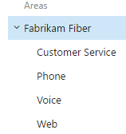
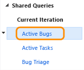
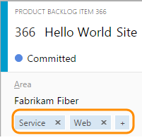

# Customize your work tracking experience 

**Team Services | TFS 2017 | TFS 2015 | TFS 2013**

As you plan and track your project, you'll find you may want to configure a feature or customize your experience to meet your team's tracking needs. You configure teams and team Agile tools through the web portal administration context. The method you use to customize team projects, which impacts all teams, depends on the process model you use.  

Customizations you make occur at one of three levels:   

- **Team project level**: Add or modify work item types, data fields, backlog levels, and other objects shared across teams  
- **Object level**: Grant or restrict access to work tracking tools, which includes setting permissions for objects and the team project and assigning users or groups to specific access levels.  

>[!NOTE]  
>If you're new to tracking work in Team Services or TFS, see [Get started with Agile tools to plan and track work](../overview.md). 


<a id="shared-resources"></a>
## Shared resources  

Each team project provides a number of shared resources that support all teams added to the project. You configure these features through the user interface or the admin context of the web portal. 

> [!div class="mx-tdBreakAll"]  
> |Area path pick lists | Sprint/iteration pick lists | 
> |-------------|----------| 
> |Change the [pick list of area paths](set-area-paths.md) to support grouping work items by team, product, or feature area.<br/> 
 | Change the [pick list of iteration paths](../scrum/define-sprints.md) to support grouping work into sprints, milestones, or other event-specific or time-related period. Activate sprints for each team.<br/> 
 |
 
> [!div class="mx-tdBreakAll"]  
> |Shared queries | Tags | 
> |-------------|----------| 
> |Open shared queries or create your own query using the query editor [to list work items or show hierarchical or dependent items](../track/using-queries.md).<br/>  |[Add tags to work items](../track/add-tags-to-work-items.md) to filter backlogs and queries<br/>
 |   
 

<a id="process-models"></a>

## Team projects and process customizations  

Your team project determines the objects available to tracking work and the configuration of Agile tools. Specifically, the team project determines the work item types (WITs)&mdash;user stories, tasks, bugs&mdash; and the data fields used to capture information. Customized objects are shared across teams added to the team project.  

>[!NOTE]  
>The method you use to customize work tracking depends on the process model you subscribe to: 
>- **Inheritance**: Supports WSIWIG customization, available for Team Services only  
>- **Hosted XML**: Supports customization through import/export of process templates, available for Team Services only    
>- **On-premises XML**: Supports customization through import/export of XML definition files for work tracking objects      
 
The following table summarizes the differences between the three supported process models. For definitions of the main work tracking objects, see [Agile glossary](../concepts/agile-glossary.md).  

<table width="90%">
<tr valign="bottom">
<th width="50%">Feature </th>
<th >Inheritance</th>
<th >Hosted XML</th>
<th >On-premises XML</th>
</tr>

<tbody valign="top" align="center">

<tr>
<td align="left">WYSIWYG editing</td>
<td></td>
<td> </td>
<td> </td>
</tr>

<tr>
<td align="left">Create inherited custom processes</td>
<td></td>
<td></td>
<td> </td>
</tr>

<tr>
<td align="left">Create custom process templates (see note 1)</td>
<td> </td>
<td></td>
<td></td>
</tr>

<tr>
<td align="left">Inherit changes in system processes (Agile, Scrum, CMMI)</td>
<td></td>
<td> </td>
<td> </td>
</tr>


<tr>
<td align="left">Updated process changes automatically apply to team projects</td>
<td></td>
<td></td>
<td> </td>
</tr>

<tr>
<td align="left">Basic customizations supported (fields, workflow, work item types, backlog levels)</td>
<td></td>
<td></td>
<td></td>
</tr>

<tr>
<td align="left">Advanced customizations supported (custom link types, global lists, global workflow, team fields)</td>
<td> </td>
<td>(see note 2)</td>
<td></td>
</tr>

<tr>
<td align="left">Use the [**witadmin** command-line tools](../reference/witadmin/witadmin-customize-and-manage-objects-for-tracking-work.md) to edit team projects</td>
<td> </td>
<td> </td>
<td></td>
</tr>

<tr>
<td align="left">Use the **witadmin** command-line tools to list information about team projects</td>
<td></td>
<td></td>
<td></td>
</tr>

<tr>
<td align="left">REST API (read)</td>
<td></td>
<td></td>
<td></td>
</tr>

<tr>
<td align="left">REST API (write)</td>
<td></td>
<td> </td>
<td> </td>
</tr>

</tbody>
</table>

**Notes:**
1. A process determines the building blocks used to track work. A process template specifies an interdependent-related set of XML definition files that provide the building blocks and initial configuration for tracking work and other functional areas.     
2. Hosted XML customization supports adding and updating global lists with a process update (subject to limits on maximum size of each list). To learn more, see [Work tracking object limits](object-limits.md).  


<a id="access-permissions"></a>
## Grant or restrict access to work tracking tools  

You can grant or restrict access to select features and functions through the web portal. When you add user accounts to your team, they're automatically added to the Contributor group. They then have access to most of the features they'll need to contribute to code, work tracking, builds, and test. However, the Contributor group doesn't allow users to create shared queries or to add area or iteration paths. You have to grant these permissions separately.  

For a simplified view of the most common, default permissions and access assignments, see [Permissions and access](../../setup-admin/permissions-access.md). If you're new to managing permissions, see [Permissions and groups reference, Inheritance](../../security/about-permissions.md#inheritance).

Otherwise, to grant or restrict access to select features or functions, review one of these topics: 
 
<div style="float:left;width:230px;margin:8px;font-size:90%">
<p style="font-weight:bold;padding-bottom:0px;text-align:center;">Manage access </p>
- [Add team members (Team Services)](../../setup-admin/team-services/add-team-members-vs.md)    
- [Add team members (TFS)](../scale/multiple-teams.md#add-team-members)    
- [Stakeholder access](../connect/change-access-levels.md)    
- [Advanced access level](../connect/change-access-levels.md)    
 
</div>

<div style="float:left;width:280px;margin:8px;font-size:90%">
<p style="font-weight:bold;padding-bottom:0px;text-align:center;">Permissions </p>
- [Area path permissions](../how-to/set-permissions-access-work-tracking.md#set-permissions-area-path)     
- [Process permissions](../process/manage-process.md#process-permissions)   
- [Work item query and folder permissions](../track/set-query-permissions.md)   
- [Dashboard permissions](../../report/dashboards.md#set-permissions)   
- [Plan permissions](../scale/review-team-plans.md#plan-permissions) (Team Services)   
- [Tagging permissions](../../setup-admin/permissions.md#tags)   
- [Test permissions](../../setup-admin/permissions.md#project_test)   
- [Restrict access](../../setup-admin/restrict-access-tfs.md)    
   
</div>


<div style="float:left;width:120px;margin:8px;font-size:90%">
<p style="font-weight:bold;padding-bottom:0px;text-align:center;">Shared resources</p>
- [Alerts](../track/alerts-and-notifications.md)    
- [Area paths](set-area-paths.md)   
- [Iteration paths](set-iteration-paths-sprints.md)   
- [Queries](../track/using-queries.md)   
- [Tags](../track/add-tags-to-work-items.md)   
   
</div>

<div style="clear:left;font-size:100%">
</div>


##Related notes

Learn more about how to use work tracking to plan, manage, and monitor your projects:  

- [Configure team settings](../scale/manage-team-assets.md)  
- [**witadmin** command-line tools](../reference/witadmin/witadmin-customize-and-manage-objects-for-tracking-work.md)
- [Agile tools](../overview.md)  
- [Agile project management, get started](../overview.md)   
- [Scrum](../guidance/scrum-process.md) | [Agile](../guidance/agile-process.md) | [CMMI](../guidance/cmmi-process.md) processes and process templates  
- [Configure features after an upgrade](configure-features-after-upgrade.md) (TFS only)    


###Additional options 
Do you want to customize your tools in a way that's not supported?  

Here are a few options available to you:  

- Check out [Marketplace extensions](https://marketplace.visualstudio.com/VSTS) to see if there's a tool available for your purposes  
- Determine if a [Service hook](../../service-hooks/get-started.md) will satisfy your needs  
- Create your own tool using [REST APIs](https://visualstudio.com/integrate/api/overview)  
- Add your feature request to our [Team Services user voice page](https://visualstudio.uservoice.com/forums/330519-team-services) page.      


<a id="test-experience"></a>
###Customize the test experience (TFS)  

Several WITs support the test experience within the web portal Test hub and Test Manager client. You can customize these WITs as you would any other WIT. The following image illustrates the support link relationships.  

  

See the following resources for additional usage and customization information:

- [Test configurations and test variables](../../manual-test/test-different-configurations.md)  
- [Test resolution states](../reference/witadmin/tcm-customize-manage-test-experience.md) (TFS)
- [Failure types](../reference/witadmin/tcm-customize-manage-test-experience.md)  
- [Define the initial test management configuration (process template)](../reference/process-templates/define-initial-configuration-test-manager.md)
- [Query based on build and test integration fields](../track/build-test-integration.md)

<a id="person-name-field"></a>
### Change the pick list for a person-name field  
To add values for fields associated with user accounts such as **Assigned To** add users to a TFS security group or by restricting access to a group or set of users. By default, the list for the Assigned To field contains the account names for all users and groups that have been added to TFS. These accounts are often synchronized with Active Directory. See [Set up groups for use in TFS deployments](../../setup-admin/tfs/admin/setup-ad-groups.md). To limit the names of accounts in a list, see [Limit the number of names that appear in the Assigned To field](add-modify-field.md#limit-account-names). 

### Less common customizations   
You can only perform the following customizations when working with the Hosted XML or On-premises XML process models. The customizations made to process configuration apply to all teams added to the team project.  

<a id="limits">  </a>
#### Backlog and board limits (Hosted XML, On-premises XML) 

To limit the display load time to acceptable parameters, the task board is restricted to a maximum of 1000 work items. For details, see [Process configuration XML element reference](../reference/process-configuration-xml-element.md). 

You can increase this value up to a maximum of 1500 by specifying a value for the `workItemCountLimit` attribute of the **TaskBacklog** element. For details, see [Process configuration XML element reference](../reference/process-configuration-xml-element.md#backlog_page). 

    <TaskBacklog category="Microsoft.TaskCategory" pluralName="Tasks" singularName="Task" workItemCountLimit="800" >
    . . .
    </TaskBacklog>
 


<a id="assign-fields">  </a>
#### Change field assignments (Hosted XML, On-premises XML) 

You can change the work item fields that are used in calculating capacity, burndown charts, forecasting, and velocity. Any change you make to one of the default assignments should correspond to a change made to the WIT used to define and capture information for that value. 

For example, if you change the `refname` assigned to `type="Activity"` then you should include the same field in the WIT definition assigned to the Task Category which captures the activity information. For details, see [Process configuration XML element reference](../reference/process-configuration-xml-element.md#fields). 

The fields you assign are used by the following tools: 

| Tool | Field type |  
| ----- | ---------- |  
| Task board, capacity tools, sprint burndown | Remaining work | 
| Product and portfolio backlogs | Backlog priority | 
| Velocity and forecast | Effort (maps to Story Points, Effort, or Size) | 
| Task board, capacity tools | Remaining work | 
| Capacity tools | Activity (Task Activity or Discipline) | 


#### Use a team field (On-premises XML)  

Do you want to organize your teams using a team field instead of the area path?  

If your organization has several teams that work from a common backlog and across many product areas, you might want to [customize the team project to support team fields](use-team-fields-instead-area-paths.md). This configuration will still allow teams to work independently, but work can be assigned to teams instead of by product area path.  


<a id="before-you-customize"></a>
### Maintenance and upgrade implications (TFS)
Before you customize, you should understand how your customizations may impact your team project when you upgrade your application-tier server.  

Upgrades to an on-premises TFS can introduce new features that require updates to the objects used to track work. These objects include work item types, categories, and process configuration. Minimizing changes to the workflow for a WIT or the process configuration can help minimize the work you must do when you upgrade your TFS. 

To minimize the amount of manual work you'll need to do after a TFS upgrade, understand which customizations support an easy update path and which do not. 


<div style="float:left;width:350px;margin:8px;font-size:90%">
<p><b>Compatible for quick updating</b></p>
<p>With the following customizations, you can use the Configure Features Wizard to automatically apply any changes to your team project required for new features. </p>

<ul>
<li>Fields: Add custom fields, customize a pick list, add or modify area and iteration paths, add rules to a field  </li>
<li>WITs: Add custom WITs, change the form layout</li>
<li>Categories: Add custom categories  </li>
<li>Agile tools: Customize the columns on the Kanban board, customize the quick add panel  </li>
<li>Office integration: Add or change how Project fields map to TFS fields   </li>
</ul>

<p>To learn more about the Configure Features Wizard, see [Configure features after an upgrade](configure-features-after-upgrade.md).</p>

</div>

<div style="float:left;width:350px;margin:8px;font-size:90%">
<p><b>Compatible, but may require manual updates</b></p>


<p>The Configure Features Wizard requires that specific work item types, workflow states, and fields exist in the team project. When you make the following customizations, you might need to modify your custom process for the wizard to run, or you might have to update your team project manually. </p>

<ul>
<li>Fields: Change attributes of an existing field, remove fields that are referenced in the process configuration </li>
<li>WITs: Change the workflow </li>
<li>Agile tools: Change the WITs defined for the Requirement Category, Task Category, or Feature Category.</li>
<li>Agile tools: Change the metastate mapping defined in the process configuration.  </li>
<li>Agile tools: Change a field specified for a ```TypeField``` in the process configuration.   </li>
</ul>

<p>In addition, changes you make to WITs or the workflow could require updates to other artifacts provided with your process, such as Excel or SQL Server Reporting Services reports.</p>
</div>

<div style="clear:left;font-size:100%">
</div>

 

#### Customizations to avoid
You should avoid making the following customizations because they can result in schema conflicts in the data warehouse or cause problems when updating team projects after a TFS upgrade. 

*	Fields:  
	*	Change the friendly name of a field (a field specified within a WIT definition file)  
	*	Change one or more reporting attributes, or the attribute to synchronize person names with Active Directory of a default field  
*	WITs: Rename or delete WITs 
*	Categories: Change the name of default categories, or change the WITs specified within default categories  

To learn more about reporting attributes, see [Add or modify work item fields to support reporting](http://msdn.microsoft.com/library/ee921481.aspx).

#### Recommended practices  
*	Identify the best options for customizing WITs that support your tracking requirements. When you change objects that track work items, you should identify how these changes will affect existing and future team projects.  
*	Put processes and all XML definition files under version control. Do not deploy objects that you define but have not stored in a repository.  
*	Test your customized objects just as you would test your software.  
*	Minimize the number of custom fields that you introduce. Minimize the number of fields that you make reportable.   


<!---
 


<a id="field-reference">  </a>  
### What is a field? How are field names used?  

For descriptions and usage of each field defined for the core system processes&mdash;[Scrum, Agile, and CMMI system processes](../guidance/choose-process.md)&mdash;see [Work item field index](../guidance/work-item-field.md).  

#### Field names  
A work item field name uniquely identifies each work item field. Make sure your field names fall within these guidelines:  

- Field names must be unique within the account/project collection  
- Field names must be 128 or fewer Unicode characters  
- Field names can't contain any leading or trailing spaces, nor two or more consecutive spaces  
- Field names must contain at least one alphabetic character  
- Field names can't contain the following characters: ```.,;'`:~\/\*|?"&%$!+=()[]{}<>```.   

Because custom fields are defined for the account collection, you can't add a custom field to a process with the same field name that you add to another inherited process.  

#### Customization limits 
When adding custom fields, note the following limits:  
*   A maximum of 256 fields can be defined for each WIT  
*   A maximum of 512 fields can be defined per process   
*   
-->

[add-team-members]: ../scale/multiple-teams.md#add-team-members
[add-team-admin]: ../scale/add-team-administrator.md

 
  

[!INCLUDE [temp](../_shared/help-support-shared.md)]

<!--- ADDRESS THESE VERBATIMS: 
Configure bug reporting
Add a column to a board 

--> 

