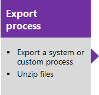
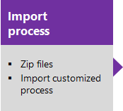

# Hosted XML process model  

**VSTS**

> [!NOTE]   
> **Feature availability**:  The Hosted XML process model is only supported for select accounts of Visual Studio Team Services.  

The Hosted XML process model provides support for customizing work tracking objects and Agile tools for a project by modifying and importing a process template. Updates made to the process template are applied to projects that were created using that process.

You can perform the following tasks with the Hosted XML process model. 

> [!div class="mx-tdBreakAll"]  
> |Fields  |Pick lists   |   Work item types |
> |-------------|----------|---------|
> |- [Add or modify a field](add-modify-field.md) - [Add a checkbox (Boolean) field](add-modify-field.md#boolean-field) - [Add rules to a field](add-modify-field.md#add-rules) - [Change a field label](add-modify-field.md#change-label) - [Add a custom control field](add-modify-field.md#custom-control) - [Remove a field from a form](add-modify-field.md#change-label) |-[Area paths](../../organizations/settings/set-area-paths.md) - [Iteration paths](../../organizations/settings/set-iteration-paths-sprints.md) - [State or Reason fields (customize workflow)](reference/change-workflow-wit.md) - [Person-name field (add users)](../../organizations/security/add-users-team-project.md) - [Add a custom pick list](add-modify-field.md#picklist) - [Predefined field](add-modify-field.md#picklist) - [Resolution State or Failure Type](customize-work.md#test-experience) - [Define global lists](reference/define-global-lists.md) |-[Add or modify a work item type](add-modify-wit.md) - [Change the workflow (States, Reasons, Transitions)](reference/change-workflow-wit.md) - [Customize the form](reference/change-work-item-form-layout.md) - [Specify the WIT color](reference/process-configuration-xml-element.md#wit-colors) - [Specify the WIT icon](reference/process-configuration-xml-element.md) - [Specify the workflow state color](reference/process-configuration-xml-element.md#state-colors) |

> [!div class="mx-tdBreakAll"]  
> | Backlogs and process configuration | Process template |  
> |----------|---------|   
> |- [Add WITs to backlogs or boards](add-wits-to-backlogs-and-boards.md) - [Add portfolio backlogs](add-portfolio-backlogs.md) - [Configure the quick add panel](reference/process-configuration-xml-element.md#add) - [Configure the default backlog columns](reference/process-configuration-xml-element.md#columns) - [Set maximum number of task board items](reference/process-configuration-xml-element.md#number_items) - [Set default weekend days (Scrum)](reference/process-configuration-xml-element.md#weekend_days)  - [Set default bug management behavior](reference/process-configuration-xml-element.md#behaviors) - [Set default hidden backlogs](reference/process-configuration-xml-element.md#behaviors) - [Process configuration](reference/process-configuration-xml-element.md) - [Categories](reference/categories-xml-element-reference.md) |-[Import a process template](import-process/import-process.md#import-from-TFS) - [Export a process template](import-process/import-process.md#export-process) - [Customize a process template](import-process/customize-process.md) |

 
Use the following sequences when you manage your VSTS through the Hosted XML process model. This sequence requires you to update your project by updating the process template that it uses. We recommend that you maintain your process templates in a repository for version control.  

  