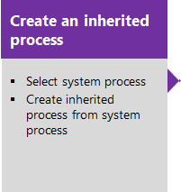
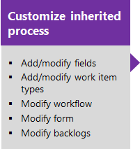
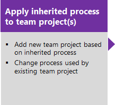
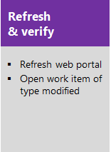

# Inheritance process model  

**VSTS**

 

> [!NOTE]   
> **Feature availability**:  The Inheritance process model is only supported for Visual Studio Team Services at this time.  

The Inheritance process model provides support for customizing work tracking objects and Agile tools for a team project through the user interface. Team projects inherit the customizations made to a process.

You can perform the following tasks with the Inheritance process model. 

> [!div class="mx-tdBreakAll"]  
> |Fields  |Pick lists   |   Work item types |
> |-------------|----------|---------|
> |- [Add a custom field](process/customize-process-field.md) - [Add a person-name or Identity field](process/customize-process-field.md#identity) - [Add a rich-text field](process/customize-process-field.md#html) - [Add a checkbox (Boolean) field](process/customize-process-field.md#boolean-field) - [Add rules to a field](process/custom-rules.md) - [Change a field label](process/customize-process-field.md) - [Remove a field from a form](process/customize-process-field.md) - [Add a custom control field](process/custom-controls-process.md) - [Delete a field](process/customize-process-field.md#delete-field) - [Review fields](process/customize-process-field.md#review-fields)|- [Area paths](set-area-paths.md) - [iteration paths](set-iteration-paths-sprints.md) - [Person-name field (add team members)](../../accounts/add-team-members-vs.md) - [State or Reason fields](process/customize-process-workflow.md) - [Add a custom pick list](process/customize-process-form.md)|- [Add a custom field](process/customize-process-field.md) - [Add a custom WIT](process/customize-process-wit.md) - [Specify the WIT color](process/customize-process-wit.md) - [Customize the workflow (States)](process/customize-process-workflow.md) - [Customize the WIT form](process/customize-process-form.md) - [Add a custom control](process/custom-controls-process.md)| 

> [!div class="mx-tdBreakAll"]  
> | Backlogs | Process |  
> |----------|---------|   
> |- [Add custom backlog levels](add-portfolio-backlogs.md) - [Add a custom WIT to a backlog](process/customize-process-backlogs-boards.md) - [Show bugs on backlogs/boards](show-bugs-on-backlog.md)|- [Create & manage an inherited process](process/manage-process.md) - [Customize a process](process/customize-process.md) |

 
>[!NOTE]  
>With the Inheritance process model, you can't modify the pick-lists of pre-defined fields&mdash;such as [Activity](../track/query-numeric.md), [Automation Status](../track/build-test-integration.md), [Discipline](../track/query-numeric.md), [Priority](../track/planning-ranking-priorities.md), plus others.  

Use this sequence when you manage your VSTS customization through the Inherited process model. You belong to this phase when your Process user interface appears as shown under [Manage processes](process/manage-process.md). 

  

