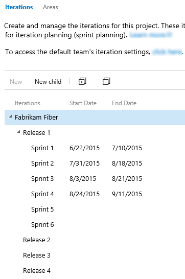

# Customize area and iteration paths  

<b>Team Services | TFS 2017 | TFS 2015 | TFS 2013</b> 

Area paths allow you to group work items by team, product, or feature area. Iteration paths allow you to group work into sprints, milestones, or other event-specific or time-related period.

Newly created team projects contain a single, root area that corresponds to the team project name. Team projects typically specify a predefined set of iterations to help you get started tracking your work. All you need to do is specify the dates.  

The iterations you see depend on the process you used to create your team project. Here we show the defaults defined for the Scrum process. No dates are set. You set dates to correspond to your sprint or release schedules.

 
[!INCLUDE [temp](../_shared/image-differences.md)] 

<table>
<tbody valign="top">
<tr>
<td>

</td>
<td>

</td>
</tr>
</tbody>
</table>

## Agile tools that rely on areas or iterations

[!INCLUDE [temp](../_shared/agile-tools-areas-iterations-summary.md)]


#### Team defaults referenced by backlogs and boards

[!INCLUDE [temp](../_shared/team-defaults-referenced-by-team-tools.md)]


<a id="open-admin-context">  </a>
## Open the administration context for the team project  

From the web portal, open the admin page for the team project.

You define both areas and iterations from the Work hub of the team project admin context. From the user context,you open the admin context by clicking the  gear Settings icon. The tabs and pages available differ depending on which admin context you access.  

[!INCLUDE [temp](../_shared/learn-about-new-nav-experience.md)] 


To manage areas and iterations you need to be a project administrator or have the **Create child nodes** permission for an area path. If you aren't a project administrator, [get added as one](../scale/manage-team-assets.md#add-team-admin) or have someone provide you with explicit permissions to <b>Edit project-level information</b>. 

If you want to add area paths to support teams, you can do that when you [add teams to your team project](../scale/multiple-teams.md).  

Certain [restrictions](#name-restrictions) apply on names of areas.  

<div style="background-color: #f2f0ee;padding-top:10px;padding-bottom:10px;">

<ul class="nav nav-pills" style="padding-right:15px;padding-left:15px;padding-bottom:5px;vertical-align:top;font-size:18px;">

<li style="float:left;" data-toggle="collapse" data-target="#admin-intro">Open the admin context, project-level</li>

<li style="float: right;"><a style="max-width: 374px;min-width: 120px;vertical-align: top;background-color:#AEAEAE;margin: 0px 0px 0px 8px;min-width:50px;color: #fff;border: solid 2px #AEAEAE;border-radius: 0;padding: 2px 6px 0px 6px;outline-style:none;height:32px;font-size:12px;font-weight:400" data-toggle="pill" href="#admin-intro-tfs-2015">TFS 2015, TFS 2013</a></li>

<li style="float: right;"><a style="max-width: 374px;min-width: 120px;vertical-align: top;background-color:#AEAEAE;margin: 0px 0px 0px 8px;min-width:50px;color: #fff;border: solid 2px #AEAEAE;border-radius: 0;padding: 2px 6px 0px 6px;outline-style:none;height:32px;font-size:12px;font-weight:400" data-toggle="pill" href="#admin-intro-tfs-2017">TFS 2017</a></li>

<li style="float: right;"><a style="max-width: 374px;min-width: 120px;vertical-align: top;background-color:#AEAEAE;margin: 0px 0px 0px 8px;min-width:90px;color: #fff;border: solid 2px #AEAEAE;border-radius: 0;padding: 2px 6px 0px 6px;outline-style:none;height:32px;font-size:12px;font-weight:400" data-toggle="pill" href="#admin-intro-tfs-2017-1">TFS 2017.1</a></li>

<li class="active" style="float: right"><a style="max-width: 374px;min-width: 120px;vertical-align: top;background-color:#007acc;margin: 0px 0px 0px 0px;min-width:90px;color: #fff;border: solid 2px #007acc;border-radius: 0;padding: 2px 6px 0px 6px;outline-style:none;height:32px;font-size:12px;font-weight:400" data-toggle="pill" href="#admin-intro-team-services">Team Services</a></li>

</ul>

<div id="admin-intro" class="tab-content collapse in fade" style="background-color: #ffffff;margin-left:5px;margin-right:5px;padding: 5px 5px 5px 5px;">

<div id="admin-intro-team-services" class="tab-pane fade in active"> 
<ol>
<li>
<p>From the web portal for the team project context, click the  gear Settings.  </p>

  

<p>If you're currently working from a team context, then hover over the  and choose Project settings. </p>

 
</li>
<li>
<p>Open the **Work** hub.  </p>
</li>
</ol>
</div>

<div id="admin-intro-tfs-2017-1" class="tab-pane fade"> 
<ol>
<li>
<p>From the web portal for the team project context, click the  gear Settings.  </p>

  

<p>If you're currently working from a team context, then hover over the  and choose Project settings. </p>

 
</li>
<li>
<p>Open the **Work** hub.  </p>
</li>
</ol>

</div>

<div id="admin-intro-tfs-2017" class="tab-pane fade"> 
<ol>
<li>
<p>From the web portal for the team project context, click the  gear Settings.  </p>

  

<p>If you're currently working from a team context, then hover over the  and choose Project settings. </p>

 
</li>
<li>
<p>Open the **Work** hub.  </p>
</li>
</ol>

  
</div>


<div id="admin-intro-tfs-2015" class="tab-pane fade">
 
<ol>
<li>
<p>From the web portal user context, click the  gear Settings.  </p>

 
</li>
<li>
<p>Open the **Work** hub.  </p>
</li>
</ol>

</div>


</div>
</div>


## Add an area 


<div style="background-color: #f2f0ee;padding-top:10px;padding-bottom:10px;"> 

<ul class="nav nav-pills" style="padding-right:15px;padding-left:15px;padding-bottom:5px;vertical-align:top;font-size:18px;">

<li style="float:left;" data-toggle="collapse" data-target="#area-paths">Areas </li>

<li style="float: right;"><a style="max-width: 374px;min-width: 120px;vertical-align: top;background-color:#AEAEAE;margin: 0px 0px 0px 8px;min-width:90px;color: #fff;border: solid 2px #AEAEAE;border-radius: 0;padding: 2px 6px 0px 6px;outline-style:none;height:32px;font-size:14px;font-weight:400" data-toggle="pill" href="#tfs-2015-area-paths">TFS 2015, TFS 2013</a></li>

<li style="float: right;"><a style="max-width: 374px;min-width: 120px;vertical-align: top;background-color:#AEAEAE;margin: 0px 0px 0px 8px;min-width:90px;color: #fff;border: solid 2px #AEAEAE;border-radius: 0;padding: 2px 6px 0px 6px;outline-style:none;height:32px;font-size:14px;font-weight:400" data-toggle="pill" href="#tfs-15-area-paths">TFS 2017</a></li>

<li class="active" style="float: right"><a style="max-width: 374px;min-width: 120px;vertical-align: top;background-color:#007acc;margin: 0px 0px 0px 0px;min-width:90px;color: #fff;border: solid 2px #007acc;border-radius: 0;padding: 2px 6px 0px 6px;outline-style:none;height:32px;font-size:14px;font-weight:400" data-toggle="pill" href="#team-services-area-paths">Team Services</a></li>
</ul>
 
<div id="area-paths" class="tab-content collapse in fade" style="background-color: #ffffff;margin-left:5px;margin-right:5px;padding: 5px 5px 5px 5px;">

<div id="team-services-area-paths" class="tab-pane fade in active">

<a id="add-areas-team-services">   </a>
<h3>Add area paths (Team Services) </h3>
<ol><li><p>Open the Work, Areas page for the team project context.</p>
<p>If you haven't added any areas or teams, you'll see that only one area is defined. </p> 
  
</li>
<li><p>Add a new child node to the area you have selected.</p>
 
</li>
</ol>
</div>


<div class="tab-pane fade" id="tfs-15-area-paths" >
<h3>Add area paths (TFS 2017) </h3> 
<ol><li><p>Open the Work, Areas page for the team project context.</p>
<p>If you haven't added any areas or teams, you'll see that only one area is defined. </p> 
  
</li>
<li><p>Add a new child node to the area you have selected.</p>
 
</li>
</ol>
</div>

<div class="tab-pane fade" id="tfs-2015-area-paths" >
<h3>Add area paths (TFS 2015)</h3>
<ol><li><p>Open the **Areas** tab.</p>
  
<p>From the areas page, you can set the default area path used to filter the backlog.  The default area path is also used when new work items a user creates new work items.</p>
</li>
<li><p>Add a new child node to the area you have selected.</p>

</li>
</ol>
</div>

</div>
</div>

<a id="iterations"></a>  
##Add iterations and set iteration dates
From the **Iterations** page, you can add and select the iterations that will be active for your team. You add iterations in the same way you add areas. For more information about working within a sprint cadence, see [Schedule sprints](../scrum/define-sprints.md).  


<div style="background-color: #f2f0ee;padding-top:10px;padding-bottom:10px;"> 

<ul class="nav nav-pills" style="padding-right:15px;padding-left:15px;padding-bottom:5px;vertical-align:top;font-size:18px;">

<li style="float:left;" data-toggle="collapse" data-target="#iteration-paths">Iterations </li>

<li style="float: right;"><a style="max-width: 374px;min-width: 120px;vertical-align: top;background-color:#AEAEAE;margin: 0px 0px 0px 8px;min-width:90px;color: #fff;border: solid 2px #AEAEAE;border-radius: 0;padding: 2px 6px 0px 6px;outline-style:none;height:32px;font-size:14px;font-weight:400" data-toggle="pill" href="#tfs-2015-iteration-paths">TFS 2015, TFS 2013</a></li>

<li class="active" style="float: right"><a style="max-width: 374px;min-width: 120px;vertical-align: top;background-color:#007acc;margin: 0px 0px 0px 0px;min-width:90px;color: #fff;border: solid 2px #007acc;border-radius: 0;padding: 2px 6px 0px 6px;outline-style:none;height:32px;font-size:14px;font-weight:400" data-toggle="pill" href="#team-services-iteration-paths">Team Services, TFS 2017</a></li>
</ul>
 
<div id="iteration-paths" class="tab-content collapse in fade" style="background-color: #ffffff;margin-left:5px;margin-right:5px;padding: 5px 5px 5px 5px;">

<div id="team-services-iteration-paths" class="tab-pane fade in active">


<a id="define-sprints-team-services">   </a>
<h3>Schedule sprints (Team Services)</h3>
<ol>
<li>
<p>Open the Work, Iterations page for the team project context.</p>
<p>For Scrum-based team projects, you'll see these set of sprints.</p>

<p>If you need to select another team project, go to the Overview page for the collection (click the DefaultCollection link).</p>
</li>
<li><p>Schedule the start and end dates for each sprint your teams will use. Click Set dates or choose to edit the iteration from the  actions menu for the sprint.</p>  
  
</li>
<li>
<p>When you're finished, you'll have a set of sprints scheduled - like this:</p>

 <p>Your next step is to [choose the sprints each team will use](../scale/set-team-defaults.md#activate-team-services).</p>
</li>
</ol>
</div>

<div class="tab-pane fade" id="tfs-2015-iteration-paths" >
<h3>Schedule sprints (TFS 2015)</h3>
<ol>
<li>
<p>Open the Iterations tab for the team project context.</p>
<p>For Scrum-based team projects, you'll see these set of sprints.</p>
  
<p>You can change the name, location within the tree hierarchy, or set dates for any sprint. Simply open it (double-click or press Enter key) and specify the info you want.</p>
</li>
<li>
<p>Schedule the start and end dates for those sprints you plan to use.</p>
  
<p>After you set the start and end dates for one iteration, the calendar tool automatically attempts to set the next set of dates, based on the same iteration length you specified for the first. For example, if you set a three week sprint for Sprint 1, then when you select the start date for Sprint 2, the calendar tool automatically determines the start and end dates based on the next three weeks. You can accept or change these dates.</p>
</li>
<li>
<p>To add another sprint, select <b>New child</b> and name it what you want. Here, we call it Sprint 7.</p>

<p>Your next step is to [activate the sprints each team will use](../scale/set-team-defaults.md#activate-sprints-tfs).</p>
</li>
</ol>

</div>
</div>
</div>


<!---
0. Teams can choose which iterations they work in by checking the check box next to each iteration.  

	   

0. Each iteration can have a start and end date.  After you set the start and end dates for one iteration, the calendar tool automatically defaults the next set of dates, based on the same iteration length you specified for the first.

	**Example:** if you set a 3 week sprint for Sprint 1, then when you select the start date for Sprint 2, the calendar tool automatically determines the start and end dates based on the next three weeks.  

	  

	  

-->

<a id="set-permissions" >  </a> 

##Set permissions to restrict access to work items   

Permissions placed on an area paths allows you to permit or restrict access to edit or modify work items, test cases, or test plans assigned to those areas. You can restrict access to users or groups. You can also set permissions for who can add or modify areas or iterations for the team project.  

1. Open the **Security** dialog for the node you want to manage.  

	

2. Select the group or team member, and then change the permission settings. For example, for the Disallow Access Group, deny the ability to view, modify, or edit work items in the FabrikamFiber area path.

	

	If the group or team member doesn't appear in the list, you can [**Add** it](../../setup-admin/add-users.md).  
	
You can specify two explicit authorization states for permissions: **Deny** and **Allow**. In addition, permissions can exist in one of three additional states.  

| Permission 		| Authorization |
| ----------------- | ------------- |
| Allow 			| Explicitly grants users to perform the task associated with the specific permission. For users to access a task, the associated permission must be set to **Allow** or **Inherited allow**. |
| Deny 				| Explicitly prevents users from performing the task associated with the specific permission. **Deny** takes precedence over **Allow**. <br/>For exceptions to these rules, see [Permissions reference](../../setup-admin/permissions.md#inheritance)|
| Inherited allow/Inherited deny 	| Allows or denies a user to perform the task associated with the permission based on the permission set for a group to which the user belongs. |
| Not set         	| Implicitly prevents users from performing the action associated with the permission. <br/>Because the permission is neither explicitly set to **Deny** nor explicitly set to **Allow**, authorization for that permission can be inherited from other groups of which the user or group is a member. <br/>By default, most permissions are not set to either **Deny** or **Allow**, the permissions are left **Not set**.  |


For additional ways to restrict modifications to work items, see [Restrict who can create or modify a work item](../reference/apply-rule-work-item-field.md). 

###Test management permissions  

Area permissions for web-based test case management and test execution control access to the following actions. 

The **Manage test suites** permission enables users to:  
<ul style="padding-left:10px">
<li style="margin-bottom:2px">Create and modify test suites</li>
<li style="margin-bottom:2px">Add or remove test cases to/from test suites</li>
<li style="margin-bottom:2px">Change test configurations associated with test suites</li>
<li style="margin-bottom:2px">Modify the suite hierarchy by moving a test suite</li>
</ul>

The **Manage test plans** permission enables users to:  
<ul style="padding-left:30px">
<li style="margin-bottom:2px">Create and modify test plans </li>
<li style="margin-bottom:2px">Add or remove test suites to or from test plans</li>
<li style="margin-bottom:2px">Change test plan properties such as build and test settings</li>
</ul>


Additional test management permissions are assigned at the team project level and include the ability to create, delete, and view test runs, and manage test configurations and environments. See [Project, object, and test-level permissions](../../setup-admin/permissions.md#project_test).  


##Related notes 
As you can see, areas and iterations play a major role in supporting Agile tools and managing work items. You can learn more about working with these fields from these topics: 

*	[Add another team](../scale/multiple-teams.md)  
*	[Set team defaults](../scale/set-team-defaults.md)  
*	[Agile tools and sprint definitions ](../scrum/define-sprints.md)  
*	[Manage team assets ](../scale/manage-team-assets.md)  
*	[Query by date or current iteration](../track/query-by-date-or-current-iteration.md)  
*	[Permissions and access](../../setup-admin/permissions-access.md)  

<a name="permissions"></a>
###Required permissions 

To create or modify areas or iterations, you must either be a member of the **Project Administrators** group, or your **Create and order child nodes**, **Delete this node**, and **Edit this node** permissions must be set to **Allow** for the area or iteration node that you want to modify.

### Chart progress by area or iteration

You can quickly generate [queries](../track/using-queries.md) to view the progress for those areas and iterations. As an example, you can [visualize progress of work items assigned to sprints](../../report/charts.md) as shown in the following stacked bar chart.  

 


<a name="rename-delete"></a>
### Rename or delete an area or iteration node 

When you rename an area or an iteration, or move the node within the tree hierarchy, the system will automatically update the work items and queries that reference the existing path or paths. 

When you delete an area or an iteration node, the system automatically updates the existing work items with the node that you enter at the deletion prompt. 

<a name="field-reference"></a>
### Classification field reference 

These fields appear on the forms for all WITs. 

|**Field name**|**Description**|**Reference name**|
|---|---|---|
|**Area Path**|Groups work items into product feature or team areas. The area must be a valid node in the project hierarchy.|System.AreaPath|
|**Iteration Path**|Groups work items by named sprints or time periods. The iteration must be a valid node in the project hierarchy.|System.IterationPath|

For each field, data path=```TreePath```, reportable type=```Dimension```, index attribute=```True```. 
 
If you define a path name that is longer than 256 characters, you will not be able to specify it in Microsoft Project. To avoid this problem, define path names of no more than 10 characters, and do not nest nodes more than 14 levels deep.

You can't apply most field rules to the System.AreaPath and System.IterationPath fields. To learn more, see [Apply a field rule](../reference/apply-rule-work-item-field.md).

The following fields do not appear on work item forms but are tracked for each work item type. These fields provide a numeric value for each classification value that is defined for a team project. You can use these fields to filter queries and create reports.

|**Field name**|**Description**|**Reference name**|**Data type**|
|---|---|---|---|
|Area ID|The unique ID of the area to which this work item is assigned.|System.AreaId|Integer|
|Iteration ID|The unique ID of the iteration to which this work item is assigned.|System.IterationId|Integer|
|Node Name|The name of the leaf node of an area path. For example, if the area path is Project\A1\B2\C3, the node name is C3.|System.NodeName|String|

The default reportable type is none. Area ID and Iteration ID are indexed, Node Name is not. To learn more about field attributes, see [Work item data type reference](../reference/define-modify-work-item-fields.md).


<a name="name-restrictions"></a>
###Naming restrictions 

The **Area Path** and **Iteration Path** fields, [data type=TreePath](../reference/define-modify-work-item-fields.md), consist of multiple node items which are separated by the backslash (&#92;) character. We recommend that you minimize the names of nodes, and make sure that you conform to the following restrictions when adding child nodes:

| Restriction type                 | Restriction                                 | 
| -------------------------------- | ------------------------------------------- | 
| Node length | Must not contain more than 255 characters | 
| Special characters for nodes | Must not contain Unicode control characters<br/>Must not contain any of the following characters: \ / $ ? * : " & > < # % + ,<br/>Must not contain characters that the [local file system prohibits](https://msdn.microsoft.com/library/aa365247.aspx). | 
| Reserved names | Must contain more than a period (.) or two periods (..)<br/>Must not be a [system-reserved name](https://msdn.microsoft.com/library/aa365247.aspx) such as PRN, COM1, COM2, COM3, COM4, COM5, COM6, COM7, COM8, COM9, COM10, LPT1, LPT2, LPT3, LPT4, LPT5, LPT6, LPT7, LPT8, LPT9, NUL, CON, or AUX<br/>| 
| Path length | Must contain fewer than 4,000 Unicode characters | 
| Path hierarchy depth | Must be fewer than 14 levels deep | 


<a name="field-rules"></a>
###Supported field rules (TFS)  

You can [specify only a small subset of rules](../reference/apply-rule-work-item-field.md#system), such as ```HELPTEXT``` and ```READONLY``` to System.XXX fields. 

<a name="export"></a>
###Export tree structures  

You can't export the structure of tree paths for one team project to use with another team project.  


<a name="team-field"></a>
### Team field versus team area path 
If your organization has several teams that work from a common backlog and across many product areas, you might want to change how teams are configured. By [adding a custom field to represent teams](https://msdn.microsoft.com/library/dn144940.aspx) in your organization, you can reconfigure the agile planning tools and pages to support your teams and decouple assignment to teams and area paths. 


### Examples 

####How do I structure teams, areas, and iterations to support hierarchical teams or scale agility within an enterprise?

Although there is no concept of sub-teams, you can create teams whose area paths are under another team, which effectively creates a hierarchy of teams. To learn more, see [Add another team](../scale/multiple-teams.md).

Also, these topics can walk you through the steps for configuring teams, area paths, and iterations to support portfolio management or enterprise organizations: [Portfolio management](../scale/portfolio-management.md) and [Implement Scaled Agile Framework to support epics, release trains, and multiple backlogs](../scale/scaled-agile-framework.md).

#### What kind and how many areas should a team define?

You add areas to support your team's trace-ability and security requirements. Use areas to represent logical or physical components, and then create child areas to represent specific features.  

Add areas when you have these requirements: 
*	Filter queries based on a product or feature area 
*	Organize or group work items by team or sub-teams  
*	Restrict access to work items based on their area.  

Each team can create a hierarchy of areas under which the team can organize their backlog items, user stories, requirements, tasks, and bugs.

Avoid creating an area structure that is too complex. You can create areas to partition permissions on work items, but complex trees require significant overhead for permission management. You might find that it is too much work to duplicate the structure and permissions in other team projects.

#### What kind and how many iterations should a team define?

You define as many child iterations as you need to reflect your project lifecycle. These paths represent a series of events, such as sprints, pre-beta and beta deliverables, and other release milestones. Teams typically leave work items assigned to the team's default iteration if they are not yet scheduled for work or for a release.  

Add iterations to support these requirements:  
* Define sprints your Scrum teams use to [plan and execute their sprints](../scrum/sprint-planning.md)
* Set up more complex multi-release and sprint cycles
* Filter queries based on sprints, milestones, or cycle time for your project 
* Support future work that you're not ready to assign to a target release cycle.  

In the following example, Backlog, Beta 1, Beta 2, Release 1.0, and Release 2.0 are defined for the MyApplication team project.  

  

As you create the backlog of product features and tasks, you can start to assign them to the milestones by which you expect the team to finish the features and tasks.
As your needs change, you can add events under each major milestone that reflect how your team schedules and manages its work.  

As the following example shows, the Beta 1 iteration now contains three child nodes, one for each sprint in the Beta 1 time period.  

  

Iterations do not enforce any rules. For example, you can assign a task to an iteration but not close or complete it during that iteration. At the end of an iteration, you should find all work items that remain active or have not been closed for that iteration and take appropriate action. You can, for example, move them to a different iteration or return them to the backlog.  

