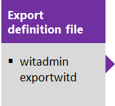
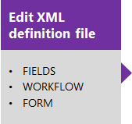
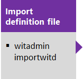
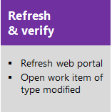

# On-premises XML process model 

[!INCLUDE [temp](../_shared/version-header-tfs-only.md)]


> [!NOTE]   
> **Feature availability**:  The On-premises XML process model is supported for on-premises TFS.  


The On-premises XML process model provides support for customizing work tracking objects and Agile tools for a team project. With this model, you can update the XML definition of work item types, the process configuration, categories, and more. You can also update the attributes of fields. 


You can perform the following tasks when you work with the On-premises XML process model. 

<a id="on-prem-xml-process-model"></a>


> [!div class="mx-tdBreakAll"]  
> |Fields  |Pick lists   |   Work item types |
> |-------------|----------|---------|
> |- [Add or modify a field](add-modify-field.md)<br/>- [Add a checkbox (Boolean) field](add-modify-field.md#boolean-field) (TFS 2017.2)<br/>- [Add rules to a field](add-modify-field.md#add-rules)<br/>- [Change a field label](add-modify-field.md#change-label)<br/>- [Add a custom control field](add-modify-field.md#custom-control)<br/>- [Remove a field from a form](add-modify-field.md#change-label)<br/>- [Change a field attribute](add-modify-field.md#change-attribute)<br/>- [Add fields that integrate with test, build, and version control](add-modify-field.md#integration-fields)<br/>- [Delete a field](add-modify-field.md#delete-field) |- [Area paths](set-area-paths.md)<br/>- [Iteration paths](set-iteration-paths-sprints.md)<br/>- [Add a custom pick list](add-modify-field.md#picklist)<br/>- [Modify a pre-defined pick list](add-modify-field.md#picklist)<br/>- [State or Reason fields (customize workflow)](reference/change-workflow-wit.md)<br/>- [Person-name field (add users)](../../security/add-users-team-project.md) <br/>- [Resolution State & Failure Type](customize-work.md#test-experience)<br/>- [Define global lists](reference/define-global-lists.md) |- [Add or modify a work item type](add-modify-wit.md)<br/>- [Change the workflow (States, Reasons, Transitions)](reference/change-workflow-wit.md)<br/>- [Customize the form](reference/change-work-item-form-layout.md)<br/>- [Specify the WIT color](reference/process-configuration-xml-element.md#wit-colors)<br/>- [Specify the WIT icon](reference/process-configuration-xml-element.md)<br/>- [Specify the workflow state color](reference/process-configuration-xml-element.md#state-colors) |


> [!div class="mx-tdBreakAll"]  
> |Backlogs & Process configuration  |Process templates  | Link types |
> |-------------|----------|---------|
> |- [Add WITs to backlogs or boards](add-wits-to-backlogs-and-boards.md)<br/>- [Add portfolio backlogs](add-portfolio-backlogs.md)<br/>- [Configure the quick add panel](reference/process-configuration-xml-element.md#add)<br/>- [Configure the default backlog columns](reference/process-configuration-xml-element.md#columns)<br/>- [Set maximum number of task board items](reference/process-configuration-xml-element.md#number_items)<br/>- [Set default weekend days (Scrum)](reference/process-configuration-xml-element.md#weekend_days) <br/>- [Set default bug management behavior](reference/process-configuration-xml-element.md#behaviors) <br/>- [Set default hidden backlogs](reference/process-configuration-xml-element.md#behaviors) <br/>- [Process configuration](reference/process-configuration-xml-element.md)<br/>- [Categories](reference/categories-xml-element-reference.md) |- [Customize](reference/process-templates/customize-process.md)<br/>- [Manage (upload/download)](../work-items/guidance/manage-process-templates.md)<br/>- [Maintenance and upgrade implications](#before-you-customize) |- [Add a custom link type](reference/link-type-element-reference.md)<br/>- [Delete a custom link type](reference/witadmin/manage-link-types.md)<br/>- [Deactivate/activate a custom link type](reference/witadmin/manage-link-types.md) | 


<a id="on-prem-xml-sequence"></a>

When you manage an on-premises TFS, you perform most customizations using the following sequence. This sequence supports updating the XML definition for WIT, global lists, process configuration, and categories. This sequence supports individual updates through the import of their respective modified XML definition files. We recommend that you maintain your XML definition files in a repository for version control.  

[](customize-wit-form.md#witadmin)[](reference/weblayout-xml-elements.md)[](customize-wit-form.md#witadmin)  

In addition, you can use the **witadmin** tool to list objects, rename WITs, permanently remove WITs, and more.  
 

[!INCLUDE [temp](../_shared/process-editor.md)]  


<a id="before-you-customize"></a>
## Maintenance and upgrade implications
Before you customize, you should understand how your customizations may impact your team project when you upgrade your application-tier server.  

Upgrades to an on-premises TFS can introduce new features that require updates to the objects used to track work. These objects include work item types, categories, and process configuration. Minimizing changes to the workflow for a WIT or the process configuration can help minimize the work you must do when you upgrade your TFS. 

To minimize the amount of manual work you'll need to do after a TFS upgrade, understand which customizations support an easy update path and which do not. 


### Compatible for quick updating  

With the following customizations, you can use the Configure Features Wizard to automatically apply any changes to your team project required for new features.

<ul>
<li>Fields: Add custom fields, customize a pick list, add or modify area and iteration paths, add rules to a field  </li>
<li>WITs: Add custom WITs, change the form layout</li>
<li>Categories: Add custom categories  </li>
<li>Agile tools: Customize the columns on the Kanban board, customize the quick add panel  </li>
<li>Office integration: Add or change how Project fields map to TFS fields   </li>
</ul>

To learn more about the Configure Features Wizard, see [Configure features after an upgrade](configure-features-after-upgrade.md).


### Compatible, but may require manual updates

The Configure Features Wizard requires that specific work item types, workflow states, and fields exist in the team project. When you make the following customizations, you might need to modify your custom process for the wizard to run, or you might have to update your team project manually. 

<ul>
<li>Fields: Change attributes of an existing field, remove fields that are referenced in the process configuration </li>
<li>WITs: Change the workflow </li>
<li>Agile tools: Change the WITs defined for the Requirement Category, Task Category, or Feature Category.</li>
<li>Agile tools: Change the metastate mapping defined in the process configuration.  </li>
<li>Agile tools: Change a field specified for a ```TypeField``` in the process configuration.   </li>
</ul>

In addition, changes you make to WITs or the workflow could require updates to other artifacts provided with your process, such as Excel or SQL Server Reporting Services reports.
 

### Customizations to avoid
You should avoid making the following customizations because they can result in schema conflicts in the data warehouse or cause problems when updating team projects after a TFS upgrade. 

*	Fields:  
	*	Change the friendly name of a field (a field specified within a WIT definition file)  
	*	Change one or more reporting attributes, or the attribute to synchronize person names with Active Directory of a default field  
*	WITs: Rename or delete WITs 
*	Categories: Change the name of default categories, or change the WITs specified within default categories  

To learn more about reporting attributes, see [Add or modify work item fields to support reporting](http://msdn.microsoft.com/library/ee921481.aspx).

### Recommended practices  
*	Identify the best options for customizing WITs that support your tracking requirements. When you change objects that track work items, you should identify how these changes will affect existing and future team projects.  
*	Put processes and all XML definition files under version control. Do not deploy objects that you define but have not stored in a repository.  
*	Test your customized objects just as you would test your software.  
*	Minimize the number of custom fields that you introduce. Minimize the number of fields that you make reportable.  

 

## Replace team area path with a team field (On-premises TFS)  
The default configuration for team projects associates each team with an area path. If your organization has several teams that work from a common backlog and across many product areas, this configuration might not fit how you want to organize your work. By adding a custom field to represent teams in your organization, you can reconfigure the agile planning tools and pages to support your teams and decouple assignment to teams and area paths.

[Use team fields instead of area paths to support teams](../customize/use-team-fields-instead-area-paths.md) describes how to change the default configuration.

<!--- Add definitions for these 
release 
team 

--> 