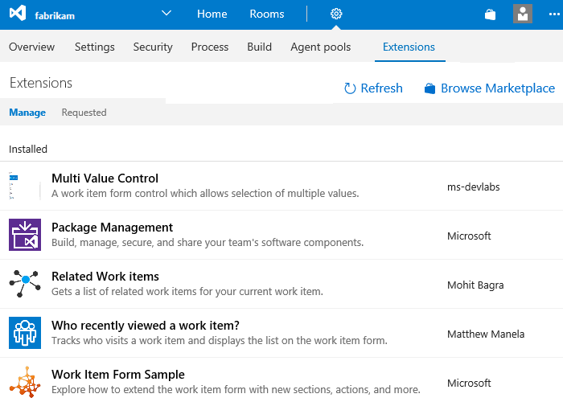
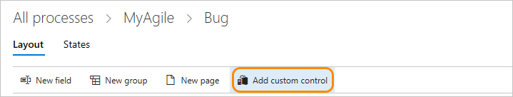
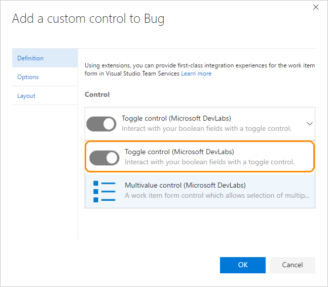
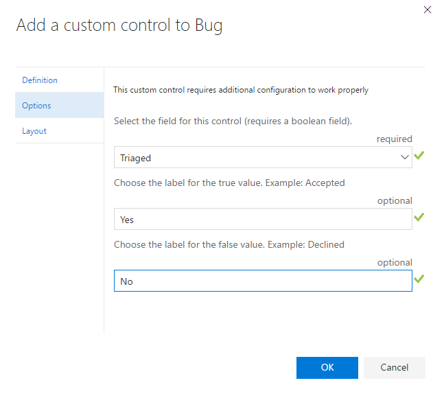
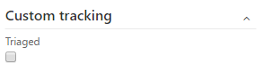
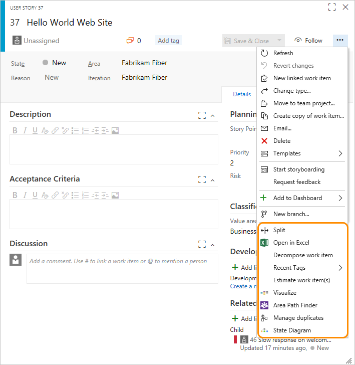

# Add a custom control to a work item type 

[!INCLUDE [temp](../../_shared/process-feature-availability.md)]

With custom controls, you can add rich functionality to your work item forms. A custom control comes in four flavors, or contribution types. The first three in the following list appear on the web form layout for all inherited and customizable work item types (WITs):    
- Field-level contribution 
- Group-level contribution 
- Page-level contribution
- Action-level contribution (appears in the context menu of the web form) 

You add all custom controls by installing its extension from the [Visual Studio Marketplace](https://marketplace.visualstudio.com/vsts). Or, you can [create your own custom control](../../../extend/get-started/node.md). 

For example, you can add the [**Who recently viewed a work item?** extension](https://marketplace.visualstudio.com/items?itemName=mmanela.vsts-workitem-recentlyviewed). This group-level control appears in your work item form as shown. 

## Add a Marketplace extension   

Browse the Marketplace to determine what extension(s) you want to add. To install an extension, see [Install free extensions for VSTS](../../../marketplace/install-vsts-extension.md)

From the admin context, Extensions hub, you can view the extensions that are already installed.    

  

You may need to click  to refresh the page to show newly installed extensions. 

## Add a field-level contribution 

1. Install the [field-level extension](#add-extension) as discussed in the previous section.  
  
0. Open the admin context Process hub from a work item form or by choosing the Account Settings option from the gear option. For details, see [Customize a process, Start customizing](customize-process.md#start-customizing).

2. (Optional) [Add a field](customize-process-field.md#add-custom-field) to associate with the field-level contribution. Alternatively, you can specify an existing field, inherited or custom. 

3. With the WIT selected, click **Add custom control**. 

	  

	> [!NOTE]    
	>If you don't see the **Add custom control** option, then you haven't installed a field-level extension. Or, you may need to refresh your browser to cause your browser to register any new extensions that have been installed. 
	
4. Choose the field-level control you want from the menu of options. 

	For example, here we choose the Toggle control that you can associate with a Boolean field.   

	  

4. Click the Options tab and fill out the dialog box. The options you need to specify will depend on the extension you've selected.   

	For example, here we specify the custom field, Triaged, and indicate the toggle labels to appear on the form.   

	

5. (Optional) Open the Layout tab and specify the label for the field. 
 
	Fill in any additional required fields. Review the extension description for guidance. 

5.	Verify the working of the custom control by opening a work item of the type you modified. You may need to refresh your browser to see your changes.  

	Here, we show how the control appears by default with the checkbox and then with the toggle control.  

	<table>
	<tr><th>Boolean field with checkbox</th>
	<th>Boolean field with toggle control</th></tr> 
	<tr><td></td>
	<td></td>
	</tr> 
	</table>

## Group-level and page-level contributions

When you add group-level and page-level extensions, they are automatically added to all WITs defined for all processes, both inherited and custom. You can choose to [hide these contributions from appearing on the form](customize-process-field.md#show-hide-field) for a specific WIT, or move it within the form from it's default location. 

If you've installed a group or page extension, refresh your browser, and then open a work item to view the placement of the control on the form. To move or hide the control, [follow the guidance provided for the Layout tab](customize-process-form.md).  

## Action-level contributions

Action-level extensions are added to the context menu of inherited and customizable WITs for both system and inherited processes. All action-level extensions are added to all work item types and cannot be hidden or removed without [uninstalling or disabling the extension](../../../marketplace/uninstall-disable-vsts-extensions.md).  

For example, the following image shows nine action-level contributions have been added and appear in the context menu for the user story.  

## Related articles 

As you add custom controls, keep in mind that all team projects that reference the inherited process that you're customizing will automatically update to contain the new fields. To view your customizations, refresh your web browser. 
 
Additional topics of interest:  

- [Add a custom field to a work item type](customize-process-field.md)  
- [Customize a work item type](customize-process-wit.md)
- [Customize the web form](customize-process-form.md)
- [Customize a process](customize-process.md)    
- [WebLayout XML elements](../reference/weblayout-xml-elements.md)  
- [VSTS Marketplace](https://marketplace.visualstudio.com/search?target=VSTS&category=Plan%20and%20track&sortBy=Downloads)

### Required permissions  

To add extensions or edit a process, you must be a member of the Project Collection Administrators group or be [granted explicit permissions to edit a specific process](../../../security/set-permissions-access-work-tracking.md#process-permissions).

### Programmatically add custom controls 
You can use these REST APIs to work with custom controls:   
- [Extend the work item form](../../../extend/develop/add-workitem-extension.md)  
- [Add a custom control to the work item form](../../../extend/develop/custom-control.md)  
