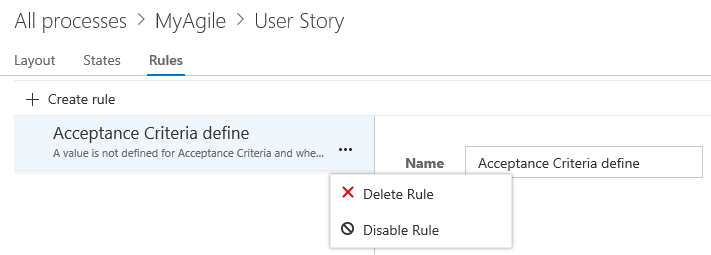

# Add a rule to a work item type  

[!INCLUDE [temp](../../_shared/process-feature-availability.md)]

Custom rules provide support for a number of business use cases, allowing you to go beyond setting a default value for a field or make it required. Rules allow you to clear the value of a field, copy a value into a field, and apply values based on dependencies between different fields' values. 

With a custom rule, you can define a number of actions based on one or two conditions. For example, you can apply a rule to support these types of scenarios: 

- When a value is defined for Priority, then make Risk a required field 
- When a change is made to the value of Release, then clear the value of "Milestone"     
- When a change was made to the value of Remaining Work, then make Completed Work a required field
- When the value of Approved is True, then make Approved By a required field 
- When a user story is created, make make the following fields required: Priority, Risk, and  Effort

## Rule composition  

Each rule consists of two parts: Conditions and Actions. Conditions define the circumstances which must be met in order for the rule to be applied. Actions define the operations to perform. You can specify a maximum of two conditions and 10 actions per rule. All custom rules require all conditions to be met in order to be run. 
 
As an example, you can make a field required based on value assignments made to two other fields. In this case, you would specify two conditions and one action. For example: 

	(Condition) When the value of Reason = Verified Fixed  
	(Condition) And when the value of the Tech Lead = Jamal Hartnett   
	(Action) Then make the Integration Build field required   

> [!div class="mx-tdBreakAll"]  
> |Supported conditions |Supported actions  |
> |-------------|----------|  
> |- A work item state changes to a selected state - A work item state changes from one state to another state - A work item is created - A work item state is in a selected state - The value of a field equals a specified value - The value of a field does not equal a specified value - A value is defined for a field - No value is defined for a field - A change was made to the value of a field - No change was made to the value of a field |- Clear the value of a field - Copy the value of a field to another field    - Make a field required - Set the value of a field - Set the value of a field to the current date-time - Set the value of a field to the current user  |

>[!NOTE]   
>You make a field required and specify a field default through the [**Options** tab for the field](customize-process-field.md#options).  
 
## Add a custom rule 

You add fields to a selected work item type. To add custom rules, you must be a member of the Project Collection Administrators group or be [granted explicit permissions to edit a specific process](../../../security/set-permissions-access-work-tracking.md#process-permissions).  

0. Open the admin context Process hub from a work item form or by choosing the Account Settings option from the gear option. For details, see [Customize a process, Start customizing](customize-process.md#start-customizing).

	>[!IMPORTANT]  
	>If you don't see the Account settings option, then you are working from an on-premises TFS. The Process page isn't supported. You must use the features supported for the On-premises XML process model as described in [Customize your work tracking experience](../customize-work.md).
	
0. Select the WIT to which you want to add a rule, click **Rules** and then click  Create rule.   

     

0. Name the rule and select the condition(s) and action(s) from the dropdown menus.     

	>[!TIP]  
	>Specify a name that builds off the field(s) you're acting on, or the conditions you're setting.  
	
	Here we define that the Acceptance Criteria field is required when the State changes to Active and it is currently empty. 

     
 
	>[!NOTE]  
	>The sequence of actions you specify doesn't impact the behavior of the rule itself or its behavior with respect to other rules defined for the same WIT. 

## Delete or disable a rule     

You can temporarily disable a rule or delete it altogether.  

You delete or disable the rule from the actions menu of the rule.  

  

<!---

## System rules

Each work item type&mdash;bug, task, user story, etc.&mdash;has several system rules already defined. Some are simple, like making the Title field required or setting a default for the Value Area field. In addition, a number of system rules define actions to take when a workflow state changes. 

For example, several rules exist to copy the current user identity under the following conditions: 
- When a work item is modified, copy the user identity to the Changed By field  
- When a work item is modified, copy the user identity to the Changed By field
- When the workflow state changes to Closed or Done, copy the user identity to the Closed By field. 
 
>[!IMPORTANT]  
>Predefined system rules will take precedent over any custom rule that you define which would overwrite it.  

-->

## Related notes  

Once you've added a custom rule, open a work item and verify that the rule works as you intended.  

Additional topics of interest:  
- [Add or modify a custom work item type](customize-process-wit.md)
- [Customize the form](customize-process-form.md)
- [Customize a process](customize-process.md)    

>[!TIP]    
>You can't calculate or set formulas using a rule. However, you may find a solution that fits your needs via the [TFS Aggregrator  (Web Service) Marketplace extension](https://marketplace.visualstudio.com/items?itemName=tfsaggregatorteam.tfs-aggregator-web-service). 

<!---
### Unsupported XML element rules 
If you're familiar with the [XML elements for applying rules to fields](../reference/apply-rule-work-item-field.md), then note that the following rules and rule attributes aren't supported: 

- The *for* and *not* attributes aren't supported - you can't apply or restrict a rule based on a group, specific user, or the account collection 
- The following XML value rule elements aren't supported: 
	- **CANNOTLOSEVALUE**  
	- **FROZEN**  
	- **MATCH**  
	- **NOTSAMEAS**  
	- **EMPTY**

-->

[!INCLUDE [temp](../../../_shared/help-support-shared.md)]