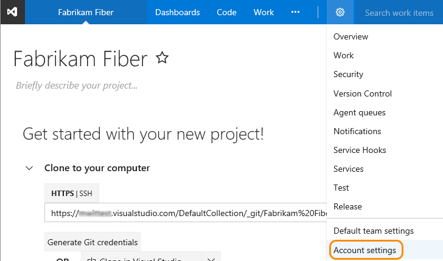
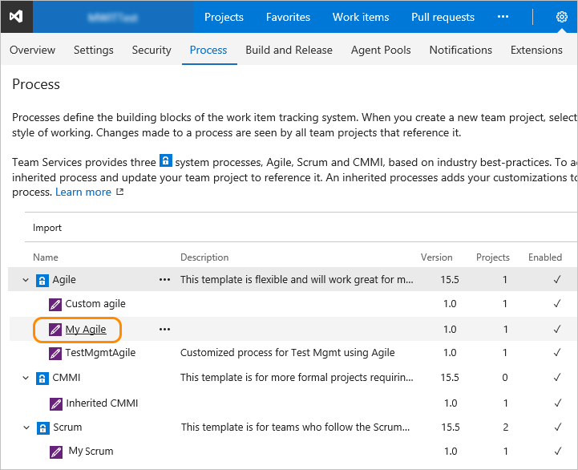
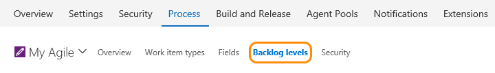
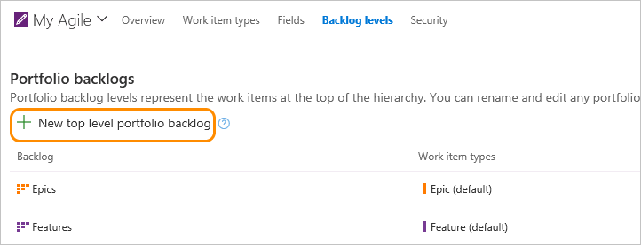
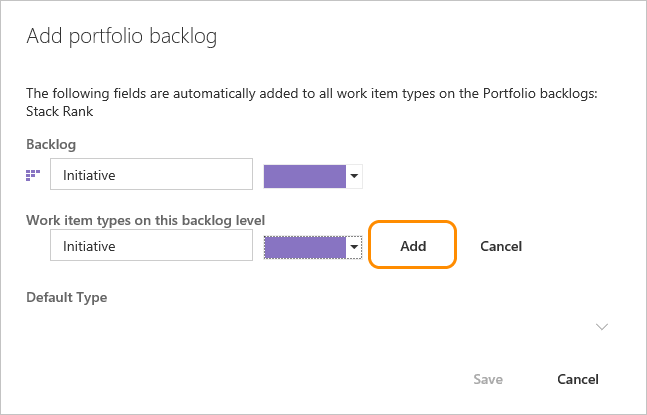
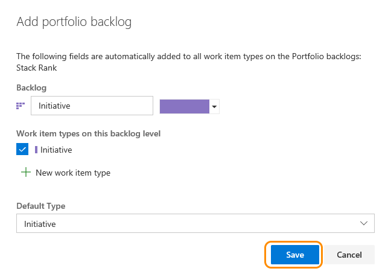
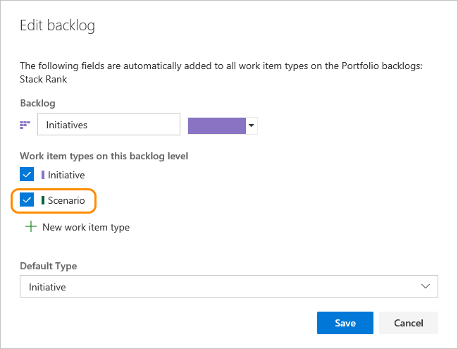
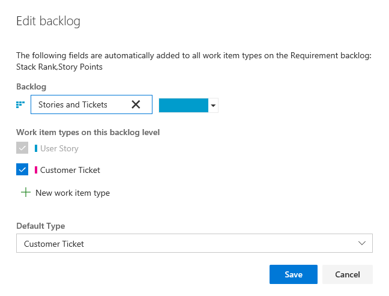
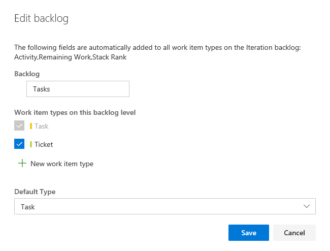

# Customize your backlogs or boards (Inheritance process model)  

<b>VSTS (Inheritance)</b>  

>[!IMPORTANT]  
>This topic applies to process customization for the Inheritance process model, which supports customization of team project(s) through a shared process model.
>
>To customize your backlogs or boards for the Hosted XML or On-premises XML process models, see [Add a work item type to a backlog and board](../add-wits-to-backlogs-and-boards.md) or [Add a portfolio backlog level](../add-portfolio-backlogs.md). For an overview of process models, see [Customize your work tracking experience](../customize-work.md).    

You can customize your backlogs to add more levels or add custom work item types (WITs) to them. As shown below, we've added a third level portfolio backlog labeled *Initiatives* which tracks the custom *Initiative* WIT, and we've renamed the product backlog to *Stories and Tickets* to indicate that we not only track *User Stories*, but also *Customer Tickets* on the product backlog. 
 
 

Your team project comes equipped with two portfolio backlogs: Features and Epics. However, if you need one or more additional portfolio backlogs, you can add them.   

Portfolio backlogs are useful for organizing your backlog under various business initiatives and user scenarios. When you [organize your backlogs into portfolios](../../backlogs/organize-backlog.md), you can gain a hierarchical view of the work defined in lower-level backlogs, including work in progress across several teams. Program managers can track the status of those backlog items of interest and drill down to ensure that all work is represented.  

##What you can customize   

You customize the backlogs and boards for an inherited process in the following ways: 

- Add a custom WIT to appear on any backlog&mdash;product, portfolio, iteration and task board 
- Add a portfolio backlog level which displays custom WITs 
- Change the default WIT for any backlog level 
- Rename or change the color of any portfolio or product backlog 
- Delete the top-level portfolio backlog (but not Epics nor Features) 

To perform any of these actions, you must be a member of the Project Collection Administrators group or be [granted explicit permissions to edit a specific process](../../../security/set-permissions-access-work-tracking.md#process-permissions). 

When you change the default WIT for a backlog level, it causes that WIT to appear by default in the quick add panel. For example, *Customer Ticket* appears by default in the following quick add panel for the product backlog. 

 

**What you can't customize**  
- You can't add or remove an inherited WIT to or from a backlog   
- You can't remove an inherited portfolio level from the product (but you can rename them)
- You can't insert a backlog level within the existing set of defined backlogs
- You can't reorder the backlog levels  
- You can't create a custom task level, although you can add custom WITs to the iteration backlog  
- You can't add the *Bug* work item type to any backlog level. Instead, the system allows each team to decide how they want to manage bugs. To learn more, see [Show bugs on backlogs and boards](../show-bugs-on-backlog.md).
 

## Open Process>Backlog levels in the admin context

To get started, you'll want to open the Backlog levels page of your custom inherited process. If you haven't created an inherited process yet, [do that now](manage-process.md#create-inherited-process).   
 
0. Open the admin context Process hub from a work item form or by choosing the Account Settings option from the gear option. For details, see [Customize a process, Start customizing](customize-process.md#start-customizing).

	>[!IMPORTANT]  
	>If you don't see the Account settings option, then you are working from an on-premises TFS. The Process page isn't supported. You must use the features supported for the On-premises XML process model as described in [Customize your work tracking experience](../customize-work.md).

	<!---  -->

0. Click Process, and then click the inherited process that you've created previously. 

	<!---    -->

0. Open the Backlog levels page.

	  

## Add or edit portfolio backlogs 

Each process defines two default portfolio backlogs, Epics and Features; each is associated with their corresponding work item types, epics and features. 

You can add a custom work item type when adding or editing a portfolio backlog, or you can choose a work item type you've previously added. Only those work item types that don't belong to another backlog level will appear for selection. 
 

### Add a portfolio backlog 

0. From the Backlog levels page, open the Add portfolio backlog dialog. 
  
	 

0. Name the backlog level, select the backlog level color, and add the work item type  to associate with this level. Click Add. 

	 

0. If you are associating only one work type with the backlog, then click Save to save your changes. Otherwise, you can add more work item types as needed. 

	 

### Edit, rename, or delete a portfolio backlog 

Open the context menu of a portfolio backlog that you've added to edit, rename, or delete it. From the Backlog levels page, open the Add portfolio backlog dialog. 

Deleting the backlog level only removes the backlog and board associated with this level. The work items defined with the associated work item types are not deleted or affected in any way. 

>[!NOTE]  
>You can't remove the default, inherited WIT from the Epics or Features portfolio backlogs. 

## Edit or rename the requirement backlog 
The Requirement backlog, also referred to as the product backlog, defines the WITs that appear on the product backlog and Kanban board. The default WIT for Agile is User Story; for Scrum, Product Backlog Item; and for CMMI, Requirement. 

You can rename the backlog, change the color, add WITs, and change the default WIT. Open the Edit backlog dialog from the context menu for the Requirements backlog. 

Here, we've renamed the backlog, added *Customer Ticket*, and changed the default type to *Customer Ticket*. 

>[!NOTE]  
>You can't remove the default, inherited WIT from the Requirements backlog. 

## Edit the iteration backlog 
The Iteration backlog, also referred to as the sprint backlogs, defines the WITs that are displayed on the sprint backlogs and task boards. The default WIT for all processes is Task.  

For the iteration backlog, you can add WITs and change the default WIT. Open the Edit backlog dialog from the context menu for the Iteration backlog. 

Here, we've added the *Ticket* WIT which will be tracked along with tasks. 

>[!NOTE]  
>You can't remove the default, inherited WIT from the Iteration backlog. 

## Related notes  

As you customize the backlog levels, all team projects that reference the inherited process that you're customizing will automatically update to reflect the changes you made to your inherited process. To view your changes, open the backlog page for the team project and refresh your web browser.  

To customize a single team project, always start by [creating an inherited process and migrating the team project to that process](manage-process.md). Then, all the customizations that you make to the inherited process automatically appear for the team project you migrated.  

Additional topics of interest:  

- [Add or modify a custom work item type](customize-process-wit.md)
- [Customize a process](customize-process-field.md) 
- [Backlogs, boards, and plans](../../backlogs/backlogs-boards-plans.md)    
- [Create your backlog](../../backlogs/create-your-backlog.md)
- [Organize your backlog, work with portfolio backlogs](../../backlogs/organize-backlog.md)

### Fields added to WITs associated with a backlog level 

When you add a field to a backlog level, the following fields are added to support select Agile tool features.  

| Backlog level | Fields added | 
|---------------|--------------|
| Portfolio backlog | - Stack rank (Agile, CMMI) - Backlog Priority (Scrum) | 
| Requirement backlog |  - Stack Rank, Story Points (Agile) - Stack Rank, Size (CMMI) - Backlog Priority, Effort (Scrum) |
| Iteration backlog | - Activity, Remaining Work, Stack Rank (Agile) - Discipline, Remaining Work, Stack Rank (CMMI) - Activity, Remaining Work, Backlog Priority (Scrum) |

The Stack Rank and Backlog Priority fields capture the relative priority of work items as they are reordered on a backlog or board.  

The Story Points, Size, and Effort fields capture the relative work required to complete a WIT assigned to the Requirement backlog. This value is used to compute [velocity](../../../report/dashboards/velocity-chart-data-store.md).  

And, lastly, Remaining Work is used [Sprint burndown and capacity charts](../../scrum/define-sprints.md). 

<!---
###About Categories 
The system defines 13 categories for use, and at least one WIT is assigned to each category. You can't add a WIT that already belongs to an existing category to a backlog.  

The Bug category is a special category that is designed to allow teams to manage their bugs as requirements or tasks. To learn more, see [Show bugs on backlogs and boards](../show-bugs-on-backlog.md)

--> 

[!INCLUDE [temp](../../../_shared/help-support-shared.md)]

