# Add a custom field to a work item type (Inheritance process model)  

[!INCLUDE [temp](../../_shared/process-feature-availability.md)]

Each  system process&mdash;[Agile](../../work-items/guidance/agile-process.md), [Scrum](../../work-items/guidance/scrum-process.md), or [CMMI](../../work-items/guidance/cmmi-process.md)&mdash;contains 100 or more work item fields. You can add a custom field to support tracking additional data requirements or modify select attributes of an  inherited field. For example, you can add a custom field and pick list or change the label that appears in the work item form for an inherited field.  

For a list of all fields defined for your account&mdash;which includes all fields defined for system and inherited processes&mdash;see [Review fields](#review-fields).  

## What you can customize  

Locked and inherited fields correspond to fields inherited from a system process. You can't customize locked fields. You can customize some options for inherited fields. 

> [!div class="mx-tdBreakAll"]  
> | Inherited fields |Custom fields |&nbsp;&nbsp;&nbsp;| 
> |-------------|----------|---------| 
> |- [Change the field label](#rename-field) - [Show/Hide field on form](#show-hide-field) |- [Add a custom field](#add-field) - [Add pick list (drop-down menu)](#pick-list) - [Add person-name/Identity](#identity) - [Add a rich-text (HTML) field](#html)  - [Add a checkbox (Boolean) field](#boolean-field) - [Add a custom control](custom-controls-process.md) | - [Add custom rules to a field](custom-rules.md) - [Change the field label](#rename-field) - [Set Required/Default options](#options) - [Move the field within the layout](customize-process-form.md#move-field) - [Remove field from form](#remove-field) - [Delete field](#delete-field) | 

When adding custom fields, note the following limits:  
*   A maximum of 64 fields can be defined for each WIT  
*   A maximum of 512 fields can be defined per process   

In addition, you can [add an existing inherited or custom field](#add-existing-field) to another WIT within the process. For example, you can add Due Date to the user story or bug WITs.    

To perform any of these actions, you must be a member of the Project Collection Administrators group or be [granted explicit permissions to edit a specific process](../../../security/set-permissions-access-work-tracking.md#process-permissions).  

**What you can't customize**
- You can't change the field name or data type once you've defined it  
- With regards to pick lists, you currently can't perform these operations:
	- Change the pick list of an inherited field, such as the Activity or Discipline field  
	- Change the pick list order, pick lists display in alphabetic order
- Import or define a global list  

## Add a custom field 

You can add fields and specify the group and page where they should appear. Also, once you've added a field, you can drag-and-drop it within a page to relocated it on the form. If you have several fields you want to add to a custom page or group, then you may want to [add those elements first](customize-process-form.md) and then add your fields. 

0. Open the admin context Process hub from a work item form or by choosing the Account Settings option from the gear option. For details, see [Customize a process, Start customizing](customize-process.md#start-customizing).

	>[!IMPORTANT]  
	>If you don't see the Account settings option, then you are working from an on-premises TFS. The Process page isn't supported. You must use the features supported for the On-premises XML process model as described in [Customize your work tracking experience](../customize-work.md).
	
0. With the WIT selected, click the  (New Field icon).  

    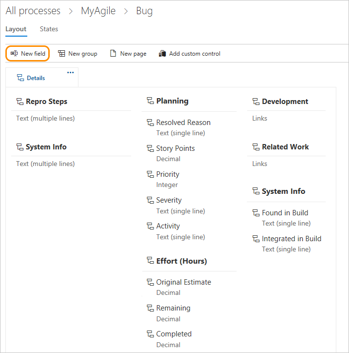 

0. Name the field and select the field type from one of the supported data types. Optionally, add a description.  

	>[!NOTE]  
	>You must specify a field name that is unique within the account. A custom field defined for one process cannot be the same as the name defined for another process. For more information on field names, see [What is a field? How are field names used?](#field-reference)
	
	Here we add an Integer field labeled Customer Ticket. 

     

	
0.	(Optional) On the Options tab, indicate if the field is required and specify a default value. Or leave these blank. By making a field Required, users must specify a value for the field in order to save it. The default value you specified is set when you create a work item as well as every time a work item is opened and the field is empty.

	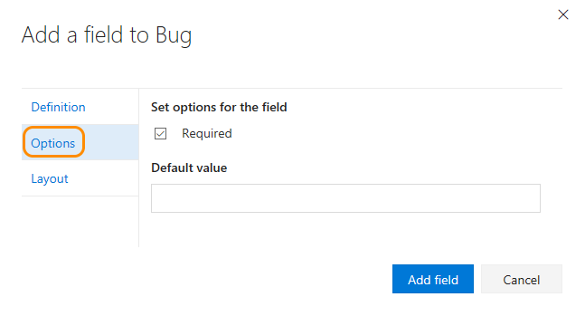  

	
0.	(Optional) On the Layout tab, you can enter a different form label than the name of the field. Also, you can choose the page and group where the field will appear on the form. 

	Here, we add the Customer Ticket field to a new group labeled Customer focus. 

	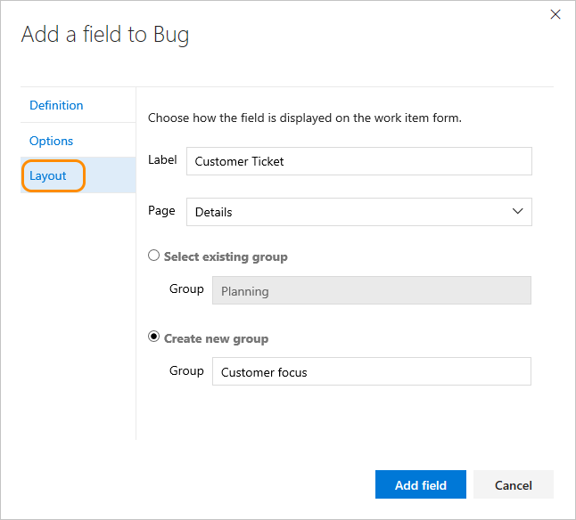  

	>[!NOTE]  
	>While you can change the form label, you must use the field name when adding fields to cards ([Kanban](../customize-cards.md#fields), [task board](../customize-cards.md#task-board)) or [creating queries](../../track/using-queries.md) based on the field.   

0.	Click **Add field** to complete adding the field. If you haven't specified it's layout location, it will be added to the first group of fields on the layout form.  

0.	When you've completed making all your changes, open a work item of the type you've just customized. 

	Here, we show the Customer Ticket field has been added to the Status group. You may need to refresh your browser to see the changes. 

	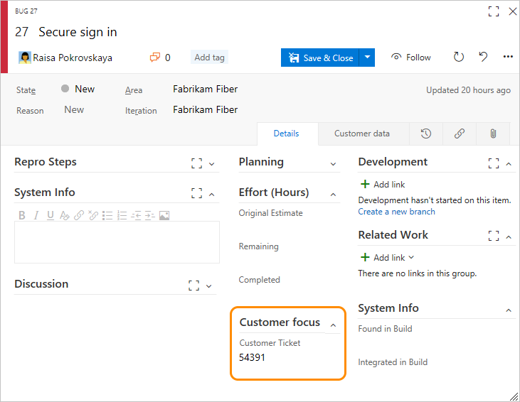
 

### Add a pick list  

1. Start by clicking  (New Field), then specify the pick list type&mdash;integer or string&mdash;and then add the items to appear in the pick list. You can simply add an item and then press Enter to add another item.

	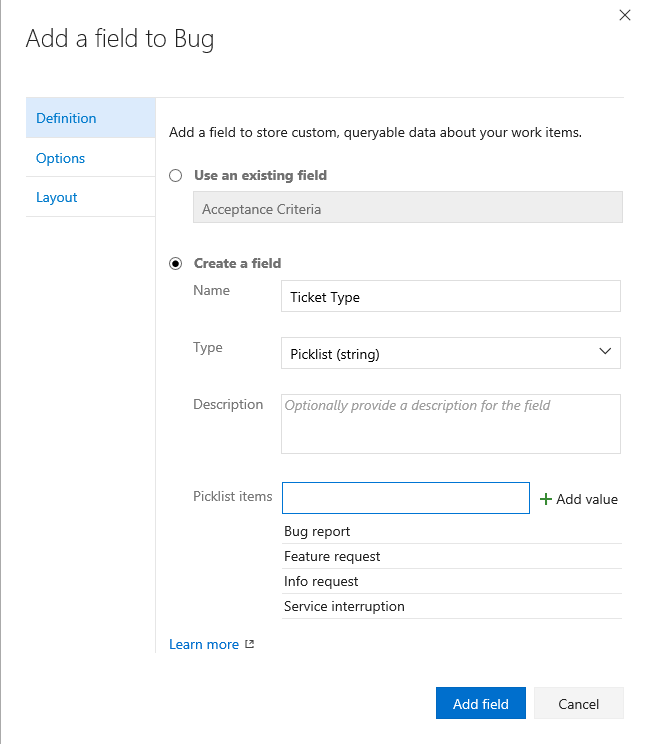  

	To delete an item in the list, highlight the item and then click the  delete icon.  

2. (Optional) Click the Options tab to define the field as required, specify  a default, or allow users to enter their own values. 

	  

3. (Optional) See previous [step 5](#layout) to specify where you want the field to appear on the form (Layout tab). 
 
<!---
2. To reorder the list, simply drag the item to where you want it in the list. 

	
-->

### Add an Identity field  

Use the Identity field to add a field similar to the Assigned To field. Identity fields act in the same way as the Assigned To field, providing a search and identity picker function. If your account manages users with Azure Active Directory (AAD), then the system synchronizes Identity fields with the names defined in AAD and are valid users of the team project. 

1. Start by clicking  (New Field), then the field name, Identity type, and optionally a description. 

	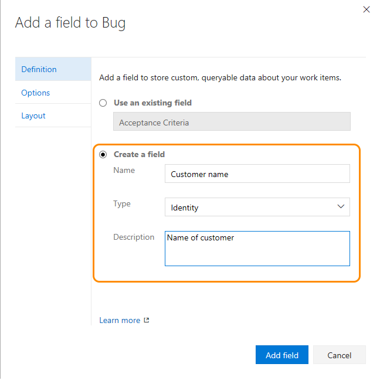  

3. (Optional) See previous [step 5](#layout) to specify where you want the field to appear on the form (Layout tab). 
 

### Add a rich-text, HTML field 

1. Just as before, choose the WIT you want to add the field to and then click the  (New Field icon).  

2. Choose Text (multiple lines) as the type. Here we label the field as Customer request to capture customer verbatims.   

    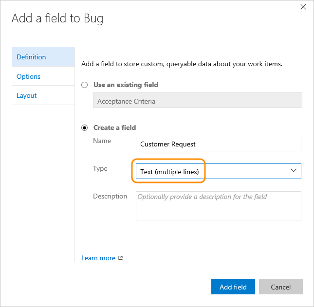  

2. The field is added to the first column under all system-defined rich-text fields, but before the Discussion control.   

	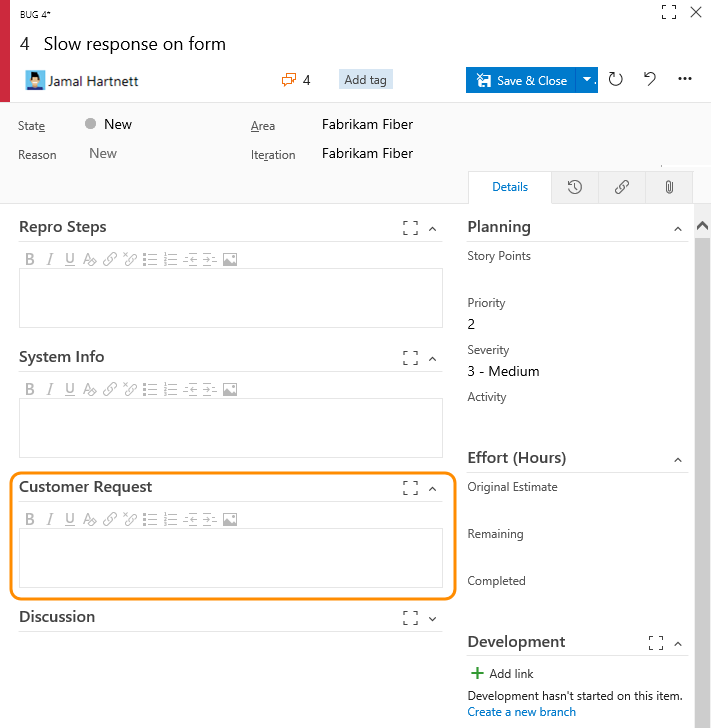   

### Add a checkbox field  

1. Just as before, choose the WIT you want to add the field to and then click  New Field.  

2. Choose Boolean as the type, and give it a label. Here we label the field as Triaged to track the triage state of the bug.  

	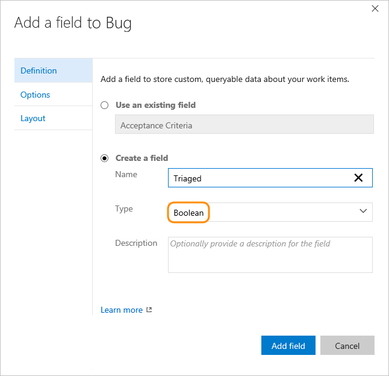   

3. (Optional) Open the Options tab and specify if the field should be required. 

	 

4. By default, the field is added to the last group defined in the second column. Open the Layout tab to drag and drop the field to another group on the form.  

	>[!NOTE]  
	>The field will appear as a checkbox in the work item form. Check the box to indicate a True value. If you display the field on the Kanban or Task board, then the field values of True and False display (not a checkbox). 

## Add an existing field to another WIT

Existing fields correspond to any inherited field and custom field defined within the collection. Once you've added a custom field to one WIT, you can add it to others from the form menu. Simply open the work item and choose the existing field. 

For a list of all work item fields defined for all WITs and processes, see the [Work item field index](../../work-items/guidance/work-item-field.md).  

Here we add the Customer Ticket field to the User Story WIT.  

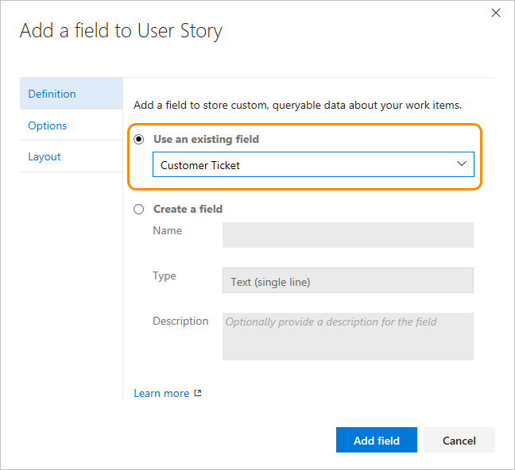  

Optionally, specify the [Required/Default values](#options) and [placement within the form](#layout) for the field.  

## Show, hide, or remove a field   

You can choose to show or hide an inherited field or a custom control from appearing on a form. For custom fields, you can remove it from the form. If you want to reinstate it later, you can add it back to the form. These actions differ from the [**Delete**](#delete-field) option, which deletes the field from the account.

>[!NOTE]    
>Data defined for an inherited field, even if you hide it, is maintained in the data store and work item history. You can view a record of it by viewing the history tab for a work item. 
>
>Data defined for a custom field is deleted when you remove it from the form. To delete a custom field from a project collection, see [Delete a field](#delete-field).   

### Hide an inherited field or custom control 

0. Open the context menu for the inherited field and choose Hide from layout.

	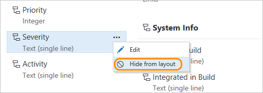  

0. To add a hidden field to the form, choose **Show on layout**.  

### Remove a custom field from a form
1. Choose Remove from the context menu of the field you want to remove. 

	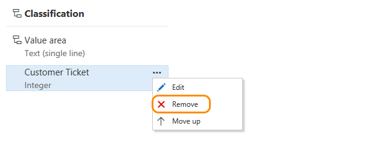    

2. Confirm that you want to remove the field.  

	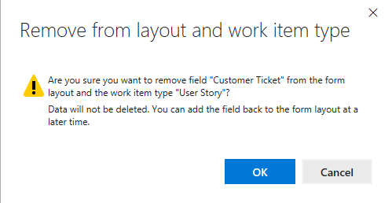   

0. To add a custom field that's been removed, choose **New field** and select **Use an existing field**.  

## Review fields 

To review the list of fields defined for all processes and the WITs which reference them, click the **Process** hub and then the **Fields** page.  

Fields listed correspond to all those defined for the account. For descriptions and usage of each field, see [Work item field index](../../work-items/guidance/work-item-field.md).  

## Related notes  

Once you've added a custom field, you can create [queries](../../track/using-queries.md) or [charts](../../../Report/charts.md) to track data related to it. <!---Note, however, that you can't access custom field data from [Power BI reports](https://www.visualstudio.com/en-us/get-started/report/connect-vso-pbi-vs). --> 

As you add custom fields, keep in mind that all team projects that reference the inherited process that you're customizing will automatically update to contain the new fields. Remember to refresh your web browser to view your latest changes. 

Additional topics of interest:  

- [Add or modify a custom work item type](customize-process-wit.md)
- [Customize the form](customize-process-form.md)
- [Customize a process](customize-process.md)    
- [Customize cards on boards](../customize-cards.md)  
- [Show bugs on backlogs and boards](../show-bugs-on-backlog.md)  

If you are working with test plans or test cases, see these topics: 
- [Create a test plan](../../../manual-test/getting-started/create-a-test-plan.md)  
- [Create manual test cases](../../../manual-test/getting-started/create-test-cases.md)   

<!---

### Revert field to preset defaults     
If you've made changes to an inherited field, and now want to discard those changes, you can do that by choosing the revert option for the field from the Layout page of the modified WIT.  
-->

### Delete a field     
Deleting a field will delete all data associated with that field, including historical values. Once deleted, you can't recover the data. 

Prior to deleting a field, you must first remove it from the form for each WIT that it's been added to.  

1. You delete the field from a collection from the **Fields** page for all processes.  

	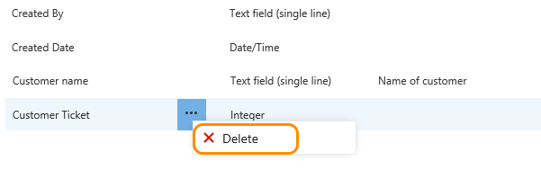  

	To delete fields, you must be a member of the Project Collection Administrators group or be [granted explicit permissions to edit a specific process](../../../security/set-permissions-access-work-tracking.md#process-permissions). 

2. To complete the delete operation, you must type the name of the field as shown. 

	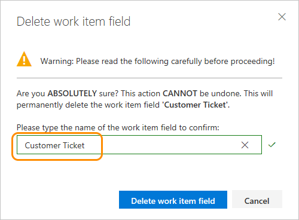  
 

### Can a field be renamed or its field type changed?   
Renaming a field or changing the field type aren't supported actions.  

However, you can change the label that appears for a field on the work item form from the Layout tab. When selecting the field in a query you need to select the field name and not the field label. 

Here, we relabel the Customer Ticket field to Ticket Number.   
 
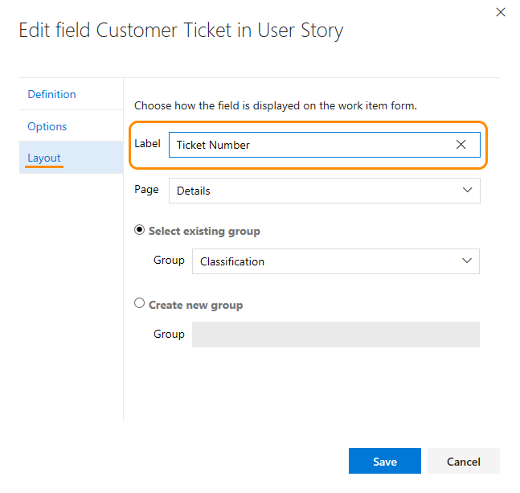

[!INCLUDE [temp](../../_shared/field-reference.md)]  

[!INCLUDE [temp](../../../_shared/help-support-shared.md)]
