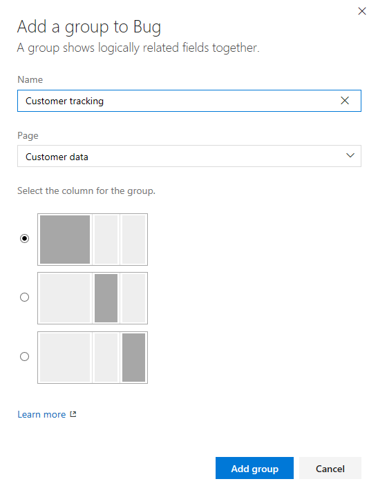
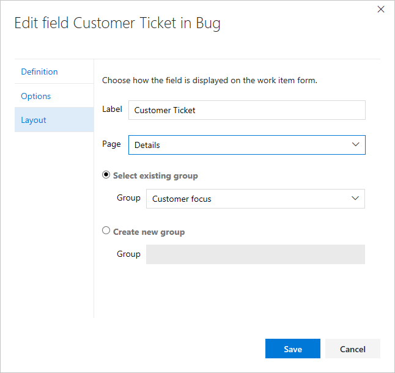
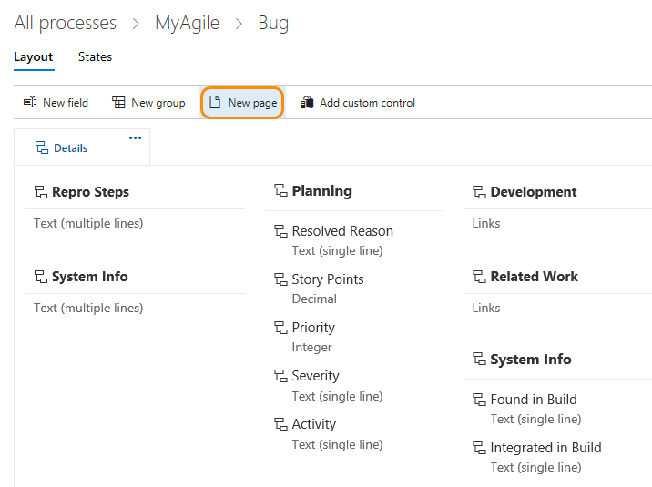
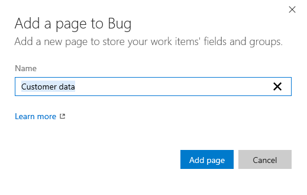
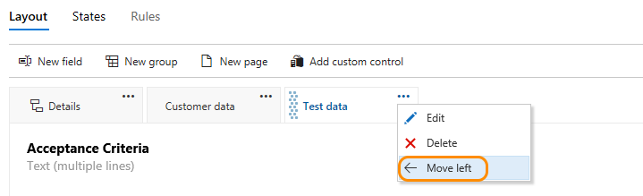

# Customize the web form for a work item type (Inheritance process model)  

[!INCLUDE [temp](../../_shared/process-feature-availability.md)]

Work items are the backbone for planning and tracking work. As such, you'll want to make sure that each work item type (WIT) is tracking the data that your team needs. 

To support your work tracking requirements, you can customize each WIT to add custom groups to collect custom fields that you add under a common section. You can organize your forms by placing logically related groups and HTML fields on separate pages within a form to minimize clutter on any one page within the form.  

For example, the following form shows that two custom pages have been added, **Impact** and **Mitigation**. In addition, several new groups and fields have been added to the Details page.  

 

##What you can customize   

You customize the web form for a WIT to which you want to add fields, groups, or pages. Each web form consists of a non-editable header, and a single inherited page labeled *Details*.  

A custom page appears on the form as a tab to the right of the Details page. Groups are used to organize a set of fields within a page. You can specify the column within a page where a custom group or field should appear.  

Here are your customization options for inherited groups and pages. For information on field customization options, see [Customize a field for a process](customize-process-field.md).

> [!div class="mx-tdBreakAll"]  
> | Inherited groups |Custom groups |&nbsp;&nbsp;&nbsp;| 
> |-------------|----------|---------| 
> |- [Relabel](#groups) - [Add/remove custom fields](customize-process-field.md) - [Show/hide fields](customize-process-field.md#remove-field) |- [Add, modify, re-sequence, delete](#groups) - [Add/remove custom fields](customize-process-field.md) - [Add/Hide a group extension](custom-controls-process.md) |  

> [!div class="mx-tdBreakAll"]  
> | Inherited pages |Custom pages | 
> |-------------|----------|
> |- [Relabel](#pages) - [Add/remove custom fields](customize-process-field.md) - [Add/remove a custom group](#groups) |- [Add, modify, re-sequence, delete](#pages) - [Add/delete custom fields](customize-process-field.md) - [Add/Hide a page extension](custom-controls-process.md) |  
 

To perform any of these actions, you must be a member of the Project Collection Administrators group or be [granted explicit permissions to edit a specific process](../../../security/set-permissions-access-work-tracking.md#process-permissions).  

**What you can't customize**  
You can't modify the layout or field options assigned to these WITs: 
- Shared Steps and Shared Parameters
- Code Review Request and Code Review Response
- Feedback Request and Feedback Response 

  
## Layout and resizing 

The web form layout is organized into three columns as shown in the image below. 

If you only add groups and fields to the first two columns, then the layout reflects a two column layout. Likewise, if you only add groups and fields to the first column, then the layout reflects a one column layout. 

The web form resizes depending on the width available and the number of columns in the layout.  At maximum width, in most web browsers, each column within a page will display within its own column. As the display width decreases, each column resizes proportionally as follows: 

- For three columns: 50%, 25%, and 25%  
- For two columns: 66% and 33%  
- For one column: 100%.  

When the display width won't accommodate all columns, columns appear stacked within the column to the left. 

## Open Process>Work Item Types in the admin context

To customize the web form, you must work from the admin context Process hub. 

You can open the admin context Process hub from a work item form or by choosing the Account Settings option from the gear option. For details, see [Customize a process, Start customizing](customize-process.md#start-customizing).

>[!IMPORTANT]  
>If you don't see the Account settings option, then you are working from an on-premises TFS. The Process page isn't supported. You must use the features supported for the On-premises XML process model as described in [Customize your work tracking experience](../customize-work.md).

## Groups 

You can add your own custom groups to both inherited pages and custom pages. 

### Add a custom group  

1. From the Layout page, choose New group.    

	Work Item Types>Bug>Layout>Add new group" style="border: 1px solid #C3C3C3;" /> 

2. Label the group and choose the column it should appear in.

	

	
3. (Optional) Once you've added the group, you can drag and drop the group into any column or within the column, or select the Move Up or Move Down options from the group's &hellip; context menu.  

  

### Delete or remove a custom group    

Before you remove a group, first move all fields defined in that group to another group or remove them from the form.  

>[!TIP]   
>You must remove all fields from a group for the Remove option to appear. 

Choose the  Remove option from the custom group &hellip; context menu.   

>[!NOTE]   
>When all fields in an inherited group are hidden, the inherited group itself will not appear on the form.   

### Move a field     

Within a page, you can quickly drag-and-drop a field to a new group or section within the page. 

To move a field to another page, choose Edit from the field's &hellip; context menu and then choose the Page from the menu. Optionally, select an existing group or create a new group. 

Here we move the Customer ticket field to the Details page and the Customer focus group.   

 

### Remove a field from a form    
 
You can only remove custom fields from a form. For inherited fields, you can hide them from showing on the form. To learn more, see [Customize a field for a process, Show, hide, or remove a field](customize-process-field.md#show-hide-remove-field).  

<!---
For a custom field, open the field's &hellip; context menu, and then choose the  **Remove** option.   

For an inherited field, open the field's &hellip; context menu, and then choose the **Hide from layout** option.   

Here we remove the Severity inherited field from appearing on the Bug form.   

Removing a custom field from a form removes tracking data for the WIT. You can re-add a custom field to a WIT by adding it to a form as an existing field. 

Removing an inherited field from a form simply hides the field from displaying on the form; it remains defined for the WIT. Hidden fields display on the admin layout page with a strikethrough. You can re-add these fields to the form through their context menu. 

--> 

##Pages  

Add a custom page when you have several custom fields that you want to group within that page. You can add and reorder custom pages. 

### Add a custom page  

0. From the Layout page of the WIT you've selected, click New page.    

	

0. Label the page.

	

	
0. Edit the page to add [fields](customize-process-field.md) or [groups](#groups).  

0. When you've finished adding groups and fields to the page, verify your layout is as expected. Refresh your browser and open a work item of the type you just customized. 

	

### Reorder pages 

You can reorder custom pages using drag and drop, or choose the move operation from the custom page &hellip; context menu. You can't move the inherited Details page.

### Delete a page  

Before you delete a page, you'll want to move any fields that your team still uses to another page. 

Choose the  Delete option from the custom page &hellip; context menu.   

>[!NOTE]  
>Deleting a page doesn't delete any data. Once data has been defined for a field, it's maintained in the data store and work item history, even if you remove it from the form. You can always choose to re-add the field by choosing **New field** and selecting **Use an existing field**.    

## Related notes  

Once you've added a custom page or group, you can add [custom fields to those pages or groups](customize-process-field.md).   

As you add custom pages or groups, all team projects that reference the inherited process that you're customizing will automatically update to contain the new pages or groups.

Additional topics of interest:  

- [Add or modify a custom work item type](customize-process-wit.md)
- [Customize a field](customize-process-field.md) 
- [Add or modify a custom control](custom-controls-process.md) 
- [Customize a process](customize-process.md)  
- [Customize cards on boards](../customize-cards.md)  

[!INCLUDE [temp](../../../_shared/help-support-shared.md)]

