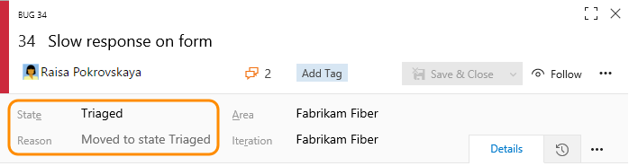
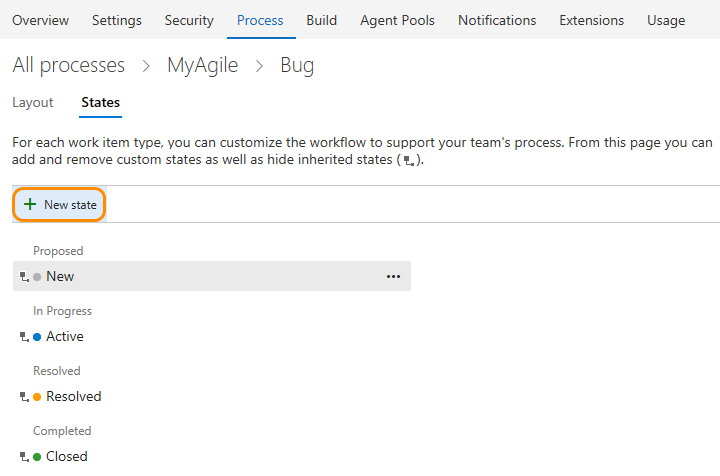
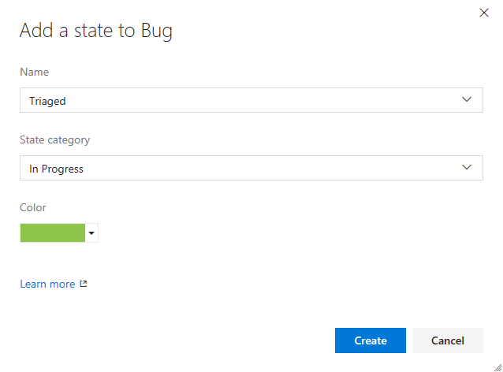
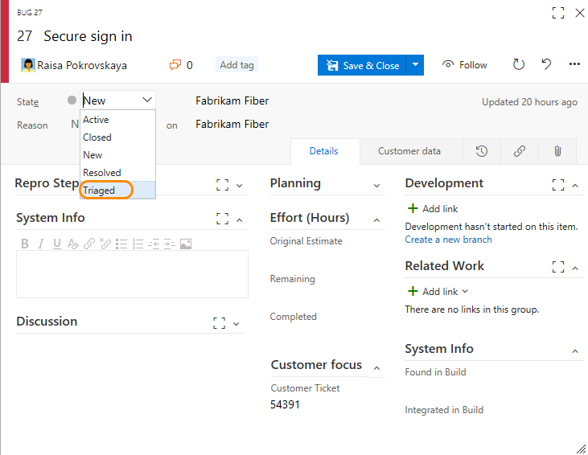
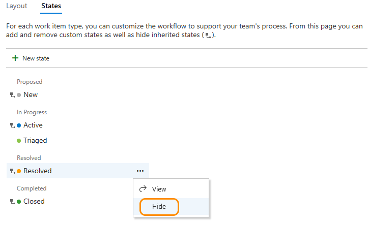
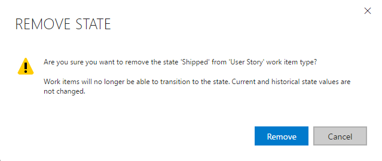

# Customize the workflow 

[!INCLUDE [temp](../../_shared/process-feature-availability.md)]

Each work item type is associated with a workflow that supports tracking the status of work as it moves from creation to completion. To support your business and team processes, you can add custom states to most work item types (WITs). For example, you may want to insert a Triaged state for bugs, or a Design state for features or user stories. 

Here, the Bug WIT has been customized to support a Triaged state. The state and reason fields appear on the work item form in the header area.

 

##What you can customize   

You customize the workflow for a WIT by adding a custom state. Each customizable WIT consists of three or more inherited states. Inherited states differ based on the system process &mdash;[Agile](../../work-items/guidance/agile-process.md), [Scrum](../../work-items/guidance/scrum-process.md), or [CMMI](../../work-items/guidance/cmmi-process.md)&mdash;you chose from which to create your custom process. 

> [!div class="mx-tdBreakAll"]  
> | Inherited states |Custom states |
> |-------------|----------|
> |- [View workflow states](#hide-state) - [Hide a state](#hide-state) |- [Add a state](#add-states) - [Edit a state (change color or category)](#edit-state) - [Remove a state](customize-process-workflow.md#remove-state) |  

To perform any of these actions, you must be a member of the Project Collection Administrators group or be [granted explicit permissions to edit a specific process](../../../security/set-permissions-access-work-tracking.md#process-permissions).  

**What you can't customize**  
- You can't modify an inherited state (you can't change its name, color, or category)
- You can't hide an inherited state if it's the only one in its state category    
- You can't change the name of a custom state 
- You can't add a custom state to the Completed category
- You can't change the order of states (states are listed in the order you add them within the States page, and they're listed  alphabetically within the drop down list of a work item form)  
- You can't apply a field rule to a state (for example, make a field required)
- You can't specify a Reason for a state, instead, default reasons are defined such as Moved to state Triaged, Moved out of state Triaged 
- You can't specify allowed transitions, all transitions are defined from any state to another state (except to the Removed state).  

## Add a workflow state   

States you add will appear in the pick list for the States field shown in work item forms and the query editor. A transition to and from the State you add is created to every other State, except not to a Removed state. Also, default reasons are defined, such as Moved to state Triaged, Moved out of state Triaged.

> [!NOTE]    
>Before adding a workflow state, review [Workflow states and state categories](../workflow-and-state-categories.md) to learn how workflow states map to state categories. 

### Open Process>Work Item Types in the admin context

To customize the workflow for a WIT, you must work from the admin context Process hub. 

You can open the admin context Process hub from a work item form or by choosing the Account Settings option from the gear option. For details, see [Customize a process, Start customizing](customize-process.md#start-customizing).

> [!IMPORTANT]  
>If you don't see the Account settings option, then you are working from an on-premises TFS. The Process page isn't supported. You must use the features supported for the On-premises XML process model as described in [Customize your work tracking experience](../customize-work.md).
	

### Add a state 

> [!NOTE]    
>States that you add to the task WIT will add columns to the task board. If you [track bugs along with tasks](../show-bugs-on-backlog.md), then states you add to the bug WIT will also add columns to the task board. You don't have to add the same states to each of these WITs, however, you may want to do so in order to  update the status in the same way and to minimize the number of columns that get added.  
>
>If you add a state to a WIT which you is associated with a backlog level, each team will need to update their [Kanban board columm settings](../../kanban/add-columns.md) in order to view and use the affected Kanban board.  

0. From the Work Item Types tab, choose the work item type you want to modify, choose States, and then choose New State.    

	  

0. Enter the name of the State, choose its category and color, and then click Save. The color you specify will appear throughout the product including on the work item form and when the State field appears on a backlog, boards, query results, and more.  

	  
	
0. When you've finished adding states for the WIT, verify your changes by refreshing your browser and open a work item of the type you just customized. 

	Here we show the state drop down field with Triaged selected. 

	 

0. Remember, when you add a state to a WIT which is associated with a backlog level, each team that uses the Kanban board will need to [update their column settings](../../kanban/add-columns.md).

### Edit a state

You can edit the category or the color of a custom state. However, you can't change the name of the custom state. 

0. Choose Edit from the &hellip; context menu for the state you want to modify.  
  
	 

0. Modify the category or color, and then click Save. 

0. If you change the category, teams that use the Kanban board to update their status will need to update their [column settings](../../kanban/add-columns.md).    
 

## Hide or remove a state

When you hide or remove a state:  
- The state no longer appears in the State pick list for the WIT
- No changes occur to the work item history     
- Existing work items maintain their state value, but are in an invalid state. If you want to make a change to the work item, you must first update the state values. You may want to create a query and do a bulk update to move the affected work items into a valid state. If you add the state back to the work item type, the work items revert to a valid state.  
 

### Hide or unhide an inherited state 

You can hide an inherited state that your team doesn't use in its workflow process. However, you must have at least one state defined for each category. 

0. Open the &hellip; context menu for the state you want to hide and choose the **Hide** option. 

	Here we hide the Resolved state for the Bug WIT. 

	 

	> [!NOTE]    
	>If you hide the state of a WIT tracked on a Kanban board, each team  that uses the Kanban board will need to [update their column settings](../../kanban/add-columns.md).

0. To unhide, open the &hellip; context menu and choose the **Unhide** option.  
 

### Remove a custom state 
0. Open the &hellip; context menu for the state you want to remove, and choose **Remove**. You can only remove a custom state.     

0. From the Remove State dialog, click Remove.   

	  

0.  If teams use the Kanban board to update their status, each team will need to update their [column settings](../../kanban/add-columns.md).    
 

## Related articles  

As you customize a workflow, all team projects that reference the inherited process that you're customizing will automatically update to reflect the customized workflow states. To view your customizations, refresh your web browser.  

Additional topics of interest:  

- [Add or modify a work item type](customize-process-wit.md)
- [Customize a field](customize-process-field.md)  
- [Customize a form](customize-process-form.md)
- [Customize a process](customize-process-field.md) 
- [Add or edit Kanban columns](../../kanban/add-columns.md)  
- [Query by workflow or Kanban board changes](../../track/query-by-workflow-changes.md)    

<!---
UPDATE CONTENT FOR THIS FWLINK: http://go.microsoft.com/fwlink/?LinkId=286303. 

Requested and Accepted States - Code Review Request and Code Review Response  

Rules governing States 
All work item types need at least 2 statesone Proposed/In Progress state and one Completed state.

-->
 

