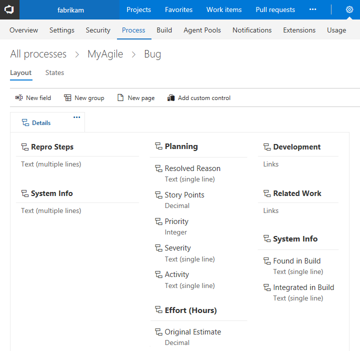
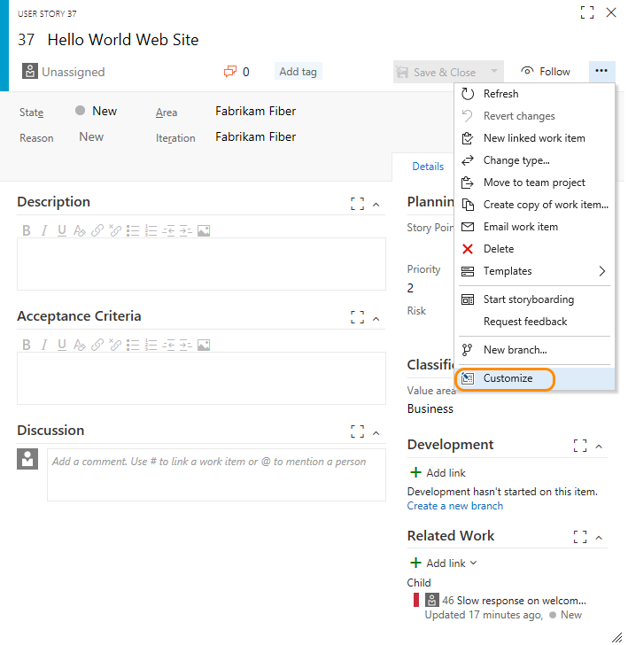
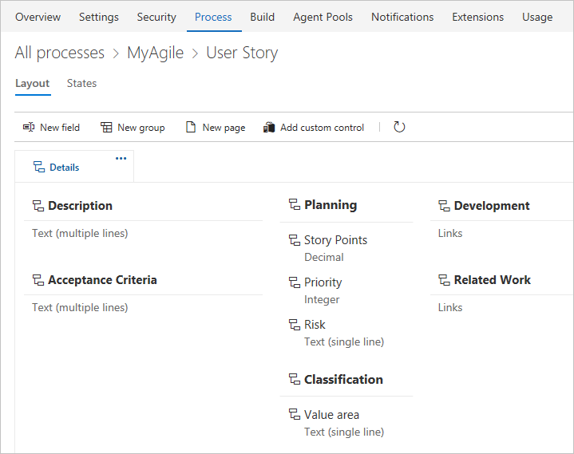
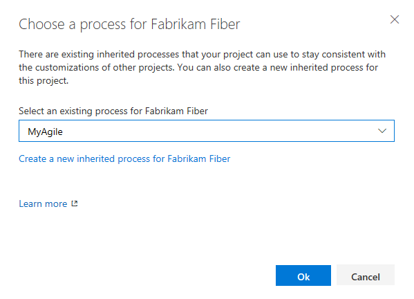
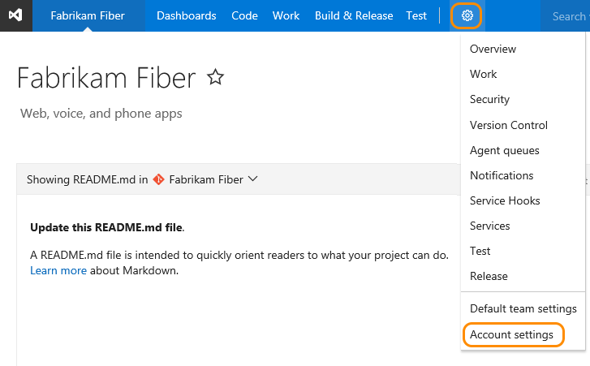
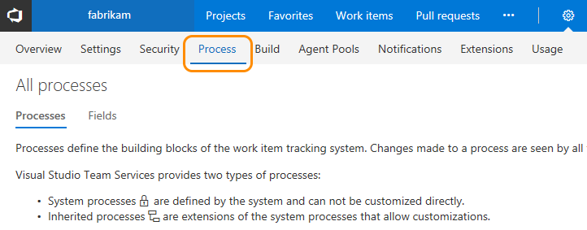
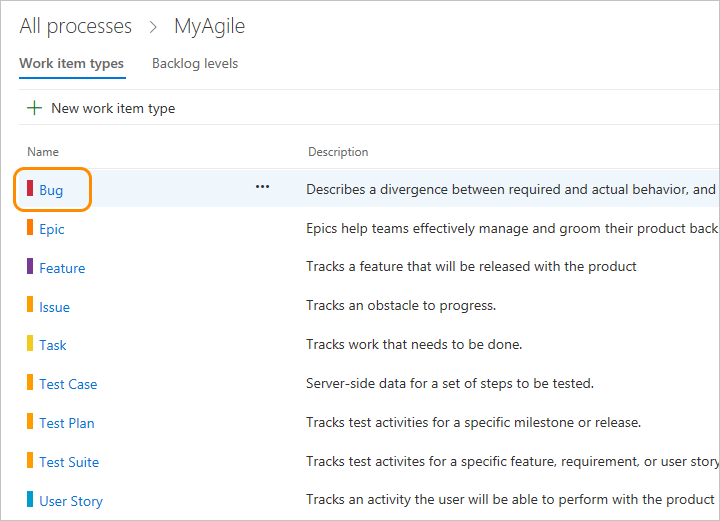
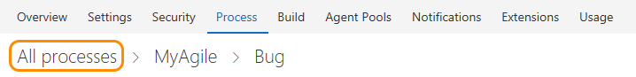

# Customize a process  

[!INCLUDE [temp](../../_shared/process-feature-availability.md)]

Your process provides the building blocks for tracking work. For each work item type (WIT) you want to customize, you do so from the WIT's **Process>Layout** page. If you haven't [created an inherited process](manage-process.md) yet, do that now. You can only customize inherited processes.   

Any changes you make to the inherited process will automatically show up in the team projects that use that process. 

For example, the following image shows the work item form layout for the Bug WIT. From this page, you can add fields, groups, pages, and custom controls. To modify the workflow, you click **States**.

 

## What you can customize

You can customize the elements listed below. Some options of inherited elements are locked and can't be customized. To perform any of these actions, you must be a member of the Project Collection Administrators group or be [granted explicit permissions to edit a specific process](../../../security/set-permissions-access-work-tracking.md#process-permissions).  

>[!NOTE]  
>For a list of limits placed on the number of fields, work item types, backlog levels, and other objects you can customize, see [Work tracking object limits](../object-limits.md). 

### Fields

Choose your inherited process, the work item type and then add and edit fields from the **Layout** page. Customizations are subject to the guidelines and limitations outlined under [What is a field?](customize-process-field.md#field-reference).

> [!div class="mx-tdBreakAll"]  
> | Inherited fields |Custom fields |&nbsp;&nbsp;&nbsp;| 
> |-------------|----------|---------| 
> |- [Change the field label](customize-process-field.md#rename-field) - [Show/Hide field on form](customize-process-field.md#show-hide-field) |- [Add a custom field](customize-process-field.md#add-field) - [Add pick list (drop-down menu)](customize-process-field.md#pick-list) - [Add person-name/Identity](customize-process-field.md#identity) - [Add a rich-text (HTML) field](customize-process-field.md#html)  - [Add a checkbox (Boolean) field](customize-process-field.md#boolean-field) - [Add a custom control](custom-controls-process.md) |- [Add custom rules to a field](custom-rules.md) - [Change the field label](customize-process-field.md#rename-field) - [Set Required/Default options](customize-process-field.md#options) - [Move the field within the layout](customize-process-form.md#move-field) - [Remove field from form](customize-process-field.md#remove-field) - [Delete field](customize-process-field.md#delete-field) | 

### Work item types

Choose your inherited process, and then add or edit a work item type from the **Work item types** page.

> [!div class="mx-tdBreakAll"]  
> | Inherited WITs | Custom WITs |&nbsp;&nbsp;&nbsp;| 
> |-------------|----------|---------| 
> |- [Add/remove custom fields](customize-process-field.md) - [Add/remove custom groups](customize-process-form.md#groups) - [Add/delete custom pages](customize-process-form.md#pages) - [Add/remove a custom control](custom-controls-process.md)  - [Enable/disable](customize-process-wit.md#enable-disable) |- [Add custom WIT](customize-process-wit.md#add-wit) - [Change color or description](customize-process-wit.md#overview) - [Add/remove custom fields](customize-process-field.md) - [Add/remove custom groups](customize-process-form.md#groups) - [Add/delete custom pages](customize-process-form.md#pages) - [Add/remove a custom control](custom-controls-process.md) |- [Add, edit, or remove a workflow state](customize-process-workflow.md#states) - [Enable/disable](customize-process-wit.md#enable-disable) - [Delete](customize-process-wit.md#destroy) |  

### Web form layout  

Choose your inherited process and the work item type, and then modify the form from the **Layout** page.

> [!div class="mx-tdBreakAll"]  
> | Inherited groups |Custom groups |&nbsp;&nbsp;&nbsp;| 
> |-------------|----------|---------| 
> |- [Relabel](customize-process-form.md#groups) - [Add/remove custom fields](customize-process-field.md) - [Show/hide fields](customize-process-field.md#remove-field)  **Inherited pages** - [Relabel](customize-process-form.md#pages) - [Add/remove custom fields](customize-process-field.md) - [Add/remove a custom group](customize-process-form.md#groups) |- [Add, modify, re-sequence, delete](customize-process-form.md#groups) - [Add/remove custom fields](customize-process-field.md) - [Add/Hide a group extension](custom-controls-process.md) **Custom pages**  - [Add, modify, re-sequence, delete](customize-process-form.md#pages) - [Add/delete custom fields](customize-process-field.md) - [Add/Hide a page extension](custom-controls-process.md) |    

### Workflow states

Choose your inherited process, the work item type, and then modify the workflow from the **States** page.  

> [!div class="mx-tdBreakAll"]  
> | Inherited states |Custom states |
> |-------------|----------|
> |- [View workflow states](customize-process-workflow.md#hide-state) - [Hide a state](customize-process-workflow.md#hide-state) |- [Add a state](customize-process-workflow.md#add-states) - [Edit a state (change color or category)](customize-process-workflow.md#edit-state) - [Remove a state](customize-process-workflow.md#remove-state) |   

### Backlogs 
Choose your inherited process, and then modify the backlogs configuration from the **Backlog levels** page. Inherited backlogs aren't locked. 

> [!div class="mx-tdBreakAll"]  
> | Inherited backlogs |Custom backlogs |
> |-------------|----------|
> |- [Add a custom WIT](customize-process-backlogs-boards.md) - [Change the default WIT](customize-process-backlogs-boards.md) - [Rename the requirement backlog](customize-process-backlogs-boards.md#edit-product-backlog) - [Rename a portfolio backlog](customize-process-backlogs-boards.md#edit-portfolio-backlog) |- [Add a portfolio backlog which displays custom WITs](customize-process-backlogs-boards.md#portfolio-backlogs) - [Edit or rename a portfolio backlog](customize-process-backlogs-boards.md#edit-portfolio-backlog) - [Delete the top-level custom portfolio backlog](customize-process-backlogs-boards.md#edit-portfolio-backlog) |

## Start customizing  
The easiest way to start customizing a process is to start from the work item of the type you want to customize. 

0. From the web portal, open the WIT you want to customize, open the context menu, and choose the Customize. 

	  

	- If the team project already uses an inherited process, then the **Layout** page for the corresponding WIT will open. 

		For example, the MyAgile process, User Story WIT, Layout page appears.   

		  

		>[!NOTE]  
		>The **Add custom control** option only appears when [qualifying extensions have been added from the Marketplace](custom-controls-process.md). 

	- If the team project uses a system process, but a valid inherited process has been defined, then you have the option to select which inherited process you want the team project to use. 

	 	 

		Upon choosing, the Layout page for the corresponding process and WIT opens.

	- If the team project uses a system process, and no valid inherited process have been defined, then the system will automatically create an inherited process, labeling it *AccountName_ParentProcessName*&mdash;for example, *fabrikam Agile*&mdash;and automatically update the team project to use the process. You can later [rename the process](manage-process.md#process-naming).  

		After which, the Layout page for the corresponding process and WIT opens.
  
0. From the Layout page, you can customize the WIT. Review the next section for a summary of all the customizations you can make. 

###Open the Process hub from the user context  

You can also start customizing an inherited process by navigating to the inherited process from the user context. 

0. To open the admin context from the user context, click the  gear Settings icon and choose Account settings. 

	>[!IMPORTANT]  
	>If you don't see the Account settings option, then you are working from an on-premises TFS. The Process page isn't supported. You must use the features supported for the On-premises XMl process model as described in [Customize your work tracking experience](../customize-work.md).

	 

0. Click Process and then select the inherited process you want to customize. If you haven't yet created an inherited process, do that now. See [Create an inherited process](manage-process.md#create-inherited-process).  

	  

0. From the Work Item Types page, choose the WIT that you want to customize.  

	Here we open Bug for the MyAgile process.
 

	

### Web versus Visual Studio form layouts 

The customizations you make only impact the work item forms displayed in a web browser. The work item forms displayed in Visual Studio or other [supported clients](../../../user-guide/tools.md) won't reflect any process customizations you make.    

## Return to the process list  
To return to the Process page, simply click the Process hub or the **All processes** breadcrumb link.   

  

To return to a specific process and choose another WIT to customize, click the process name from the breadcrumb link.  

## Related notes

Keep in mind that all team projects that reference the inherited process that you're customizing will automatically update to contain the modifications you make. 

To customize a single team project, always start by [creating an inherited process and changing the team project to use that process](manage-process.md). Then, all the customizations that you make to the inherited process automatically appear for the team project you migrated.  

See also: 
- [Work tracking object limits](../object-limits.md)
- [Customize the work tracking experience](../customize-work.md) 

### Programmatically query for processes 

You can determine the processes defined for an account using the REST API: [Processes](https://visualstudio.com/integrate/api/tfs/processes.md).

[!INCLUDE [temp](../../../_shared/help-support-shared.md)]

