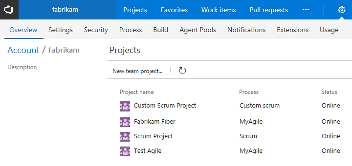
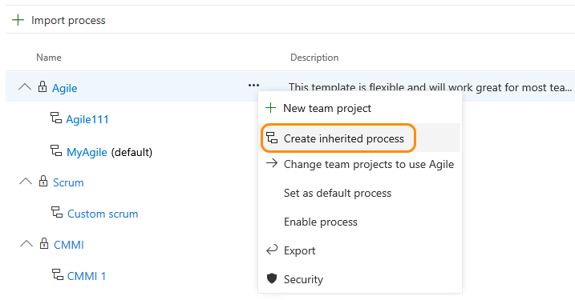
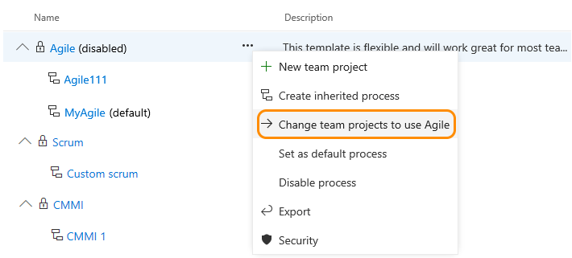
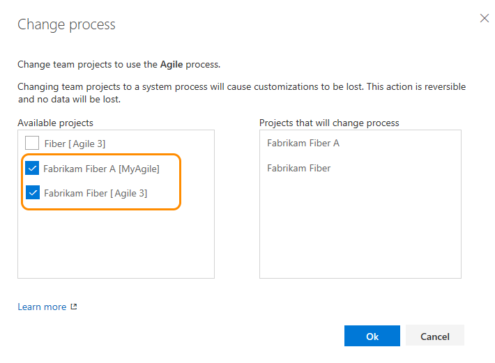
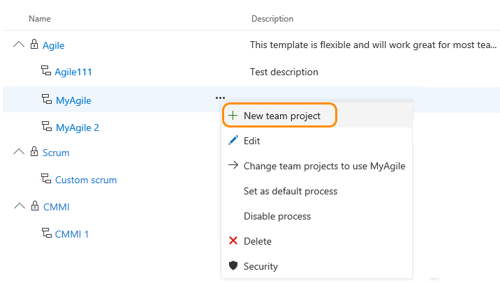

<!-- supports the FWLink: http://go.microsoft.com/fwlink/?LinkID=616878 --> 


# Manage processes 

[!INCLUDE [temp](../../_shared/process-feature-availability.md)]

In VSTS, you customize your team project through a process. (You configure your [Agile tools&mdash;Scrum and Kanban&mdash;through the web UI](../../../teams/about-teams-and-settings.md).) A process defines the building blocks of the work tracking system. Whenever you create a team project, you select the process you want your team project to use. 

VSTS supports two types of processes. 

-  System processes &mdash;[Scrum, Agile, and CMMI](../../work-items/guidance/choose-process.md)&mdash;which are locked from being changed except by VSTS.   
-  Inherited processes, which you can customize, are so named as they inherit from the system process from which they were created. Any updates VSTS makes to the parent system process will automatically update your custom inherited process.  

In addition, all processes are shared. That is, one or more team projects can use a single process. Instead of customizing a single team project, you customize a process. Changes made to the process automatically update all team projects that use that process. 

Once you've created an inherited process, you can customize it, create team projects based on it, and change existing team projects to use it. 

For example, as shown in the picture below, you see a list of team projects defined for the *fabrikam* account. The second column shows the process used by each team project. To update the *Fabrikam Fiber* team project, you need to update the *MyAgile* process (which inherits from the Agile system process). Any changes you make to the *MyAgile* process will also update the *Test Agile* team project. You can't customize the *Scrum project*, on the other hand, until you change it to a Scrum inherited process.

  

To perform any of the following actions, you must be a member of the Project Collection Administrators group or be [granted explicit permissions to edit or create a specific process](../../../security/set-permissions-access-work-tracking.md#process-permissions).  To get added to an admin group, see [Add administrators](../../../security/set-project-collection-level-permissions.md). 
- Import Process (only supported for accounts that use the [Hosted XML process model](../hosted-xml-process-model.md)) 
- Create an inherited process   
- Customize a process  
- Change team projects to use an inherited process or a system process    
- Add a new team project based on a process   
- Enable or disable a process
- Set a process as the default when creating a team project

<a id="open-process-wit">  </a>
## Open Process in the admin context

[!INCLUDE [temp](../../_shared/open-process-admin-context-ts.md)]

<a id="create-inherited-process"></a>
##Create an inherited process
You can create an inherited process from any one of the three system processes: [Agile](../../work-items/guidance/agile-process.md), [Scrum](../../work-items/guidance/scrum-process.md), or [CMMI](../../work-items/guidance/cmmi-process.md).   

0. From the Process page, open the &hellip; context menu of the process you'll use to create an inherited process, and then choose **Create inherited process**. 

	Here, we create an inherited process from the Agile system process.   

	  

	If you don't have access to these options, ask your project collection admin to [grant you permissions](../../../security/set-permissions-access-work-tracking.md#process-permissions). 

0.	Enter a name for your process and optionally a description. (For naming restrictions, see [Process name restrictions](#process-naming) later in this topic.)

	  

Once you've defined the inherited process, you can perform these actions: 
- [Customize a process](customize-process.md)   
- [Create a team project](#create-team-project) that uses the inherited process  
- [Change team projects to use the inherited process](#migrate)        

<a id="migrate"></a>
## Change the process used by team projects   

>[!IMPORTANT]  
>When you change a team project to use an inherited process, you may find one or more Agile tools or work items appear in an invalid state. For example: 
> 
> - If you make a field required, work items with that field undefined will show an error message. You'll need to resolve the errors to make additional changes and save the work item. 
> - If you add or remove/hide workflow states of a WIT that appears on the Kanban board, you'll need to update the Kanban board column configurations for all teams defined in the team project.  

You can change the process a team project uses from a system process or inherited process to an inherited process.  You can only change team projects to use another process that inherits from the same system process. That is, you can change an Agile-based team project to any process you created from the Agile system process as well as to the Agile process. Whereas, you can't change a Scrum-based team project to an Agile-derived inherited process.  

>[!NOTE]  
>You can change the process of a team project as long as you don't have any undeleted work items of a custom work item type that isn't also defined in the target process. 
>
>Also, if you change a team project to a system process or other inherited process that doesn't contain the same custom fields, data is still maintained. However, the custom fields that aren't represented in the current process won't appear on the work item form. You can still access the field data through a query or REST APIs. These fields are essentially locked from changes and appear as read-only values.  

0. Open the &hellip; context menu for the process and choose the **Change team projects**&hellip; option. 

	Here we open the menu for the Agile system process:

	  

	The system lists only those team projects that are valid for the current process.

0. Click the checkbox of those team projects you want to change to use the Agile process. 	

	Here we choose to use the Agile process for the team projects Fabrikam Fiber A and Fabrikam Fiber.  Only those projects created from the Agile process or one that inherits from Agile will appear under the Available projects column. 
 
	  

0. After  you've confirmed that the projects you want to change are correct, click Ok. 


<a id="create-team-project">  </a>
## Create a team project from a process 

0. Open the &hellip; context menu for the process you want to use and choose **New team project**.  

	

0. The Create new project page opens. For details, see [Create your team project](../../../accounts/create-team-project.md).


<a id="enable-process">  </a>
##Enable/disable a process

To prevent team projects being created from a process, you disable it. You might choose this option when you want to apply several customizations and don't want the process used until they are complete. Or, you might want to retire use of a process in favor of moving team projects to a new process. 

All system processes and newly created inherited processes are enabled by default. 

1. To disable a process, open the &hellip; context menu for the process and choose **Disable process**. 

2. To enable a process, open the &hellip; context menu for the process and choose **Enable process**. 


<a id="default-process">  </a>
##Set the default process

Set a process as the default to have it pre-selected for any additional team projects you plan to create. 

To set a process as the default, open the &hellip; context menu for the process and choose **Set as default process**. 

Account owners and Project Collection Administrators can add team projects from the admin Overview page or the [account My Projects page](../../../user-guide/account-home-pages.md). VSTS will automatically preselect the default selection.   


## Related notes  

An inherited process supports team projects defined in accounts that use the Inherited process models. For an overview of all process models, see [Customize the work tracking experience](../customize-work.md). 

For an overview of what you can customize, see [Customize a process](customize-process.md).  


<a id="process-naming"></a>
###Process name restrictions  
Process names must be unique and 128 Unicode characters or less. Also, names can't contain the following characters: ```.,;'`:~\/\*|?"&%$!+=()[]{}<>```. 

To rename a process, open the &hellip; context menu for the process and choose **Edit**. 

<a id="process-rest-api">  </a>
### Programmatically query for processes 
You can determine the processes defined for an account using the REST API: [Processes](https://www.visualstudio.com/en-us/docs/integrate/api/tfs/processes).


[!INCLUDE [temp](../../../_shared/help-support-shared.md)]

