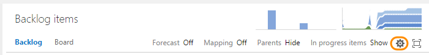
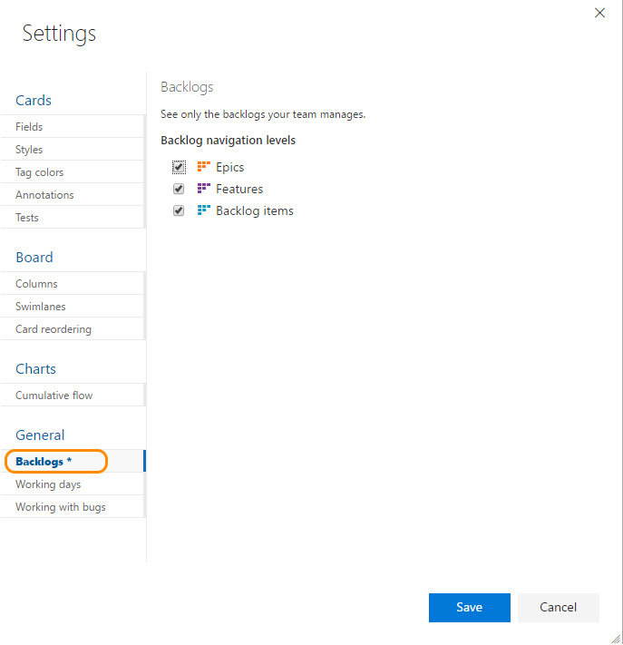
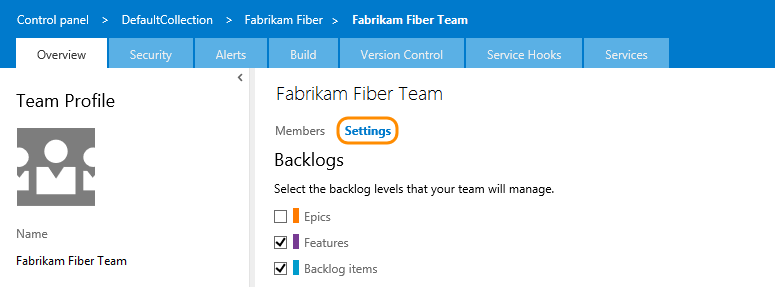

# Select backlog navigation levels for your team

**VSTS | TFS 2018 | TFS 2017 | TFS 2015**

>[!NOTE]  
>**Feature availability**: The team setting for choosing which backlog levels are available is available from VSTS and TFS 2015 and later versions. For TFS 2013, the Feature portfolio backlog level is enabled for all teams.  

Each team can determine the backlog levels that they use. For example, feature teams may want to only focus on their product backlog, while a management team may choose to only show feature and epics (the two default portfolio backlogs). You configure which backlog levels appear from your team settings dialog. 

If you want additional portfolio backlogs, see the following topics based on the process model you use: 
- **Inheritance**: [Customize your backlogs or boards for a process](process/customize-process-backlogs-boards.md)  
- **Hosted XML or On-premises XML**: [Add portfolio backlogs](add-portfolio-backlogs.md).  

For an overview of process models, see [Customize your work tracking experience](customize-work.md).

##Set your team's preferences for backlog levels

>[!NOTE]  
><b>Feature availability: </b>You can manage all your team settings from a common configuration dialog from VSTS or the web portal for TFS 2015 Update 1 or later version.  

Because this setting affects all team members' view of the team backlogs and boards, you must be a team administrator to change the setting. Changing the setting is disabled if you're not a team administrator. Go [here to get added as a team administrator](../scale/add-team-administrator.md).
 	

**VSTS** 

1. From your team's backlog page, click the  (gear icon) to open the common configuration team settings.

	 

2. Click the **Backlogs** tab and check the boxes of those backlog levels you want your team to manage. 

	

3. To see the changes, open or refresh your team's backlog web page. 
 
**TFS 2017** 

1. From your team's backlog page, click the  (gear icon) to open the common configuration team settings. 

	  

2. Click the **Backlogs** tab and check the boxes of those backlog levels you want your team to manage. 

	

3. To see the changes, open or refresh your team's backlog web page. 

**TFS 2015.1** 
1. From your web portal, click the , (gear icon) to open the administration page. 

	  

2. From the Overview tab, choose the team whose settings you want to configure, and then click **Settings**. 

	  

3. Click the **Backlogs** tab and check the boxes of those backlog levels you want your team to manage. 

	 

4. To see the changes, open or refresh your team's backlog web page. 
 

## Related notes

- [Get started with Agile tools to plan and track work](../backlogs/overview.md)
- [Backlogs, boards, and plans](../backlogs/backlogs-boards-plans.md)
- [Create your backlog](../backlogs/create-your-backlog.md)  
- [Define features and epics](../backlogs/define-features-epics.md)
- [Organize your backlog](../backlogs/organize-backlog.md)   
- [Portfolio management, setup a team hierarchy](../scale/portfolio-management.md)  
- [Work with multi-team ownership of backlog items](../backlogs/work-multi-team-ownership-backlogs.md)
- [Visibility across teams](../scale/visibility-across-teams.md)  

