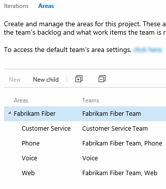

# Define area paths  

<b>Team Services | TFS 2017 | TFS 2015 | TFS 2013</b> 

Area paths allow you to group work items by team, product, or feature area. Whereas, [iteration paths](set-iteration-paths-sprints.md) allow you to group work into sprints, milestones, or other event-specific or time-related period. Both these fields allow you to define a hierarchy of paths. 

You define area paths for a team project. Teams can then choose which area paths are used to support their backlog and other Agile tools. To understand how Agile tools use area paths, see [Agile tools that rely on areas and iterations](../about-teams-and-settings.md).

Newly created team projects contain a single, root area that corresponds to the team project name.  
 
[!INCLUDE [temp](../_shared/image-differences.md)] 


 

 
<a id="open-admin-context">  </a>
## Open the administration context for the team project  

From the web portal, open the admin page for the team project.

You define both areas and iterations from the Work hub of the team project admin context. From the user context,you open the admin context by clicking the  gear Settings icon. The tabs and pages available differ depending on which admin context you access.  

[!INCLUDE [temp](../_shared/learn-about-new-nav-experience.md)] 


To manage areas and iterations you need to be a project administrator or have the **Create child nodes** permission for an area path. If you aren't a project administrator, [get added as one](../scale/add-team-administrator.md) or have someone provide you with explicit permissions to <b>Edit project-level information</b>. 

If you want to add area paths to support teams, you can do that when you [add teams to your team project](../scale/multiple-teams.md).  

Certain [restrictions](#name-restrictions) apply on names of areas.  


<a id="admin-intro-team-services" /> 

**Team Services**

1. From the web portal for the team project context, click the  gear Settings.   

	  

	If you're currently working from a team context, then hover over the  and choose Project settings.  

	 

2. Open the **Work** hub.   
 
**TFS 2017.1**
<a id="admin-intro-tfs-2017-1" /> 

1. From the web portal for the team project context, click the  gear Settings.   

	  

	If you're currently working from a team context, then hover over the  and choose Project settings.  

	 

2. Open the **Work** hub.  
 
**TFS 2017**
<a id="admin-intro-tfs-2017" /> 

1. From the web portal for the team project context, click the  gear Settings.   

	  

	If you're currently working from a team context, then hover over the  and choose Project settings. 

	 

2. Open the **Work** hub.   
 

**TFS 2015**
<a id="admin-intro-tfs-2015" />
 
1. From the web portal user context, click the  gear Settings.   

	 

2. Open the **Work** hub.   

## Add an area 

<a id="add-areas-team-services">   </a>

### Add area paths (Team Services) < 

1. Open the Work, Areas page for the team project context.  

	If you haven't added any areas or teams, you'll see that only one area is defined.   

	  

2.  Add a new child node to the area you have selected. 

	 

<a id="tfs-15-area-paths" />

### Add area paths (TFS 2017)  

1. Open the Work, Areas page for the team project context. 

	If you haven't added any areas or teams, you'll see that only one area is defined.   

	  

2. Add a new child node to the area you have selected.  

	 
 


<a id="tfs-2015-area-paths" />

### Add area paths (TFS 2015) 

1. Open the **Areas** tab.  

	  

	From the areas page, you can set the default area path used to filter the backlog.  The default area path is also used when new work items a user creates new work items. 

2. Add a new child node to the area you have selected.</p>

	
 

 
<a name="rename-delete"></a>
### Rename or delete an area or iteration node 

When you rename an area or an iteration, or move the node within the tree hierarchy, the system will automatically update the work items and queries that reference the existing path or paths. 

When you delete an area or an iteration node, the system automatically updates the existing work items with the node that you enter at the deletion prompt. 

## Chart progress by area or iteration

You can quickly generate [queries](../track/using-queries.md) to view the progress for those areas and iterations. As an example, you can [visualize progress of work items assigned to sprints](../../report/charts.md) as shown in the following stacked bar chart.  

 


## Related notes 
As you can see, areas play a major role in supporting Agile tools and managing work items. You can learn more about working with these fields from these topics: 

*	[Add another team](../scale/multiple-teams.md)  
*	[Set team defaults](../scale/set-team-defaults.md)  
*	[Configure team settings and add team administrators](../scale/manage-team-assets.md)   
*	[Agile tools that rely on areas or iterations](../about-teams-and-settings.md)
*	[Permissions and access](../../security/permissions-access.md)  


<a name="permissions"></a>
### Required permissions 

To create or modify areas or iterations, you must either be a member of the **Project Administrators** group, or your **Create and order child nodes**, **Delete this node**, and **Edit this node** permissions must be set to **Allow** for the area or iteration node that you want to modify.


### What kind and how many areas should a team define?

You add areas to support your team's trace-ability and security requirements. Use areas to represent logical or physical components, and then create child areas to represent specific features.  

Add areas when you have these requirements: 
*	Filter queries based on a product or feature area 
*	Organize or group work items by team or sub-teams  
*	Restrict access to work items based on their area.  

Each team can create a hierarchy of areas under which the team can organize their backlog items, user stories, requirements, tasks, and bugs.

Avoid creating an area structure that is too complex. You can create areas to partition permissions on work items, but complex trees require significant overhead for permission management. You might find that it is too much work to duplicate the structure and permissions in other team projects.


<a name="name-restrictions"></a>
### Naming restrictions 

The **Area Path** and **Iteration Path** fields, [data type=TreePath](../reference/define-modify-work-item-fields.md), consist of multiple node items which are separated by the backslash (&#92;) character. We recommend that you minimize the names of nodes, and make sure that you conform to the following restrictions when adding child nodes:

| Restriction type                 | Restriction                                 | 
| -------------------------------- | ------------------------------------------- | 
| Node length | Must not contain more than 255 characters | 
| Special characters for nodes | Must not contain Unicode control characters<br/>Must not contain any of the following characters: \ / $ ? * : " & > < # % + ,<br/>Must not contain characters that the [local file system prohibits](https://msdn.microsoft.com/library/aa365247.aspx). | 
| Reserved names | Must contain more than a period (.) or two periods (..)<br/>Must not be a [system-reserved name](https://msdn.microsoft.com/library/aa365247.aspx) such as PRN, COM1, COM2, COM3, COM4, COM5, COM6, COM7, COM8, COM9, COM10, LPT1, LPT2, LPT3, LPT4, LPT5, LPT6, LPT7, LPT8, LPT9, NUL, CON, or AUX<br/>| 
| Path length | Must contain fewer than 4,000 Unicode characters | 
| Path hierarchy depth | Must be fewer than 14 levels deep | 


<a name="field-rules"></a>
### Supported field rules (TFS)  

You can [specify only a small subset of rules](../reference/apply-rule-work-item-field.md#system), such as ```HELPTEXT``` and ```READONLY``` to System.XXX fields. 

<a name="export"></a>
###Export tree structures  

You can't export the structure of tree paths for one team project to use with another team project.  


<a name="team-field"></a>
### Team field versus team area path 
If your organization has several teams that work from a common backlog and across many product areas, you might want to change how teams are configured. By [adding a custom field to represent teams](https://msdn.microsoft.com/library/dn144940.aspx) in your organization, you can reconfigure the agile planning tools and pages to support your teams and decouple assignment to teams and area paths. 


 
