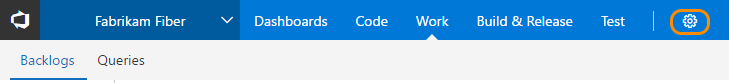
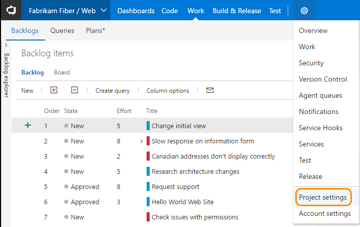
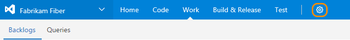
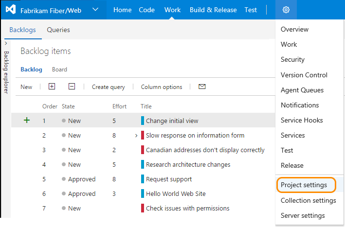
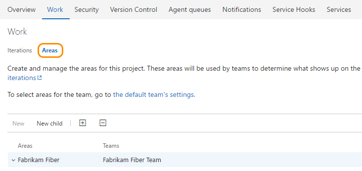
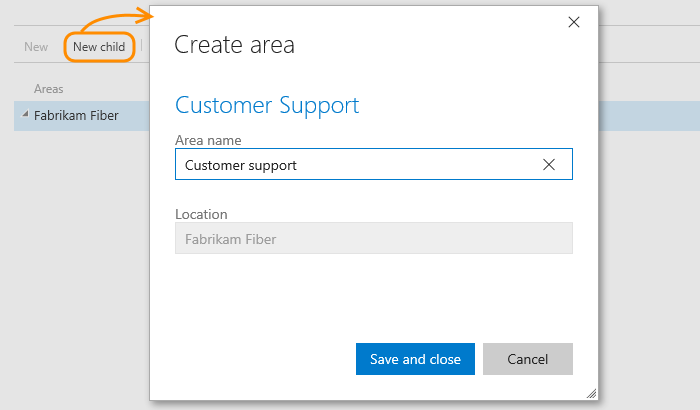
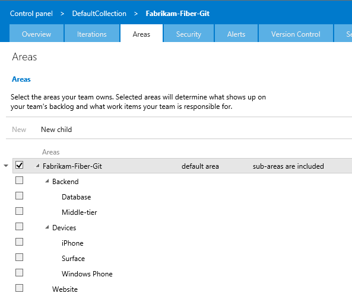
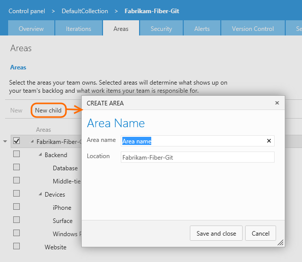
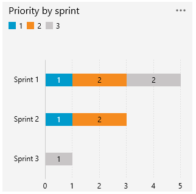

# Define area paths  

[!INCLUDE [temp](../_shared/version-vsts-tfs-all-versions.md)]

Newly created team projects contain a single, root area that corresponds to the team project name. You add area paths under this root. To understand how the system uses area paths, see [About area and iteration paths](about-areas-iterations.md). 

## Prerequisites

::: moniker range="vsts"
* You must be a member of a team project. If you don't have a team project yet, create one in [VSTS](../../organizations/accounts/set-up-vs.md). If you haven't been added as a team member, [get added now](../../organizations/accounts/add-account-users-from-user-hub.md). 
::: moniker-end
::: moniker range=">= tfs-2013 <= tfs-2018"
* You must be a member of a team project. If you don't have a team project yet, create one in an [on-premises TFS](../../organizations/accounts/create-team-project.md). If you haven't been added as a team member, [get added now](../../organizations/security/add-users-team-project.md). 
::: moniker-end
* To create or modify areas or iterations, you must either be a member of the **Project Administrators** group, or your **Create and order child nodes**, **Delete this node**, and **Edit this node** permissions must be set to **Allow** for the area or iteration node that you want to modify.

	If you aren't a project administrator, [get added as one](../../organizations/security/set-project-collection-level-permissions.md) or have someone provide you with explicit permissions to **Edit project-level information**.   

For naming restrictions on area and iteration paths, see [About areas and iterations, Naming restrictions](about-areas-iterations.md#name-restrictions).

<a id="admin-intro-team-services" /> 
## Open the administration context for the team project  

From the web portal, open the admin page for the team project.

You define both areas and iterations from the **Work** hub of the team project admin context. From the user context, you open the admin context by clicking the  gear icon. The tabs and pages available differ depending on which admin context you access.  

<a id="admin-intro-team-services" /> 
::: moniker range="vsts || >= tfs-2017 <= tfs-2018"  

1. From the web portal for the team project context, click the  gear icon.   
	::: moniker range="vsts || >= tfs-2018"
	

	If you're currently working from a team context, then hover over the  and choose **Project settings**.  

	  
	::: moniker-end
	::: moniker range="tfs-2017"
	<a id="admin-intro-tfs-2017-1" /> 
	**TFS 2017.1**

	  

	If you're currently working from a team context, then hover over the  and choose Project settings. 

	    
	**TFS 2017**   
	
	::: moniker-end
2. Open the **Work** hub.  

::: moniker-end   

::: moniker range=">= tfs-2013 <= tfs-2015"
<!---**TFS 2015** -->
<a id="admin-intro-tfs-2015" />

1. From the web portal user context, click the  gear Settings.   

	 

2. Click the **Areas** tab.   

::: moniker-end

<a id="tfs-15-area-paths" />
## Add an area path 

::: moniker range="vsts || >= tfs-2017 <= tfs-2018"  

1. Open the **Work, Areas** page for the team project admin context.  

	If you haven't added any areas or teams, you'll see that only one area is defined.   

	  

2.  Add a new child node to the area you have selected. 

	 

::: moniker-end

::: moniker range=">= tfs-2013 <= tfs-2015"  

1. Open the **Areas** tab.  

	  

	From the areas page, you can set the default area path used to filter the backlog.  The default area path is also used when new work items a user creates new work items. 

2. Add a new child node to the area you have selected.

	
 
::: moniker-end
 
::: moniker range="vsts || >= tfs-2017 <= tfs-2018"

## Rename or delete an area or iteration node 

When you rename an area or an iteration, or move the node within the tree hierarchy, the system will automatically update the work items and queries that reference the existing path or paths. 

When you delete an area or an iteration node, the system automatically updates the existing work items with the node that you enter at the deletion prompt. 

::: moniker-end

## Chart progress by area or iteration

You can quickly generate [queries](../track/using-queries.md) to view the progress for those areas and iterations. As an example, you can [visualize progress of work items assigned to sprints](../../report/dashboards/charts.md) as shown in the following stacked bar chart.  

 

## Related articles 
As you can see, areas play a major role in supporting Agile tools and managing work items. You can learn more about working with these fields from these topics: 

*	[About areas and iterations](about-areas-iterations.md)  
*	[Add another team](../scale/multiple-teams.md)  
*	[Set team defaults](../../organizations/settings/set-team-defaults.md)  
*	[Configure team settings and add team administrators](../scale/manage-team-assets.md)   
*	[Agile tools that rely on areas or iterations](../../organizations/settings/about-teams-and-settings.md)

