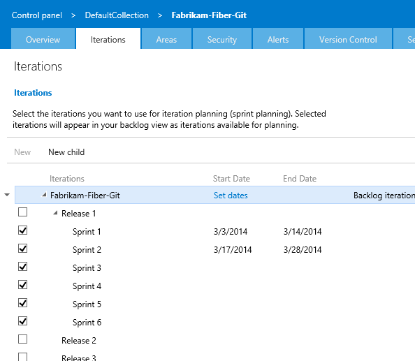
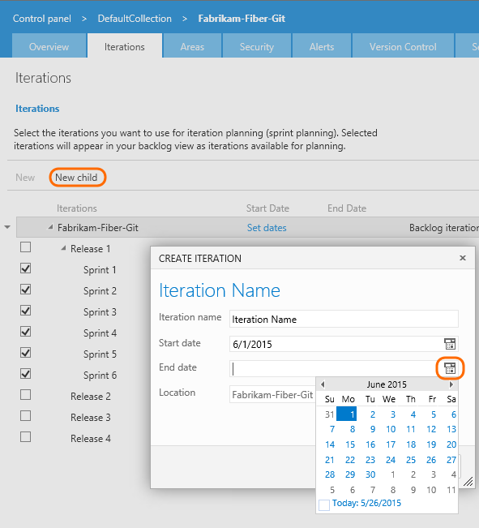
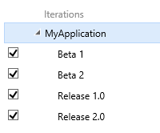
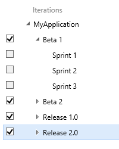

# Define iteration paths (aka sprints) 

[!INCLUDE [temp](../_shared/version-vsts-tfs-all-versions.md)]

Newly created team projects contain a single, root area that corresponds to the team project name. Team projects typically specify a predefined set of iterations to help you get started tracking your work. All you need to do is specify the dates. 

You add iteration paths under this root. To understand how the system uses area paths, see [About area and iteration paths](about-areas-iterations.md). 

  
[!INCLUDE [temp](../_shared/image-differences.md)] 

## Open the administration context for the team project  

From the web portal, open the admin page for the team project.

You define both areas and iterations from the Work hub of the team project admin context. From the user context,you open the admin context by clicking the  gear Settings icon. The tabs and pages available differ depending on which admin context you access.  

[!INCLUDE [temp](../_shared/learn-about-new-nav-experience.md)] 

To manage areas and iterations you need to be a project administrator or have the **Create child nodes** permission for an area path. If you aren't a project administrator, [get added as one](../scale/add-team-administrator.md) or have someone provide you with explicit permissions to <b>Edit project-level information</b>. 

If you want to add area paths to support teams, you can do that when you [add teams to your team project](../scale/multiple-teams.md).  

Certain [restrictions](about-areas-iterations.md#name-restrictions) apply on names of areas.  

**VSTS**
<a id="admin-intro-team-services" /> 

1. From the web portal for the team project context, click the  gear Settings.  

	  

	If you're currently working from a team context, then hover over the  and choose Project settings.  

	 

2.	Open the **Work** hub.   

<a id="admin-intro-tfs-2017-1" /> 

**TFS 2017.1**

1. From the web portal for the team project context, click the  gear Settings.   

	  

	If you're currently working from a team context, then hover over the  and choose Project settings. 

	 

2. Open the **Work** hub.   
 

<a id="admin-intro-tfs-2017" /> 
**TFS 2017**

1. From the web portal for the team project context, click the  gear Settings.   

	  

	If you're currently working from a team context, then hover over the  and choose Project settings. 

	 

2. Open the **Work** hub.   
 

<a id="admin-intro-tfs-2015" />
 **TFS 2015**

1. From the web portal user context, click the  gear Settings.   

	 

2. Open the **Work** hub.   
 
 

  
##Add iterations and set iteration dates
From the **Iterations** page, you can add and select the iterations that will be active for your team. You add iterations in the same way you add areas. For more information about working within a sprint cadence, see [Schedule sprints](../scrum/define-sprints.md).  

 

### Schedule sprints (VSTS) 

1. Open the Work, Iterations page for the team project context. 

	For Scrum-based team projects, you'll see these set of sprints. 

	

	If you need to select another team project, go to the Overview page for the collection (click the DefaultCollection link). 

2. Schedule the start and end dates for each sprint your teams will use. Click Set dates or choose to edit the iteration from the  actions menu for the sprint. 

	  

3. When you're finished, you'll have a set of sprints scheduled - like this: 

	

	Your next step is to [choose the sprints each team will use](../scale/set-team-defaults.md#activate-team-services). 

<a id="tfs-2015-iteration-paths" />
### Schedule sprints (TFS 2015) 

1. Open the Iterations tab for the team project context. 

	For Scrum-based team projects, you'll see these set of sprints. 

	  

	You can change the name, location within the tree hierarchy, or set dates for any sprint. Simply open it (double-click or press Enter key) and specify the info you want.

2. Schedule the start and end dates for those sprints you plan to use. 

	  

	After you set the start and end dates for one iteration, the calendar tool automatically attempts to set the next set of dates, based on the same iteration length you specified for the first. For example, if you set a three week sprint for Sprint 1, then when you select the start date for Sprint 2, the calendar tool automatically determines the start and end dates based on the next three weeks. You can accept or change these dates.  

3. To add another sprint, select <b>New child</b> and name it what you want. Here, we call it Sprint 7.  

	

	Your next step is to [activate the sprints each team will use](../scale/set-team-defaults.md#activate-sprints-tfs). 
 

<!---
0. Teams can choose which iterations they work in by checking the check box next to each iteration.  

	   

0. Each iteration can have a start and end date.  After you set the start and end dates for one iteration, the calendar tool automatically defaults the next set of dates, based on the same iteration length you specified for the first.

	**Example:** if you set a 3 week sprint for Sprint 1, then when you select the start date for Sprint 2, the calendar tool automatically determines the start and end dates based on the next three weeks.  

	  

	  

-->
 
## Chart progress by area or iteration

You can quickly generate [queries](../track/using-queries.md) to view the progress for those areas and iterations. As an example, you can [visualize progress of work items assigned to sprints](../../report/dashboards/charts.md) as shown in the following stacked bar chart.  

 

## Rename or delete an area or iteration node 

When you rename an area or an iteration, or move the node within the tree hierarchy, the system will automatically update the work items and queries that reference the existing path or paths. 

When you delete an area or an iteration node, the system automatically updates the existing work items with the node that you enter at the deletion prompt. 

## Related notes 
As you can see, areas and iterations play a major role in supporting Agile tools and managing work items. You can learn more about working with these fields from these topics: 
 
*	[Set team defaults](../scale/set-team-defaults.md)  
*	[Agile tools and sprint definitions ](../scrum/define-sprints.md)  
*	[Query by date or current iteration](../track/query-by-date-or-current-iteration.md)  

### Required permissions 

To create or modify areas or iterations, you must either be a member of the **Project Administrators** group, or your **Create and order child nodes**, **Delete this node**, and **Edit this node** permissions must be set to **Allow** for the area or iteration node that you want to modify.

### What kind and how many iterations should a team define?

You define as many child iterations as you need to reflect your project lifecycle. These paths represent a series of events, such as sprints, pre-beta and beta deliverables, and other release milestones. Teams typically leave work items assigned to the team's default iteration if they are not yet scheduled for work or for a release.  

Add iterations to support these requirements:  
* Define sprints your Scrum teams use to [plan and execute their sprints](../scrum/sprint-planning.md)
* Set up more complex multi-release and sprint cycles
* Filter queries based on sprints, milestones, or cycle time for your project 
* Support future work that you're not ready to assign to a target release cycle.  

In the following example, Backlog, Beta 1, Beta 2, Release 1.0, and Release 2.0 are defined for the MyApplication team project.  

  

As you create the backlog of product features and tasks, you can start to assign them to the milestones by which you expect the team to finish the features and tasks.
As your needs change, you can add events under each major milestone that reflect how your team schedules and manages its work.  

As the following example shows, the Beta 1 iteration now contains three child nodes, one for each sprint in the Beta 1 time period.  

  

Iterations do not enforce any rules. For example, you can assign a task to an iteration but not close or complete it during that iteration. At the end of an iteration, you should find all work items that remain active or have not been closed for that iteration and take appropriate action. You can, for example, move them to a different iteration or return them to the backlog.

### Naming restrictions 

The **Area Path** and **Iteration Path** fields, [data type=TreePath](reference/define-modify-work-item-fields.md), consist of multiple node items which are separated by the backslash (&#92;) character. We recommend that you minimize the names of nodes, and make sure that you conform to the following restrictions when adding child nodes:

| Restriction type                 | Restriction                                 | 
| -------------------------------- | ------------------------------------------- | 
| Node length | Must not contain more than 255 characters | 
| Special characters for nodes | Must not contain Unicode control characters Must not contain any of the following characters: \ / $ ? * : " & > < # % + , Must not contain characters that the [local file system prohibits](https://msdn.microsoft.com/library/aa365247.aspx). | 
| Reserved names | Must contain more than a period (.) or two periods (..) Must not be a [system-reserved name](https://msdn.microsoft.com/library/aa365247.aspx) such as PRN, COM1, COM2, COM3, COM4, COM5, COM6, COM7, COM8, COM9, COM10, LPT1, LPT2, LPT3, LPT4, LPT5, LPT6, LPT7, LPT8, LPT9, NUL, CON, or AUX | 
| Path length | Must contain fewer than 4,000 Unicode characters | 
| Path hierarchy depth | Must be fewer than 14 levels deep | 

### Export tree structures  

You can't export the structure of tree paths for one team project to use with another team project.  
 