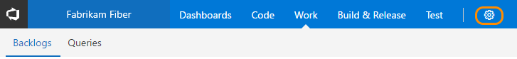
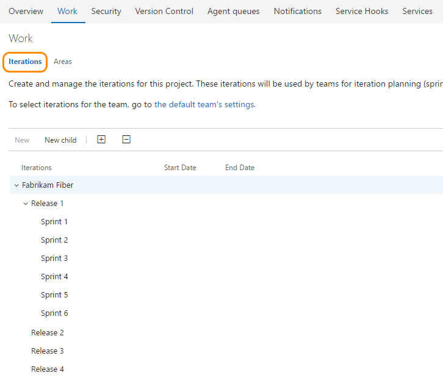
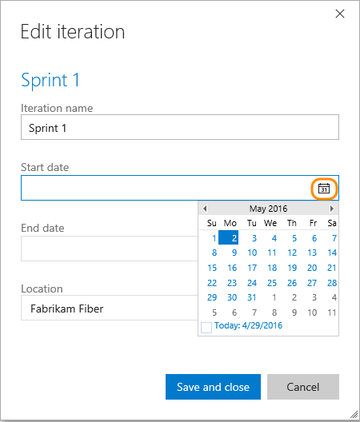
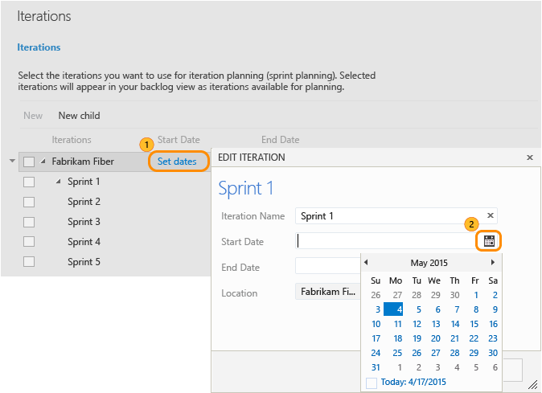
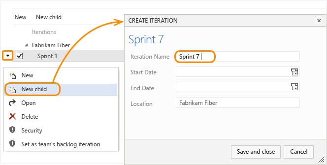

# Define iteration paths (aka sprints) 

[!INCLUDE [temp](../_shared/version-vsts-tfs-all-versions.md)]

Newly created team projects contain a single, root area that corresponds to the team project name. Team projects typically specify a predefined set of iterations to help you get started tracking your work. All you need to do is specify the dates. 

You add iteration paths under this root. To understand how the system uses area paths, see [About area and iteration paths](about-areas-iterations.md). 

## Prerequisites

::: moniker range="vsts"
* You must be a member of a team project. If you don't have a team project yet, create one in [VSTS](../../accounts/set-up-vs.md). If you haven't been added as a team member, [get added now](../../accounts/add-account-users-assign-access-levels.md). 
::: moniker-end
::: moniker range=">= tfs-2013 <= tfs-2018"
* You must be a member of a team project. If you don't have a team project yet, create one in an [on-premises TFS](../../accounts/create-team-project.md). If you haven't been added as a team member, [get added now](../../security/add-users-team-project.md). 
::: moniker-end
* To create or modify areas or iterations, you must either be a member of the **Project Administrators** group, or your **Create and order child nodes**, **Delete this node**, and **Edit this node** permissions must be set to **Allow** for the area or iteration node that you want to modify.

	If you aren't a project administrator, [get added as one](../../security/set-project-collection-level-permissions.md) or have someone provide you with explicit permissions to **Edit project-level information**.   

For naming restrictions on area and iteration paths, see [About areas and iterations, Naming restrictions](about-areas-iterations.md#name-restrictions).

## Open the administration context for the team project

::: moniker range="vsts || >= tfs-2017 <= tfs-2018"  
From the web portal, open the admin page for the team project.

You define both areas and iterations from the Work hub of the team project admin context. From the user context, you open the admin context by clicking the  gear icon. The tabs and pages available differ depending on which admin context you access.  

<a id="admin-intro-team-services" /> 

1. From the web portal for the team project context, click the  gear icon..  
	::: moniker range="vsts || >= tfs-2018"
	 
	If you're currently working from a team context, then hover over the  and choose Project settings.  

	  
	::: moniker-end
	::: moniker range="tfs-2017"
	<a id="admin-intro-tfs-2017-1" /> 
	**TFS 2017.1**  
	 
	<a id="admin-intro-tfs-2017" /> 
	**TFS 2017**  
	
	::: moniker-end
2. Open the **Work** hub.   

::: moniker-end 

::: moniker range=">= tfs-2013 <= tfs-2015"

<a id="admin-intro-tfs-2015" />

1. From the web portal user context, click the  gear Settings.   

	 

2. Open the **Iterations** tab.  
::: moniker-end  

  
## Add iterations and set iteration dates
From the **Iterations** page, you can add and select the iterations that will be active for your team. You add iterations in the same way you add areas. For more information about working within a sprint cadence, see [Schedule sprints](../scrum/define-sprints.md).  

::: moniker range="vsts || >= tfs-2017 <= tfs-2018"

1. Open the Work, Iterations page for the team project context. 

	For Scrum-based team projects, you'll see these set of sprints. 

	

	If you need to select another team project, go to the Overview page for the collection (click the DefaultCollection link). 

2. Schedule the start and end dates for each sprint your teams will use. Click Set dates or choose to edit the iteration from the  actions menu for the sprint. 

	  

3. When you're finished, you'll have a set of sprints scheduled - like this: 

	

	Your next step is to [choose the sprints each team will use](../scale/set-team-defaults.md#activate-team-services). 
::: moniker-end

::: moniker range=">= tfs-2013 <= tfs-2015"

<a id="tfs-2015-iteration-paths" />

1. Open the **Iterations** tab for the team project context. 

	For Scrum-based team projects, you'll see these set of sprints. 

	  

	You can change the name, location within the tree hierarchy, or set dates for any sprint. Simply open it (double-click or press Enter key) and specify the info you want.

2. Schedule the start and end dates for those sprints you plan to use. 

	  

	After you set the start and end dates for one iteration, the calendar tool automatically attempts to set the next set of dates, based on the same iteration length you specified for the first. For example, if you set a three week sprint for Sprint 1, then when you select the start date for Sprint 2, the calendar tool automatically determines the start and end dates based on the next three weeks. You can accept or change these dates.  

3. To add another sprint, select <b>New child</b> and name it what you want. Here, we call it Sprint 7.  

	

	Your next step is to [select the sprints each team will use](../scale/set-team-defaults.md#activate-sprints-tfs). 
 
::: moniker-end

::: moniker range="vsts || >= tfs-2017 <= tfs-2018"

## Rename or delete an iteration 

When you rename an iteration, or move the node within the tree hierarchy, the system will automatically update the work items and queries that reference the existing path or paths. 

When you delete an iteration node, the system automatically updates the existing work items with the node that you enter at the deletion prompt.
 
::: moniker-end

## Chart progress by area or iteration

You can quickly generate [queries](../track/using-queries.md) to view the progress based on an iteration. As an example, you can [visualize progress of work items assigned to sprints](../../report/dashboards/charts.md) as shown in the following stacked bar chart.  

 

## Related articles 
As you can see, areas and iterations play a major role in supporting Agile tools and managing work items. You can learn more about working with these fields from these topics: 
 
*	[Set team defaults](../scale/set-team-defaults.md)  
*	[Agile tools and sprint definitions ](../scrum/define-sprints.md)  
*	[Query by date or current iteration](../track/query-by-date-or-current-iteration.md)  

 
 