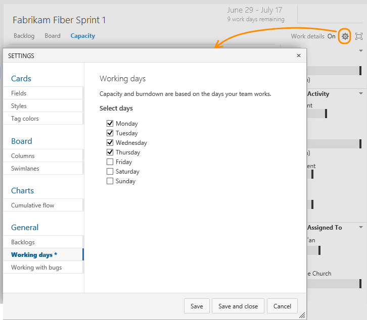

# Set working days  

[!INCLUDE [temp](../_shared/version-vsts-tfs-all-versions.md)]

Your sprint planning and tracking tools automatically consider days off when calculating capacity and sprint burndown. Leave those days of the week that your team doesn't work unchecked in your team's Settings, Working days page. 

If you're not a team administrator, [get added as one](../scale/add-team-administrator.md). Only team and project admins can change team settings. 

### VSTS
<a id="team-services-work-days" />

Open the Settings dialog from the Capacity page to set Working days.

### TFS 2015
<a  id="tfs-2015-work-days" />

Open your team settings from the Overview tab of your team's admin context.  

 

<a id="tfs-2015-1-work-days" />
### TFS 2015.1

Open the Settings dialog from the Capacity page to set Working days.

### TFS 2015.1
<a id="tfs-15-work-days" />

Open the Settings dialog from the Capacity page to set Working days.

 

