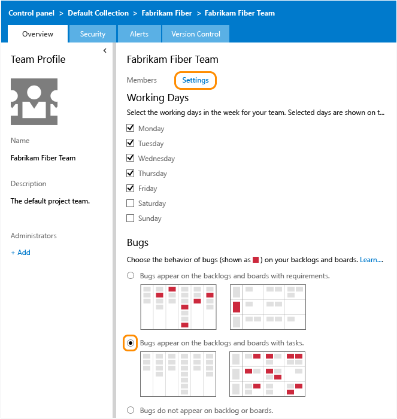
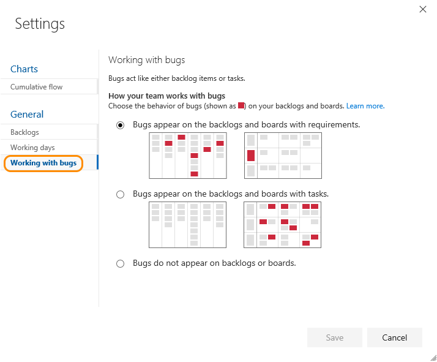
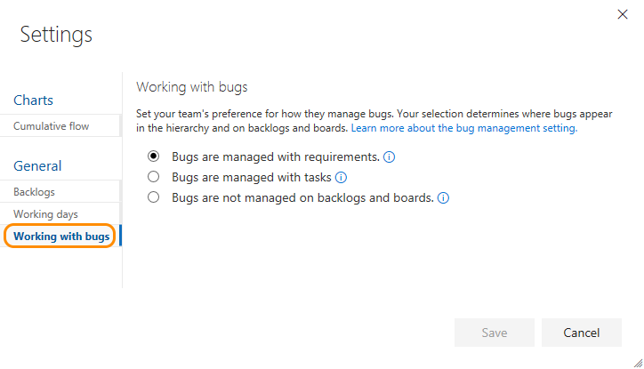

# Show bugs on backlogs and boards  

<b>Team Services | TFS 2017 | TFS 2015 | TFS 2013.4 </b>

>[!NOTE]  
>**Feature availability**: This feature is available from Team Services and the web portal for TFS 2013.4 and later versions. 

As your team identifies code defects or bugs, they can add them to the backlog and track them similar to requirements. Or, they can schedule them to be fixed within a sprint along with other tasks. 
 
When you track bugs as requirements, they'll show up on the product backlog and Kanban board. When you track bugs similar to tasks, they'll show up on the sprint backlogs and task boards.

>[!NOTE]  
>If you want to track custom WITs on your backlogs or boards, you can.<br/>
> - For Team Services and the Inheritance process model, see [Customize your backlogs or boards for a process](../process/customize-process-backlogs-boards.md).   
> - For Hosted XML and On-premises XML process models, see [Add a work item type to a backlog and board](add-wits-to-backlogs-and-boards.md).
>  
>For an overview of process models, see [Customize your work tracking experience](../customize/customize-work.md).  


## Set your team's preferences for tracking bugs  

>[!NOTE]  
>**Feature availability**: You can manage all your team settings from a common configuration dialog from Team Services or the web portal for TFS 2015 Update 1 or later version.  

1. (Team Services and TFS 2015.1 and later versions) From your team's backlog page, click the  (gear icon) to open the common configuration team settings.  

	 

	(TFS 2015 or TFS 2013.4) Click the , (gear icon) to open the administration page.  

	

	From the Overview tab, choose the team whose settings you want to configure, and then click **Settings**.

2. Click the **Working with bugs** tab and choose from the three options available.

	* Choose the first option when your team wants to manage bugs similar to requirements. Bugs can be estimated and tracked against team velocity and cumulative flow. Bugs will be associated with the Requirements category.  

	* Choose the second option when your team wants to manage bugs similar to tasks. Remaining work can be tracked for bugs and tracked against the sprint capacity and burndown. Bugs will be associated with the Task category. 

	* Choose the last option if your team manages bugs separate from requirements or tasks. Bugs will be associated with the Bugs category. 

	>[!NOTE]  
	>Because this setting affects all team members' view of the team backlogs and boards, you must be a team administrator to change the setting. Changing the setting is disabled if you're not a team administrator. Go [here to get added as a team administrator](../scale/manage-team-assets.md#add-team-admin).
	
	<div style="background-color: #f2f0ee;padding-top:10px;padding-bottom:10px;">
	<ul class="nav nav-pills" style="padding-right:15px;padding-left:15px;padding-bottom:5px;vertical-align:top;font-size:18px;">
	<li style="float:left;" data-toggle="collapse" data-target="#bug-settings">Choose where bugs appear</li>
	<li style="float: right;"><a style="max-width: 374px;min-width: 120px;vertical-align: top;background-color:#AEAEAE;margin: 0px 0px 0px 8px;min-width:90px;color: #fff;border: solid 2px #AEAEAE;border-radius: 0;padding: 2px 6px 0px 6px;outline-style:none;height:32px;font-size:12px;font-weight:400" data-toggle="pill" href="#bug-settings-tfs-2013">TFS 2015 & 2013.4</a></li>
	<li style="float: right;"><a style="max-width: 374px;min-width: 120px;vertical-align: top;background-color:#AEAEAE;margin: 0px 0px 0px 8px;min-width:90px;color: #fff;border: solid 2px #AEAEAE;border-radius: 0;padding: 2px 6px 0px 6px;outline-style:none;height:32px;font-size:12px;font-weight:400" data-toggle="pill" href="#bug-settings-tfs-2015">TFS 2017 & 2015.1</a></li>
	<li class="active" style="float: right"><a style="max-width: 374px;min-width: 120px;vertical-align: top;background-color:#007acc;margin: 0px 0px 0px 0px;min-width:90px;color: #fff;border: solid 2px #007acc;border-radius: 0;padding: 2px 6px 0px 6px;outline-style:none;height:32px;font-size:12px;font-weight:400" data-toggle="pill" href="#bug-settings-team-services">Team Services</a></li>
	</ul>
	
	<div id="bug-settings" class="tab-content collapse in fade" style="background-color: #ffffff;margin-left:5px;margin-right:5px;padding: 5px 5px 5px 5px;">
	
	<div id="bug-settings-tfs-2013" class="tab-pane fade" style="background-color: #ffffff;margin-left: 15px;margin-right:15px;padding: 5px 5px 5px 5px;">
	
	
	
	</div>

	<div id="bug-settings-tfs-2015" class="tab-pane fade" style="background-color: #ffffff;margin-left: 15px;margin-right:15px;padding: 5px 5px 5px 5px;">
	
	
	
	</div>
	
	<div id="bug-settings-team-services" class="tab-pane fade in active">  
	
	
	</div>
	</div>
	</div>
 	  
3. To see the changes, open or refresh the team's [backlog](../backlogs/create-your-backlog.md), [sprint backlog pages](../scrum/sprint-planning.md), or [Kanban board](../kanban/kanban-basics.md).  

>[!TIP]  
>If, after refreshing a backlog or board, and you don't see bugs where you expect them, review [How backlogs and boards display hierarchical (nested) items](../backlogs-boards-plans.md#nested). Only leaf nodes of nested items will appear on the Kanban or task boards.  

##Related notes

Bugs are a common item that teams want to track, and choose how they track it. See [Manage bugs](../backlogs/manage-bugs.md) for more guidance. 

However, what if you want to track other work item types (WITs) on your backlogs and boards?  

You can add other WITs&#8212;such as change requests, issues, or impediments&#8212; by customizing your process or team project, based on the process model you use. For details, see [Customize your work tracking experience](customize-work.md).

Other quickly configurable options you can make:
- [Customize cards on the Kanban board or task board](customize-cards.md)
- [Enable backlog levels of interest to your team](../customize/select-backlog-navigation-levels.md) 
- [Configure team settings](../scale/manage-team-assets.md)  


###Nested items  
As indicated in this topic, bugs can appear alongside user stories (requirements or product backlog items) or tasks. You don't need to link bugs to one of these items in order to manage them.

When you manage bugs with requirements or with tasks, they'll show up on one or more of your Agile tool backlogs and boards. However, if you nest items&mdash;create parent-child links of items that belong in either the Requirements or Task categories&mdash;then not all items may appear on your backlogs and boards. To learn more about how nested items are treated, see [Backlogs, boards, and plans-How backlogs and boards display hierarchical (nested) items](../backlogs-boards-plans.md#nested).

###Error TF400917  

The following error indicates that there is a misconfiguration in either your ProcessConfiguration or Categories definition files. 

```TF400917: The current configuration is not valid for this feature. This feature cannot be used until you correct the configuration.```

To resolve the error, review the information provided in [Add bugs or other work item types to backlogs or boards](add-wits-to-backlogs-and-boards.md) to make sure that you have configured your XML definition files correctly.     

