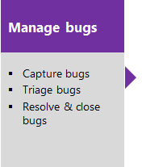
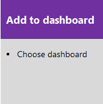

# Agile process 

<b>Team Services | TFS 2017 | TFS 2015 | TFS 2013</b>  

The Agile process supports the following work item types (WITs) to plan and track work, tests, feedback, and code review. With different WITs you can track different types of work&mdash;such as features, user stories, and tasks. These artifacts are created when you create a team project using the Agile  process. They are based on Agile principles and values.  
 

In addition to the WITs, teams have access to a set of shared work item queries to track information, analyze progress, and make decisions.  

>[!NOTE]  
><b>Feature availability:</b> From the cloud-based Team Services, you'll always have access to the latest version of the Agile process, [which you can also customize](../process/customize-process.md). If you connect to an on-premises Team Foundation Server (TFS), the latest version of the Agile process uploads automatically when you install or upgrade to the latest version of TFS. You can [customize team projects](../customize/customize-work.md) and use the [Process Template Manager](manage-process-templates.md) to upload and download process templates. 
>
>The following WITs are available as follows: Epic, TFS 2015 and later versions; 
>Shared Parameters, TFS 2013.2 and later versions; 
>and Test Plan and Test Suite, TFS 2013.3 and later versions.   
>
>Additional artifacts, such as [SQL Server reports](#reports) and [SharePoint dashboards](#dashboards), are only available when you connect to a team project from an on-premises Team Foundation Server (TFS). Other resource requirements apply. 

## Plan and track work
 
You build your project plan by creating a backlog of user stories that represent the work you want to develop and ship. You track bugs, tasks, and blocking issues using the bug, task, and issue WITs. To support portfolio management, teams create features and epics to view a roll up of user stories within or across teams. For details about using Agile WITs, see [Agile process work item types and workflow](agile-process-workflow.md).  

The essential flow for getting started is as shown. To get started using Scrum or Kanban tools, see [Get started with Agile tools to plan and track work](../agile-project-management.md).  

>[!NOTE]  
>A work item is a database record that contains the definition, assignment, priority, and state of work. Work item types define the template of fields, workflow, and form for each type. Work items can be linked to each other to support tracking dependencies, roll up of work, and reports.  

 
### List work items using queries

You can manage your workload more effectively by frequently reviewing the status of user stories and tasks. You can use the shared work item queries to list work items for a current sprint or the product backlog.  

  

[Descriptions of predefined queries](#predefined-queries) are listed later in this topic.  

You can open these queries from the **Work/Queries** page in the web portal or from the **Work Items** page in Team Explorer. You can modify a query using the [query editor to apply different filter criteria](../track/using-queries.md). Also, you can [add queries to team dashboards](../../report/dashboards.md).  

From Team Explorer, you can open any [work item query in Excel](../office/bulk-add-modify-work-items-excel.md) to perform bulk edits.   

[!INCLUDE [temp](../_shared/quick-tips-shared-query.md)] 

## Monitor progress  

All processes&mdash;Agile, Scrum, and CMMI&mdash;support [building status and trend charts and dashboards](../../report/overview.md). In addition, several charts are automatically built based on the Agile tools you use. These charts display within the web portal. 
 
### Create light-weight charts  
To get started, you can open a shared query and create a chart based on your tracking interests. Chart types include status&mdash;pie, bar, column, stacked bar, and pivot&mdash;and trend&mdash;stacked area, line, and area&mdash;charts.   

  

[!INCLUDE [temp](../_shared/powerbi-reports-links.md)] 

###SQL Server reports (TFS) 

If you connect to an on-premises TFS, you can access the following Agile process reports. For these reports to be useful, [teams must perform certain activities,](../../Report/admin/review-team-activities-for-useful-reports.md) such as define build processes, link work items, and update status or remaining work.  

To access these reports, your team project collection and the team project must be configured with SQL Server Analysis Services and Reporting Services.  If you need to add reporting services or update reports to the latest versions, see [Add reports to a team project](../../Report/admin/add-reports-to-a-team-project.md).  

Project management reports

<ul style="padding-left:10px">
<li style="margin-bottom:2px"><a href="https://msdn.microsoft.com/library/dd380678.aspx">Burndown and Burn Rate</a></li>
<li style="margin-bottom:2px"><a href="https://msdn.microsoft.com/library/dd380673.aspx">Remaining Work</a></li>
<li style="margin-bottom:2px"><a href="https://msdn.microsoft.com/library/dd380706.aspx">Status of All Iterations</a> (similar to Velocity)</li>
<li style="margin-bottom:2px"><a href="https://msdn.microsoft.com/library/dd380641.aspx">Stories Overview</a> </li>
<li style="margin-bottom:2px"><a href="https://msdn.microsoft.com/library/dd380641.aspx">Stories Progress</a> </li>
<li style="margin-bottom:2px"><a href="https://msdn.microsoft.com/library/ee707132.aspx">Unplanned Work</a></li>
</ul>

Test and bug reports

<ul style="padding-left:20px">
<li style="margin-bottom:2px"><a href="https://msdn.microsoft.com/library/dd380736.aspx">Bug Status</a> </li>
<li style="margin-bottom:2px"><a href="https://msdn.microsoft.com/library/dd380674.aspx">Bug Trends</a> </li>
<li style="margin-bottom:2px"><a href="https://msdn.microsoft.com/library/dd380713.aspx">Test Case Readiness</a></li>
<li style="margin-bottom:2px"><a href="https://msdn.microsoft.com/library/dd380702.aspx">Test Plan Progress</a> </li>
<li style="margin-bottom:2px"><a href="https://msdn.microsoft.com/library/dd380731.aspx">Reactivations</a> </li>
</ul>

Build reports

<ul style="padding-left:20px">
<li style="margin-bottom:2px"><a href="https://msdn.microsoft.com/library/dd380683.aspx">Build Quality Indicators</a> </li>
<li style="margin-bottom:2px"><a href="https://msdn.microsoft.com/library/dd380643.aspx">Build Success Over Time</a></li>
<li style="margin-bottom:2px"><a href="https://msdn.microsoft.com/library/dd380708.aspx">Build Summary</a></li>
</ul>

### SharePoint portal dashboards (TFS) 

If you connect to an on-premises TFS, you can access Agile process dashboards displayed through SharePoint. These dashboards display project data, support investigation tasks, and help teams to perform common tasks quickly. The following dashboards support the display of web access parts for listing work items and reports that were built in the Analysis Services cube.

Standard dashboards

<ul style="padding-left:20px">
<li style="margin-bottom:2px">[Project Dashboard](https://msdn.microsoft.com/library/ee828504.aspx) </li>
<li style="margin-bottom:2px">[My Dashboard](https://msdn.microsoft.com/library/dd420561.aspx)</li>
</ul>

Enterprise dashboards

<ul style="padding-left:20px">
<li style="margin-bottom:2px">[Bugs Dashboard](https://msdn.microsoft.com/library/dd560860.aspx)  </li>
<li style="margin-bottom:2px">[Build Dashboard](https://msdn.microsoft.com/library/dd420556.aspx)  </li>
<li style="margin-bottom:2px">[Progress Dashboard](https://msdn.microsoft.com/library/dd420557.aspx)  </li>
<li style="margin-bottom:2px">[Quality Dashboard](https://msdn.microsoft.com/library/dd420562.aspx)  </li>
<li style="margin-bottom:2px">[Test Dashboard](https://msdn.microsoft.com/library/dd420548.aspx)  </li>
</ul>

To use [Dashboards](https://msdn.microsoft.com/library/dd380719.aspx) your team project must have a [project portal configured and the project portal must point to a SharePoint site](https://msdn.microsoft.com/library/ms242883.aspx).

##Related notes  

[!INCLUDE [temp](../_shared/create-team-project-links.md)]  

<a id="predefined-queries" />
###Agile process predefined queries 

#### Product backlog and feedback queries

Product owners can use the shared queries that are defined in the following table to plan and track user stories that compose the product backlog.

<table>
<thead>
<tr>
<th>
Shared query
</th>
<th>
Description
</th>
</tr>
</thead>
<tbody>
<tr>
<td>
Product Backlog
</td>
<td>
Provides a tree list of all user stories that are in a New, Active or Resolved state and sorts them by rank.
</td>
</tr>
<tr>
<td>
Product Planning
</td>
<td>
Provides a flat list of all user stories that are not in a Removed state, and have not been closed in the last 90 days.
</td>
</tr>
<tr>
<td>
Feedback
</td>
<td>
Lists all feedback responses that are in an Active state.
</td>
</tr>
</tbody>
</table>

#### Iteration planning queries

The following table describes the shared queries that are listed under the **Current Iteration** folder. These queries find work items that are assigned to a specified iteration. As you plan additional iterations, you can modify these queries to specify a different iteration and then save them to additional folders that you create, such as **Iteration 2** or **Iteration 3**.

The project administrator for each team project [defines area and iteration paths](../customize/modify-areas-iterations.md) for that project so that the team can track progress by those designations.

<table>
<thead>
<tr>
<th>
Shared query
</th>
<th>
Description
</th>
</tr>
</thead>
<tbody>
<tr>
<td>
Active Bugs
</td>
<td>
Lists all active bugs and sorts them by rank, priority, and severity.
</td>
</tr>
<tr>
<td>
Active Tasks
</td>
<td>
Lists all active tasks and sorts them by rank, priority, and severity.
</td>
</tr>
<tr>
<td>
Bug Triage
</td>
<td>
Lists all active bugs that are not assigned to a team member.

The [Triage Workbook references](https://msdn.microsoft.com/library/dd380707.aspx) this query. 
</td>
</tr>
<tr>
<td>
Completed Tasks
</td>
<td>
Lists all tasks that have been closed and sorts them by rank, priority, and severity.
</td>
</tr>
<tr>
<td>
Iteration Backlog
</td>
<td>
Lists all user stories and their linked tasks and sorts the stories by rank and priority.
</td>
</tr>
<tr>
<td>
Open Issues
</td>
<td>
Lists all issues under the specified iteration path that are not closed and any tasks that are linked to the issues and then sorts the issues by rank and priority.

The [Issues Workbook](https://msdn.microsoft.com/library/dd380707.aspx) references this query. 
</td>
</tr>
<tr>
<td>
Open Test Cases
</td>
<td>
Lists all test cases that are not closed and sorts them by priority.
</td>
</tr>
<tr>
<td>
Open User Stories
</td>
<td>
Lists all active user stories and sorts them by their stack rank.
</td>
</tr>
<tr>
<td>
Resolved Bugs
</td>
<td>
Lists all resolved bugs and sorts them by rank, priority, and severity.
</td>
</tr>
<tr>
<td>
User Stories
</td>
<td>
Lists all user stories that are not closed and sorts them by priority and then ID,
</td>
</tr>
<tr>
<td>
User Stories without Test Cases
</td>
<td>
Lists all user stories that do not have a link to a test case. Stories are sorted by ID.
</td>
</tr>
</tbody>
</table>

<blockquote style="font-size: 13px"><b>Tip: </b>Queries listed under the Current Iteration folder do not automatically update when a new iteration becomes current. The current iteration is based on the dates that you [assign to your sprint schedules](../scrum/define-sprints.md). You must manually update the iteration path of each query to have it point to the iteration path that corresponds to the current iteration. Or, you can edit the shared query to [use the **@CurrentIteration** macro](../track/query-by-date-or-current-iteration.md). </blockquote>  

#### Find tasks with summary values

The **Work Items With Summary Values** shared query, which is located in the **Troubleshooting** folder, lists all tasks that have child tasks and that contain non-zero values in the Remaining Work or Completed Work fields. This query is designed to find tasks that report work effort that is already accounted for in their child tasks. For the hours to be counted only once, summary tasks should not be assigned any hours. For more information, see [Address inaccuracies published for summary values](https://msdn.microsoft.com/library/dd997572.aspx).

### Workbooks (TFS)  

You can use the following Excel workbooks to review open issues and to rank and assign untriaged work items. Each workbook references a shared query.  

-   The [Issues workbook](https://msdn.microsoft.com/library/dd380707.aspx) uses the Open Issues shared query.  
-   The [Triage workbook](https://msdn.microsoft.com/library/dd380707.aspx) uses the Bug Triage shared query.

<blockquote style="font-size: 13px"><b>Feature availability: </b>Workbooks are only available when you connect to an on-premises TFS that's been configured with a SharePoint portal.  
</blockquote>  

Because these queries support workbooks, if you change these queries, it will affect those workbooks that use them.

[!INCLUDE [temp](../_shared/help-support-shared.md)]