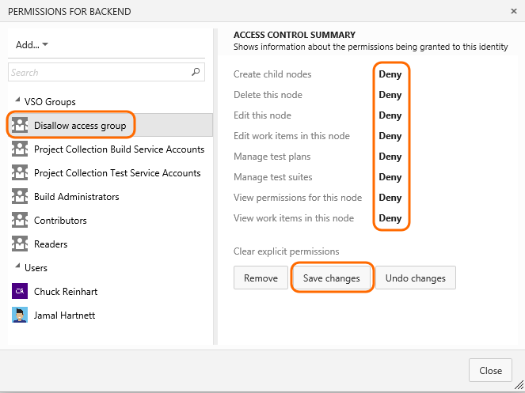

# Set permissions and access for work tracking   

<b>Team Services | TFS 2017 | TFS 2015 | TFS 2013</b> 

You can grant or restrict access to various work tracking features. You do this by granting users or groups specific permissions for the team project or at the object-level. 

**Project-level permissions**
- Restrict ability to create work item tags  
- Restrict ability to delete and restore work items  
- Restrict ability to move work items out of a team project
- Grant ability to permanently delete work items
- Customize a team project
	- Create and modify work item types, link types, categories, and process configuration
	- Add teams and team administrators 
	- Edit project level permissions 

**Object-level permissions**
- Restrict access to view or modify work items under an area path 
- Grant access to define or modify queries or query folders 
- Grant access to create and manage area paths or iteration paths 

**Role-based permissions**
- Add a user as a team administrator to allow them to configure team settings 

Add users to the Contributors group to provide access to most features as listed in [Permissions and access for work tracking](../permissions-access-work-tracking.md) 

 

## Set permissions to restrict access to work items   

Permissions placed on an area paths allows you to permit or restrict access to edit or modify work items, test cases, or test plans assigned to those areas. You can restrict access to users or groups. You can also set permissions for who can add or modify areas or iterations for the team project.  

1. Open the **Security** dialog for the node you want to manage.  

	

2. Select the group or team member, and then change the permission settings. For example, for the Disallow Access Group, deny the ability to view, modify, or edit work items in the FabrikamFiber area path.

	

	If the group or team member doesn't appear in the list, you can [**Add** it](../../setup-admin/add-users.md).  
	
You can specify two explicit authorization states for permissions: **Deny** and **Allow**. In addition, permissions can exist in one of three additional states.  

| Permission 		| Authorization |
| ----------------- | ------------- |
| Allow 			| Explicitly grants users to perform the task associated with the specific permission. For users to access a task, the associated permission must be set to **Allow** or **Inherited allow**. |
| Deny 				| Explicitly prevents users from performing the task associated with the specific permission. **Deny** takes precedence over **Allow**.  For exceptions to these rules, see [Permissions reference](../../setup-admin/permissions.md#inheritance)|
| Inherited allow/Inherited deny 	| Allows or denies a user to perform the task associated with the permission based on the permission set for a group to which the user belongs. |
| Not set         	| Implicitly prevents users from performing the action associated with the permission.  Because the permission is neither explicitly set to **Deny** nor explicitly set to **Allow**, authorization for that permission can be inherited from other groups of which the user or group is a member.  By default, most permissions are not set to either **Deny** or **Allow**, the permissions are left **Not set**.  |

For additional ways to restrict modifications to work items, see [Restrict who can create or modify a work item](../reference/apply-rule-work-item-field.md). 

## Related notes 

*	[Permissions and access for work tracking](../permissions-access-work-tracking.md) 
   
