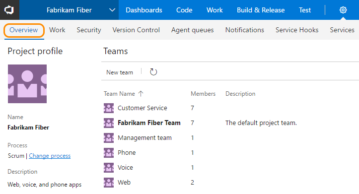
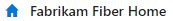

# Switch team project or team focus   
Several features depend on the team project or team that you have selected. For example, dashboards, backlogs, and board views will change depending on the context selected. 

For example, when you add a work item, the system references the default area and iteration paths defined for the team context. Work items you add from the team dashboard (new work item widget) and queries page are assigned the team default iteration. Work items you add from a team backlog or board, are assigned the team default backlog iteration. To change team defaults, see [Set team defaults](/docs/work/scale/set-team-defaults).  

You navigate to your team context from the top navigation bar. The method changes slightly depending on the platform/version you work from.     

## View teams   

To view a list of teams defined for a team project, open the admin context for the team project, and choose **Overview**.  

>[!NOTE]  
>**Feature availability**: The **Change process** link is only supported for team projects that use the [Inheritance process model](../customize/customize-work.md#inheritance).  

 

## Switch to a different team 

>[!NOTE]  
>**Feature availability**: The Account Landing Page feature is in preview mode for Team Services and enabled for all users from web portal for TFS 2017.1 and later versions. To learn more about this feature, see [Work effectively from your account hub](/docs/connect/account-home-pages). To enable or disable the feature, see [Enable preview features](/docs/collaborate/preview-features).   

<ul class="nav nav-pills" style="padding-right:15px;padding-left:15px;padding-bottom:5px;vertical-align:top;font-size:18px;">
<li style="float:left;" data-toggle="collapse" data-target="#switch-context">Switch team project/team focus</li> 

<li style="float: right;"><a style="max-width: 374px;min-width: 120px;vertical-align: top;background-color:#AEAEAE;margin: 0px 0px 0px 8px;min-width:50px;color: #fff;border: solid 2px #AEAEAE;border-radius: 0;padding: 2px 6px 0px 6px;outline-style:none;height:32px;font-size:12px;font-weight:400" data-toggle="pill" href="#tfs-2015-switch-context">TFS 2015</a></li>

<li style="float: right;"><a style="max-width: 374px;min-width: 120px;vertical-align: top;background-color:#AEAEAE;margin: 0px 0px 0px 8px;min-width:50px;color: #fff;border: solid 2px #AEAEAE;border-radius: 0;padding: 2px 6px 0px 6px;outline-style:none;height:32px;font-size:12px;font-weight:400" data-toggle="pill" href="#tfs-2017-switch-context">TFS 2017</a></li>

<li style="float: right;"><a style="max-width: 374px;min-width: 120px;vertical-align: top;background-color:#AEAEAE;margin: 0px 0px 0px 8px;min-width:90px;color: #fff;border: solid 2px #AEAEAE;border-radius: 0;padding: 2px 6px 0px 6px;outline-style:none;height:32px;font-size:12px;font-weight:400" data-toggle="pill" href="#switch-context-tfs-2017-1">TFS 2017.1</a></li>

<li class="active" style="float: right"><a style="max-width: 374px;min-width: 120px;vertical-align: top;background-color:#007acc;margin: 0px 0px 0px 0px;min-width:90px;color: #fff;border: solid 2px #007acc;border-radius: 0;padding: 2px 6px 0px 6px;outline-style:none;height:32px;font-size:12px;font-weight:400" data-toggle="pill" href="#switch-context-team-services">Team Services</a></li>

</ul>
 

 

You can switch your team focus to a team project or team you've recently viewed from the team project/team drop-down menu. If you don't see the team or team project you want, click **Browse&hellip;** to [browse all team projects and teams](/docs/connect/account-home-pages). To access your [account hub](/docs/connect/account-home-pages), click the  Team Services icon. If you haven't yet enabled the Account Landing Page, you'll be taken to the account home page.  

To go directly to the [project vision and status page](/docs/collaborate/project-vision-status), choose the project home icon from the drop-down menu, for example, .
 

 

 

To switch your team focus to a team project or team you've recently viewed, hover over the  Team Services icon and choose from the drop-down menu of options. If you don't see the team or team project you want, choose **Browse&hellip;** to [browse all team projects and teams](/docs/connect/account-home-pages). Your selection will open the [project vision and status page](/docs/collaborate/project-vision-status) for the team project.
 

To access your [account hub](/docs/connect/account-home-pages), click the  Team Services icon. If you haven't yet enabled the Account Landing Page, you'll be taken to the account home page.  

To go directly to the [project vision and status page](/docs/collaborate/project-vision-status), choose the project home icon from the drop-down menu, for example, .
 

 

 

Open the team project/team drop-down menu and select the team project/team that you've recently visited. If you don't see the team or team project you want, choose **Browse all** to browse all team projects and teams. 

 

Open the team project/team drop-down menu and select the team project/team that you've recently visited. If you don't see the team or team project you want, choose **Browse all** to browse all team projects and teams. 

 

 

## Switch to a team project or team from the account hub 
If you work in Team Services or TFS 2017.1, you can use your account hub to view and quickly navigate to teams, team projects, branches, work items, pull requests and other objects that are relevant to you. For details, see [Work effectively from your account hub](../../connect/account-home-pages.md).  

## Related notes
- [Work effectively from your account hub](../../connect/account-home-pages.md)
- [Add teams and team members](../scale/multiple-teams.md)