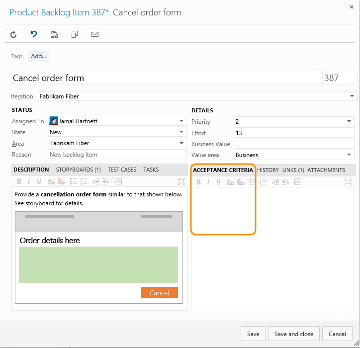

# Definition of Done

<b>Team Services | TFS 2017 | TFS 2015 </b>

As your team updates the status of work as it progresses from one stage to the next, it helps that they agree on what “done” means. By specifying the Definition of Done criteria for each Kanban column, you help share the essential tasks to complete before moving an item into a downstream stage. 

Also, you'll have implemented one of the core Kanban tenets: **make processes and policies explicit.**

When set, team members can quickly double-check the done criteria.

If you're just getting started, review [Kanban basics](kanban-basics.md) to get an overview of how to access your board and implement Kanban.

## Specify the Definition of Done for a column
 
1. From your Kanban board, click  and as needed, click Columns.  

	

	If you're not a team administrator, [get added as one](../scale/manage-team-assets.md#add-team-admin). Only team or project administrators can customize the Kanban board.

2. Open the Definition of Done for the column that applies to the criteria you'll enter. You can specify the Definition of Done for each intermediate column on your team's Kanban board. 

	**Team Services and TFS 2015.1 and later versions**  
	Click a column tab and enter the Definition of Done for that column. Enter text that defines your [team's Definition of Done](#your-team-working-software-and-the-definition-of-done). 

	  

	**TFS 2015**   

	
	
	Enter text that defines your [team's Definition of Done](#your-team-working-software-and-the-definition-of-done).

	

4. Team members can quickly check that they have met the criteria by clicking the Information tooltip  icon.
 
## Your team, working software and the Definition of Done

One of the [12 principles of Agile software development](http://agilemanifesto.org/principles.html) is to “deliver working software frequently, from a couple of weeks to a couple of months, with a preference to the shorter timescale.”

<blockquote style="font-size: 13px">*All agile teams must establish what they mean when they say "working software," which is frequently known as the definition of done. At a high level, a piece of functionality is complete only when its features pass all tests and can be operated by an end user. At a minimum, teams must go beyond the unit test level and test at the system level. The best teams also include integration testing, performance testing, and customer acceptance testing in their definition of what it means to be done with a piece of functionality.* ─ [Agile Principles and Values](https://msdn.microsoft.com/library/dd997578.aspx), by Jeff Sutherland</blockquote>  

One of the major causes of teams failing to implement Agile is they lack good definitions of done. 

Each stage indicates a handoff to someone else who will do work. What information does the next person in the flow sequence need to quickly succeed. Incomplete work or uncommunicated information can lead to delays and wasted effort. 

As a starting point, consider some of the following criteria as you work with your team to decide what done means throughout the development process.

<table valign="top" width="100%">
  <tr>
    <th width="35%">Stage</th>
    <th width="65%">Done criteria</th>
  </tr>
  <tr valign="top">
    <td>Before work starts on a feature, user story, or requirement</td>
    <td style="padding:100">
<ol>
<li>User story is properly scoped and estimated.</li>
<li>Acceptance criteria is well defined.</li>
<li>Customer needs are understood by the team.</li>
<li>Dependencies have been identified and are tracked.</li>
</ol>
	</td>
  </tr>
  <tr valign="top">
    <td>Bug filing</td>
    <td>
<ol>
<li>Bug title identifies the issue clearly.</li>
<li>Repro steps are clear and minimal.</li>
<li>Bug specifies a single issue.</li>
<li>Related issues are linked to as related.</li>
<li>Terms used are clearly understood within the team.</li>
</ol>
	</td>
  </tr>
  <tr valign="top">
    <td>Code complete, ready for testing</td>
    <td>
<ol>
<li>Code complete, commented, and run against current version.</li>
<li>Code peer reviewed and meets team standards.</li>
<li>Builds without error.</li>
<li>Passes unit and system tests.</li>
<li>Remaining hours for tasks set to zero and task closed.</li>
</ol>
	</td>
  </tr>
  <tr valign="top">
    <td>Test complete, ready for release</td>
    <td>
<ol>
<li>Unit tests implemented for all new features or functions.</li>
<li>Unit tests are all passing.</li>
<li>Acceptance/story tests are written and passing. </li>
<li>Regression tests are green with known failures. </li>
<li>Sufficient exploratory testing has been done.</li>
<li>Feature/function works correctly as expected. </li>
<li>Unsolved defects have been logged as bugs. </li>
<li>Code coverage is stable or improving.</li>
</ol>
	</td>
  </tr>
</table>

As your team makes progress, revisit your Definition of Done criteria. 

<blockquote style="font-size: 13px">*A development team's Definition of Done is meant to expand over time. A newly formed team will invariably have a less stringent and smaller Definition of Done than a more mature team with a shared history of improving. Expanding a team's Definition of Done lies at the very core of Kaizen, a Japanese term meaning a mindful and constant focus on improvement. While a team may initially require only that code build before being checked in, over time they should evolve more exacting standards like the need for unit tests to accompany new code.*─ David Starr, [Effective Sprint Retrospectives](https://msdn.microsoft.com/library/jj620912.aspx)</blockquote>  

## Acceptance Criteria versus Definition of Done
Acceptance criteria corresponds to what a customer should expect when a user story, feature, or requirement has been implemented. Conversations between the team and customers to determine the acceptance criteria helps ensure a common understanding within the team to meet customers' expectations. The acceptance criteria can be used as the basis for acceptance tests so that the team can more effectively evaluate whether an item has been satisfactorily completed. 

Acceptance criteria defines when a feature is shippable. Capture the criteria for each backlog item in the Acceptance Criteria field (for Scrum product backlog items) or the Description field (for Agile user stories and CMMI requirements).

  

The Definition of Done, on the other hand, is about delivering an incremental piece of a feature as it moves from not started to complete. Agile teams meet with greater success when each handoff made is in a ready state for the recipient to begin their work. 

<blockquote style="font-size: 13px">*Agility requires delivering done, ready-to-use increments of working software each Sprint. Yet most Scrum and agile teams generate partially done, incomplete Increments. When a Scrum Team is asked why Product Backlog requirements were not completely done in a Sprint, team members often reply, “We didn't have time.”* ─ Ken Schwaber and David Starr, [Done and Undone](https://msdn.microsoft.com/library/hh765983.aspx)</blockquote>  

## Related Kanban notes
See these choices for further options to customize the Kanban board:

- [Add, rename, move, and delete columns ](add-columns.md)
- [Work in Progress limits](wip-limits.md)  
- [Add swimlanes, expedite work](expedite-work.md)
- [Split columns](split-columns.md) 
- [Customize cards ](../customize/customize-cards.md)

