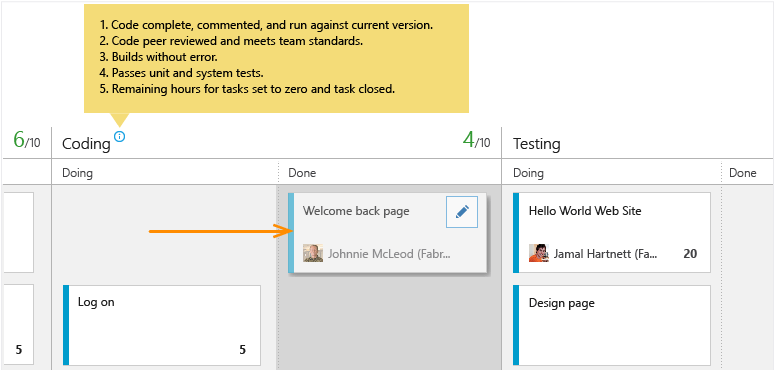
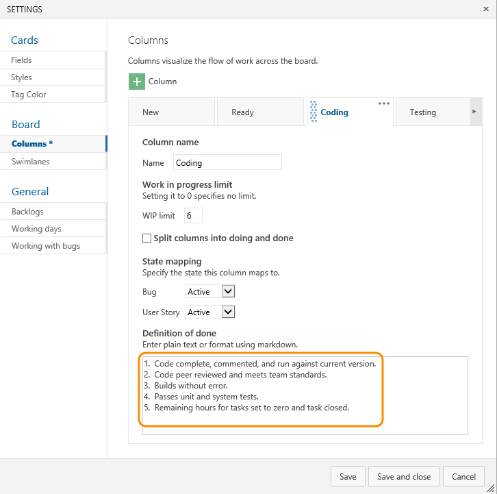
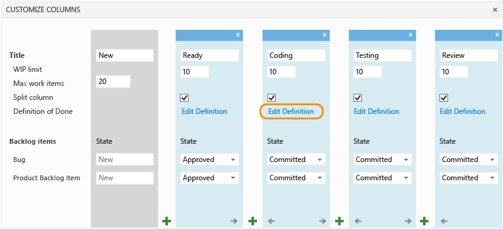
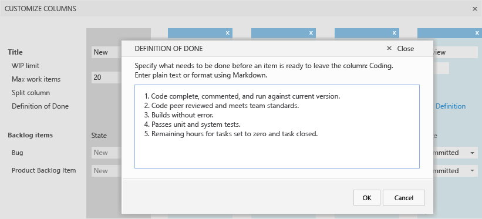

# Definition of Done

<b>VSTS | TFS 2018 | TFS 2017 | TFS 2015</b> 

As your team updates the status of work as it progresses from one stage to the next, it helps that they agree on what “done” means. By specifying the Definition of Done criteria for each Kanban column, you help share the essential tasks to complete before moving an item into a downstream stage. 

Also, you'll have implemented one of the core Kanban tenets: **make processes and policies explicit.**

When set, team members can quickly double-check the done criteria.

If you're just getting started, review [Kanban basics](kanban-basics.md) to get an overview of how to access your board and implement Kanban.

## Specify the Definition of Done for a column
 
1. From your Kanban board, click  and as needed, click Columns.  

	

	If you're not a team administrator, [get added as one](../scale/add-team-administrator.md). Only team or project administrators can customize the Kanban board.

2. Open the Definition of Done for the column that applies to the criteria you'll enter. You can specify the Definition of Done for each intermediate column on your team's Kanban board. 

	**VSTS and TFS 2015.1 and later versions**  
	Click a column tab and enter the Definition of Done for that column. Enter text that defines your [team's Definition of Done](#definition-of-done). 

	  

	**TFS 2015**   

	
	
	Enter text that defines your [team's Definition of Done](#definition-of-done).

	

4. Team members can quickly check that they have met the criteria by clicking the Information tooltip  icon.

## Related Kanban notes
See these choices for further options to customize the Kanban board:

- [Add, rename, move, and delete columns ](add-columns.md)
- [Work in Progress limits](wip-limits.md)  
- [Add swimlanes, expedite work](expedite-work.md)
- [Split columns](split-columns.md) 
- [Customize cards ](../customize/customize-cards.md)

