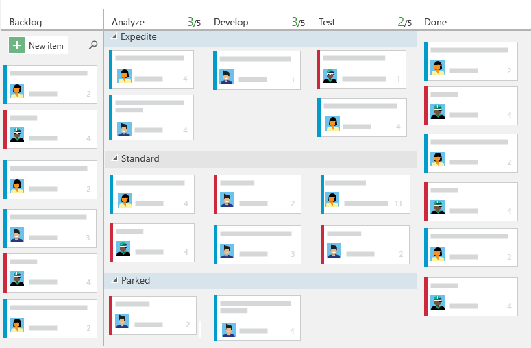
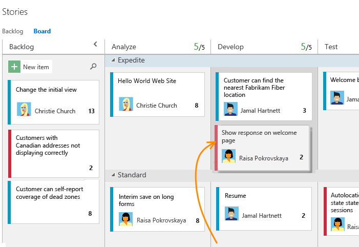
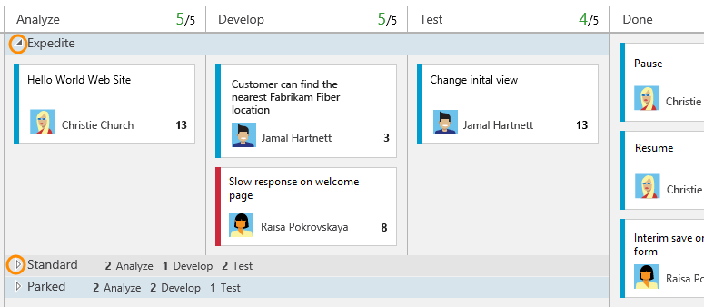
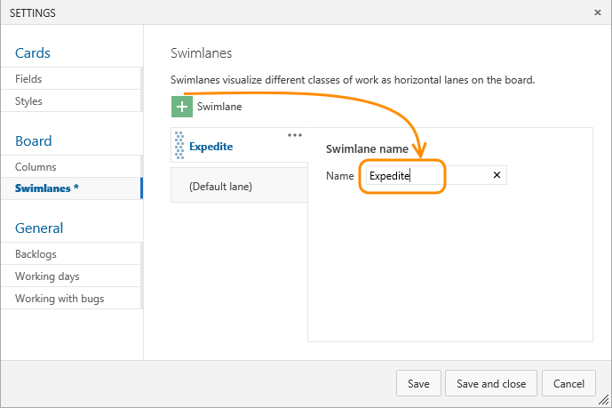
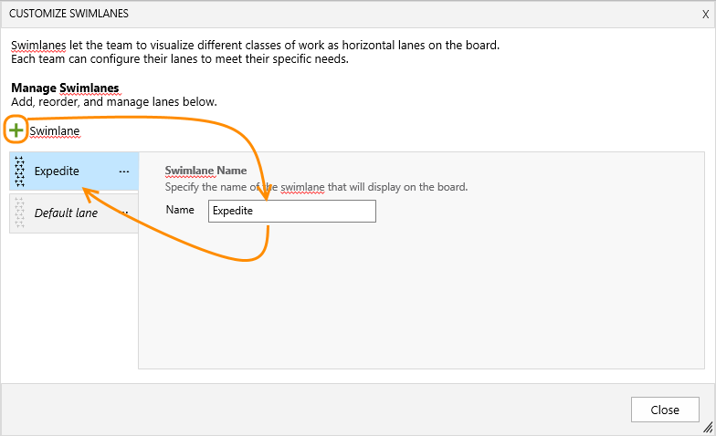
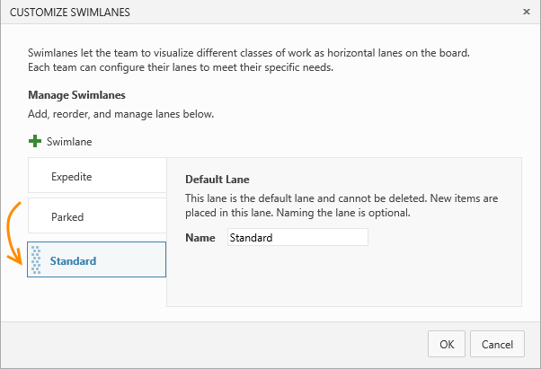
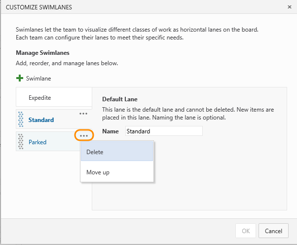
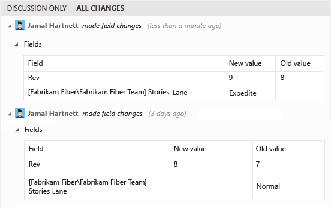

# Expedite work with swimlanes

<b>VSTS | TFS 2018 | TFS 2017 | TFS 2015</b> 

::: moniker range="vsts || >= tfs-2015 <= tfs-2018"
Your Kanban board supports your ability to visualize the flow of work as it moves from new to done. When you add swimlanes, you can also visualize the status of work that supports different service-level classes. You can create a swimlane to represent any other dimension that supports your tracking needs.    

For example, you can create three swimlanes&mdash;Expedite, Standard, and Park&mdash;to track high-priority work, standard work, and work that's currently blocked.  

> [!TIP]
>Type **o** to expand all swimlanes and **u** to collapse all swimlanes. To move the focus up or down, enter the  up/down arrows. For more tips, see [kanban board keyboard shortcuts](kanban-board-keyboard-shortcuts.md).

## Types of swimlanes  
You can use swimlanes to sort work on your Kanban board to track items that you differentiate as follows: 
*	High priority items  
*	Service-level class  
*	Date-driven requirement  
*	Dependency for or from another team   
*	Blocked items  
*	Technical debt or other engineering work that's not a specific user story  

## Track work in swimlanes  
Once you've set up your swimlanes, you can drag items into a swimlane as well as reorder them within the lane.  

You can also focus on a single swimlane by collapsing all other lanes.

 
::: moniker-end

	
## Configure swimlanes 
So, what swimlanes will support your tracking needs?  

Once you've identified one or two, add them to your working Kanban board.  

1. From your Kanban board, click  and as needed, click Swimlanes.  

	 

	If you're not a team admin, [get added as one](../scale/add-team-administrator.md). Only team and project admins can customize the Kanban board.

2.	Click  and enter the name of the swimlane you want to add.       
	::: moniker range="vsts || >= tfs-2017 <= tfs-2018"    	
	     

	The default lane appears unlabeled on the Kanban board. You can rename it to anything you like, however, you can't delete it. Also, you can rename it directly from the Kanban board.
	::: moniker-end   
	::: moniker range="tfs-2015"   
	**For TFS 2015.1 and later versions**       
	     
	The default lane appears unlabeled on the Kanban board. You can rename it to anything you like, however, you can't delete it. Also, you can rename it directly from the Kanban board.    
	**For TFS 2015**    
	     
	The default lane is automatically renamed to Standard when you add a second lane. You can rename it to anything you like, however, you can't delete it.   
	::: moniker-end    
    
3.	To reorder your swimlanes, simply grab the lane and move it up or down.   
	   

4.	If you need to delete a lane, first move all items out of the lane, and then click Delete from the lane's context menu.      
	   

  
## Related articles

As you can see, swimlanes provides another way to organize and visualize the flow of work using [Kanban](kanban-basics.md). Here are a few more options you have for customizing the look and feel of your Kanban board.   

*	[Add columns](add-columns.md)  
*	[Work in Progress limits](wip-limits.md)   
*	[Split columns](split-columns.md)   
*	[Definition of Done](definition-of-done.md)   
*	[Customize cards](../customize/customize-cards.md)   
*	[Show bugs on backlogs and boards](../customize/show-bugs-on-backlog.md)   

::: moniker range="vsts || >= tfs-2017 <= tfs-2018"		
### Tracking lane moves  

<!---**VSTS and TFS 2015.1 and later versions**-->
You can track Kanban board swimlane moves using the [Board Lane field](../track/query-by-workflow-changes.md#kanban_query_fields). 
::: moniker-end

::: moniker range="tfs-2015"
### Tracking lane moves  

**For TFS 2015.1 and later versions**  

You can track Kanban board swimlane moves using the [Board Lane field](../track/query-by-workflow-changes.md#kanban_query_fields).  

**For TFS 2015**

Similar to the way [column moves are tracked](add-columns.md), swimlane moves are captured in the history field.  

   

For TFS 2015 and earlier versions, you can't [query](../track/using-queries.md) for all items in a particular swimlane. To perform such a query, you'd have to assign a value to a field, such as the Priority field, or [tag](../track/add-tags-to-work-items.md) each item in a similar way.  

::: moniker-end

###REST API resources
To programmatically interact with the Kanban board and other team settings, see the [REST API, Boards reference](https://docs.microsoft.com/en-us/rest/api/vsts/work/boards).

<!---
> [!NOTE]   
> Swimlanes is a supported feature in TFS 2015 and later versions. Consider upgrading to a later TFS version. 
> -->