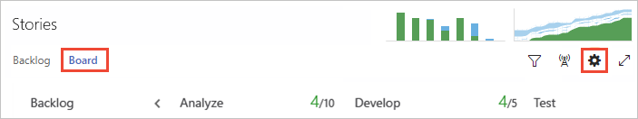

# Kanban basics

<b>Team Services | TFS 2017 | TFS 2015 | TFS 2013</b> 

To maximize a team's ability to consistently deliver high quality software, Kanban emphasize two main practices. The first, visualize the flow of work, requires you to map your team's workflow stages and configure your Kanban board to match. The second, constrain the amount of work in progress, requires you to set work-in-progress (WIP) limits. You're then ready to track progress on your Kanban board and monitor key metrics to reduce lead or cycle time.  

Your Kanban board turns your backlog into an interactive signboard, providing a visual flow of work. As work progresses from idea to completion, you update the items on the board. Each column represents a work stage, and each card represents a user story (blue cards) or a bug (red cards) at that stage of work.  


Review this topic to gain an understanding of how to configure and start working with your Kanban boards:   

> [!div class="checklist"] 
> * View your Kanban board    
> * Customize the columns shown on your Kanban board to support how your team works  
> * Set WIP limits to constrain work in progress   
> * Update the status of work via drag-and-drop  
> * View the Cumulative flow chart     
> * How to turn live updates on or off  
 

### Open your Kanban board from the web portal

You access your Kanban board from the **Work>Backlogs>Board** page. If you don't have a team project yet, create one in [Visual Studio Team Services](../../setup-admin/team-services/set-up-vs.md) or set one up in an [on-premises TFS](../../setup-admin/create-team-project.md).   

To contribute to the Kanban board, you must be a member of the team and belong to the Contributors group. To configure the Kanban board, you must be added to the team administrator role or be a member of the Project Administrators group.   If you don't have access to the team project, [get invited to the team](../scale/multiple-teams.md#add-team-members).   

<div style="background-color: #f2f0ee;padding-top:10px;padding-bottom:10px;">

<ul class="nav nav-pills" style="padding-right:15px;padding-left:15px;padding-bottom:5px;vertical-align:top;font-size:18px;">

<li style="float:left;" data-toggle="collapse" data-target="#open-backlog">Open product backlog</li> 

<li style="float: right;"><a style="max-width: 374px;min-width: 120px;vertical-align: top;background-color:#AEAEAE;margin: 0px 0px 0px 8px;min-width:50px;color: #fff;border: solid 2px #AEAEAE;border-radius: 0;padding: 2px 6px 0px 6px;outline-style:none;height:32px;font-size:12px;font-weight:400" data-toggle="pill" href="#open-backlog-tfs-2015-13">TFS 2015, TFS 2013</a></li>

<li class="active" style="float: right"><a style="max-width: 374px;min-width: 120px;vertical-align: top;background-color:#007acc;margin: 0px 0px 0px 0px;min-width:90px;color: #fff;border: solid 2px #007acc;border-radius: 0;padding: 2px 6px 0px 6px;outline-style:none;height:32px;font-size:12px;font-weight:400" data-toggle="pill" href="#open-backlog-team-services">Team Services, TFS 2017</a></li>

</ul>
 
<div id="open-backlog" class="tab-content collapse in fade" style="background-color: #ffffff;margin-left:5px;margin-right:5px;padding: 5px 5px 5px 5px;">


<div id="open-backlog-team-services" class="tab-pane fade in active"> 

 

<p>The URL follows this pattern:</p>
<ul>
<li>Visual Studio Team Services: ```https://{account}.visualstudio.com/{project name}/_backlogs```</li>
<li>Team Foundation Server (on-premises): ```http://{server}:8080/tfs/DefaultCollection/{project name}/_backlogs```</li>
</ul>

<p>If you don't see the team or team project you want, click the  Team Services icon to [browse all team projects and teams](/team-services/connect/account-home-pages). </p> 
 

</div>

<div id="open-backlog-tfs-2015-13" class="tab-pane fade"> 


  

<p>The URL follows this pattern:</p>
<p>```http://{server}:8080/tfs/DefaultCollection/{project name}/_backlogs```</p>

<p>If you don't see the team or team project you want, open the team project/team drop-down menu and select the team project/team that you've recently visited. If you don't see the team or team project you want, choose **Browse all** to browse all team projects and teams. </p>

 


</div>


</div>
</div> 

<!--- 
[!INCLUDE [temp](../_shared/image-differences.md)]  

To view your Kanban board, click the **Board** link from the **Work>Backlogs** page. 

  

-->

>[!NOTE]  
>Your Kanban board is one of two types of boards available to you. For an overview of the features supported on each backlog and board, see [Backlogs, boards, and plans](../backlogs-boards-plans.md). To switch to the [product backlog](../backlogs/create-your-backlog.md), click **Backlog**. And, to switch to the [Task board](../scrum/task-board.md), click on the current iteration or other sprint of interest. If no sprints appear, see [Schedule sprints](../scrum/define-sprints.md). 

User stories and bugs correspond to types of work items. You use  [work items](../backlogs/add-work-items.md) to share information, assign work to team members, update status, track dependencies, and more.

<!--- 
You open your Kanban board using one of these URLs that connects you to your team project:   

**Team Services**:  ```http://AccountName/DefaultCollection/TeamProjectName/_backlogs/board/ ```

**On-premises Team Foundation Server (TFS)**:  ```http://ServerName:8080/tfs/DefaultCollection/TeamProjectName/_backlogs/board/```

If you don't have a team project yet, create one in [Visual Studio Team Services](../../setup-admin/team-services/set-up-vs.md) or set one up in an [on-premises TFS](../../setup-admin/create-team-project.md). If you don't have access to the team project, get [invited to the team](../scale/multiple-teams.md#add-team-members).

-->

<a id="add-or-rename-columns"> </a>

## 1. Map the flow of how your team works, add or rename columns
<meta name="description" content="Kanban workflow" />
Kanban literally means signboard or billboard. As a first step, you customize your board to map to how your team works.

When you first open your Kanban board, you'll see one column for each [workflow state](../concepts/workflow-and-state-categories.md). Your actual columns vary based on the [process](../guidance/choose-process.md) chosen to create your team project.

For user stories, the New, Active, Resolved, and Closed states track progress from idea to completion.
<table>
<tbody>
<tr valign="top">
<td>


</td>
<td>


</td>
</tr>
</tbody>
</table>

However, your team's workflow stages most likely don't map to these default states. For your team to have a functional board they must identify the stages of their workflow process and then configure the board to match.

For example, you can change your Kanban columns to map to the following five workflow stages.


Once you've identified your stages, simply add and rename columns to map to them. Keep the number of columns to a minimum while still representing the key handoffs that occur for your team.

<div style="background-color: #f2f0ee;padding-top:10px;padding-bottom:10px;">

<ul class="nav nav-pills" style="padding-right:15px;padding-left:15px;padding-bottom:5px;vertical-align:top;font-size:18px;">
<li style="float:left;" data-toggle="collapse" data-target="#add-columns">Add or rename columns </li>
<li style="float: right;"><a style="max-width: 374px;min-width: 120px;vertical-align: top;background-color:#AEAEAE;margin: 0px 0px 0px 8px;min-width:90px;color: #fff;border: solid 2px #AEAEAE;border-radius: 0;padding: 2px 6px 0px 6px;outline-style:none;height:32px;font-size:14px;font-weight:400" data-toggle="pill" href="#tfs-2015-on-prem">TFS 2015, TFS 2013</a></li>
<li style="float: right;"><a style="max-width: 374px;min-width: 120px;vertical-align: top;background-color:#AEAEAE;margin: 0px 0px 0px 8px;min-width:90px;color: #fff;border: solid 2px #AEAEAE;border-radius: 0;padding: 2px 6px 0px 6px;outline-style:none;height:32px;font-size:14px;font-weight:400" data-toggle="pill" href="#tfs-2015-1">TFS 2015.1</a></li>
<li class="active" style="float: right"><a style="max-width: 374px;min-width: 120px;vertical-align: top;background-color:#007acc;margin: 0px 0px 0px 0px;min-width:90px;color: #fff;border: solid 2px #007acc;border-radius: 0;padding: 2px 6px 0px 6px;outline-style:none;height:32px;font-size:14px;font-weight:400" data-toggle="pill" href="#team-services">Team Services, TFS 2017</a></li>
</ul>
 
<div id="add-columns" class="tab-content collapse in fade" style="background-color: #ffffff;margin-left:5px;margin-right:5px;padding: 5px 5px 5px 5px;">

<div id="team-services" class="tab-pane fade in active">        
<ol>
<li><p>To open, click , the gear icon, to open the team settings dialog and then click Columns. If you're not a team admin, [get added as one](../scale/add-team-administrator.md). Only team and project admins can customize columns.</p>    

  
 
</li>
<li><p>Click the **Columns** tab to see all the settings you can modify. Your initial column settings will look something like this.</p>  

  

</li>
<li><p>Change your column titles to map to your workflow stages. You can add, rename, and move columns to support more stages.</p>
<p>Here, we rename the first, second, and third columns to Backlog, Analyze, and Develop. We then add a column and label it Test.</p>
<p>You can also rename a column directly form the Kanban board.</p>

<p>Or, you can open the dialog and change one or more settings for a Kanban column.</p>
 
</li>
<li><p>To change the column order, simply drag the column tab to the position you want.</p>
</li>
<li><p>To delete a column, first make sure that the column doesn't contain any work items. If it does, move the items to another column. Then, click Delete on the column tab menu.</p>
    
</li>
<li><p>[Change State mappings as needed](add-columns.md#state-mappings) for added columns, added workflow states, or added work item types (WITs).</p>
<p>Usually you need to do this when you change the [Working with bugs](../customize/show-bugs-on-backlog.md) setting, add different work item types to the backlog, or customize the workflow.</p>  
</li>
</ol>
  
</div>


<div class="tab-pane fade" id="tfs-2015-1" style="background-color: #ffffff;margin-left: 15px;margin-right:15px;padding: 5px 5px 5px 5px;">
<ol>
<li><p>To open, click , the gear icon, to open the team settings dialog and then click Columns.</p>

<p>If you're not a team admin, [get added as one](../scale/add-team-administrator.md). Only team and project admins can customize columns.</p>
</li>
<li><p>Click a column tab to see all the settings you can modify. Your initial column settings will look something like this.</p>

</li>
<li><p>Change your column titles to map to your workflow stages. You can add, rename, and move columns to support more stages.</p>
<p>Here, we rename the first, second, and third columns to Backlog, Analyze, and Develop. We then add a column and label it Test. (You can also rename a column directly form the Kanban board.)</p>


<p>Or, you can open the dialog and change one or more settings for a Kanban column.</p>

</li>
<li><p>To change the column order, simply drag the column tab to the position you want.</p>
</li>
<li><p>To delete a column, first make sure that the column doesn't contain any work items. If it does, move the items to another column. Then, click Delete on the column tab menu.</p>
  
</li>
<li><p>[Change State mappings as needed](#state-mappings) for added columns, added workflow states, or added work item types (WITs).</p>
<p>Usually you need to do this when you change the [Working with bugs](../customize/show-bugs-on-backlog.md) setting or add [WITs to the Requirement Category](../customize/add-wits-to-backlogs-and-boards.md).</p>  
</li>
</ol>
</div>

<div class="tab-pane fade" id="tfs-2015-on-prem" style="background-color: #ffffff;margin-left: 15px;margin-right:15px;padding: 5px 5px 5px 5px;">

<ol>
<li><p>To open, click , the gear icon, to open Customize Columns.</p>
  

<p>If you're not a team admin, [get added as one](../scale/add-team-administrator.md). Only team and project admins can customize columns.</p>   

  
</li>
<li>
<p>Change your column titles to map to your workflow stages. You can add, rename, and move columns to support more stages.</p>
<p>Here, we rename the first, second, and third columns to Backlog, Analyze, and Develop. We then add a column and label it Test.</p>
  
<p>Rename column titles to best reflect each stage of work. Keep the column titles as simple as possible.</p>
</li>
<li>
<p>To change the column order, use the left  or right  arrow icons.</p>
</li>
<li>
<p>To delete a column, first make sure that the column doesn't contain any work items. If it does, move the items to another column. Then, click X at the top of the column.</p>
</li>
<li>
<p>[Change State mappings as needed](#state-mappings) for added columns, added workflow states, or added work item types (WITs).</p>
<p>Usually you need to do this when you change the [Working with bugs](../customize/show-bugs-on-backlog.md) setting or add [WITs to the Requirement Category](../customize/add-wits-to-backlogs-and-boards.md).</p>
</li>
</ol>

 
</div>

</div>
</div>

## 2. Set WIP limits to constrain work in progress
<meta name="description" content="Kanban WIP limits" />
In this next step, your team sets WIP limits for each workflow stage. While setting WIP limits is easy, adhering to them takes a team commitment. Teams new to Kanban may find WIP limits counterintuitive and uncomfortable. However, this single practice has helped teams identify bottlenecks, improve their process, and increase the quality of software they ship.

What limits should you set? Start with numbers that don't exceed 2 or 3 items per team member working within a stage. Respecting WIP limits means teams don't pull items into a column if doing so causes the number of items in the column to exceed the WIP limit.

When they do exceed the limit, the column count displays red. Teams can use this as a signal to focus immediately on activities to bring the number of items in the column down.


Set WIP limits based on team discussions and revisit as your team identifies ways to improve their processes. Use WIP limits to identify bottlenecks and eliminate waste from your work flow processes. For guidance, see [WIP limits](wip-limits.md).

1. From your Kanban board, click  and as needed, click Columns.  

	
	
	If you're not a team admin, [get added as one](../scale/add-team-administrator.md). Only team and project admins can customize columns.

	You'll see different column titles and choices based on the following:
	
	- You connect to Visual Studio Team Services or an on-premises TFS
	- The [Process](../guidance/choose-process.md) you used to create your team project  
	- Whether your team has chosen to [treat bugs like requirements or like tasks](../customize/show-bugs-on-backlog.md)  

	**Team Services and TFS 2015.1 and later versions**  
2. Click a column tab to set the WIP limit for that column.  

	 

	Go to [Kanban basics](kanban-basics.md) for information about accessing your Kanban board. And, if you're not a team admin, [get added as one](../scale/add-team-administrator.md). Only team and project admins can customize columns.  

	**TFS 2015**   
	Set the WIP limits for each intermediate column.  

	  


<a id="track-work">  </a>
## 3. Track work in progress, update status via drag-and-drop
<meta name="description" content="Kanban tools track progress" />
Once you've configured your Kanban board to match how your team works, you're ready to use it.

Here are a few things you can do. See at a glance the estimated size of work for each item which displays at the bottom right of each card. Add items to your backlog in the first column. When priorities change, move items up and down within a column. And, as work completes in one stage, update the status of an item by dragging and dropping it to a downstream stage.


>[!NOTE]  
><b>Feature availability: </b> You can [reorder items within a column](#reorder-cards) from Team Services and the web portal for TFS 2015.1 and later versions.   

Also, you can quickly update a field or reassign ownership directly from the board.


Updating your Kanban board as work progresses helps keep you and your team in sync. Also, you'll be able to see and share the value stream your team is delivering to customers.

## 4. Monitor metrics and fine tune
As with most Agile practices, Kanban encourages monitoring key metrics to fine tune your processes. After your team has used the Kanban board for several weeks, check out your Cumulative Flow Diagram (CFD).

   

The CFD shows the count of items in each Kanban column for the past 30 weeks or less. From this chart you can gain an idea of the amount of work in progress and lead time. Work in progress counts unfinished requirements. Lead time indicates the amount of time it takes to complete a requirement once work has started.  

   

By monitoring these metrics, you can gain insight into how to optimize your processes and minimize lead time. For additional guidance, see [Cumulative Flow](../../report/guidance/cumulative-flow.md) 
 
>[!NOTE]  
><b>Feature availability: </b>From Team Services, you can also add the [Cumulative Flow Diagram (CFD)](../../report/guidance/cumulative-flow.md) and [Lead Time and Cycle Time](../../report/guidance/cycle-time-and-lead-time.md)  widgets to a team dashboard.  


## Related notes

Each team can manage their backlog and customize their Kanban board. [Add teams](../scale/multiple-teams.md) when you assign specific feature areas to different teams for development. Each team can then manage their backlog and focus on how they will develop their deliverables. 

Here are some useful tips when working with the Kanban board:
- To quickly assign items to a team member, add the Assign To field to display on the cards (see [Customize cards](../customize/customize-cards.md))   
- Customize cards to show the fields you most care about  
- Add a swimlane to track high-priority work or track work which falls into different service level agreements (see [Swimlanes](expedite-work.md))   
- Highlight specific work items by color coding cards based on a field value or tag (see [Customize cards](../customize/customize-cards.md)) 
- If you use Scrumban, drag-and-drop cards onto a sprint to quickly assign them to a sprint.  


If your new to Team Services or TFS and want to understand what you can customize, see [Customize your work tracking experience](../customize/customize-work.md). 

<!---
For more opportunities to adopt Kanban practices and customize your team's Kanban board, check out the following topics:  

<div style="float:left;width:230px;margin:3px;font-size:90%">
<p style="font-weight:bold;padding-bottom:0px;text-align:center;">Kanban</p>
<ul style="padding-left:10px">
<li style="margin-bottom:2px">[Task checklists](add-task-checklists.md)</li>
<li style="margin-bottom:2px">[Filter the Kanban board](../how-to/filter-backlog-or-board.md)</li>
<li style="margin-bottom:2px">[Features and epics](kanban-epics-features-stories.md)</li>
<li style="margin-bottom:2px">[Split columns](split-columns.md)</li>
<li style="margin-bottom:2px">[Swimlanes](expedite-work.md)</li>
<li style="margin-bottom:2px">[Definition of Done](definition-of-done.md)</li>
<li style="margin-bottom:2px">[Customize cards](../customize/customize-cards.md)</li>
<li style="margin-bottom:2px">[Show bugs on backlogs and boards](../customize/show-bugs-on-backlog.md)</li>
<li style="margin-bottom:2px">[Switch team project or team focus](../how-to/switch-team-context-work.md)</li> 
</ul>
</div>

<div style="float:left;width:230px;margin:3px;font-size:90%">
<p style="font-weight:bold;padding-bottom:0px;text-align:center;">Manage</p>
<ul style="padding-left:20px">
 <li style="margin-bottom:2px">[Add work items](../backlogs/add-work-items.md)</li>
 <li style="margin-bottom:2px">[Tag work items](../track/add-tags-to-work-items.md)</li>
 <li style="margin-bottom:2px">[Copy a work item](../backlogs/copy-clone-work-items.md#copy-clone)</li>
 <li style="margin-bottom:2px">[Delete a work item](../backlogs/remove-delete-work-items.md)</li>
 <li style="margin-bottom:2px">[Integrate with Git](../backlogs/connect-work-items-to-git-dev-ops.md)</li>
</ul>
</div>

<div style="float:left;width:230px;margin:3px;font-size:90%">
<p style="font-weight:bold;padding-bottom:0px;text-align:center;">Track</p>
<ul style="padding-left:20px">
<li style="margin-bottom:2px">[Query by assignment, workflow or Kanban board changes](../track/query-by-workflow-changes.md)</li>
<li style="margin-bottom:2px">[Cumulative Flow Diagram (CFD)](../../report/guidance/cumulative-flow.md)</li>
<li style="margin-bottom:2px">[Lead Time](../../report/guidance/cycle-time-and-lead-time.md)</li>
<li style="margin-bottom:2px">[Cycle Time](../../report/guidance/cycle-time-and-lead-time.md)</li>
 <li style="margin-bottom:2px">[Review delivery plans](../scale/review-team-plans.md)</li>
 <li style="margin-bottom:2px">[Dashboards](../../report/dashboards.md)</li>
 <li style="margin-bottom:2px">[Follow a work item or pull request](../../collaborate/follow-work-items.md)</li>
 <li style="margin-bottom:2px">[History & audit](../track/history-and-auditing.md)</li>
</ul>
</div>


<div style="clear:left;font-size:100%">
</div>

-->


[!INCLUDE [temp](../_shared/kanban-board-controls.md)]  


[!INCLUDE [temp](../_shared/live-updates.md)]  
 
 

