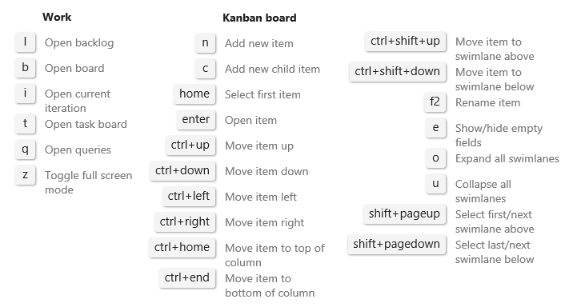

# Kanban board controls

<b>VSTS | TFS 2018 | TFS 2017 | TFS 2015.1</b> 

| Control                  | Function                      |
|--------------------------|-------------------------------|
| Backlog               | [Switch to backlog view](../backlogs/create-your-backlog.md)           |
| Board    | [Switch to Kanban board view](kanban-quickstart.md)            | 
|  | [Filter by keyword or tag](filter-kanban-board.md)   |  
|  | [Filter by field](filter-kanban-board.md)     | 
|   | [Enable live updates](kanban-basics.md#live-updates)  |
|  | Customize the board and configure team settings: [Cards](../customize/customize-cards.md)  &#124; [Card reordering](../customize/reorder-cards.md) &#124; [Columns](add-columns.md)  &#124; [Swimlanes](expedite-work.md)  &#124; [CFD chart](../../report/dashboards/cumulative-flow.md) &#124; [Backlogs](../customize/select-backlog-navigation-levels.md) &#124; [Working days](../customize/set-working-days.md) &#124; [Working with bugs](../customize/show-bugs-on-backlog.md)   |
|  /  | Enter or exit full screen mode      |   
 

Enter **?** to open the Kanban board keyboard shortcuts.  

>[!NOTE]  
><b>Feature availability: </b>Global keyboard shortcuts are available from VSTS and the web portal for TFS 2015.2 and later versions.  

  
  

