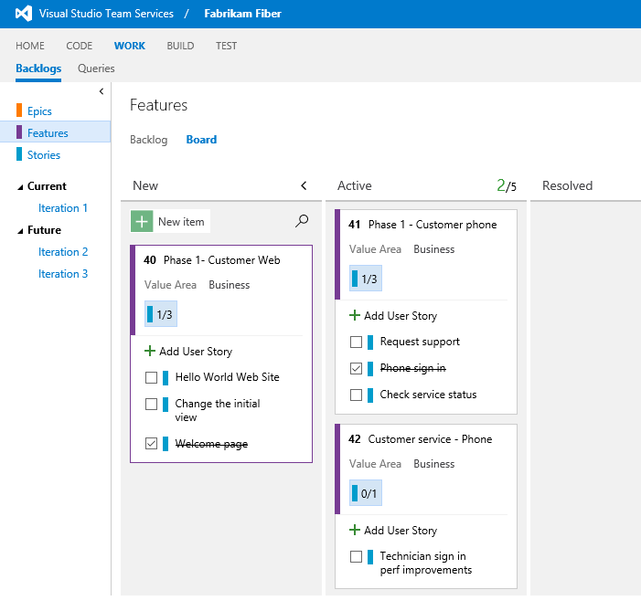
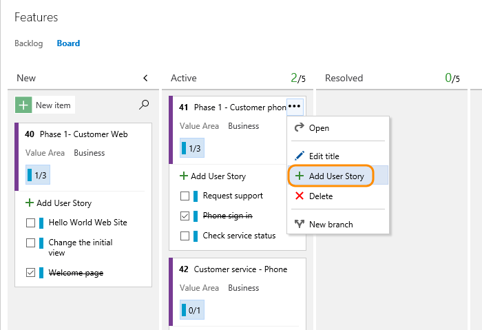

# Kanban board features and epics  

[!INCLUDE [temp](../_shared/version-vsts-tfs-all-versions.md)]

<!---
> [!NOTE]    
><b>Feature availability: </b>Child checklists for feature and epic Kanban boards are supported from VSTS and TFS 2017 and later versions.
--> 

If you use Kanban to track progress on your backlog, you can also use Kanban boards to track epics and features.  

And, just as with [child task checklists for backlog items](add-task-checklists.md), you can quickly define and track the progress of child items for your features or epics. Here we see several stories defined for features, both in progress and those completed.    

In this topic, you'll learn: 
>[!div class="checklist"]    
> * How to add epics and features using your portfolio backlogs    
> * Keyboard shortcuts for working with the Kanban board  

::: moniker range="tfs-2013"
> [!NOTE]   
> Epic portfolio backlogs are supported in TFS 2015 and later versions.  
::: moniker-end

::: moniker range=">= tfs-2013 <= tfs-2015"
> [!NOTE]    
>Child checklists for feature and epic Kanban boards are supported from TFS 2017 and later versions.
::: moniker-end

## Add epics or features    

Add new items to a feature or epic through the item's  Action menu. For descriptions of fields used to support features and epics, see [Define features and epics](../backlogs/define-features-epics.md). 

 

If you have a number of items to add, simply keep typing your task titles and click Enter. If you have details you want to add about to a work item, hover over the item and press Enter.  
 

## Related articles

If you're new to working with the Kanban board, see [Kanban basics](kanban-basics.md)

For additional guidance on working with a checklist on a Kanban board, see [Add task checklists](add-task-checklists.md). You can perform the same operations for the features and epics Kanban boards as you do with the Kanban board for the product backlog. This includes:    

- Mark an item as done  
- Reorder and reparent work items  
- Assign work items to sprints   

To customize the columns, swimlanes, or cards for each Kanban board, make sure you first select the board and then click the gear icon to open the Settings dialog. See these topics for details: 

* [Add columns](add-columns.md)  
* [Customize cards](../customize/customize-cards.md)  

### REST API resources
To programmatically interact with Kanban board and other team settings, see the [REST API, Boards reference](https://docs.microsoft.com/en-us/rest/api/vsts/work/boards).

