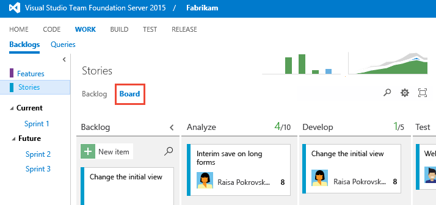

# About Kanban and Agile project management 

[!INCLUDE [temp](../_shared/version-vsts-tfs-all-versions.md)]
 
Your Kanban board provides you with a visual interactive space for you and your team to plan and show progress. With it, your team can track the critical information they need by seeing which work items are in progress, where the bottlenecks are, who work is assigned to, and more.

Each card on the board corresponds to a user story or work item the team is tracking.

::: moniker range="vsts || >= tfs-2017 <= tfs-2018"
 

Your Kanban board is highly customizable to support your team's workflow. 
::: moniker-end

::: moniker range=">= tfs-2013 <= tfs-2015"
> [!div class="mx-imgBorder"]  
>  

Each team can customize their Kanban board to meet their workflow needs. 
::: moniker-end

The main steps you'll typically want to follow are outlined below. 

::: moniker range="vsts || >= tfs-2015 <= tfs-2018"
Once you've configured your Kanban board, you can add work items directly to the board. You can then update the status of work by dragging a card to another column on the Kanban board. You can even change the order of items as you move a card to a new column.   

::: moniker-end

::: moniker range="tfs-2013"
Once you've configured your Kanban board, you can add work items directly to the board. You can then update the status of work by dragging a card to another column on the Kanban board. 
::: moniker-end

## Try this next  

Take these tools for a test run by [creating an account on VSTS for free](../../organizations/accounts/create-account-msa-or-work-student.md). From there, you're ready to add items to your Kanban board and customize it. 

> [!div class="nextstepaction"]
> [Kanban quickstart](kanban-quickstart.md)  
  

 

 