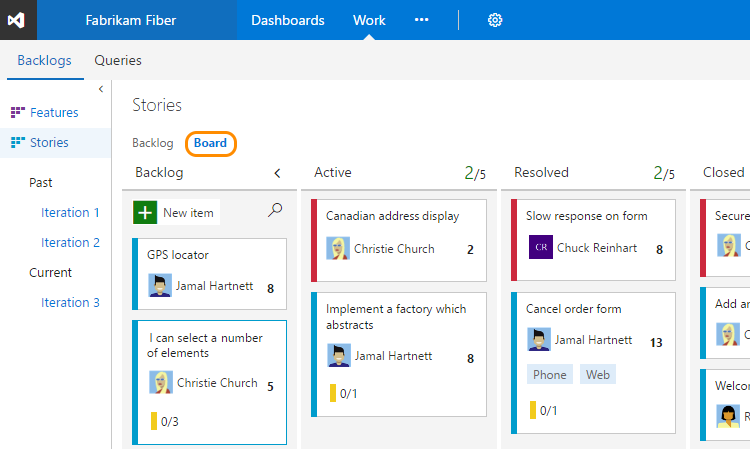
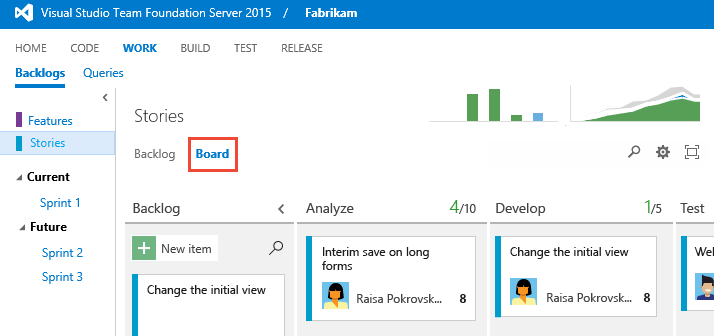
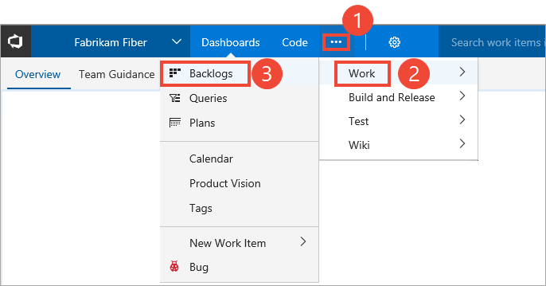
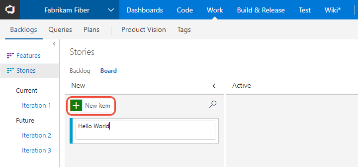
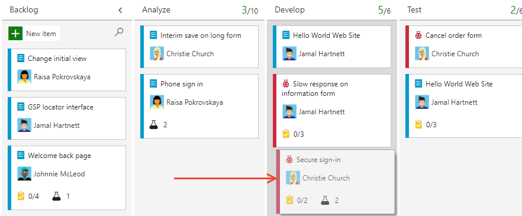
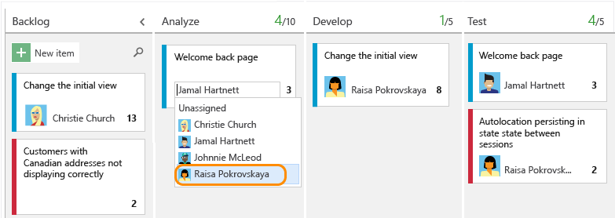
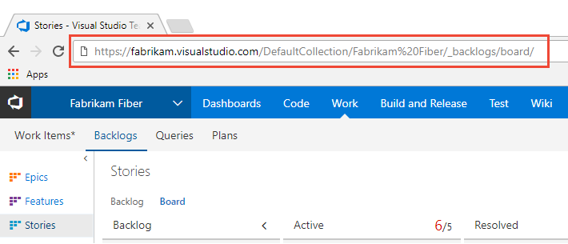
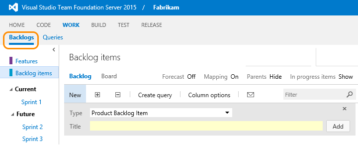
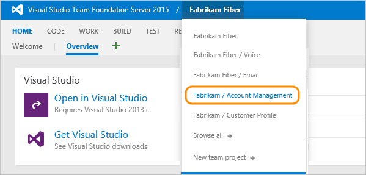

# Get started using your Kanban board

[!INCLUDE [temp](../_shared/version-vsts-tfs-all-versions.md)]

Your Kanban board turns your backlog into an interactive signboard, providing a visual flow of work. As work progresses from idea to completion, you update the items on the board. Each column represents a work stage, and each card represents a backlog item, user story, or bug at that stage of work. 

User stories and bugs correspond to types of work items. You use [work items](../backlogs/add-work-items.md) to share information, assign work to team members, update status, track dependencies, and more.

[!INCLUDE [temp](../_shared/prerequisites.md)]

## Add a Kanban board

Each Kanban board is associated with a team and a work item type. For the Agile process, the three boards are Stories, Features, and Epics.  

When you add a team, you add a number of team assets which a team admin can  configure to support the way the team works. To add a set of Kanban boards to support a new team, [add a team](../scale/multiple-teams.md). 

::: moniker range="vsts" 
To add a board to support an additional portfolio backlog, see [Customize your backlogs or boards](../customize/process/customize-process-backlogs-boards.md).
::: moniker-end 
::: moniker range=">= tfs-2013 <= tfs-2018"   
To add a board to support an additional portfolio backlog, see [Add a portfolio backlog level](../customize/add-portfolio-backlogs.md).
::: moniker-end   

## Open your Kanban board from the web portal

To view your Kanban board, open your team project from a web browser and click **Work>Backlogs**, and then click **Board**.   
::: moniker range="vsts || >= tfs-2017 <= tfs-2018"   
     
::: moniker-end   
::: moniker range=">= tfs-2013 <= tfs-2015"    
> [!div class="mx-imgBorder"]  
>        
::: moniker-end   
::: moniker range="vsts || >= tfs-2017 <= tfs-2018"   
If you don't see the **Work** hub, your screen size may be reduced. Click the three dots (), then click **Work**, **Backlogs**, and then **Board**.   

   

If you don't see the team or team project you want, click the  icon to [browse all team projects and teams](../../user-guide/account-home-pages.md).
   
::: moniker-end


<a id="add-work-items"> </a>
## Add work items 

0. To add a work item, simply click the plus sign () and enter a title for the item, and then press Enter on your keyboard. 

	  

	The system automatically saves the work item with the title you entered. You can add as many work items you want using this method. 

0. To add details to any work item, click the title. Or, you can directly modify any field that displays. For example, you can reassign a work item by clicking the Assigned To field.   

<a id="update-status">  </a>
## Update status via drag-and-drop

As work completes in one stage, update the status of an item by dragging and dropping it to a downstream stage. 

  

::: moniker range="vsts || >= tfs-2015 <= tfs-2018"
## Update fields from the card 

You can quickly update a field or reassign ownership directly from the board. 



If the field you want to update isn't showing, then [customize the card to show it](../customize/customize-cards.md). 
::: moniker-end

::: moniker range="vsts"
## Invite others to work on your Kanban board 

All members of a team project will be able to view and contribute to your Kanban board. To invite users to start contributing, copy the URL of your Kanban board and email it to those you want to invite to your project. 

 

To add users to your team project, see [Add users to a team project](../../security/add-users-team-project.md)   
::: moniker-end

## Try this next 

To get the full power of the Kanban board working for you, you'll want to configure it to map the flow of work and set WIP limits for your team. To configure the Kanban board, you must be [added as a team administrator](../scale/add-team-administrator.md) or be a member of the Project Administrators group. If you're the account owner or creator of the team project, then you'll have these permissions. 

> [!div class="nextstepaction"]
> [Kanban basics](kanban-basics.md)  


> [!NOTE]  
> Your Kanban board is one of two types of boards available to you. For an overview of the features supported on each backlog and board, see [Backlogs, boards, and plans](../backlogs/backlogs-boards-plans.md). To switch to the [product backlog](../backlogs/create-your-backlog.md), click **Backlog**. And, to switch to the [Task board](../scrum/task-board.md), click the current iteration or other sprint of interest. If no sprints appear, see [Schedule sprints](../scrum/define-sprints.md). 


   

<!---

### TFS 2015, TFS 2013

  

The URL follows this pattern:  
```http://serverName:8080/tfs/DefaultCollection/projectName/_backlogs```  

If you don't see the team or team project you want, open the team project/team drop-down menu and select the team project/team that you've recently visited. If you don't see the team or team project you want, choose **Browse all** to browse all team projects and teams. 

 

To view your Kanban board, click the **Board** link from the **Work>Backlogs** page. 

  

The web browser URL follows this pattern:  
- **VSTS**: ```https://{account name}.visualstudio.com/DefaultCollection/{project name}/_backlogs\board```  
- **On-premises TFS**: ```http://serverName:8080/tfs/DefaultCollection/projectName/_backlogs\board```  

You can use this URL to quickly open the team project, substituting the {account name} and {project name} with your specific account and project name (remove braces).

If you're new to VSTS or TFS and want to understand what you can customize, see [Customize your work tracking experience](../customize/customize-work.md). 


Here are a few things you can do. See at a glance the estimated size of work for each item which displays at the bottom right of each card. Add items to your backlog in the first column. When priorities change, move items up and down within a column. And, as work completes in one stage, update the status of an item by dragging and dropping it to a downstream stage.

Each team can manage their backlog and customize their Kanban board. [Add teams](../scale/multiple-teams.md) when you assign specific feature areas to different teams for development. Each team can then manage their backlog and focus on how they will develop their deliverables. 

Here are some useful tips when working with the Kanban board:
- To quickly assign items to a team member, add the Assign To field to display on the cards (see [Customize cards](../customize/customize-cards.md))   
- Customize cards to show the fields you most care about  
- Add a swimlane to track high-priority work or track work which falls into different service level agreements (see [Swimlanes](expedite-work.md))   
- Highlight specific work items by color coding cards based on a field value or tag (see [Customize cards](../customize/customize-cards.md)) 
- If you use Scrumban, drag-and-drop cards onto a sprint to quickly assign them to a sprint.  


-->

 


 
 

