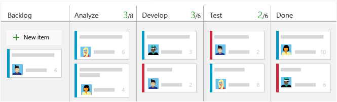
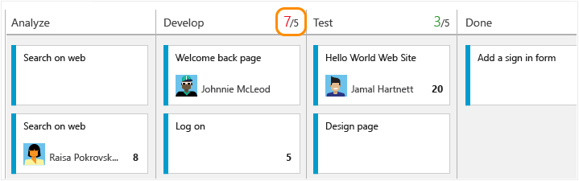
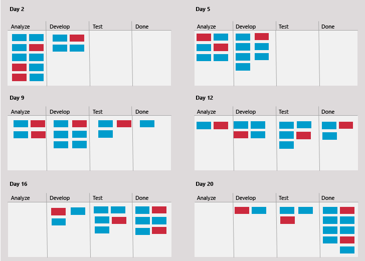
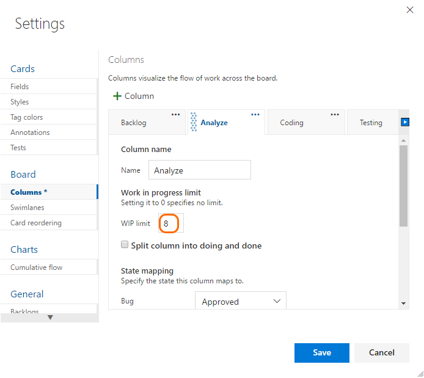
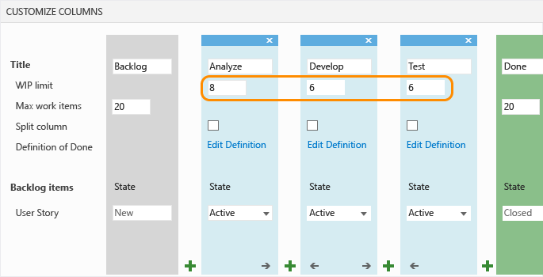

# Work in Progress limits

<b>Team Services | TFS 2017 | TFS 2015 | TFS 2013 </b>

An essential Kanban practice─Work in Progress limits, aka “WIP limits”─constrains the amount of work your team undertakes at each work stage. It's designed to focus your team on completing items before starting new work. While counter-intuitive at first, many teams find WIP limits helps them increase their productivity and improve their software quality.  

You define WIP limits for each work stage, corresponding to each intermediate column. The limit sets a soft constraint on the number of items allowed within the column. Nothing actually prevents you from moving more items into the column and exceeding the limit. Your Kanban board shows the count of items at each stage next to each limit.

 

While [setting WIP limits](#Set) is simple, adhering to the limits takes a team commitment. Successful adoption of WIP limits involves a culture change. It moves teams from a focus on individual productivity to one of team productivity. 

<a id="Initial WIP" />

##Determine initial WIP limits

To get started, have your team determine the initial WIP limits to set and how they'll use and monitor them. Beyond that, few rules apply to what numbers to set as they can vary based on several factors. Here are two guidelines to help you determine what limits to set:

* Set limits based on current works in progress. Count the items present in your existing Kanban columns.

* Set limits that don't exceed 2 or 3 items per team member that works within a stage. For example, if you have three team members and each team member can work on no more than two tasks at a time, the resulting WIP limit is 6 (= 3 developers X 2 tasks/developer).

Starting low may help your team discover bottlenecks more quickly and identify process issues to address.

After you've defined an initial set of WIP limits, you'll likely want to fine tune them as your project progresses.

If you're new to Kanban, review [Kanban basics](kanban-basics.md) to get an overview of how to access your board and implement Kanban.

<a id="Keep within WIP" />

##Keep within WIP limits

After you've set your WIP limits, you'll want to track how well your team keeps within the limits. 

Respecting WIP limits means teams don't pull items into a column if doing so causes the number of items in the column to exceed the column limit. When they do, your Kanban board provides immediate feedback. This feedback should act as a signal to the team to focus immediately on activities to reduce the number of items in the column.

 

Although simple in theory, keeping within WIP limits can force individuals, teams, and organizations out of their comfort zone. Team members who like to multitask might feel unnecessarily constrained. Others might find themselves without work as they wait for work to complete at an upstream stage. 

To gain the advantages of constraining work-in-progress, have your team meet frequently to discuss the process changes taking place. As a starting point, consider hosting discussions around some of the [challenges and solutions to support successful implementation of WIP limits](#practices) provided below.

<a id="Keep within WIP" />

##Identify bottlenecks

To optimize the flow of value, you naturally want to identify and eliminate bottlenecks. Bottlenecks indicate waste exists in the overall workflow process. 

By monitoring your Kanban board over time, you can learn where bottlenecks occur. When several items sit in a column unworked for several days, a bottleneck has occurred. Bottlenecks typically occur when WIP limits are too high. On the other hand, no bottlenecks could indicate that WIP limits are too low. 

The free eBook, [Kanban and Scrum - making the most of both](http://www.infoq.com/minibooks/kanban-scrum-minibook), provides this guidance:

*Too low WIP limit => idle people => bad productivity*

*Too high WIP limit => idle tasks => bad lead time* 

Taking periodic snapshots of your Kanban board can visually catalog where work flows smoothly and where bottlenecks appear.

Such snapshots can show your team:

* How many items on average reside within a workflow stage/column

* How many items are being worked versus team members who work within a workflow stage/column

* How many and which items remained in a workflow stage/column for long periods of time

* How many items did the team complete at the end of a one, two, or three week period?

<a id="Eliminate waste" />

##Eliminate waste

Because bottlenecks signal waste in your workflow process, you'll want to identify the source of the waste. Kanban defines waste as anything not strictly needed to produce desired outcomes.

Common wastes in software development, as described by [David Starr in the Lean of Scrum](https://MSDN.microsoft.com/library/jj161049), include:

* Unused code or features
* Defects that lead to re-work
* Delays or time spent waiting for something
* Handoffs from one person, team, or business process to another
* Insufficient requirements
* Slow or poor communication

Eliminating waste calls for team discussions to identify causes and solutions acceptable to the team. In addition to addressing the [challenges and solutions](#practices) described below, the team may decide to adjust their workflow process or WIP limits. 

<a id="Set" />

##Set WIP limits

With an understanding of how you'll use WIT limits, here's how you set them.  
1. From your Kanban board, click  and as needed, click Columns.  

	
	
	If you're not a team admin, [get added as one](../scale/manage-team-assets.md#add-team-admin). Only team and project admins can customize columns.

	You'll see different column titles and choices based on the following:
	
	- You connect to Visual Studio Team Services or an on-premises TFS
	- The [Process](../guidance/choose-process.md) you used to create your team project  
	- Whether your team has chosen to [treat bugs like requirements or like tasks](../customize/show-bugs-on-backlog.md)  

	**Team Services and TFS 2015.1 and later versions**  
2. Click a column tab to set the WIP limit for that column.  

	 

	Go to [Kanban basics](kanban-basics.md) for information about accessing your Kanban board. And, if you're not a team admin, [get added as one](../scale/manage-team-assets.md#add-team-admin). Only team and project admins can customize columns.  

	**TFS 2015**   
	Set the WIP limits for each intermediate column.  

	  

If you haven't yet [mapped your team's work flow to Kanban columns](add-columns.md), do that first. 

<a id="Related notes" />

##Related notes

Here are some additional ways your team can implement Kanban practices and customize the board:

* [Split columns](split-columns.md)  
* [Expedite work](expedite-work.md)  
* [Definition of Done](definition-of-done.md)  
* [Customize cards](../customize/customize-cards.md)  
* [Show bugs on backlogs and boards](../customize/show-bugs-on-backlog.md)  

<!---
>[!NOTE]  
><b>Feature availability: </b>If you connect to Visual Studio Team Services, you can [add and configure the Cumulative Flow Diagram (CFD) widget to a team dashboard](../../report/guidance/cumulative-flow.md).  

--> 

<a id="practices" />

##Challenges and solutions

Teams occasionally exceed WIP limits by 1 or 2 items. However, if your team frequently exceeds the limits, and exceeds them by 3 or more items, they should review processes or adjust the limits.

After a team has worked with WIP limits for several weeks, discuss the challenges team members have, solutions they'd like to try, and adjust the limits as needed. The following list, although not exhaustive, indicates some of the common challenges encountered and proven solutions used by teams who've implemented Kanban successfully. 

###Challenges
* **Social dynamics.** When it comes to following rules, team members can feel challenged. Some naturally want to rebel, others don't see that the rule applies to them, or don't see what they do as breaking the rules. Some team members may take on extra work that's outside the scope of what's been agreed to. And, still others don't want to give up multitasking as they believe it's the key to their productivity and individual achievement. 

* **Variability of work in progress.** Wide variability in the size of work items─users stories and bugs─ can negatively impact the overall workflow. For example, items with estimates that vary in size from 4 hours to 14 days, or 2 to 55 story points, can't be counted the same when it comes to constraining work in progress.

* **Ignoring systemic problems.** Instead of addressing workflow problems when bottlenecks occur, teams soldier on, putting in more time to overcome the bottleneck. 

* **Culture change.** Adopting WIP limits introduces changes to the system, culture, and team. 

###Solutions
* **Build a culture of team productivity.** Address the natural tension that exists between individual productivity versus team productivity. Identify ways in which team members can enhance the overall productivity of the team and workflow process. 

* **Size work to minimize variability.** Before work starts on any item, the team should discuss the overall size of work required and determine if it can be broken down into smaller tasks. 

* **Focus on the flow of high priority items.** When idle, team members ask how they can help move an upstream item forward. When blocked or challenged to deliver an item on time, team members ask for help to complete an item.

* **Resource team capacity for each work stage.** Bottlenecks can occur when there aren't enough specialists who work in a particular stage. Determine ways to either increase team skills within each work stage, or add resources as needed to meet an understaffed work stage.

* **Build shared understanding.** Continuously strive to increase the team's understanding of how to work using Kanban practices. Take actions that allow team members to contribute to process changes. Consider scheduling regular retrospectives or team meetings to discuss what works well and what needs changing. Document team policies to limit ambiguity.

* **Use metrics to adjust processes.** Periodically check Kanban metrics of work in progress and lead time to determine when changes need to be made. 

* **Manage culture changes mindfully.** People want to do their best work─a core tenant underlying Kanban and its associated disciplines. Apply change management principles as you adopt new practices. Create greater ownership within the team for the success of implementing WIP limits.