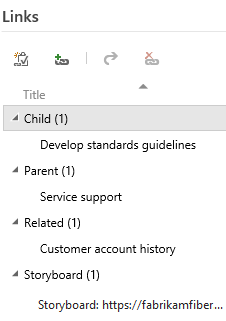
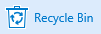
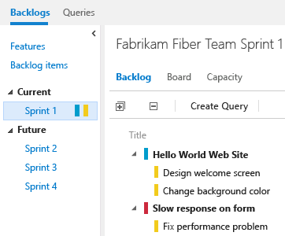
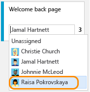
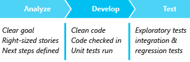
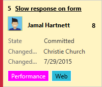
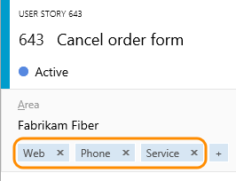
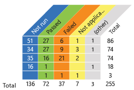
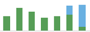

#Agile tools

<b>Team Services | TFS 2017 | TFS 2015 | TFS 2013</b> 

> [!NOTE]  
> Are you new to Agile? if so, [Learn more](https://www.visualstudio.com/agile) about how Agile and Team Services can help your team create great software.

As a project manager you can plan and track the work required to bring your applications from idea to completion. Agile tools provide you with the power, flexibility, and responsiveness you need to stay on top of changing priorities, deadlines, and requirements. 

To use these tools, you must be added to a group with the [appropriate permissions and access](../setup-admin/permissions-access.md) and must be able to [connect to a team project](../connect/connect-team-projects.md). If you need to create a team project, you can do that either in the cloud with 
[Team Services](../setup-admin/team-services/connect-to-visual-studio-team-services.md), 
or by creating one on an [on-premises Team Foundation Server (TFS)](../setup-admin/tfs/install/get-started.md). 

Backlogs

- [Backlogs, boards, & plans](backlogs-boards-plans.md)  
- [Create your backlog](./backlogs/create-your-backlog.md)   
- [Add work items](./backlogs/add-work-items.md)    
- [Define features and epics](./backlogs/define-features-epics.md)   
- [Organize backlogs](./backlogs/organize-backlog.md)  
 
- [Integrate with Git](backlogs/connect-work-items-to-git-dev-ops.md)    
- [Bulk modify](./backlogs/bulk-modify-work-items.md)  
- [Work item templates](./productivity/work-item-template.md)  
- [Storyboarding](office/storyboard-your-ideas-using-powerpoint.md)  
- [Manage bugs](./backlogs/manage-bugs.md)  
- [Productivity tips](./productivity/productivity-tips.md)  

Scrum

- [What is Scrum?](https://www.visualstudio.com/learn/what-is-scrum/)  
- [Plan sprints](./scrum/sprint-planning.md)   
- [Schedule sprints](./scrum/define-sprints.md)  
- [Plan capacity](./scale/capacity-planning.md)  
- [Task board](./scrum/task-board.md)  
- [Sprint burndown](./scrum/sprint-burndown.md)  
- [Velocity & forecast](./scrum/velocity-and-forecasting.md)  
 
<i><u>Customize</u></i>   
- [Set team defaults](./scale/set-team-defaults.md)  
- [Customize cards](./customize/customize-cards.md)  

Kanban

- [Kanban basics](./kanban/kanban-basics.md)  
- [Task checklists](./kanban/add-task-checklists.md)  
- [Epics & features](./kanban/kanban-epics-features-stories.md)  
- [Filter Kanban board](./kanban/filter-kanban-board.md)  
- [Add inline tests](./kanban/add-run-update-tests.md)  
- [Cumulative flow](../report/guidance/cumulative-flow.md)  
  
<i><u>Customize</u></i>   
- [Add columns](./kanban/add-columns.md)  
- [WIP limits](./kanban/wip-limits.md)  
- [Split columns](./kanban/split-columns.md)  
- [Expedite work](./kanban/expedite-work.md)  
- [Definition of done](./kanban/definition-of-done.md)  
- [Customize cards](./customize/customize-cards.md)  
- [Card reordering](./kanban/kanban-basics.md#card-reorder-setting)  

Track

- [Queries overview](./track/example-queries.md)  
- [Adhoc vs managed queries](./track/adhoc-vs-managed-queries.md)  
- [Managed queries](./track/using-queries.md)  
- [Code search](../search/overview.md)  
- [Follow work](../collaborate/follow-work-items.md)  

   
- [Charts](../Report/charts.md)  
- [Dashboards](../Report/dashboards.md)  
- [Tags](./track/add-tags-to-work-items.md)  
- [Alerts](./track/alerts-and-notifications.md)  
- [History & audit](./track/history-and-auditing.md)  
- [Share work plans](track/share-plans.md)  

Scale

- [Agile culture](./scale/agile-culture.md)  
- [Add teams](./scale/multiple-teams.md)  
- [Set team defaults](./scale/set-team-defaults.md)  
- [Configure team settings](./scale/manage-team-assets.md)  
- [Manage portfolios](./scale/portfolio-management.md)  
- [Visibility across teams](./scale/visibility-across-teams.md)  

   

- [Scale Agile to large teams](https://www.visualstudio.com/learn/scale-agile-large-teams/)  
- [Delivery plans](./scale/review-team-plans.md)    
- [Scaled Agile Framework](./scale/scaled-agile-framework.md)   
- [Practices that scale](./scale/practices-that-scale.md)   

For an overview of all your customization options, see [Customize your work tracking experience](./customize/customize-work.md). 

## Backlogs  

You can plan and manage your work using the backlogs and boards provided. For an overview of the features available with the three classes of backlogs you can use and two types of boards, see [Backlogs, boards, and plans](backlogs-boards-plans.md). With list backlogs you can quickly develop your project plan and group and prioritize work. With boards, you can quickly update status and fields displayed for each work item. 

You use [work items](./backlogs/add-work-items.md) to share information, assign work to team members, track dependencies, organize work, and more.  

<b>Create your backlog</b>

Plan your project by [adding a work item for each user story or requirement](./backlogs/create-your-backlog.md).   

  

<b>Storyboard</b>

Visualize your ideas and user stories and support greater understanding of them by [storyboarding them with PowerPoint](./office/storyboard-your-ideas-using-powerpoint.md), also link your storyboards to your backlog work items.  

<b>Choose how you want to track bugs</b>

Each team can [choose how they want to manage bugs](./customize/show-bugs-on-backlog.md) and where they'll show up on the backlogs and boards

.   

<b>Organize your backlog</b>

[Group items into a hierarchical list using portfolio backlogs](./backlogs/organize-backlog.md) and quickly reorder and re-parent items to effectively manage your deliverables. 

<b>New work item experience </b>

The [new work item experience](../Work/process/new-work-item-experience.md) provides access to a more modern form, additional features, and the ability to add fields and apply other customizations to the work item type. 

<b>Track issues and other types of work</b>

Different work item types [track different types of work](./backlogs/add-work-items.md) - such as bugs, test cases, risks, issues, and more. 

  

<b>Manage bugs</b>

[Capture and triage bugs](./backlogs/manage-bugs.md) using a variety of tools. 

<b>Link work items  </b>

Track related work, dependencies, and changes made over time by [linking work items](./backlogs/add-work-items.md#link-wi). 

  

### Bulk modify, link, change type, move, and delete work items 

<b>Drive Git development from a work item</b>

Follow you development processes associated with your work by [adding or linking to branches, pull requests, and commits in the Development section](./backlogs/connect-work-items-to-git-dev-ops.md). 

<b>Discussion </b>

[Add or review comments](./backlogs/add-work-items.md) added to a work item. Start by clicking the  discussion icon.  

 

<b>Bulk modify</b>

Quickly change one or more fields in several work items using [bulk modify in the web portal](./backlogs/bulk-modify-work-items.md) or [bulk modify using Excel](./office/bulk-add-modify-work-items-excel.md). 

<b>Copy or clone a work item</b>

[Copy an existing work item](./backlogs/copy-clone-work-items.md) or bulk copy several using [Excel](./office/bulk-add-modify-work-items-excel.md).

  

<b>Change the work item type (Team Services) </b>

<b>Move a work item to another team project (Team Services) </b>

<b>Remove or delete a work item</b>

Remove work items from the backlog by changing their State to Removed. Or,  [move them to the recycle bin (Team Services) or permanently delete them](./backlogs/remove-delete-work-items.md).

  
  

<b>Work item templates</b>

Quickly add new work items based on templates [with pre-populate values for your team's commonly used fields](./productivity/work-item-template.md). 

<b>Rich text comments</b>

Describe and comment on work to perform using [formatted text, hyperlinks, and inline images](./backlogs/add-work-items.md). Click  or   to expand or contract the viewing area. 

<b>Attachments</b>

[Add emails, documents, images, log files, or other file types](./track/share-plans.md#attachments) to support collaboration of work in progress. 

 

##Scrum  

New to Scrum? [Learn more](https://www.visualstudio.com/learn/what-is-scrum/) about the basics of Scrum and how it can help your team.

Scrum teams use sprint backlogs to [plan sprints](./scrum/sprint-planning.md) and focus on just the set of work they want to accomplish during a sprint.  
 
  

 

<b>Define sprints</b>

[Schedule and select your team's sprints](./scrum/define-sprints.md) to gain access to sprint backlogs and task boards

  

<b>Plan sprints</b>

Build your sprint backlog, add tasks, and load balance work across your team as you [plan your sprint](./scrum/sprint-planning.md)

  

<b>Track work on your task board</b>

Use your [task board](./scrum/task-board.md) during your daily Scrum meetings to view  and update progress  

<b>Manage resources</b>

Use [capacity planning tools](./scale/capacity-planning.md) to track individual, team, and activity over and under capacity for a sprint

<b>Velocity & forecasting</b>

Use [velocity & forecast tools](./scrum/velocity-and-forecasting.md) to estimate work that can be completed in future sprints 

  

<b>Sprint burndown charts</b>

Monitor progress and review team patterns from [sprint burndown charts](./scrum/sprint-burndown.md)

  

## Kanban 

Your Kanban board turns your backlog into an interactive signboard, providing a visual flow of work. Each Kanban column represents a work stage, and each card represents a work item. Using the [product backlog Kanban board](./kanban/kanban-basics.md), you can quickly update workflow status by moving items to a downstream column or different swimlane.

  
 

Kanban basics

Use your Kanban board to [visualize and track the flow of work](./kanban/kanban-basics.md) from idea to completion as well as quickly update work item fields.

  

<b>Add task checklists</b>

Add and mark tasks as done with [lightweight tasks checklists](./kanban/add-task-checklists.md). 

  

<b>Set WIP limits</b>

[Set constraints on the amount of work your team undertakes at each work stage](./kanban/wip-limits.md) to gain access to sprint backlogs and task boards.

Add columns

[Customize columns to support your team's workflow](./kanban/add-columns.md) and track work from start to finish. 
 
  

<b>Definition of done</b>

Support your [team to be in sync about when to handoff items to a downstream work stage](./kanban/definition-of-done.md). 

<b>Split columns</b>

Turn on split columns to [track the lag between when items are done in one state and work actually starts in a new state](./kanban/split-columns.md).

<b>Expedite work</b>

Use [swimlanes](./kanban/expedite-work.md) to track work at different service-level classes. 

<b>Customize cards</b>

[Add fields to cards](./customize/customize-cards.md) that you can edit directly on your Kanban and task boards.  

  

## Track  
Track and visualize progress using fit-for-purpose tools. You can search the code base, list work items, and set up alerts to get notified when changes that you care about occur. 

### Search, queries, tags, and filters  

<b>Example queries</b>

[Find examples to use](./track/example-queries.md) when constructing your queries.

<b>Work item queries</b>

Open shared queries or create your own query using the query editor [to list work items or show hierarchical or dependent items](./track/using-queries.md).

<b>Work item search box</b>: find work items based on [ID, assignment, changed date, or keyword](track/example-queries.md). 

  

<b>Code search</b>

[Search within your code branches (TVC) and repositories (Git)](../search/overview.md) to find files, commits, and more using powerful filters to obtain rich results. 

  

<b>Tags</b>

[Add tags to work items](./track/add-tags-to-work-items.md) to filter backlogs and queries.

  

<b>Manage risks and dependencies</b>

Link work items to [track related work, dependencies, and changes made over time](../work/track/link-work-items-support-traceability.md).

<b>History & Auditing</b>

Review and query [work item change history](./track/history-and-auditing.md) to learn of past decisions and support future ones.
 
 

<b>Alerts & notifications</b>

Get notified as [changes occur to work items, code reviews, source control files, and builds](../collaborate/manage-personal-notifications.md).
 

### Charts and dashboards

[Team dashboards](../report/dashboards.md) provide a centralized location for keeping both the team and stakeholders in sync. 
Each dashboard tile provides quick access to the progress of builds, status of work items, or latest code changes. 

 

 

<b>Multiple team dashboards</b>

Each team can create several [team dashboards](../report/dashboards.md) to help keep both the team and stakeholders in sync. Each dashboard tile provides quick access to the progress of builds, status of work items, or latest code changes. 

  

<b>Edit dashboard mode  </b>

Add, remove, move, and configure widgets by [clicking the Edit dashboard icon](../report/dashboards.md). Click the checkmark icon to exit.  

 |   

<b>Drag-n-drop layout</b>

Configure the layout to your specifications by [dragging tiles into the sequence you want](../report/dashboards.md). 

<b>Widget catalog </b>

Add [widgets](../report/widget-catalog.md) to your dashboard to provide the information and monitor the data your team needs. Check out the [Marketplace for additional widget extensions](https://marketplace.visualstudio.com). 

  

<b>Work item query charts</b>

View the status of work in progress by [charting the results of a flat-list query](../Report/charts.md). You can create several types of charts&mdash;such as pie, column, or trend&mdash;for the same query. Optionally add these charts to a dashboard.

<b>Cumulative flow diagrams</b>

Track the progress of work on your backlogs [through the CFD charts](kanban/kanban-basics.md).  

<b>Work item and test charts</b>

Track status and trends of [work items](../report/charts.md) or [test progress and test runs](../test/manual-exploratory-testing/getting-started/track-test-status.md). Optionally add these charts to a dashboard.  

  

<b>Capacity planning and tracking</b>

Easily track how much work your team has completed and has left to do in a sprint by adding the [sprint capacity chart widget](../report/widget-catalog.md#sprint-capacity-widget) to your dashboard.  

  

<b>Velocity charts</b>

The [team velocity chart](./scrum/velocity-and-forecasting.md) tracks the total estimated effort (story points or size) of backlog items (user stories or requirements) completed or still in progress within each sprint. 

  

## Scale: Manage work across the enterprise

How do you manage work across the enterprise using Agile tools?  How will you scale your Agile tools to support your growing enterprise?  

You can scale your system as needed by adding teams and/or team projects. These can be created within the single account or collection. As your organization grows, your tools can grow to support a [culture of team autonomy as well as organizational alignment](./scale/agile-culture.md). 

<table width="100%">
<tbody valign="top">
<tr>
<td width="40%">
**Single team project, team defined within an account/collection**  
  
</td>

<td width="60%">
**Multiple team projects and teams defined within an account/collection**   
  

</td>
</tr>
</tbody>
</table>
 

To learn more, see the following topics:  

- [Scale Agile to large teams](https://www.visualstudio.com/learn/scale-agile-large-teams/)
- [Add and structure teams](./scale/multiple-teams.md) and organize work to gain the best of both worlds: team autonomy and organizational alignment. Teams can manage their work independently of one another.  
- [Configure team settings and add team administrators](./scale/manage-team-assets.md). 
- Manage a [portfolio of backlogs](./scale/portfolio-management.md) and gain insight into each team's progress as well as the progress of all programs.  
	  
	

- Incrementally adopt [practices that scale](./scale/practices-that-scale.md) to create greater rhythm and flow within your organization, engage customers, improve project visibility, and develop a productive workforce.
- Structure team projects to gain [visibility across teams](./scale/visibility-across-teams.md) or to support [epics, release trains, and multiple backlogs to support the Scaled Agile Framework](./scale/scaled-agile-framework.md). 
- Use [Delivery plans](./scale/review-team-plans.md) to review the schedule of stories or features your teams plan to deliver. Delivery plans show the scheduled work items by sprint (iteration path) of selected teams against a calendar view. 

## Related notes

You access tools provided by Team Services and TFS by connecting from a client to the server, either in the cloud or on-premises. Some web portal tools require additional Visual Studio Subscriptions or Advanced/VS Enterprise access.  
- **Team Services**: [Add users and assign licenses in Visual Studio Team Services](../setup-admin/team-services/add-account-users-assign-access-levels-team-services.md)
- **TFS**: [Change access levels](./connect/change-access-levels.md)  

See the [Feature index](../alm-devops-features.md) for an end-to-end overview of all Team Services and TFS features.  

For an overview of all your customization options, see [Customize your work tracking experience](./customize/customize-work.md). 
  
### Additional resources:

Team projects and process
 
- [Get started with Team Services](../overview.md)   
- [Choose a process](./guidance/choose-process.md)   
- Process guidance: [Agile](./guidance/agile-process.md), [CMMI](./guidance/cmmi-process.md), [Scrum](./guidance/scrum-process.md)   
- [Create a team project](../setup-admin/create-team-project.md)   
- [Connect to team projects](../connect/connect-team-projects.md)   
- [Work as a stakeholder (no client access license required)](./connect/work-as-a-stakeholder.md)      

Team Foundation clients and tools

- [Web portal](../connect/work-web-portal.md)   
- [Visual Studio/Team Explorer](../connect/work-team-explorer.md)   
- [Visual Studio Code](https://code.visualstudio.com/Docs)   
- [Visual Studio Community](https://www.visualstudio.com/products/visual-studio-community-vs.aspx)   
- [Eclipse: Team Explorer Everywhere](http://java.visualstudio.com/Docs/tools/eclipse)   
- [Microsoft Test Manager](https://msdn.microsoft.com/library/jj635157.aspx)   
- [Excel](./office/bulk-add-modify-work-items-excel.md)   
- [Project](./office/create-your-backlog-tasks-using-project.md)   
- [PowerPoint Storyboarding](./office/storyboard-your-ideas-using-powerpoint.md)   
- [Microsoft Feedback Client](../work/connect/give-feedback.md)   
- [TFS Power Tools (TFS only)](https://visualstudiogallery.msdn.microsoft.com/898a828a-af00-42c6-bbb2-530dc7b8f2e1)   
- [Compatibility and Team Foundation clients](../setup-admin/requirements.md#client-compatibility)   
   

Reference

- [Index of work item fields](./guidance/work-item-field.md)   
- [Reportable field reference](reference/reportable-fields-reference.md)   
- [Technical reference](../reference/overview.md)   
- [Permissions reference](../setup-admin/permissions.md)   
- [Integrate with Service Hooks](../service-hooks/authorize.md)    
- [REST API reference](https://www.visualstudio.com/integrate/api/overview)      

### Work across team projects 
  
If you work in Team Services or TFS 2017.1, you can use your account hub to view and quickly navigate to teams, team projects, branches, work items, pull requests and other objects that are relevant to you. For details, see [Work effectively from your account hub](../connect/account-home-pages.md).  

### Feedback and support  

We welcome your feedback. 

Send suggestions on **[UserVoice](https://visualstudio.uservoice.com/forums/330519-team-services)**, and follow us on **[Twitter](https://twitter.com/VSTeam) @VSTeam**. 

See also our  [comprehensive feedback and support page](../provide-feedback.md).  

<!--- 

<b>Restrict access</b>

[Limit who can create or modify work items or a work item field](../setup-admin/restrict-access-tfs.md) based on area path, work item type, or based on your specific conditions. 

<b>Field index </b>

Find descriptions and usage information for each field from the [field index reference](./guidance/work-item-field.md). 

<b>Power BI dashboards (Team Services)</b>

You can create dashboards, individual reports, or explore data collected for your Visual Studio Online account once you [connect to Power BI](../report/powerbi/report-on-vso-with-power-bi-vs.md). 

-->