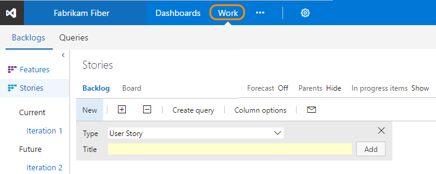

# About Agile tools and Agile project management 

You plan and track your project using the suite of Agile tools you access from the web portal. Agile tools support the core Agile methods&mdash;Scrum and Kanban&mdash;used by software development teams today. Scrum tools support defining and managing work within sprints, setting capacity, and tracking tasks. Kanban tools allow you to manage a continuous flow of work via an interactive sign board.  

You access all Agile tools from the **Work** hub. If you're new to Agile, see [What is Agile?](https://www.visualstudio.com/learn/what-is-agile/) for an overview.

  

Most Agile tools are [scoped to a team](about-teams-and-settings.md). This supports team autonomy as well as scaling the system.  

Backlogs

- [Product backlog](backlogs/create-your-backlog.md)   
- [Portfolio (Epics, Features) backlogs](backlogs/define-features-epics.md)   
- [Sprint backlogs](scrum/sprint-planning.md)     

Task boards

- [Task boards](scrum/task-board.md)   
- [Sprint burndown](scrum/sprint-burndown.md)   
- [Capacity planning](scale/capacity-planning.md)    

Kanban boards
 
- [Kanban board](kanban/kanban-basics.md)   
- [Task checklists](kanban/add-task-checklists.md)   
- [Epics & Features boards](kanban/kanban-epics-features-stories.md)   
 

Other

- [Delivery plans](scale/review-team-plans.md)   
- [Managed queries](track/using-queries.md)  
- [Adhoc queries](../search/workitem/get-started.md)  
- [Velocity](scrum/velocity-and-forecasting.md)   
- [Forecasting](scrum/velocity-and-forecasting.md)      
   

>[!NOTE]
>To understand the differences between several backlogs and boards, see [Backlogs, boards, and plans](backlogs-boards-plans.md). 
 

## Define work items and create your backlog  

You build your project plan by creating a backlog of work items that represent the features, requirements, user stories, or other work to perform. Portfolio backlogs provide support for organizing work in a hierarchical fashion and tracking major product initiatives or scenarios that rely on many stories or requirements.  Different types of work items help you track different types of work, such as user stories, tasks, bugs, issues, and more. 

## Scrum method and tools 
The Scrum method uses sprints to plan work to perform by a team within a specific time period and cadence. To get started, several sprints are predefined for your team.  If you're new to Scrum, get an overview from [What is Scrum?](https://www.visualstudio.com/learn/what-is-scrum/). 

You can quickly assign work items to a sprint by dragging and dropping them from the product backlog to the sprint. 

## Kanban method and tools
Kanban uses a visual interactive board to plan and show progress using cards. Your Kanban board is fully customizable to support the workflow used by your team.  

You update the status of work by dragging card to another column on the Kanban board. You can even change the order of items as you move a card to a new column.   

## Scale: Manage work across the enterprise

How do you manage work across the enterprise using Agile tools?  How will you scale your Agile tools to support your growing enterprise?  

When you connect to Team Services or an on-premises TFS, you connect to an account or team project collection. Within that collection, one or more team projects may be defined. At a minimum, at least one team project must be created in order to use the system.

When you create your team project, a team of the same name is automatically created. For small teams, this is sufficient.  

However, for enterprise-level organizations, it may be necessary to scale up, to create additional teams and/or team projects. These can be created within the single account or collection.

You can scale your system as needed by adding teams and/or team projects. These can be created within the single account or collection. As your organization grows, your tools can grow to support a [culture of team autonomy as well as organizational alignment](./scale/agile-culture.md). 

<table width="100%">
<tbody valign="top">
<tr>
<td width="40%">
**Single team project, team defined within an account/collection**  
  
</td>

<td width="60%">
**Multiple team projects and teams defined within an account/collection**   
  

</td>
</tr>
</tbody>
</table>
 

To learn more, see the following topics:  

- [Scale Agile to large teams](https://www.visualstudio.com/learn/scale-agile-large-teams/)
- [About teams and Agile tools](about-teams-and-settings.md) 
- Manage a [portfolio of backlogs](./scale/portfolio-management.md) and gain insight into each team's progress as well as the progress of all programs.  
- Use [Delivery plans](./scale/review-team-plans.md) to review the schedule of stories or features your teams plan to deliver. Delivery plans show the scheduled work items by sprint (iteration path) of selected teams against a calendar view. 
- Incrementally adopt [practices that scale](./scale/practices-that-scale.md) to create greater rhythm and flow within your organization, engage customers, improve project visibility, and develop a productive workforce.
- Structure team projects to gain [visibility across teams](./scale/visibility-across-teams.md) or to support [epics, release trains, and multiple backlogs to support the Scaled Agile Framework](./scale/scaled-agile-framework.md). 

## Try this next  

Take these tools for a test run by [creating an account on Team Services for free](../setup-admin/team-services/sign-up-for-visual-studio-team-services.md). From there, you're ready to [create your backlog](backlogs/create-your-backlog.md).  

Once you've started tracking work, you'll want to monitor and track progress, identify trends, and share your plans. See [Charts, dashboards, and widgets](../report/overview.md). 

## Related notes

You access tools provided by Team Services and TFS by connecting from a client to the server, either in the cloud or on-premises. Some web portal tools require additional Visual Studio Subscriptions or Advanced/VS Enterprise access.  To learn more, see [Permissions and access for work tracking](permissions-access-work-tracking.md). 

See the [Feature index](../alm-devops-features.md) for an end-to-end overview of all Team Services and TFS features.  

For an overview of all your customization options, see [Customize your work tracking experience](./customize/customize-work.md). 

### Work across team projects 
  
If you work in Team Services or TFS 2017.1 or later version, you can use your account hub to view and quickly navigate to teams, team projects, branches, work items, pull requests and other objects that are relevant to you. For details, see [Work effectively from your account hub](../connect/account-home-pages.md).  

### Feedback and support  

We welcome your feedback. 

Send suggestions on **[UserVoice](https://visualstudio.uservoice.com/forums/330519-team-services)**, and follow us on **[Twitter](https://twitter.com/VSTeam) @VSTeam**. 

See also our [comprehensive feedback and support page](../provide-feedback.md).  

 