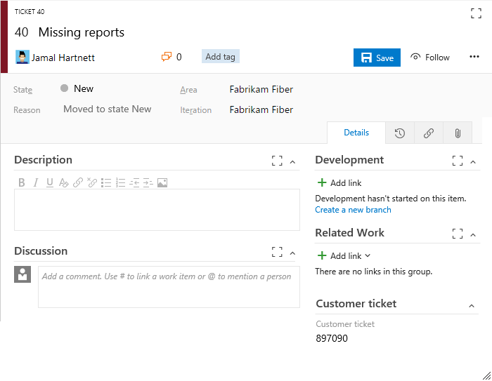
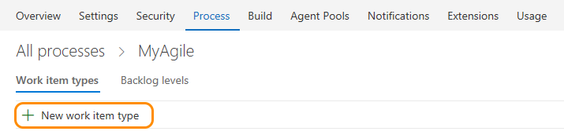
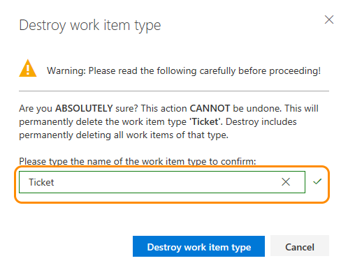

# Customize a work item type (Inheritance process model)    

[!INCLUDE [temp](../_shared/process-feature-availability.md)]

You use different work item types (WITs) to plan and track different types of work. Your team project contains 9 or more WITs that you can customize, based on the process&mdash;[Agile](../guidance/agile-process.md), [Scrum](../guidance/scrum-process.md), or [CMMI](../guidance/cmmi-process.md)&mdash;used to create your team project. Also, you can add a custom WIT to support additional tracking requirements. 

For example, you may want to capture customer issues in a custom Ticket WIT.   

 

##What you can customize   

Each process you create inherits the WITs provided with the parent system process&mdash;[Agile](../guidance/agile-process.md), [Scrum](../guidance/scrum-process.md), or [CMMI](../guidance/cmmi-process.md). For example, the Agile process provides bug, task, user story, feature, epic, issue and test-related WITs. 

You can add fields and modify the workflow and form for all inherited WITs that display on the Work Item Types page. If you don't want users to use a WIT, you can disable it. In addition, you can add custom WITs. 

>[!NOTE]  
>For a list of limits placed on the number of fields, work item types, backlog levels, and other objects you can customize, see [Work tracking object limits](../customize/object-limits.md). 

Here are your customization options for inherited and custom WITs. 

 **Inherited WITs:**

- [Add/remove custom fields](customize-process-field.md)   
- [Add/remove custom groups](customize-process-form.md#groups)    
- [Add/delete custom pages](customize-process-form.md#pages)    
- [Add/remove a custom control](custom-controls-process.md)     
- [Hide a workflow state](customize-process-workflow.md#hide-state)   
- [Enable/disable](#enable-disable)  

 

**Custom WITs:**

- [Add custom WIT](#add-wit)   
- [Change color, icon or description](#overview)     
- [Add/remove custom fields](customize-process-field.md)   
- [Add/remove custom groups](customize-process-form.md#groups)    
- [Add/delete custom pages](customize-process-form.md#pages)    
- [Add/remove a custom control](custom-controls-process.md)     

&nbsp;&nbsp;&nbsp;

- [Add, edit, or remove a workflow state](customize-process-workflow.md#states)   
- [Enable/disable](#enable-disable)   
- [Delete](#destroy)  

 

To perform any of these actions, you must be a member of the Project Collection Administrators group or be [granted explicit permissions to edit a specific process](manage-process.md#process-permissions). 

**What you can't customize**  
- You can't add or remove an inherited WIT to or from a backlog  
- You can't change the position of an inherited field within the form layout
- You can't remove the inherited portfolio level from the product (but you can rename them)
- You can't change the name of a custom WIT.

## Open Process>Work Item Types in the admin context

To customize the web form, you must work from the admin context Process hub. 

You can open the admin context Process hub from a work item form or by choosing the Account Settings option from the gear option. For details, see [Customize a process, Start customizing](customize-process.md#start-customizing).

>[!IMPORTANT]  
>If you don't see the Account settings option, then you are working from an on-premises TFS. The Process page isn't supported. You must use the features supported for the On-premises XML process model as described in [Customize your work tracking experience](../customize/customize-work.md).

## Add a work item type

0. From the Work Item Types page, click  New work item type.

	
 
0. Name the WIT and optionally specify a description, icon and color. The icon and color you specify will appear throughout the web portal, including on the work item form and when associated work items appear on a backlog, boards, query results, and more. Click Create to save. 

	 

	Each new WIT comes predefined with a Details page with the Description field, and Discussion, Development, and Related Work groups. Also added, but not shown nor editable, are the standard elements included with the header of the form as shown in the following image, as well as the history, links, and attachment pages. 
 
	 

0.   From the Layout page, you can add fields, groups, or pages to specify the form and fields you want to track. For details, see [Customize a field](customize-process-field.md) or [Customize a web form for a process](customize-process-form.md).    

	 	

0. Open the States page to view the default workflow states. Optionally, [customize the workflow states](customize-process-workflow.md). 

0.  Optional. To add the WIT to a backlog, see [Customize your backlogs or boards for a process](customize-process-backlogs-boards.md). By default, custom WITs aren't added to any backlog. To learn more about different backlog levels, see [Backlogs, boards, and plans](../backlogs-boards-plans.md).   

0. Verify the custom work item type appears as expected. Either navigate to the backlog or board to which you added the custom WIT, or open the Work hub menu and open a new work item of the type you added.  

	 

	If you don't see the custom WIT, refresh your browser to make sure it registers all the custom changes you've made. 

## Change description, icon or color of a custom WIT 

To change the description, icon or color of a custom WIT, choose Edit from the WIT context menu. 

Here we change the description, icon and color for the Ticket custom WIT.  

 

## Enable or disable a custom WIT  

You can disable a custom WIT which will prevent users from being able to add new work items using it. However, all existing work items defined using the custom WIT remain in the data store.  

You may want to disable a custom WIT until you have defined all the fields, workflow, and form layout that you have planned.

To disable a custom WIT, choose Disable from the WIT context menu. 

To re-enable the WIT, choose Enable from the WIT context menu. 

>[!NOTE]  
>Disabling a WIT will remove the work item type from the New drop down and add experiences. Creating a work item of that WIT will also be blocked via REST APIs.  
>
>No changes are made to existing work items of that type. You can update or delete them and they will continue to appear on backlogs and boards. Also, you can change the work item type of disabled WITs to an enabled type, but you can't change the type to a disabled WIT.

## Related notes  

As you customize a WIT, all team projects that reference the inherited process that you're customizing will automatically update to reflect the custom WITs you've added. To view your customizations, refresh your web browser.  

To customize a single team project, always start by [creating an inherited process and migrating the team project to that process](manage-process.md). Then, all the customizations that you make to the inherited process automatically appear for the team project you migrated.  

Additional topics of interest:  

- [Customize a field](../process/customize-process-field.md)  
- [Customize a form](../process/customize-process-field.md)
- [Customize a workflow for a work item type](../process/customize-process-field.md)
- [Customize a process](../process/customize-process-field.md) 
- [Customize your backlogs or boards for a process](customize-process-backlogs-boards.md)  
- [Backlogs, boards, and plans](../backlogs-boards-plans.md)  
- [Work tracking object limits](../customize/object-limits.md)

### Delete or destroy a custom WIT 

>[!IMPORTANT]  
>Destroying a WIT will delete all work items and data associated with that WIT, including historical values. Once destroyed, you can't recover the data. 

1. To completely remove a custom WIT and all work items based on that WIT, click the Destroy option from the WIT context menu.

	To destroy a WIT, you must be a member of the Project Collection Administrators group or be [granted explicit permissions to edit a specific process](manage-process.md#process-permissions). 

2. To complete the delete operation, you must type the name of the WIT as shown. 

	  
 

[!INCLUDE [temp](../_shared/help-support-shared.md)]

[!INCLUDE [temp](../_shared/custom-help.md)]

<!---
### WIT extensibility

Using REST APIs you can add .... 

-->

