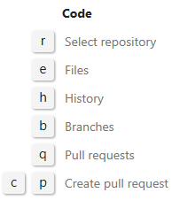
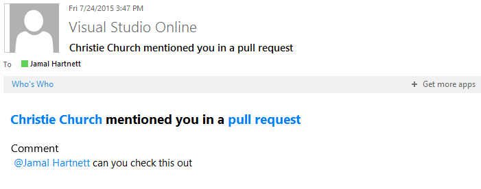
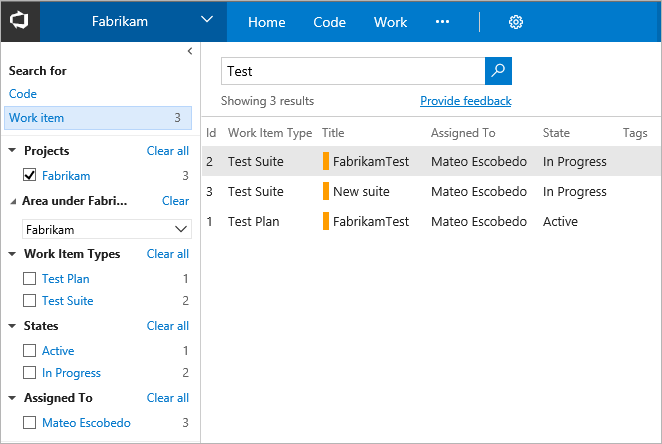

# Productivity tips

[!INCLUDE [temp](../_shared/dev15-version-header.md)]  

Productivity is all about producing more value in less time. You can use the tips below to work more quickly and efficiently as you work in Visual Studio Team Services or the web portal for Team Foundation Server (TFS).  

>[!NOTE]  
>**Feature availability:**&#160;&#160;The following tools and tasks are available from Team Services (cloud service) or from the web portal of the listed on-premises TFS version or a later version. Those not annotated are available from all platforms and versions. Visit the [Visual Studio Downloads page](https://www.visualstudio.com/downloads/download-visual-studio-vs) to get the latest TFS update. Additional resources may be required as annotated. To determine your platform or TFS version, see [Platform and version support](../../provide-feedback.md#platform-version). 

Here are some of the types of productivity tools and tasks that you can access:  

Quick add or update work items

<ul style="padding-left:30px;font-size:90%">
<li style="margin-bottom:1px">[Backlog items](../backlogs/create-your-backlog.md)&#160;1 </li>
<li style="margin-bottom:1px">[User stories or backlog items](../kanban/kanban-basics.md) &#160;1, 2 </li>
<li style="margin-bottom:1px">[Features or epics](../kanban/kanban-epics-features-stories.md)&#160;1, 2 (TFS 2015.2)</li>
<li style="margin-bottom:1px">[Task checklists](../kanban/add-task-checklists.md) (TFS 2015.1)</li>
<li style="margin-bottom:1px">[Work item templates](work-item-template.md)</li>
<li style="margin-bottom:1px">[Inline tests](../kanban/add-run-update-tests.md)&#160; 2 (TFS 2017)</li>
<li style="margin-bottom:1px">[Git branch linked to work items](../backlogs/connect-work-items-to-git-dev-ops.md) (TFS 2017)</li>
</ul>

Follow

<ul style="padding-left:30px;font-size:90%">
<li style="margin-bottom:1px">[Follow a work item](#follow) (TFS 2017)</li>
<li style="margin-bottom:1px">[Follow a pull request](#follow-pr) (TFS 2017.1)</li>
<li style="margin-bottom:1px">[Manage work items you're following](../../collaborate/follow-work-items.md) (TFS 2017)</li>
<li style="margin-bottom:1px">[View work items you're following across team projects](../../connect/account-home-pages.md#follow-work) (TFS 2017.1)</li>
</ul>

Favorites

<ul style="padding-left:30px;font-size:90%">
<li style="margin-bottom:1px">[Favorite a query](../track/using-queries.md#favorite-query) (TFS 2017)</li>
<li style="margin-bottom:1px">[Favorite a team or team project](../../connect/account-home-pages.md#favorites) (TFS 2017.1)</li>
<li style="margin-bottom:1px">[Favorite a branch or repository](../../connect/account-home-pages.md#favorites) (TFS 2017.1)</li>
<li style="margin-bottom:1px">[Favorite a build definition](../../connect/account-home-pages.md#favorites) (TFS 2017.1)</li>
<li style="margin-bottom:1px">[Favorite team plans](../../connect/account-home-pages.md#favorites) (TFS 2017.1)</li>
<li style="margin-bottom:1px">[View and manage favorites](../../connect/account-home-pages.md#favorites) (TFS 2017.1)</li>
</ul>

Bulk add or update work items

<ul style="padding-left:30px;font-size:90%">
<li style="margin-bottom:1px">[Bulk modify (web portal)](../backlogs/bulk-modify-work-items.md)</li>
<li style="margin-bottom:1px">[Bulk add or remove tags](../track/add-tags-to-work-items.md#bulk-modify) (TFS 2015.2)</li>
<li style="margin-bottom:1px">[Bulk add or modify with Excel](../office/bulk-add-modify-work-items-excel.md) &#160; 3</li>
<li style="margin-bottom:1px">[Bulk add or modify with Project](../office/create-your-backlog-tasks-using-project.md)&#160; 3  </li>
</ul>

@mention, notifications and alerts 

<ul style="padding-left:30px;font-size:90%">
<li style="margin-bottom:1px">[@mention to notify a team member](#mention-person-id)  (TFS 2015.2)</li>
<li style="margin-bottom:1px">[Work item discussions](../concepts/work-item-form-controls.md#discussion) (TFS 2017)</li>
<li style="margin-bottom:1px">[Manage personal notifications](../../collaborate/manage-personal-notifications.md) (TFS 2017.1)</li>
<li style="margin-bottom:1px">[Manage team notifications](../../collaborate/manage-team-notifications.md) (TFS 2017.1)</li>
<li style="margin-bottom:1px">[Set personal or team alerts, get notified of changes](../track/alerts-and-notifications.md) (TFS)</li>

</ul>

Quick navigation (TFS 2017.1)

<ul style="padding-left:30px;font-size:90%">
<li style="margin-bottom:1px">[Team projects](../../connect/account-home-pages.md)</li>
<li style="margin-bottom:1px">[My Favorites](../../connect/account-home-pages.md) </li>
<li style="margin-bottom:1px">[Work items assigned to me](../../connect/account-home-pages.md)</li>
<li style="margin-bottom:1px">[Pull requests relevant to me](../../connect/account-home-pages.md)</li>
<li style="margin-bottom:1px">[Work I'm following](../../connect/account-home-pages.md)</li>
</ul>

Quick links

<ul style="padding-left:30px;font-size:90%">
<li style="margin-bottom:1px">[#ID control to link a pull request to a work item](#mention-wit-id) (TFS 2017)</li>
<li style="margin-bottom:1px">[#ID control in discussions, and commit, changeset, and shelveset comments](#mention-wit-id)  (TFS 2015.2)</li>
<li style="margin-bottom:1px">[Map backlog items (parent-child links)](../backlogs/organize-backlog.md) </li>
</ul>

Search

<ul style="padding-left:30px;font-size:90%">
<li style="margin-bottom:1px">[Work item search box](#quick-find-search-box)</li>
<li style="margin-bottom:1px">[Ad-hoc search](#adhoc-search) 4 (Team Services)</li>
<li style="margin-bottom:1px">[Code search](#quick-find-code) 5 (TFS 2017)</li>
<li style="margin-bottom:1px">[Query by date or current sprint](../track/query-by-date-or-current-iteration.md)</li>
<li style="margin-bottom:1px">[Query by workflow or Kanban board column](../track/query-by-workflow-changes.md) (TFS 2015.1)</li>
</ul>

Keyboard shortcuts

<ul style="padding-left:30px;font-size:90%">
<li style="margin-bottom:1px">[Global and hub-specific shortcuts](../../reference/keyboard-shortcuts.md) (TFS 2015.2)</li>
<li style="margin-bottom:1px">[Web portal navigation shortcuts](../../reference/keyboard-shortcuts.md)</li>
<li style="margin-bottom:1px">[Team Explorer](../../reference/keyboard-shortcuts.md)</li>
<li style="margin-bottom:1px">[Test Manager](https://msdn.microsoft.com/library/ff458183.aspx)</li>
<li style="margin-bottom:1px">[Frequently used commands - Visual Studio](http://msdn.microsoft.com/library/dn600331.aspx) </li>
<li style="margin-bottom:1px">[Visual Studio defaults](http://msdn.microsoft.com/library/da5kh0wa.aspx)</li>
<li style="margin-bottom:1px">[Customize Visual Studio shortcuts](http://msdn.microsoft.com/library/5zwses53.aspx)</li>
</ul>

**Notes:**  
1. Use the quick add panel from the backlog pages to add user stories, requirements, or other backlog items. 
2. Use the Kanban board to quickly add and update the status of items. Also, you support traceability by adding inline items, such as tasks and test cases, which are automatically linked as child items to the parent work items.  
3. Requires that you have installed a compatible version of Office Excel or Project (Office 2010 or later) and [Visual Studio (2010 or later)](https://www.visualstudio.com/downloads/download-visual-studio-vs) or the [Team Foundation Server Standalone Office Integration 2015 (free)](https://www.visualstudio.com/downloads/#team-foundation-server-office-integration-2015-update-3-1).
4. Adhoc work item searches requires you to install the [Work item search extension](https://marketplace.visualstudio.com/items?itemName=ms.vss-workitem-search) which is in preview and currently supported for Team Services. 
4. Code search requires you to install the [Code search Marketplace extension](https://marketplace.visualstudio.com/items?itemName=ms.vss-code-search).  

##Keyboard shortcuts

>[!NOTE]  
><b>Feature availability: </b>Global and hub-specific keyboard shortcuts are only available from Team Services or the web portal for TFS 2015.2 or later version.   

Type **?** to access the [Global and hub-specific shortcuts](../../reference/keyboard-shortcuts.md). Each hub will display shortcuts that work specifically within the selected hub.  

<table>
<tbody valign="top">
<tr>
<td></td>
<td></td>
<td></td>
</tr>
</tbody>
</table>

## Discussion and link controls

The **@mention** control allows you to quickly pull someone into a discussion.  The **#ID** control quickly links the object you're working in to a work item based on its ID.

###Alert a team member about a change - @mentions control 

>[!NOTE]    
><b>Feature availability: </b>The **@mention** special control is currently supported only from Team Services or the web portal for TFS 2015.2 or later version. For on-premises TFS, [you must configure an SMTP sever](../../setup-admin/tfs/admin/setup-customize-alerts.md) in order for team members to receive notifications.    

When leaving a code comment in a pull request, you can type **@** to trigger the **@mention** identity picker. From the identity selector, you'll see a list of those people that you have you've recently mentioned. You can choose one of those names or type in the name of the person you are looking for to perform a directory search.  

To filter the list, enter the user name or alias until you've found a match.

 

To **@mention** a user you've never selected previously, just continue typing to perform your search against the full directory.  

Names of those that you mention appear in blue text. Click the **@mention link name** to open the user's contact card, which can provide you additional context for why they were pulled into the conversation.  

 

Upon completion of your selection and text entry, your **@mention** user will receive an email alerting them about the mention.  

 

When viewing their own mentioned names in conversations, users will notice that their own name is are highlighted in orange text.  

 

You can use the **@mention** control in pull request discussions, commit comments, changeset comments, and shelveset comments. You can also use the **@mention** control in the [Discussion section of work item forms](../concepts/work-item-form-controls.md#discussion). 

### Use the #ID control to link to work items 

>[!NOTE]  
><b>Feature availability: </b>The **#ID** special control is currently supported only from Team Services or the web portal for TFS 2015.1 or later version.    

When leaving a code comment in a pull request, you can type **#** to trigger the **#ID** work item picker. The picker displays a list of 50 work items that you have recently modified or that are assigned to you. 

You can narrow the list of suggested work items by entering keywords that match the work item type, ID, or title, or you can enter the exact work item ID.

     

To further filter the list, continue entering keywords until you've found a match. You can enter up to five keywords.   

**Team Services and TFS 2015.2**

You can also use the **#ID** control in pull request discussions, commit comments, changeset comments, and shelveset comments.

## Follow a work item or pull request  

>[!NOTE]  
><b>Feature availability: </b>The follow work item feature is currently available from Team Services or the web portal for TFS 2017.  

[!INCLUDE [temp](../_shared/follow.md)]

##Follow a pull request 

>[!NOTE]  
><b>Feature availability: </b>The follow pull request feature is currently available from Team Services or the web portal for TFS 2017.1.  

[!INCLUDE [temp](../_shared/follow-pr.md)]

##Pre-populate often used work items with work item templates  
[Creating a work item template](work-item-template.md) saves your team time by pre-populating the work item with values that the team uses most often. For example, you can create a template that specifies various default values for a bug.    

Provide the team a hyperlink to this template and you save every team member from having to specify the circled fields in the form.  

#### Bug work item form with pre-populated fields (Team Services, TFS 2017) 

The following image shows a new bug form opened from a work item template. The new web form is available from Team Services and TFS 2017 [once the admin has enabled it](../customize/manage-new-form-rollout.md).  

 

####Bug work item form with pre-populated fields (TTFS 2015) 

The following image shows a new bug form opened from a work item template from the web portal of TFS 2015.

 

##Quick find or access

###Quick find using the work item search box
Using the work items search box, you can quickly [find work items based on ID, assignment, changed date, or keyword](../track/search-box-queries.md). To find by ID, simply enter the ID into the search work items box.  

<table>
<tbody valign="top">
<tr>
<td>

Enter or select one or more of the following shortcut identifiers:

&nbsp;&nbsp;&nbsp;**A** =for **A**ssigned To, (for example, A:Annie or A=@Me).

&nbsp;&nbsp;&nbsp;**C** for = **C**reated By, (for example, C:Peter or C=@Me).

&nbsp;&nbsp;&nbsp;**S** for = **S**tate, (for example, S=New). 

&nbsp;&nbsp;&nbsp;**T** for = Work Item **T**ype, (for example, T=Task or T=Bug).

Use the **@Me** macro to specify your username or account alias.

Use the **=**, **:**, and **–** operators to specify the operations **Equals**, **Contains**, and **Not**, respectively. 

</td>
<td>
  
</td>
</tr>
</tbody>
</table>

###Adhoc work item search 

With the [Work item search extension](https://marketplace.visualstudio.com/items?itemName=ms.vss-workitem-search). installed, the work item search box changes to support an adhoc search query. It opens to a set of search results similar to that shown below. To learn more, see [Adhoc vs managed work item queries](../track/adhoc-vs-managed-queries.md) and [Rich work item search results](../../search/workitem/search-results.md).

  

###Find code in Git repositories  

You can perform similar [searches on your code based on keywords and semantic search filters across your Git repositories](../../search/overview.md).  

   

###Quick access using dashboards  

You can quickly access code, builds, and work items when you [add widgets and charts to your team dashboard](../../Report/dashboards.md). In addition, you can quickly open a page, create work items, or access additional tools from one of several [widgets](../../report/widget-catalog.md) that you add to a dashboard.  

 

## Related notes

You may find additional tools to enhance your productivity within the [Marketplace for VS Team Services](https://marketplace.visualstudio.com/VSTS).

To update your on-premises TFS, visit the [Visual Studio downloads page for Team Foundation Server](https://www.visualstudio.com/downloads/#team-foundation-server-2017). 

- [Visibility across teams](../scale/visibility-across-teams.md)
- [Review team plans](../scale/review-team-plans.md)  
- [Work item templates](work-item-template.md)
- [Collaborate overview](../../collaborate/overview.md)

