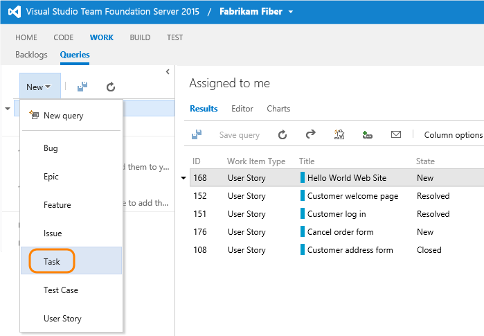
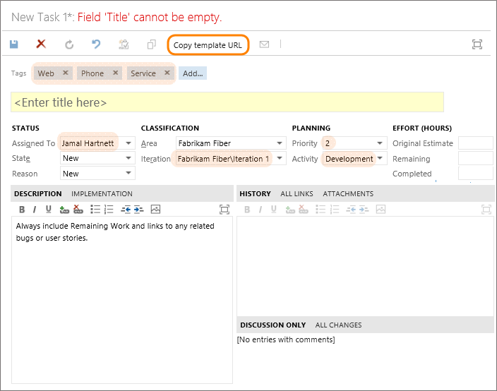
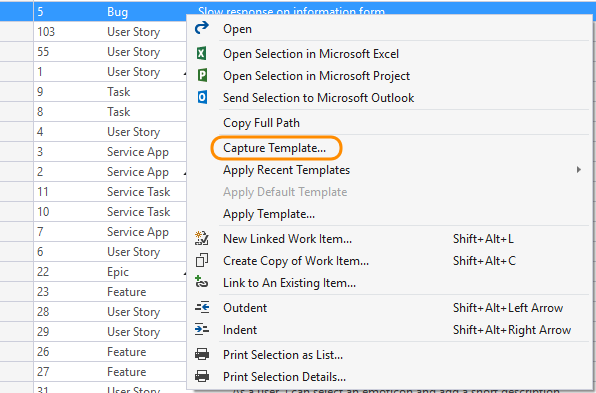
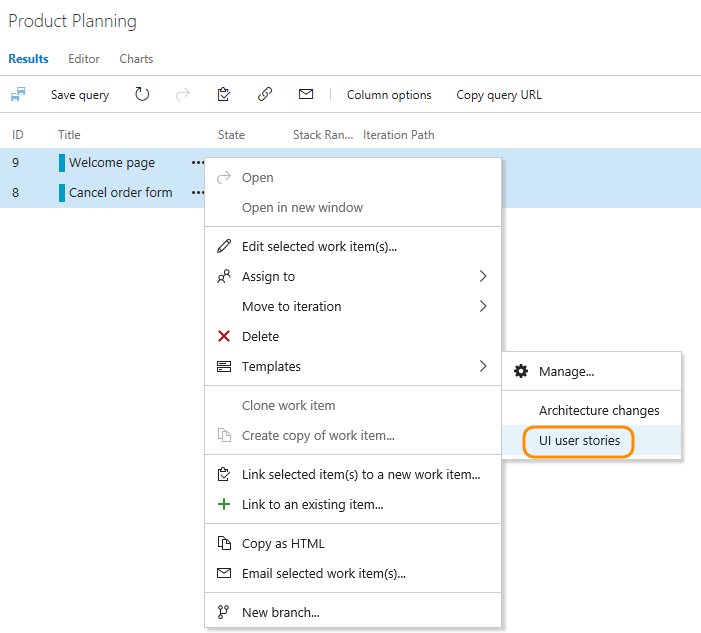
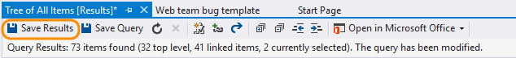

# Use templates to add and update work items 

<!--- Supports FWLINK http://go.microsoft.com/fwlink/?LinkId=824070 -->

<b>Team Services | TFS 2017 | TFS 2015 | TFS 2013 | Visual Studio 2015 | Visual Studio 2013 </b>  

With work item templates you can quickly create work items which have pre-populated values for your team's commonly used fields. For example, you can create a task template that will set the area path, iteration path, and discipline or activity whenever you use it to create a task.  

>[!NOTE]  
>Work item templates are distinct from process templates. For information on process templates, see [Choose a process template](../guidance/choose-process.md) or these specific topics for the default process templates: [Agile](../guidance/agile-process.md), [Scrum](../guidance/scrum-process.md), or [CMMI](../guidance/cmmi-process.md). 

Based on the platform or version you use, you can perform the following tasks. 

<table width="85%">
<tr>
<th width="30%">Task </th>
<th width="15%" align="center" valign="bottom">Team Services</th>
<th width="15%" align="center" valign="bottom">TFS 2013, TFS 2015 (web portal)</th>
<th width="15%" align="center" valign="bottom">TFS 2017 (web portal)</th>
<th width="20%" align="center" valign="bottom">VS 2013, VS 2015  (with power tools 1) </th>
</tr>

<tbody align="center" valign="top" style="font-size: 95%">

<tr>
<td align="left">[Capture a work item as a template](#capture)</td>
<td></td>
<td></td>
<td></td>
<td></td>
</tr>

<tr>
<td align="left">[Add a work item using a template](#add-wi)</td>
<td></td>
<td></td>
<td></td>
<td></td>
</tr>

<tr>
<td align="left">[Apply templates to work items](#apply)</td>
<td></td>
<td> </td>
<td></td>
<td></td>
</tr>

<tr>
<td align="left">[Manage work item templates](#manage)</td>
<td></td>
<td> </td>
<td></td>
<td></td>
</tr>
</tbody>
</table>

1. If you want to manage work item templates in Visual Studio 2013 or Visual Studio 2015, you can by downloading [TFS Power Tools](https://visualstudiogallery.msdn.microsoft.com/898a828a-af00-42c6-bbb2-530dc7b8f2e1) for free. With the Work Item Templates power tool add-in, you can:
	- Create and edit work item templates  
	- Create and update work items using a template  
	- Create a template from an existing work item  
	- Bulk-edit work items by applying a template  
	- Use templates created in Visual Studio to create work items through the Visual Studio client.  
	
>[!NOTE]  
><b>Feature availability: </b>Visual Studio 2015 is the last version in which you can install TFS power tools. You can use the Work Item Templates tool whenever you connect to Team Services or an on-premises TFS that is at TFS 2015 version or earlier. Templates you define through the power tool are separate from those defined through Team Services.   

## Template guidance and usage 

Prior to creating templates, consider how you and your team(s) will use the templates. If you'll be using several templates, determine a naming convention that will help users easily select the right template for their use. 

If you want to use custom fields in your templates, define those fields prior to creating your templates. See [Customize a field for a process](../process/customize-process-field.md) for Team Services, and [Add or modify a field](../customize/add-modify-field.md) for on-premises TFS. 

You can specify any number of fields you want, including ones that the user will change&mdash;such as Title or Description. If you want the work item assigned to a specific team, define the team Area Path as part of the template.  

Once you have a template defined, you can share it via email or a dashboard. Copy the link to the template and paste it within a markdown widget or through the Welcome page. See [Markdown guidance](../../reference/markdown-guidance.md).  

 
## Capture a work item as a template

The steps to capture a work item differ based on the platform, version, and client you use.  

<ul class="nav nav-pills" style="padding-right:15px;padding-left:15px;padding-bottom:5px;vertical-align:top;font-size:18px;">

<li style="float:left;" data-toggle="collapse" data-target="#capture">Capture a work item as a template </li>
<li style="float: right;"><a style="max-width: 374px;min-width: 120px;vertical-align: top;background-color:#AEAEAE;margin: 0px 0px 0px 8px;min-width:90px;color: #fff;border: solid 2px #AEAEAE;border-radius: 0;padding: 2px 6px 0px 6px;outline-style:none;height:32px;font-size:12px;font-weight:400" data-toggle="pill" href="#team-explorer-capture">VS 2013, VS 2015</a></li>
<li style="float: right;"><a style="max-width: 374px;min-width: 120px;vertical-align: top;background-color:#AEAEAE;margin: 0px 0px 0px 8px;min-width:90px;color: #fff;border: solid 2px #AEAEAE;border-radius: 0;padding: 2px 6px 0px 6px;outline-style:none;height:32px;font-size:12px;font-weight:400" data-toggle="pill" href="#tfs-portal-capture">TFS 2013, TFS 2015</a></li>
<li class="active" style="float: right"><a style="max-width: 374px;min-width: 120px;vertical-align: top;background-color:#007acc;margin: 0px 0px 0px 0px;min-width:90px;color: #fff;border: solid 2px #007acc;border-radius: 0;padding: 2px 6px 0px 6px;outline-style:none;height:32px;font-size:12px;font-weight:400" data-toggle="pill" href="#team-services-capture">Team Services & TFS 2017</a></li>
</ul>
 

 
<ol><li> 

Open a work item with the fields defined that you want to capture, and click the  actions icon to open the menu. Choose Templates and then Capture.     
   
   

</li>
<li> 

Name the template and optionally add and remove fields. Save the template when finished.

 
</li>
<li> 

Once you've saved the template, click Copy link to capture the URL for the template that you can use to add work items using the template.
 

The URL identifies the team and template ID, for example:
 

<pre><code>http://fabrikamfiber:8080/tfs/DefaultCollection/Fabrikam%20Fiber/Web/_workItems?_a=new&witd=Bug&templateId=15ffa521-7a1d-486e-9f71-a58c0b338d87
</code></pre>
</li>
<li>
Use the URL whenever you want to add a work item of the type you've defined with its predefined values.

You can save the URL as a text file or add the URL to a [dashboard](#markdown-widget) or web page as a hyperlink.

</li>
</ol>

If you connect to an on-premises TFS and primarily create work items working in the web portal, you can create a hyperlink that captures the default values you specify for a template. Click the hyperlink, and it opens the template in the web portal.  

<ol>
<li>
From the web portal Queries page, open a new work item.

    
</li>
<li>
Fill in the default values you want the template to specify. You can leave required fields empty, or place some text in them.

Here, we fill in several values, including tags, but leave the Title blank. When your done, copy the URL for the template.

    
</li>
<li>
The URL defines each predefined field, for example (line breaks added for clarity):

<pre><code>http://fabrikamprime:8080/tfs/DefaultCollection/Fabrikam%20Fiber/_workItems/create/Task?%5B
   System.AssignedTo%5D=Jamal+Hartnett&%5B
   System.Description%5D=%3Cp%3EAlways+include+Remaining+Work+and+links+to+any+related+bugs+or+user+stories.%3C%2Fp%3E&%5B
   System.Tags%5D=Web%3B+Phone%3B+Service&%5B
   Microsoft.VSTS.Common.Activity%5D=Development&%5B
   System.IterationPath%5D=Fabrikam+Fiber%5CIteration+1  
</code></pre>

	<blockquote>**Tip:** 
	The URL won't contain defaults defined for the work item type. To specify a default field value, see [Add or modify a field](../customize/add-modify-field.md). Also, there's a 2000 character limit recognized by browsers. There's no work around to that limit.</blockquote>  
</li>
<li>
Use the URL whenever you want to add a work item of the type you've defined with its predefined values.

You can save the URL as a text file or add the URL to a [dashboard](#markdown-widget) or web page as a hyperlink.

</li>
</ol>

If you primarily work in Visual Studio or Team Explorer, and want to create work items from templates that you can access from the Work Items page, you can create work item template files (extension .wt).

You create these files using Work Item Templates, a power tool for Visual Studio, which you can download from [TFS Power Tools](https://visualstudiogallery.msdn.microsoft.com/898a828a-af00-42c6-bbb2-530dc7b8f2e1).

<ol>
<li> 
Open or run a query that lists the work item whose fields you want to capture.
</li> 
<li> Right-click the work item of the type and whose fields you want to capture, and select Capture Template from the context menu.

</li>

<li>
In the dialog, use the checkboxes to select all the fields you want to save in the template, and add a name and (optionally) description to the template.

</li> 
<li>
Save the template and it will appear in the root of the Team Explorer pane under the Templates section.
</li>  

</ol>

  

## Add a work item using a template  

The main method for adding a work item using a template is to open the template link within a browser window. You can then share these links through email, a network share, team portal, or a team dashboard or Welcome page.  

### Copy the link to a template 

<ul class="nav nav-pills" style="padding-right:15px;padding-left:15px;padding-bottom:5px;vertical-align:top;font-size:18px;">
<li style="float:left;" data-toggle="collapse" data-target="#copy-link">Copy template link </li>
<li style="float: right;"><a style="max-width: 374px;min-width: 120px;vertical-align: top;background-color:#AEAEAE;margin: 0px 0px 0px 8px;min-width:90px;color: #fff;border: solid 2px #AEAEAE;border-radius: 0;padding: 2px 6px 0px 6px;outline-style:none;height:32px;font-size:12px;font-weight:400" data-toggle="pill" href="#team-explorer-copy-link">VS 2013, VS 2015</a></li>
<li style="float: right;"><a style="max-width: 374px;min-width: 120px;vertical-align: top;background-color:#AEAEAE;margin: 0px 0px 0px 8px;min-width:90px;color: #fff;border: solid 2px #AEAEAE;border-radius: 0;padding: 2px 6px 0px 6px;outline-style:none;height:32px;font-size:12px;font-weight:400" data-toggle="pill" href="#tfs-portal-copy-link">TFS 2013, TFS 2015</a></li>
<li class="active" style="float: right"><a style="max-width: 374px;min-width: 120px;vertical-align: top;background-color:#007acc;margin: 0px 0px 0px 0px;min-width:90px;color: #fff;border: solid 2px #007acc;border-radius: 0;padding: 2px 6px 0px 6px;outline-style:none;height:32px;font-size:12px;font-weight:400" data-toggle="pill" href="#team-services-copy-link">Team Services & TFS 2017</a></li>
</ul>
 

 
<ol><li> 

Click the  actions icon and choose Copy link.     
   
   

</li>
<li> 

Copy the link to a shared network or send to your team via email. Also, consider [adding a link the team dashboard](#markdown-widget).  

The link is a URL to the web portal, for example:
 

<pre><code>http://fabrikamfiber:8080/tfs/DefaultCollection/Fabrikam%20Fiber/Web/_workItems?_a=new&witd=Bug&templateId=15ffa521-7a1d-486e-9f71-a58c0b338d87
</code></pre>
</li>
<li>
Use the URL whenever you want to add a work item of the type you've defined with its predefined values.

You can save the URL as a text file or add the URL to a web page as a hyperlink.

</li>
</ol>

See [Capture a work item as a template for TFS web portal](#capture).   

 
<ol>
<li> 
You can copy the link to a template which will open in the web portal, by opening the context menu for the template.  

</li>

<li>
Paste the copied link into a web browser to check that it works as expected. 

</li> 
 

</ol>

  

 

### Add a template link to the dashboard   

You can add links to a markdown widget that appear on your team dashboard in the web portal. These links open a work item with the template defined fields predefined.

>[!NOTE]   
>**Feature availability:**&#160;&#160;Multiple team dashboards and the Markdown widget are available for Team Services and TFS 2015.2 and later versions. 

For example, the following widget contains links to three templates.  

 

To learn more about the markdown widget see [Add charts and widgets to a dashboard, Markdown widgets](../../report/add-widget-to-dashboard.md#markdown-widget).  

## Apply a template to existing work item(s)  

You can apply a template to a single work item or perform a bulk update of several work items.  

<ul class="nav nav-pills" style="padding-right:15px;padding-left:15px;padding-bottom:5px;vertical-align:top;font-size:18px;">
<li style="float:left;" data-toggle="collapse" data-target="#apply">Apply a template to work items</li>
<li style="float: right;"><a style="max-width: 374px;min-width: 120px;vertical-align: top;background-color:#AEAEAE;margin: 0px 0px 0px 8px;min-width:90px;color: #fff;border: solid 2px #AEAEAE;border-radius: 0;padding: 2px 6px 0px 6px;outline-style:none;height:32px;font-size:14px;font-weight:400" data-toggle="pill" href="#team-explorer-apply">VS 2013, VS 2015</a></li>
<li class="active" style="float: right"><a style="max-width: 374px;min-width: 120px;vertical-align: top;background-color:#007acc;margin: 0px 0px 0px 0px;min-width:90px;color: #fff;border: solid 2px #007acc;border-radius: 0;padding: 2px 6px 0px 6px;outline-style:none;height:32px;font-size:14px;font-weight:400" data-toggle="pill" href="#team-services-apply">Team Services & TFS 2017</a></li>
</ul>
 

 
<h3>Apply a template within a work item form </h3>

<ol><li> 

Open the work item that you want to update using the fields defined within a template, and click the  actions icon to access your menu. Click Templates and then click the name of a pre-defined template.      
   
   
 

<blockquote><b>Tip:</b>
Refresh your browser to discover the latest templates that have been added. If you don't see any templates, it may be that there are none defined for the work item type. Click **Manage&#133;** to open the team settings Templates admin page for your team to review or add templates. </blockquote> 

</li>
<li> 

Save the work item for the changes to be applied. The fields changed are noted in the History field. 

</li>
</ol>

<h3>Apply a template to several work items (bulk update)  </h3>
<ol>
<li>

To bulk update several work items, first select them from the backlog or a query results list, and then open the actions menu for one of them. All work items you select must be of the same work item type. For example, all user stories or all bugs. 
</li>
<li>

Choose the template to apply.
 

</li>
<li>
Field changes are automatically applied and work items saved. To learn more about bulk updates, see [Bulk modify work items](../backlogs/bulk-modify-work-items.md). 

</li>
</ul>

<h3>Apply a template to one or more work items </h3>
<ol>
<li>
Open or run a query that lists the work item(s) whose fields you want to capture.
</li> 
<li>
Right-click the work items&mdash;which must be of the same type&mdash;  and click Apply Template from the context menu.

</li>

<li>
Select the template to use and click OK. 

</li> 
<li>
Save the work item. 

</li> 
</ol>

  

 
## Manage work item templates

For Team Services and TFS 2017 and later versions, you can view the list of templates defined for each work item type, and also add, edit, copy, delete, and copy the link of a template. All templates are defined and managed for a team. 

[!INCLUDE [temp](../_shared/learn-about-new-nav-experience.md)] 

If Visual Studio with power tools installed, you can view the list of templates defined for each work item type, and also add, edit, copy, delete, and copy the link of a template.   

<ul class="nav nav-pills" style="padding-right:15px;padding-left:15px;padding-bottom:5px;vertical-align:top;font-size:18px;">
<li style="float:left;" data-toggle="collapse" data-target="#apply">Manage  templates  </li>
<li style="float: right;"><a style="max-width: 374px;min-width: 120px;vertical-align: top;background-color:#AEAEAE;margin: 0px 0px 0px 8px;min-width:90px;color: #fff;border: solid 2px #AEAEAE;border-radius: 0;padding: 2px 6px 0px 6px;outline-style:none;height:32px;font-size:14px;font-weight:400" data-toggle="pill" href="#team-explorer-manage">VS 2013, VS 2015</a></li>
<li class="active" style="float: right"><a style="max-width: 374px;min-width: 120px;vertical-align: top;background-color:#007acc;margin: 0px 0px 0px 0px;min-width:90px;color: #fff;border: solid 2px #007acc;border-radius: 0;padding: 2px 6px 0px 6px;outline-style:none;height:32px;font-size:14px;font-weight:400" data-toggle="pill" href="#team-services-manage">Team Services & TFS 2017</a></li>
</ul>
 

 

You manage templates from the team admin context. All templates are defined for a team. 

<h3>Open the admin context for your team </h3>

 
<ol><li>

From a web browser, open the web portal administrative context for your team. Here we open the admin page for the Web team.

  

If you're not a team administrator, [get added as one](../scale/add-team-administrator.md). Only team or project administrators can change team templates. 

<li>

Click Templates under the Work hub.
 
  

From here, you can click on any work item type to view or add templates for that type. 
 
</li></ol>

<h3>Manage templates for a work item type  </h3>

Click the work item type to view the templates defined for each type.

For example, click User Story to view templates defined to capture user stories.

  

<h3>Define a template from scratch</h3>  
<ol><li>

From the work item type page, click  New template to create a template from scratch.

  
</li>
<li>
Name the template and optionally add and remove fields. Save the template when finished.

Once you've saved the template, click Copy link to capture the URL for the template that you can use to add work items using the template. 

</li></ol>

<h3>Edit, delete, or copy link to a template </h3>

From the work item type page, click  the actions icon for an existing template to access the menu options to Edit, Delete, or Copy link.

  

<h3>Copy or duplicate a template </h3> 
<ol><li>

To duplicate an existing template, click  the actions icon for an existing template and click Create copy.

  
</li>
<li>

Name the template and optionally add and remove fields. Save the template when finished.

</li></ol>

You manage templates from the Team Explorer pane.
  
  

The root Templates node represents the parent of all of your templates. You may create a directory structure underneath it by adding folders – right-click on the **Templates** node or a folder and select **New Folder** from the context menu.

You can cut, copy, paste, rename, and delete templates and folders using the context menu. You may also drag and drop templates into folders. To edit multiple templates, use shift-click to select a range or ctrl-click to add individual templates to your selection, then right-click.

<h3> Define a template from scratch</h3>  
<ol>
<li>From the Templates section, right-click Templates and choosee to create a template from scratch.
  
</li>
<li>Save the template, provide a Name in the dialog provided.  
  

Once you've saved the template, click Copy link to capture the URL for the template that you can use to add work items using the template.

</li>
</ol>

<h3>Edit, use, copy, or delete a template </h3> 
To edit, delete, or perform another action on a template, open its context menu (right-click) and choose the option you want.  

  

To make frequently-used templates more accessible, you can set a default template for each work item type. To do so, right-click on a template in Team Explorer and click **Set As Default**. A checkmark will appear on the icon to indicate that it is now the default. 

<h3>Set your template directory </h3>  
To change the directory where templates are stored, click the Configure link, or navigate to it via **Tools>Options>Microsoft Team Foundation Server>Work Item Templates**. Use this dialog to set your template store path. Place your templates in a network location to share them with your team.  

  

## Related notes

Using work item templates can help your team be more productive by predefining fields in advanced. Remember that Team Services templates are associated with a team. Only those templates defined for a team are accessible when working in a team context, either through a work item form or bulk update context menu. 

For more information, see these additional resources:

Plan and track work

<ul style="padding-left:10px">
 <li style="margin-bottom:2px">[Add work items](../backlogs/add-work-items.md) (Team Services)</li>
 <li style="margin-bottom:2px">[Add work items](../backlogs/add-work-items-tfs.md) (on-prem TFS)</li>
 <li style="margin-bottom:2px">[Copy or clone a work item](../backlogs/copy-clone-work-items.md#copy-clone)</li>
 <li style="margin-bottom:2px">[Change, move, or delete a work item](../backlogs/remove-delete-work-items.md)</li>
</ul>

Customize (Team Services) 

<ul style="padding-left:30px">
 <li style="margin-bottom:2px">[Customize a process](../process/customize-process.md)</li>
 <li style="margin-bottom:2px">[Work item fields](../process/customize-process-field.md)</li>
 <li style="margin-bottom:2px">[Work item forms](../process/customize-process-form.md)</li>
 <li style="margin-bottom:2px">[Work item workflow](../process/customize-process-workflow.md)</li>
</ul>

Customize (TFS) 

<ul style="padding-left:30px">
 <li style="margin-bottom:2px">[Customize a process template](../process/customize-process.md)</li>
 <li style="margin-bottom:2px">[Work item fields](../customize/add-modify-field.md)</li>
 <li style="margin-bottom:2px">[Work item type](../customize/add-modify-wit.md)</li>

</ul>

### Add or remove tags from templates 

>[!NOTE]  
>**Feature availability**: The ability to add and remove tags from a template is supported from Team Services and TFS 2017 and later versions. 

You can add tags to a template and they'll be applied to the work item when you use the template. 

With Team Services, you can specify tags to be specifically added or removed. 

  

If you don't specify tags to remove, then all tags present in a work item will remain defined even when you apply a work item template to an existing work item. 

### Templates and links to other work items

You can't create templates that contain default links to work items. 

However, you can quickly copy tasks, test cases, bugs, and other items using [Excel](../office/bulk-add-modify-work-items-excel.md) to apply parent-child links in a tree list. To learn more, see:  
- [Add task checklists](../kanban/add-task-checklists.md)
- [Add, run, and update inline tests](../kanban/add-run-update-tests.md) (Team Services only)  
- [Add features and epics](../kanban/kanban-epics-features-stories.md) (Team Services only)  

Another option is to use [Excel](../office/bulk-add-modify-work-items-excel.md) to apply parent-child links in a tree list. 

<!---

If you connect to an on-premises TFS, you can make these additional customizations to a work item form:
- To specify a text string to appear when a field is empty, use the [EmptyText attribute in the FIELD definition](https://msdn.microsoft.com/library/aa337627.aspx).  
- To specify text or a hyperlink within a work item form, use [LabelText and Text XML elements](../reference/labeltext-and-text-xml-elements-reference.md
).  
- To embed a web page or HTML content within a work item form, use the [WebpageControlOptions element](../reference/webpagecontroloptions-xml-elements-reference.md).  
-->