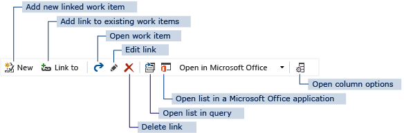

# LinksControlOptions elements (Client and web, TFS 2015) 


<p><b>TFS 2015 | TFS 2013 </b></p>

>[!IMPORTANT]  
>This topic applies to team project customization for the On-premises XML process model for TFS 2015 and earlier versions. For the Hosted XML process model and TFS 2017 and later versions, see [LinksControlOptions XML elements](linkscontroloptions-xml-elements.md).  <br/><br/>
>Customizing link control options is not a supported feature This the Hosted XML process model. For an overview of process models, see [Customize your work tracking experience](../customize/customize-work.md).  


You use the `LinksControlOptions` element to define the options for controlling what links can be added to a work item and the default columns that you want to appear for the list of links in a work item. When you add a links control to a work item form, you can specify filters that restrict the types of links that users can be view and create and the types of work items to which users can create links. Specifically, you use the following elements as indicated:  
  
-   `WorkItemLinkFilters`: Use to restrict the types of links between work items in the current team project.  
  
-   `ExternalLinkFilters`: Use to restrict the types of links that can be created between work items and other objects, such as changesets, hyperlinks, or version controlled files.  
  
-   `WorkItemTypeFilters`: Use to restrict the link relationships that users can create based on work item type and whether the work item is defined in the current team project.  
  
In each of these elements, you can specify `Filter` elements to specify the link types or work item types that you want to include or exclude. For more information about how to use these elements, see [Define link controls to restrict link relationships](define-link-controls.md).  
  
The `LinksControlOptions` element is a child element of the `CONTROL` element.  
  

## Syntax  
  
```  
<LinksControlOptions>  
   <WorkItemLinkFilters FilterType="include | exclude | includeAll | excludeAll">  
       <Filter LinkType="linkTypeRefName" FilterOn="reversename | forwardname" />  
   </WorkItemLinkFilters>  
   <ExternalLinkFilters FilterType ="include | exclude | includeAll | excludeAll">  
       <Filter LinkType="externalLinkName"/>  
   </ExternalLinkFilters>  
   <WorkItemTypeFilters Scope=" project | all" FilterType=" include | exclude | includeAll" />  
       <Filter WorkItemType="workItemTypeReferenceName"/>  
   </WorkItemTypeFilters>  
   <LinkColumns>  
      <LinkColumn RefName="reference name" | LinkAttribute="link attribute name"/>  
   </LinkColumns>  
</LinksControlOptions>  
```  
  
## Attributes and elements  
 The following sections describe attributes, child elements, and parent elements.  
  
### Child elements and attributes  
  
|Element|Attribute|Description|  
|-------------|---------------|-----------------|  
|`LinksControlOptions`||Optional `Control` element when `type="LinksControl"`.<br /><br /> Provides a container for elements that define what links can be added to a work item and the default columns to appear for the list of link relationships in a work item.<br /><br /> The element type is complex type: [LinksControlOptionsType](#LinksControlOptionsType).|  
|`WorkItemLinkFilters`||Optional `LinksControlOptions` element.<br /><br /> Provides a container for one or more `Filter` elements that specify the link filter criteria to use for link types that are defined for the team project collection and that create relationships between work items.<br /><br /> The element type is complex type: [WorkItemLinkFiltersType](#WorkItemLinkFiltersType).|  
||`FilterType`|Required `WorkItemLinkFilters` attribute.<br /><br /> Defines the method used to filter the set of link types provided in the set of `Filter` elements. The element type is simple type: [LinksControlFilterKind](#LinksControlFilterKind).<br /><br /> Valid values that you can use are:<br /><br /> -   `exclude`: Use to disallow links to be created from those link types listed in the `Filter` elements.<br />-   `excludeAll`: Use to disallow all link types.<br />-   `include`: Use to allow only those link types listed in the `Filter` elements.<br />-   `includeAll`: Use to allow links to be created from all link types.|  
|`Filter`||Required `WorkItemLinkFilters` element when the `FilterType` is `exclude` or `include`.<br /><br /> When the `FilterType` is `excludeAll` or `includeAll`, no `Filter` elements should be specified.<br /><br /> Specifies the types of links that are to be included or excluded from the set of links that can be created for the work item. The element type is simple type: [WorkItemLinkFilterElementType](#WorkItemLinkFilterElementType).|  
||`LinkType`|Required `Filter` attribute.<br /><br /> Specifies the reference name for a type of link. Valid types include the following system defined link types:<br /><br /> -   `Storyboard`<br />-   System.LinkTypes.Dependency<br />-   System.LinkTypes.Hierarchy<br />-   System.LinkTypes.Related<br /><br /> In addition, you can specify the reference name for custom link types defined for the team project collection. For more information, see [LinkTypes](link-type-element-reference.md).|  
||`FilterOn`|Optional `Filter` attribute.<br /><br /> Specifies the type of filter to apply to the link type. The element type is simple type: [LinksControlFilterOnKind](#LinksControlFilterOnKind).<br /><br /> Valid values are:<br /><br /> -   `forwardname`: Use to filter on the forward name defined for a type of link.<br />-   `reversename`: Use to filter on the reverse name defined for a type of link.<br /><br /> If unspecified, then both the forward and reverse names are used to filter the link type. **Note:**  If the link type topology is Network, the forward and reverse names are the same. For more information, see [LinkTypes](link-type-element-reference.md).|  
|`ExternalLinkFilters`||Optional `LinksControlOptions` element.<br /><br /> Provides a container for one or more `Filter` elements that specify the link types that users can specify to create relationships to objects that are not work items, such as changesets, hyperlinks, and files under version control. The element type is complex: [ExternalLinkFiltersType](#ExternalLinkFiltersType).|  
||`FilterType`|Optional `ExternalLinkFilters` attribute.<br /><br /> Defines the method that is used to filter the list of link types provided in the set of `Filter` elements. The element type is simple: [LinksControlFilterKind](#LinksControlFilterKind).<br /><br /> You can use the following values:<br /><br /> -   `exclude`: Use to disallow links to be created from those link types that appear in the `Filter` elements.<br />-   `excludeAll`: Use to disallow all link types.<br />-   `include`: Use to allow only those link types listed in the `Filter` elements.<br />-   `includeAll`: Use to allow links to be created from all link types.<br /><br /> If unspecified, all links to external work items are excluded.|  
|`Filter`||Required `ExternalLinkFilters` element when the `FilterType` is `exclude` or `include`.<br /><br /> When the `FilterType` is `excludeAll` or `includeAll`, no `Filter` elements should be specified.<br /><br /> The element type is complex: [ExternalLinkFilterElementType](#ExternalLinkFilterElementType).<br /><br /> Specifies the name of the link types that will be included or excluded from the set of links that users can create for the work item.|  
||`LinkType`|Required `Filter` attribute.<br /><br /> Specifies the reference name for a type of link to exclude or include. The attribute type is simple: [ExternalLinkTypeName](#ExternalLinkTypeName). You can specify the following link types:<br /><br /> -   Fixed in Changeset<br />-   Result Attachment<br />-   Source Code File<br />-   Test Result<br />-   Workitem Hyperlink|  
|`WorkItemTypeFilters`||Optional `LinksControlOptions` element.<br /><br /> Provides a container for one or more `Filter` elements that specify the filter criteria to apply to work item types.<br /><br /> The element type is complex: [LinksControlWorkItemTypeFiltersElementType](#LinksControlWorkItemTypeFiltersElementType).|  
|  |`Scope`|Optional `WorkItemTypeFilters` attribute.<br /><br /> Defines the scope of the filter applied to the set of work item types provided in the set of `Filter` elements. The element type is simple type: [LinksControlWorkItemTypeFilterScopeKind](#LinksControlWorkItemTypeFilterScopeKind).<br /><br /> Valid values that you can use are:<br /><br /> -   `all`: Use to allow links to be created to all work item types specified in the `Filter` tags.<br />-   `project`: Use to allow links to be created only to those work item types that are defined for the current project.<br /><br /> If unspecified, links to all types of work items are allowed.|  
| |`FilterType`|Required `WorkItemTypeFilters` attribute.<br /><br /> Defines the method that is used to filter the set of work item types provided in the set of `Filter` elements. The element type is simple: [LinksControlWorkItemTypeFilterKind](#LinksControlWorkItemTypeFilterKind).<br /><br /> You can use the following values:<br /><br /> -   `exclude`: Use to disallow the work item types in the `Filter` elements.<br />-   `excludeAll`: Use to disallow all work item types.<br />-   `include`: Use to allow the work item types in the `Filter` elements.<br />-   `includeAll`: Use to allow all work item types.<br /><br /> If you do not specify any of these values, links to all work item types are allowed.|  
|`Filter`||Optional `WorkItemTypeFilters` element when the `FilterType` is `exclude` or `include`.<br /><br /> When the `FilterType` is `excludeAll` or `includeAll`, you should not specify any `Filter` elements.<br /><br /> Specifies the types of work items that are to be included or excluded from the set of work item types that can be linked to. The element type is complex type: [LinksControlWorkItemTypeFilterElementType](#LinksControlWorkItemTypeFilterElementType).|  
||`WorkItemType`|Required `Filter` attribute.<br /><br /> Specifies the reference name of a work item type to be filtered. The attribute type is: `typelib:NonEmptyPlainConstant`.<br /><br /> Minimum length: 1; maximum length: 255.<br /><br /> Pattern value: ^[^\\\\]*$<br /><br /> Pattern value example: Task|  
|`LinkColumns`||Optional `LinksControlOptions` element.<br /><br /> Provides a container for one or more `LinkColumn` elements. The element type is complex type: [LinkColumnsType](#LinkColumnsType).|  
|`LinkColumn`||Required `LinkColumns` element.<br /><br /> Specifies the work item fields and link type attributes displayed for the list of links defined for a work item. The element type is complex type: [LinkColumnType](#LinkColumnType).<br /><br /> This column list is the default display. The user can add and remove columns from the link list.<br /><br /> The order in which the `LinkColumn` elements are listed defines the order in which the column fields are displayed in the work item form.|  
||`RefName`|Optional `LinkColumn` attribute. Specify `RefName` or `LinkAttribute`, but not both.<br /><br /> Specifies the reference name corresponding to a valid work item field for the team project collection. The attribute type is `typelib:ReferenceFieldName`.|  
||`LinkAttribute`|Optional `LinkColumn` attribute. Specify `RefName` or `LinkAttribute`, but not both.<br /><br /> Specifies the reference name corresponding to any attribute for a valid link type for the team project collection. The attribute type is `typelib:ReferenceFieldName`.|  
  
### Parent Elements  
  
|Element|Description|  
|-------------|-----------------|  
|[Control](control-xml-element-reference.md)|Required. Defines a field, text, hyperlink, or other control element to appear on the work item form.|  
  
## Remarks  
 `LinksControlOptions` is an optional child element of `Control` element where `ControlType="LinksControl"`. You can use the `LinksControlOptions` element to support the following actions:  
  
-   Specify the restrictions that govern the creation of relationships to other work items based on the link type and, optionally, the forward and reverse names of the link types.  
  
-   Specify the restrictions that govern the creation of relationships to objects other than work items, such as changeset, hyperlink, and so on, based on external link types.  
  
-   Specify the restrictions that govern the creation of relationships to other work items based on work item type and, optionally, the team project where those work items are defined.  
  
-   Specify the default column fields that you want to display information for the link list.  
  
## Example  
 The following example specifies how to enable the creation of links whose type is `Microsoft.VSTS.Common.TestedBy` and show the `Forward Name` for this link type. The filter options disallow creation of links to all external link types. In addition, displayed default column fields for the listed links correspond to the following friendly names: ID, Work Item Type, Title, Assigned To, State, and the Comment field defined for the link. For more examples, see [Define link controls to restrict link relationships](define-link-controls.md).  
  
```  
<Control Type="LinksControl" Name="TestedBy" Label="&Work items testing this bug:" LabelPosition="Top">  
   <LinksControlOptions>  
      <WorkItemLinkFilters FilterType="include">  
         <Filter LinkType="Microsoft.VSTS.Common.TestedBy" FilterOn="forwardname" />  
      </WorkItemLinkFilters>  
      <WorkItemTypeFilters FilterType="include">  
          <Filter WorkItemType="Test Case" />  
      </WorkItemTypeFilters>  
          <ExternalLinkFilters FilterType="excludeAll"/>  
      <LinkColumns>  
          <LinkColumn RefName="System.ID" />  
          <LinkColumn RefName="System.WorkItemType" />  
          <LinkColumn RefName="System.Title" />  
          <LinkColumn RefName="System.AssignedTo" />  
          <LinkColumn RefName="System.State" />  
          <LinkColumn LinkAttribute="System.Links.Comment" />  
      </LinkColumns>  
   </LinksControlOptions>  
</Control>  
```  
  
##  <a name="Toolbar"></a> LinksControl toolbar buttons  
 Each `Control` element of Type=LinksControl provides a toolbar, which contains the buttons shown in the next illustration:  
  
   
  
 These buttons become available only after you perform a specific action:  
  
-   The button to create a work item that is linked to the open work item () becomes available only after you save the open work item.  
  
-   The buttons to open the list of work items in a query () and in a Microsoft Office client () become available only when at least one work item is listed in the links control tab.  
  
-   The buttons to open a work item (), edit a link (), and delete a link () become available only after you click one or more work items listed in the links control tab.  
  
 The links control that is displayed is the same for both the web portal and Team Explorer, except when it is configured to only render `Storyboard` links. In that case, the toolbar only contains those controls to add a new link, open the linked item, and delete the link. Also, the the web portal version displays the **Start Storyboarding** link within the control menu.  
  
   
  

  
## Related notes  
-  [LinkTypes elements reference, Define a custom link type ](link-type-element-reference.md)   
-  [Define link controls to restrict link relationships](define-link-controls.md)
-  [Specify work item form controls](specify-work-item-form-controls.md)  
 
<!---
## Schema Definitions  
  
-   [LinksControlOptionsType](#LinksControlOptionsType)  
  
-   [WorkItemLinkFiltersType](#WorkItemLinkFiltersType)  
  
-   [WorkItemLinkFilterElementType](#WorkItemLinkFilterElementType)  
  
-   [ExternalLinkFiltersType](#ExternalLinkFiltersType)  
  
-   [ExternalLinkFilterElementType](#ExternalLinkFilterElementType)  
  
-   [LinksControlFilterKind](#LinksControlFilterOnKind)  
  
-   [LinksControlFilterOnKind](#LinksControlFilterOnKind)  
  
-   [ExternalLinkTypeName](#ExternalLinkTypeName)  
  
-   [LinksControlWorkItemTypeFiltersElementType](#LinksControlWorkItemTypeFiltersElementType)  
  
-   [LinksControlWorkItemTypeFilterElementType](#LinksControlWorkItemTypeFilterElementType)  
  
-   [LinksControlWorkItemTypeFilterScopeKind](#LinksControlWorkItemTypeFilterScopeKind)  
  
-   [LinksControlWorkItemTypeFilterKind](#LinksControlWorkItemTypeFilterKind)  
  
-   [LinkColumnsType](#LinkColumnsType)  
  
-   [LinkColumnType](#LinkColumnsType)  
  
###  <a name="LinksControlOptionsType"></a> LinksControlOptionsType  
  
```  
<xs:complexType name="LinksControlOptionsType">  
   <xs:all>  
      <xs:element name="LinkColumns" type="LinkColumnsType" minOccurs="0" maxOccurs="1" />  
      <xs:element name="WorkItemLinkFilters" type="WorkItemLinkFiltersType" minOccurs="0" maxOccurs="1"/>  
      <xs:element name="ExternalLinkFilters" type="ExternalLinkFiltersType" minOccurs="0" maxOccurs="1" />  
      <xs:element name="WorkItemTypeFilters" type="LinksControlWorkItemTypeFiltersElementType" minOccurs="0" maxOccurs="1" />  
   </xs:all>  
</xs:complexType>  
```  
  
###  <a name="WorkItemLinkFiltersType"></a> WorkItemLinkFiltersType  
  
```  
<xs:complexType name="WorkItemLinkFiltersType" >  
   <xs:sequence>  
      <xs:element name="Filter" type="WorkItemLinkFilterElementType" minOccurs="0" maxOccurs="unbounded"/>  
   </xs:sequence>  
      <xs:attribute name="FilterType" type="LinksControlFilterKind" use="required" />  
</xs:complexType>  
```  
  
###  <a name="WorkItemLinkFilterElementType"></a> WorkItemLinkFilterElementType  
  
```  
<xs:complexType name="WorkItemLinkFilterElementType" >  
   <xs:attribute name="LinkType" type="typelib:ReferenceFieldName" use="required" />  
   <xs:attribute name="FilterOn" type="LinksControlFilterOnKind" use="optional" />  
</xs:complexType>  
```  
  
###  <a name="ExternalLinkFiltersType"></a> ExternalLinkFiltersType  
  
```  
<xs:complexType name="ExternalLinkFiltersType" >  
   <xs:sequence>  
      <xs:element name="Filter" type="ExternalLinkFilterElementType" minOccurs="0" maxOccurs="unbounded"/>  
   </xs:sequence>  
      <xs:attribute name="FilterType" type="LinksControlFilterKind" use="required" />  
</xs:complexType>  
```  
  
###  <a name="ExternalLinkFilterElementType"></a> ExternalLinkFilterElementType  
  
```  
<xs:complexType name="ExternalLinkFilterElementType" >  
   <xs:attribute name="LinkType" type="ExternalLinkTypeName" use="required" />  
</xs:complexType>  
```  
  
###  <a name="LinksControlFilterKind"></a> LinksControlFilterKind  
  
```  
<xs:simpleType name="LinksControlFilterKind">  
   <xs:restriction base="xs:string">  
      <xs:enumeration value="include" />  
      <xs:enumeration value="exclude" />  
      <xs:enumeration value="includeAll" />  
      <xs:enumeration value="excludeAll" />  
   </xs:restriction>  
</xs:simpleType>  
```  
  
###  <a name="LinksControlFilterOnKind"></a> LinksControlFilterOnKind  
  
```  
<xs:simpleType name="LinksControlFilterOnKind">  
   <xs:restriction base="xs:string">  
      <xs:enumeration value="forwardname" />  
      <xs:enumeration value="reversename" />  
   </xs:restriction>  
</xs:simpleType>  
```  
  
###  <a name="ExternalLinkTypeName"></a> ExternalLinkTypeName  
  
```  
<xs:simpleType name="ExternalLinkTypeName">  
   <xs:restriction base="xs:string">  
      <xs:minLength value="1"/>  
      <xs:maxLength value="128"/>  
   </xs:restriction>  
</xs:simpleType>  
```  
  
###  <a name="LinksControlWorkItemTypeFiltersElementType"></a> LinksControlWorkItemTypeFiltersElementType  
  
```  
<xs:complexType name="LinksControlWorkItemTypeFiltersElementType" >  
   <xs:sequence>  
      <xs:element name="Filter" type="LinksControlWorkItemTypeFilterElementType" minOccurs="0" maxOccurs="unbounded"/>  
   </xs:sequence>  
      <xs:attribute name="Scope" type="LinksControlWorkItemTypeFilterScopeKind" use="optional" />  
      <xs:attribute name="FilterType" type="LinksControlWorkItemTypeFilterKind" use="required" />  
</xs:complexType>  
```  
  
###  <a name="LinksControlWorkItemTypeFilterElementType"></a> LinksControlWorkItemTypeFilterElementType  
  
```  
<xs:complexType name="LinksControlWorkItemTypeFilterElementType" >  
   <xs:attribute name="WorkItemType" type="typelib:NonEmptyPlainConstant" use="required" />  
</xs:complexType>  
```  
  
###  <a name="LinksControlWorkItemTypeFilterScopeKind"></a> LinksControlWorkItemTypeFilterScopeKind  
  
```  
<xs:simpleType name="LinksControlWorkItemTypeFilterScopeKind">  
   <xs:restriction base="xs:string">  
   <xs:enumeration value="project" />  
   <xs:enumeration value="all" />  
</xs:restriction>  
</xs:simpleType>  
```  
  
###  <a name="LinksControlWorkItemTypeFilterKind"></a> LinksControlWorkItemTypeFilterKind  
  
```  
<xs:simpleType name="LinksControlWorkItemTypeFilterKind">  
   <xs:restriction base="xs:string">  
      <xs:enumeration value="include" />  
      <xs:enumeration value="exclude" />  
      <xs:enumeration value="includeAll" />  
   </xs:restriction>  
</xs:simpleType>  
```  
  
###  <a name="LinkColumnsType"></a> LinkColumnsType  
  
```  
<xs:complexType name="LinkColumnsType" >  
   <xs:sequence>  
      <xs:element name="LinkColumn" type="LinkColumnType" minOccurs="1" maxOccurs="unbounded"/>  
   </xs:sequence>  
</xs:complexType>  
```  
  
###  <a name="LinkColumnType"></a> LinkColumnType  
  
```  
<xs:complexType name="LinkColumnType" >  
   <!-- Must be one or the other, but not both -->  
      <xs:attribute name="LinkAttribute" type="typelib:ReferenceFieldName" use="optional" />  
      <xs:attribute name="RefName" type="typelib:ReferenceFieldName" use="optional" />  
</xs:complexType>  
```  
-->