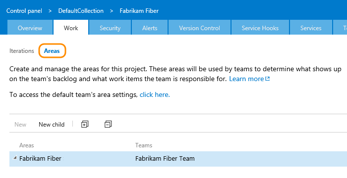

# Define the classification plug-in


[!INCLUDE [temp](../../_shared/dev15-version-header-process-template.md)]

Classifications facilitate tracking, grouping, and reporting on work based on useful categories, such as related product features and project milestones. You define areas to organize work items into logical, physical, or functional categories. You define iterations to group work items into milestones or time cycle categories. For example, a team could organize the product work into a client area, a server area, and an extensibility area. Iterations that you define determine how many times the team will repeat a particular set of major activities, such as plan, develop, and test.  
  
The classifications that you define appear on the **Areas** and **Iterations** pages, as the following illustration shows and described in [Customize areas and iterations](../../customize/modify-areas-iterations.md). You access this page from the administration web portal.  
  
[!INCLUDE [temp](../../_shared/image-differences.md)]

 

For an overview of using the web portal, see [Work in the web portal](../../../connect/work-web-portal.md).  
  
 After a team project has been created, you [modify the areas and iterations](../../customize/modify-areas-iterations.md) from the web portal. You can also define permissions to control access to a project area or iteration.  
  
 In addition to areas and iterations, you specify the mapping file for Microsoft Project to upload within the Classification plug-in and the process template property.  
  
<a name="name"></a> 
##Classification plug-in name and location  
The name of the file, folder, and plug-in are:  
 
**File name**: Classification.xml    
**Folder name**: Classification   
**Plug-in name**: Microsoft.ProjectCreationWizard.Classification  
  
> [!NOTE]  
>  You can change the names of the XML file and the folder but not the plug-in. TFS does not include a mechanism for the deployment of client-side plug-ins, policies, or other modifications. If you want to deploy this kind of functionality, you must use your own distribution and installation program.  
  
<a name="tasks"></a> 
##Classification tasks and dependencies  
 The Classification plug-in file must conform to its schema definition, as specified in the Css.xsd file, and the plug-in must be specified in its own file.  
  
 In the XML file, specify one or more tasks and their dependencies. In general, you only need one task to specify all the iterations and nodes that a team project requires.  
  
> [!NOTE]  
>  If you modify a process template's areas or iterations, make sure that you do not break any assignments that are used for work item queries or work items that are defined in the process template. For example, the Iteration1Backlog.wiq work item query for the Agile process template references Iteration 1. For more information, see [Add work item queries](add-work-item-queries-process-template.md).  
  
<a name="areas"></a> 
##Specify  the initial area paths  
Specify the root node of areas by using the following syntax:  
  
```  
<Node StructureType="ProjectModelHierarchy" Name="Area" xmlns="">  
```  
  
 Specify zero or more children nodes for as many areas as you want for your process. Use the `Node` element to specify each area and set the `StructureType` attribute to `ProjectModelHierarchy`.  
  
```  
<Node StructureType="ProjectModelHierarchy" Name="NodeName" xmlns=""></Node>  
```  
  
 The following example shows how to specify two areas, Client and Server:  
  
```  
<?xml version="1.0" encoding="utf-8" ?>  
<tasks>  
   <task  
      id="UploadStructure"  
      name="Creating project structure"  
      plugin="Microsoft.ProjectCreationWizard.Classification"  
      completionMessage="Portfolio project structure created.">  
      <taskXml>  
         <Nodes>  
            <Node StructureType="ProjectModelHierarchy" Name="Teams" xmlns="">  
               <Children>  
                  <Node StructureType="ProjectModelHierarchy" Name="Client"></Node>  
                  <Node StructureType="ProjectModelHierarchy" Name="Server"></Node>  
               </Children>  
            </Node>  
         </Nodes>  
      </taskXml>  
   </task>  
</tasks>  
```  
  
<a name="iterations"></a> 
##Specify the initial iteration paths  
 Specify the root node for iterations by using the following syntax:  
  
```  
<Node StructureType="ProjectLifecycle" Name="NodeName" xmlns="">  
```  
  
Specify zero or more children nodes for as many iterations as you want for your process. Use the **Node** element to specify each iteration and set the `StructureType` attribute to `ProjectLifecycle`.  
  
Default process templates don't specify any area nodes, but do specify iteration nodes, which are named Iteration 1, Iteration 2, and Iteration 3. The iteration nodes are referenced in the definition of work item queries, and the tasks are defined in the WorkItemTracking and Portal plug-ins.

The following example shows how to specify four iterations: Milestone 1, Milestone 2, Beta, and RTM.  
  
```  
<?xml version="1.0" encoding="utf-8" ?>  
<tasks>  
   <task  
      id="UploadStructure"  
      name="Creating project structure"  
      plugin="Microsoft.ProjectCreationWizard.Classification"  
      completionMessage="Team project structure created.">  
      <taskXml>  
         <Nodes>  
            <Node StructureType="ProjectLifecycle" Name="Iteration" xmlns="">  
               <Children>  
                  <Node StructureType="ProjectLifecycle" Name="Sprint 1"></Node>  
                  <Node StructureType="ProjectLifecycle" Name="Sprint 2"></Node>  
                  <Node StructureType="ProjectLifecycle" Name="Sprint 3"></Node>  
                  <Node StructureType="ProjectLifecycle" Name="Sprint 4"></Node>  
               </Children>  
            </Node>  
         </Nodes>  
      </taskXml>  
   </task>  
</tasks>  
```  
  
##  <a name="msproj"></a> Specifying process template properties  
 This section specifies two properties: the Project-to-TFS field mapping file and the process template. The mapping file specifies how fields in TFS map to fields defined in Project. The second property associates the process template with a unique value.  The following example shows the syntax structure for this entry:  
  
```  
<properties>  
   <property name="MSPROJ"   
             value="Classification\FileMapping.xml"   
             isFile="true" />  
   <property name="Process Template" value="Agile"/>  
</properties>  
```  
  
 To customize the FileMapping.xml file, see [Map Microsoft Project fields](../map-microsoft-project-fields-to-tf-fields.md).  
  
##  <a name="elements"></a> Classification plug-in element reference  
 You specify the following  elements within a `taskXml` container element in the Classification plug-in file. , See [Define the tasks to process a plug-in](define-tasks-to-process-a-plug-in.md) for information about `taskXml`.  
  
 Define areas and iterations by specifying a tree path of nested nodes and children nodes. For more information, see [Customize your area and iteration paths](../../customize/modify-areas-iterations.md).  
  
|Element|Description|  
|-------------|-----------------|  
|**Children**|Optional child element of **Node**. Contains the definitions for children areas or iterations.<br /> `<Children>`<br />&nbsp;&nbsp;&nbsp;`<Node> . . . </Node>`<br />`</Children>`|  
|**Node**|Optional child element of **Nodes** and **Children**. Defines the structure of the tree. Use `ProjectLifecycle` for iterations and `ProjectModelHierarchy` for areas. Node names should not exceed 255 characters.<br /> `<Node StructureType="ProjectLifecycle &#124; ProjectModelHierarchy" Name="NodeName">`<br />&nbsp;&nbsp;&nbsp;`<Node> . . . </Node>`<br />&nbsp;&nbsp;&nbsp;`<Children> . . . </Children>`<br />`</Node>`|  
|**Nodes**|Required child element of **taskXml** for the Classification plug-in. Contains the area and iteration definitions.<br /> `<Nodes>`<br />&nbsp;&nbsp;&nbsp;`<Node> . . . </Node>`<br />`</Nodes>`|  
|**properties**|Optional child element of **taskXml** for the Classification plug-in.<br />`<properties>`<br />&nbsp;&nbsp;&nbsp;`<property />`<br />`</properties>`|  
|**property**|Required child element of **properties**. Defines project-related data such as the XML mapping data for Microsoft Project.<br /> `<property name="property name" value="Classification\FileName" isFile="true &#124; false" />`<br />Where the following definitions apply for each attribute:<br /> - `name`: Required. Defines the name of the property. The only valid names are `MSPROJ` and `Process Template`.<br /> - `value`: Required. For `MSPROJ`, defines the relative path to the field mapping file. For `Process Template`, contains the name of the process that's associated with the process template. This property is added to the classification file when you [import a process to Team Services](../../import-process/import-process.md).<br />-   `isFile`: Optional. Specifies whether the property is defined in a file. If the value is true, the file must exist, or process template validation fails.|  
  
  
  
  
## Related notes 
For guidelines and naming restrictions that apply to classifications, see [Customize areas and iterations](../../customize/modify-areas-iterations.md).  
 