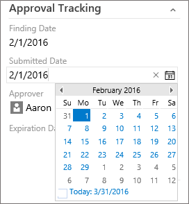
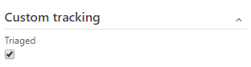
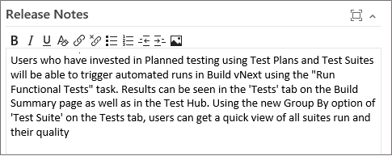

# WebLayout and Control elements  

<b>Team Services (Hosted XML) | TFS 2017 </b>

>[!IMPORTANT]  
>This topic applies to team project customization for Hosted XML and On-premises XML (TFS 2017 and later versions) process models. For TFS 2015, see [Layout XML element reference](layout-xml-element-reference.md). 
>
>For the Inheritance process model, see [Customize a process](../process/customize-process.md). For an overview of process models, see [Customize your work tracking experience](../customize/customize-work.md).  

You use the **WebLayout** element to define the layout and controls that appear on work item forms displayed through the web portal. It supports the [new work item experience](../process/new-work-item-experience.md). It is in addition to the [**Layout** element](../reference/all-form-xml-elements-reference.md) which defines the form elements that appear when viewed through Visual Studio and other non-web clients.

The **WebLayout** element is a required child element of the **FORM** element.   

[!INCLUDE [temp](../_shared/new-form-xml-elements-availability.md)]

##Summary of new and deprecated elements and attributes

The **WebLayout** and updated **Control** elements introduce several new elements and deprecate several elements and attributes. Overall, it's a much simpler syntax structure than its predecessor. 


<div style="float:left;width:175px;margin:3px;font-size:100%">
<p style="font-weight:bold;margin-bottom:-16px;text-align:center;">New elements</p>  
- ```ControlContribution```   
- ```GroupContribution```  
- ```Input```  
- ```Inputs```  
- ```Page```  
- ```PageContribution```  
- ```Section```  
- ```SystemControls```  
- ```WebLayout```   
</div>


<div style="float:left;width:175px;margin:3px;font-size:100%">
<p style="font-weight:bold;margin-bottom:-16px;text-align:center;">Maintained elements</p>  
- ```FORM```  
- ```Layout```   
- ```Group```   
- ```Control```  

</div>

<div style="float:left;width:175px;margin:3px;font-size:100%">
<p style="font-weight:bold;margin-bottom:-16px;text-align:center;">Deprecated elements</p>  
- ```Column```   
- ```Splitter```   
- ```Tab```    
- ```TabGroup```   
</div>

<div style="float:left;width:175px;margin:3px;font-size:100%">
<p style="font-weight:bold;margin-bottom:-16px;text-align:center;">Deprecated attributes</p>   
- ```ControlSpacing```    
- ```FixedWidth```   
- ```LabelPosition```  
- ```LabelSpacing```  
- ```Margin```   
- ```MinimumSize```    
- ```Padding```   
- ```PercentWidth```   
</div>

<div style="clear:left;font-size:100%">
</div>


In the new web form layout, the system manages the header elements shown below. These include the display of the work item ID, Title, State, Assigned To, Area and Iteration fields, tags, as well as the pages to display  History,  Links, and  Attachments.  


When you export a WIT definition, you'll see a **SystemControls** section at the beginning of the **WebLayout** section, similar to the following:

```
<WebLayout>
    <SystemControls>
      <Control Type="FieldControl" FieldName="System.Title" EmptyText="Enter title" />
      <Control Label="Assi&amp;gned To" Type="FieldControl" FieldName="System.AssignedTo" />
      <Control Label="Stat&amp;e" Type="FieldControl" FieldName="System.State" />
      <Control Label="Reason" Type="FieldControl" FieldName="System.Reason" />
      <Control Label="&amp;Area" Type="WorkItemClassificationControl" FieldName="System.AreaPath" />
      <Control Label="Ite&amp;ration" Type="WorkItemClassificationControl" FieldName="System.IterationPath" />
      <Control Label="History" Type="WorkItemLogControl" FieldName="System.History" />
      <Control Label="Links" Type="LinksControl" Name="Links" />
      <Control Label="Attachments" Type="AttachmentsControl" Name="Attachments" />
    </SystemControls>
...
```
You can modify select elements within the **SystemControls** section, such as changing the *EmptyText* attribute value for the System.Title field. In general, we recommend you don't customize this section much more than that. 

The other layout elements that you can customize are those associated with a page, such as the Details page, or  other custom pages that you add. 


>[!TIP]  
>The **Page** element is similar to the deprecated **Tab** element. However, a **Page** element can't be grouped or nested. One page defines one tab within the web form.  

This topic provides you with a quick reference to the **WebLayout** element and it's child elements. Use this as a guide to further customize a WIT definition that's been transformed and contains the new **WebLayout** section. 

To customize the windows client layout, the [Layout XML element](layout-xml-element-reference.md). 

## WebLayout example

The following example shows the overall structure of the **WebLayout** section within the **FORM** section. The  **WebLayout** specifies a **Control** element for each field you want to have appear on the form. 

You group elements to appear within a **Page** by using the **Section** and **Group** elements. You use a **Control** element to define each field or control that you want to appear on the form.  

The following example specifies the syntax for the Details page shown previously in this topic. 

```
<FORM>
. . .
  <WebLayout>
       <SystemControls>
	      <Control Type="FieldControl" FieldName="System.Title" EmptyText="Enter title" />
	      <Control Label="Assi&amp;gned To" Type="FieldControl" FieldName="System.AssignedTo" />
	      <Control Label="Stat&amp;e" Type="FieldControl" FieldName="System.State" />
	      <Control Label="Reason" Type="FieldControl" FieldName="System.Reason" />
	      <Control Label="&amp;Area" Type="WorkItemClassificationControl" FieldName="System.AreaPath" />
	      <Control Label="Ite&amp;ration" Type="WorkItemClassificationControl" FieldName="System.IterationPath" />
	      <Control Label="History" Type="WorkItemLogControl" FieldName="System.History" />
	      <Control Label="Links" Type="LinksControl" Name="Links" />
	      <Control Label="Attachments" Type="AttachmentsControl" Name="Attachments" />
        </SystemControls>
	<Page Label="Details" LayoutMode="FirstColumnWide">
		<Section>
		  <Group Label="Description">
             <Control Label="Description" Type="HtmlFieldControl" FieldName="System.Description" />
          </Group>
		</Section>
		<Section>
      <Group Label="Planning">
          <Control Label="Story Points" Type="FieldControl" FieldName="Microsoft.VSTS.Scheduling.StoryPoints" />
          <Control Label="Priority" Type="FieldControl" FieldName="Microsoft.VSTS.Common.Priority" />
        </Group>
        <Group Label="Classification">
          <Control Label="Value area" Type="FieldControl" FieldName="Microsoft.VSTS.Common.ValueArea" />
        </Group>
      </Section>
      <Section>
        <Group Label="Development">
          <Control Type="LinksControl" Name="Development">
            <LinksControlOptions ViewMode="Dynamic" ZeroDataExperience="Development" ShowCallToAction="true">
              <ListViewOptions GroupLinks="false">
              </ListViewOptions>
              <LinkFilters>
                <ExternalLinkFilter Type="Build" />
                <ExternalLinkFilter Type="Pull Request" />
                <ExternalLinkFilter Type="Branch" />
                <ExternalLinkFilter Type="Fixed in Commit" />
                <ExternalLinkFilter Type="Fixed in Changeset" />
                <ExternalLinkFilter Type="Source Code File" />
              </LinkFilters>
            </LinksControlOptions>
          </Control>
        </Group>
       <Group Label="Related Work">
          <Control Type="LinksControl" Name="Related Work">
            <LinksControlOptions>
              <LinkFilters>
                <WorkItemLinkFilter Type="System.LinkTypes.Hierarchy-Reverse" />
                <WorkItemLinkFilter Type="System.LinkTypes.Hierarchy-Forward" />
                <WorkItemLinkFilter Type="System.LinkTypes.Related" />
              </LinkFilters>
              <Columns>
                <Column Name="System.State" />
                <Column Name="System.ChangedDate" />
                <Column Name="System.Links.Comment" />
              </Columns>
            </LinksControlOptions>
          </Control>
        </Group>
      </Section>
    </Page>
  </WebLayout>
</FORM>
```

<a id="customize">  </a>  
## Customize the web layout  

To modify the web layout, use the information provided in this topic to modify the XML definition file for a specific work item type. To import and export your changes, see [Customize the work item tracking web form](../customize/customize-wit-form.md).   


<a id="weblayout-element">  </a>  

## WebLayout element syntax

You can specify how information and work item fields are grouped and appear in a work item form using the elements that are described in the following table.


>[!NOTE]  
>For **WebLayout**, you no longer add controls for attachments, links, and history. The system automatically addes these controls (```AttachmentControl```, ```LinksControl```, ```WorkItemClassificationControl``` and ```WorkItemLogControl```) are automatically added to the web form of each WIT.  


### Nest elements 
 
You nest the following elements: 

- ```Page``` elements within a single ```WebLayout``` element  
- ```Section``` elements within a ```Page``` element, limit the number of ```Section```  elements to four within a ```Page```  
- ```Group``` elements within a ```Section``` element  
- ```Control``` elements within a ```Group``` element.  
 

>[!TIP]  
>The schema definition for work item tracking defines all **FORM** child elements as camel case and all other elements as all capitalized. If you encounter errors when validating your type definition files, check the case structure of your elements. Also, the case structure of opening and closing tags must match according to the rules for XML syntax. For more information, see [Control XML element reference](control-xml-element-reference.md).   

<table width="100%" >
<thead>
<tr>
<th width=20%"><p>Element</p></th>
<th width=80%"><p>Description</p></th>
</tr>
</thead>
<tbody valign="top" >
<tr>
	<td><p>**Control**</p></td>
	<td><p>Optional child element for a **Group** within **WebLayout**. Defines a field, text, hyperlink, or other control element to appear on the work item form.</p>
<pre><code>
&lt;Control FieldName=&quot;FieldName&quot; Type=&quot;DateTimeControl | ExtensionsControl | FieldControl | HtmlFieldControl | LabelControl | WebpageControl&quot; Label=&quot;LabelText&quot; EmptyText=&quot;TextString&quot; ReadOnly=&quot;True | False&quot; Name=&quot;InstanceName&quot; /&gt;
</code></pre>

<p>See [Control element attributes](#control-attributes) and [control type](#control-types) for information about each attribute.</p></td>
</tr>


<tr>
	<td><p>**ControlContribution**</p></td>
	<td><p>Optional child element of **Group** within **WebLayout** used to secify a field-level work item extension to appear on the form.   </p>
<pre><code>
&lt;ControlContribution Id="ContributionId" Label="Name"  &gt;
   &lt;Inputs&gt;
      &lt;Input Id="FieldName" Value="Value" /&gt;
   &lt;/Inputs&gt;
&lt;/ControlContribution&gt;
</code></pre>
<p>The *ContributionId* you specify must be installed on the account or team project collection. The WIT definition files that you export contain a [list of installed contributions](#extensions).</p>
</td>
</tr>

<tr>
	<td><p>**Extension**</p></td>
	<td><p>Required child element for **Extensions**. Use to specify an extension ID of a work item control extension to display in the work item form. You must specify each extension that is used in the layout for a **ControlContribution**, **GroupContribution**, or **PageContribution** element. </p>
<pre><code>
&lt;Extension Id="ExtensionId" /&gt;
</code></pre>

<p>The *ExtensionId* you specify must be installed on the account or team project collection. The WIT definition files that you export contain a [list of installed extensions](#extensions).</p>
<p> </p>

</td>
</tr>

<tr>
	<td><p>**Extensions**</p></td>
	<td><p>Optional container child element of **WebLayout** used to support specifying one or more **Extension** elements. If extensions are used in the form, specify them prior to a **Page** element. </p>
<pre><code>
&lt;WebLayout &gt;
   &lt;Extensions &gt;
       &lt;Extension Id="ExtensionId" /&gt;
      . . . 
   &lt;/Extensions &gt;
. . .
&lt;/WebLayout &gt;
</code></pre>

</td>
</tr>

<tr>
<td><p>**FORM**</p></td>
<td><p>Required child element of **WITD** used to specify the layout and controls to appear on the work item form. Parent element for both the **Layout** (client form layout) and **WebLayout** (web form layout) elements. </p>
<pre><code>&lt;FORM&gt;
   &lt;Layout&gt; . . . &lt;/Layout&gt;
   &lt;WebLayout&gt; . . . &lt;/WebLayout&gt;
&lt;/FORM&gt;</code></pre></td>
</tr>


<tr>
<td><p>**Group** </p></td>
<td><p>Required child element of **Section**. Provides a visual grouping of elements within a section which you can label. </p>
<pre><code>&lt;Group Label=&quot;LabelText&quot; 
   &lt;Control&gt; . . . &lt;/Control&gt;
&lt;/Group &gt;</code></pre></td>
</tr>

<tr>
	<td><p>**GroupContribution**</p></td>
	<td><p>Optional child element of **Section** within  **WebLayout** used to specify a group-level work item extension to appear on the form. The extension will appear as a group within the form.   </p>
<pre><code>
&lt;GroupContribution Id="ContributionId" Label="Name" /&gt;
</code></pre>
<p>The *ContributionId* you specify must be installed on the account or team project collection. The WIT definition files that you export contain a [list of installed contributions](#extensions).</p>
</td>
</tr>

<tr>
	<td><p>**Input**</p></td>
	<td><p>Required child element for **Inputs** that specifies input data for an extension.  </p>
<pre><code>
&lt;Input Id="FieldName" Value="Value" /&gt;
</code></pre>
</td>
</tr>


<tr>
	<td><p>**Inputs**</p></td>
	<td><p>Optional container child element for **ControlContribution** used to support specification of input data for an extension.   </p>
<pre><code>
   &lt;Inputs&gt;
      &lt;Input Id="FieldName" Value="Value" /&gt;
   &lt;/Inputs&gt;
</code></pre>
</td>
</tr>

<tr>
	<td><p>**Page**</p></td>
	<td><p>Required child element of **WebLayout**. Defines the layout of a page within the web form.  </p>
<p>Specify the name of the page and the layout to use. 
<pre><code>&lt;Page Label="PageName" LayoutMode="FirstColumnWide | EqualColumns "&gt;  
   &lt;Section&gt;  
	   &lt;Group&gt; . . . 
		   &lt;Control&gt; . . . &lt;/Control&gt;
		   &lt;Control&gt; . . . &lt;/Control&gt;
	   &lt;/Group&gt;
   &lt;/Section&gt;
&lt;/Page&gt;</code></pre>
</td>
</tr>

<tr>
	<td><p>**PageContribution**</p></td>
	<td><p>Optional child element of **WebLayout** used to specify a page-level work item extension to appear on the form. The extension will appear as a page within the form. </p>
<pre><code>
&lt;PageContribution Id="ContributionId" Label="Name"  /&gt;
</code></pre>
<p>The *ContributionId* you specify must be installed on the account or team project collection. The WIT definition files that you export contain a [list of installed contributions](#extensions).</p>
</td>
</tr>


<tr>
	<td><p>**Section**</p></td>
	<td><p>Required child element of **Page**. Defines the layout of a section within a page of the web form. Sections form groups that [support variable resizing](../customize/customize-wit-form.md#resizing). A limit of four sections can be defined within a **Page**. </p>
<pre><code>&lt;Page&gt;  
   &lt;Section&gt;  
	   &lt;Group&gt; . . . 
		   &lt;Control&gt; . . . &lt;/Control&gt;
		   &lt;Control&gt; . . . &lt;/Control&gt;
	   &lt;/Group&gt;
   &lt;/Section&gt;
&lt;/Page&gt;</code></pre>
</td>
</tr>


<tr>
<td>**SystemControls**</td>
<td><p>Optional child element for **WebLayout**. Allows you to define the labels and empty text values for controls present in the header of the new work item form (built-in controls). This also includes, the labels for the History, Links, and Attachments tabs.</p>
<pre><code>&lt;SystemControls&gt;  
	&lt;Control Type="FieldControl" FieldName="System.Title" EmptyText="Enter title" /&gt; 
	&lt;Control Label="Assi&amp;gned To" Type="FieldControl" FieldName="System.AssignedTo" /&gt;
	&lt;Control Label="Stat&amp;e" Type="FieldControl" FieldName="System.State" /&gt;
	&lt;Control Label="Reason" Type="FieldControl" FieldName="System.Reason" /&gt;
	&lt;Control Label="&amp;Area" Type="WorkItemClassificationControl" FieldName="System.AreaPath" /&gt;
	&lt;Control Label="Ite&amp;ration" Type="WorkItemClassificationControl" FieldName="System.IterationPath" /&gt;
	&lt;Control Label="History" Type="WorkItemLogControl" FieldName="System.History" /&gt;
	&lt;Control Label="Links" Type="LinksControl" Name="Links" /&gt;
	&lt;Control Label="Attachments" Type="AttachmentsControl" Name="Attachments" /&gt;
&lt;/SystemControls&gt;</code></pre>
 

</td>
</tr>

<tr>
	<td><p>**WebLayout**</p></td>
	<td><p>Required child element of **FORM**. Defines the layout of the work item form displayed in the web portal. Includes one or more **Page** elements.</p>
<pre><code>&lt;WebLayout&gt; 
   &lt;Page&gt;  
	   &lt;Section&gt;  
		   &lt;Group&gt; . . . 
			   &lt;Control&gt; . . . &lt;/Control&gt;
			   &lt;Control&gt; . . . &lt;/Control&gt;
		   &lt;/Group&gt;
	   &lt;/Section&gt;
   &lt;/Page&gt;
. . .
&lt;/WebLayout&gt;</code></pre>
</td>
</tr>
</tbody>
</table>

<a id="control-element">  </a>  
### Control element syntax 

You use the **Control** element to define a work item field, text, hyperlink, or other form type to display in a work item form. The **Control** element you specify within the **WebLayout** section should conform to the following syntax:

<pre><code>
&lt;Control FieldName=&quot;FieldName&quot; Type=&quot;DateTimeControl |  FieldControl | HtmlFieldControl | LabelControl | WebpageControl&quot; Label=&quot;LabelText&quot; LabelPosition=&quot;Top | Bottom | Left | Right&quot; EmptyText=&quot;TextString&quot; ReadOnly=&quot;True | False&quot; Name=&quot;InstanceName&quot; /&gt;
</code></pre>


<a id="control-attributes">  </a>
### Control element attribute syntax  

<table width="100%" >
<tbody valign="top" >
<tr>
<th width=16%">Attribute</th>
<th width=84%">Description</th>
</tr>
<tr>
<td><p><strong>FieldName</strong> </p></td>
<td>
<p>Optional. Specifies the work item field with which the control is associated. Specify the reference name of the field which should be between 1 an 70 characters. </p>
</td>
</tr>
<tr>
<td><p> <strong>Type</strong> </p></td>
<td><p>Required. Specifies the data type of the control. Specify a string from one of these built-in types: </p>
<ul>
<li><p> <strong>DateTimeControl</strong>: Use to display formatted date fields with a field type of <strong>DateTime</strong>.</p></li>
<li><p><strong>FieldControl</strong>: Use to display Boolean, plain text, numeric fields, person-name fields, and pick lists. Supports fields with a data type of <strong>Boolean</strong>, <strong>Double</strong>, <strong>Identity</strong>, <strong>Integer</strong>,<strong>PlainText</strong>m and <strong>String</strong>.</p>
<blockquote style="font-size: 13px"><b>Feature availability:</b> The Boolean data type field is only supported for Team Services and TFS 2017 and later versions.    
</blockquote>
</li>
<li><p> <strong>HtmlFieldControl</strong>: Use to display multi-line, rich-text format of fields with a field type of <strong>HTML</strong>.</p></li>
<li><p> <strong>LabelControl</strong>: Use to display text that is not associated with a field. The text can be plain or hyperlinked. You can specify additional controls using the <strong>LabelText</strong>, <strong>Link</strong> and <strong>Text</strong> elements.</p></li>
<li><p> <strong>WebpageControl</strong>: Use to display HTML-based content defined by a URI or embedded within a CDATA tag. This control does not have an associated field or field type. You specify the content and links to display using the <strong>WebpageControlOptions</strong> element. </p></li>
</ul>
</td>
</tr>

<tr>
<td><p><strong>EmptyText</strong> </p></td>
<td>
<p>Optional. Specifies a text string between 1 and 255 characters in length that appears when a field is empty.</p></td>
</tr>
<tr>
<td><p> <strong>Label</strong> </p></td>
<td><p>Optional. Specifies the visible text on the form that identifies the control. Specify a string of no more than 80 characters. If unspecified, the friendly name of the ```FieldName``` is used.  </p></td>
</tr>
<tr>
</tr>

<tr>
<td><p> <strong>ReadOnly</strong> </p></td>
<td><p>Optional. Specifies that the field is read-only:</p>
<ul>
<li><p><strong>True</strong>: Control field is read-only.</p></li>
<li><p><strong>False</strong>: Control field isn't read-only.</p></li>
</ul>
</td>
</tr>
<tr>
<td><p><strong>Name</strong> </p></td>
<td><p>Optional. Identifies a control uniquely. The <strong>Name</strong> is important if more than one control on the form is associated with the same work item field.  </p>
<blockquote style="font-size: 13px"><b>Note:</b> You use the <strong>Name</strong> attribute when you want to have the same field displayed on more than one **Page** on the form. You specify a unique value for the <strong>Name</strong> attribute for both control entries so that the system identifies each control uniquely.   
</blockquote>  
</td>
</tr>
</tbody> 
</table>

### Control element Type attribute syntax
<table width="100%">
<tbody valign="top">
<tr>
<th width=20%">Type</th>
<th width=80%">Description</th>
</tr>

<tr>
<td>**DateTimeControl**</td>
<td>Use to display formatted date fields with a data type of DateTime. 

<p>Use ```FieldControl``` to provide a text field for the input or display of a DateTime data type field.</p>
<pre><code>&lt;Control FieldName=&quot; MyCompany.Group1.StartDate &quot; Type=&quot;FieldControl&quot; Label=&quot;Start Date&quot; LabelPosition=&quot;Left&quot; /&gt;</code></pre>
<p>Use ```DateTimeControl``` to provide a calendar picker to select a date for a field, as shown in the following illustration.</p>
   
<pre><code>&lt;Control Type=&quot;DateTimeControl&quot; FieldName=&quot;FabrikamFiber.Schedule.SubmittedDate&quot; Label=&quot;Submitted Date:&quot; LabelPosition=&quot;Left&quot;  Format=&quot;Short&quot; /&gt;</code></pre>
</td></tr>

<tr>
<td>**FieldControl**</td>
<td> Use to display fields with a data type of Boolean, String, Identity, Integer, Double, and PlainText.  

For example:  
<pre><code>
&lt;Control Type=&quot;FieldControl&quot; FieldName=&quot;FabrikamFiber.Milestone&quot; Label=&quot;Milestone&quot; Name=&quot;Milestone&quot; LabelPosition=&quot;Left&quot; /&gt;
</code></pre>

>[!NOTE]  
><b>Feature availability:</b> The Boolean data type field is only supported for Team Services and TFS 2017 and later versions.    
  

<p>A Boolean field displays as a checkbox within the web work item form.</p>


<p>Within a client work item form, such as Visual Studio or Eclipse, a value of True or False will display.</p>  
</td>
</tr>

<tr>
<td>**HTMLFieldControl**</td>
<td>Use to display multi-line, rich-text formatted control. Specify this control type for fields of ```Type=HTML```.  

  

For example:  
<pre><code>&lt;Control Type=&quot;HtmlFieldControl&quot; FieldName=&quot;FabrikamFiber.ReleaseNotes&quot; Label=&quot;Release Notes&quot; Dock=&quot;Fill&quot; /&gt;</code></pre>


</td></tr>

<tr>
<td>**LabelControl**</td>
<td>Use to display text that is not associated with a field. The text can be plain or hyperlinked. You can specify additional controls using the LabelText, Link and Text elements. See [LabelText and Text XML elements reference](../reference/labeltext-and-text-xml-elements-reference.md
) and [Link and Param XML elements reference](../reference/link-param-xml-elements-reference.md).</td>
</tr


<tr>
<td>**WebpageControlOptions**</td>
<td><p>Use to display HTML-based content defined by a URI or embedded within a CDATA tag. This control does not have an associated field or field type.  You specify the content and links to display using the WebpageControlOptions element.</p>
<p>The **WebpageControlOptions** element and its child elements have the following syntax structure:</p>
 
<pre><code>&lt;WebpageControlOptions AllowScript="true | false" ReloadOnParamChange="true | false" &gt;  
   &lt;Link UrlRoot=&quot;UrlRoot&quot; UrlPath =&quot;UrlPathWithParameters&quot; &gt;  
      &lt;Param index=&quot;IndexValue&quot; value=&quot;ParamValue&quot; type =&quot;Original | Current&quot;&gt;  
   &lt;/Link&gt;  
   &lt;Content&gt;  
      &lt;![CDATA[Contents of HTML]]/&gt;  
   &lt;Content/&gt;  
&lt;WebpageControlOptions/&gt;</code></pre>  

<p>You use the ```Content```, ```LabelText```, and ```Link```elements to define plain text or hyperlinked labels, add hyperlinks to a field, or display Web page content in a work item form. See [Provide help text, hyperlinks, or web content on a work item form](provide-help-text-hyperlinks-web-content-form.md) for details about the syntax.</p>

 </td>
</tr>
</tbody>
</table>


## Related notes
If you're just getting started with the new form, see these additional topics to manage the roll out or customize it: 
- [Manage new form rollout](../customize/manage-new-form-rollout.md)
- [New work item experience](../process/new-work-item-experience.md)
- [Customize a web form for a process](../process/customize-process-form.md) (Inheritance process model)
- [Customize the new form](../customize/customize-wit-form.md) (Hosted XML and On-premises XML process models)
- [LinksControlOptions elements](linkscontroloptions-xml-elements.md) 

To learn more about process models and what's supported with each, see [Customize your work tracking experience](../customize/customize-work.md). 

<a id="marketplace-extensions">  </a>
### Marketplace extensions  

Visit the [Visual Studio Team Services Marketplace](https://marketplace.visualstudio.com/search?target=VSTS&category=Plan%20and%20track&sortBy=Downloads) to find extensions you can start using.  

<a id="extensions">  </a>
### Form extensions 

The **ControlContribution**, **GroupContribution**, and **PageContribution** elements reference the ```Id``` of contributions from the extensions that have been installed for a project collection or account. You install an extension from [Visual Studio Marketplace](https://marketplace.visualstudio.com/vsts). To create an extension, see [Create your first extension](../../../integrate/extensions/get-started/node.md).

Once the extensions have been installed, you add the <b>Contribution</b> element to the XML definition for a work item type. You export these files either by [exporting a process](../import-process/import-process.md#export-a-process) or [exporting a WIT definition file](../customize/customize-wit-form.md#witadmin). 

When you export the XML definition, it will contain a comment section that lists the installed extensions, their IDs, and any required inputs. For example: 

<pre><code>
&lt;!--**********************Work Item Extensions**********************

Extension:
	Name: color-control-dev
	Id: mariamclaughlin.color-control-dev

	Control contribution:
		Id: mariamclaughlin.color-control-dev.color-control-contribution
		Description: 
		Inputs:
			Id: FieldName
			Description: The field associated with the control.
			Type: Field
			IsRequired: true

			Id: Labels
			Description: The list of values to select from.
			Type: String
			IsRequired: false

			Id: Colors
			Description: The field associated with the control.
			Type: String
			IsRequired: false

Extension:
	Name: vsts-workitem-recentlyviewed
	Id: mmanela.vsts-workitem-recentlyviewed

	Group contribution:
		Id: mmanela.vsts-workitem-recentlyviewed.recently-viewed-form-group
		Description: Recently viewed work item form group

Extension:
	Name: vsts-extensions-multi-values-control
	Id: ms-devlabs.vsts-extensions-multi-values-control

	Control contribution:
		Id: ms-devlabs.vsts-extensions-multi-values-control.multi-values-form-control
		Description: Multi Values Selection Control.
		Inputs:
			Id: FieldName
			Description: The field associated with the control.
			Type: Field
			IsRequired: true

			Id: Values
			Description: The list of values to select from.
			Type: String
			IsRequired: false

Extension:
	Name: vsts-extension-workitem-activities
	Id: ms-devlabs.vsts-extension-workitem-activities

Extension:
	Name: vsts-uservoice-ui
	Id: ms-devlabs.vsts-uservoice-ui

	Group contribution:
		Id: ms-devlabs.vsts-uservoice-ui.vsts-uservoice-ui-wi-group
		Description: Shows User Voice details on the work item form
--&gt; 
</code></pre>

Given the above example, you can add the following code snippet to your work item type definition to turn on the user voice group ```vsts-uservoice-ui``` extension by specifying the extension Id:

```
<WebLayout>
... 
 <Extensions>
     <Extension Id="ms-devlabs.vsts-uservoice-ui" /> 
 </Extensions>

...
</WebLayout> 
```

Upon import of the updated WIT definition, the group extension will automatically appear on your work item form.

The next time you export your WIT definition, you'll see that a ```GroupContribution``` element has been added. You can move this element within the ```WebLayout``` section just as you would any other control. 
 