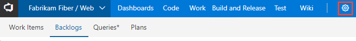
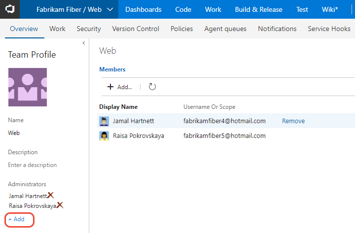
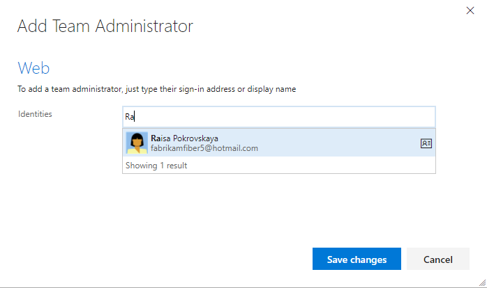
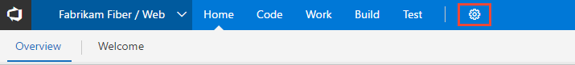
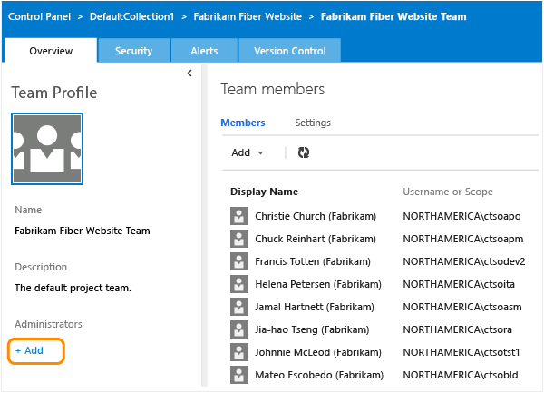

# Add a team administrator 

[!INCLUDE [temp](../_shared/version-vsts-tfs-all-versions.md)]

  

It's always a good idea to have more than one person with administration permissions for an area. You need to be a team administrator to [configure team settings](manage-team-assets.md). 

As a team administrator, you can configure, customize, and manage all team-related activities for your team. These include being able to add team members, add team admins, and configure Agile tools and team assets. 

## Prerequisites

::: moniker range="vsts"
* You must be a member of a team project. If you don't have a team project yet, create one in [VSTS](../../organizations/accounts/set-up-vs.md). If you haven't been added as a team member, [get added now](../../organizations/accounts/add-account-users-from-user-hub.md). 
::: moniker-end
::: moniker range=">= tfs-2013 <= tfs-2018"
* You must be a member of a team project. If you don't have a team project yet, create one in an [on-premises TFS](../../organizations/accounts/create-team-project.md). If you haven't been added as a team member, [get added now](../../organizations/security/add-users-team-project.md). 
::: moniker-end
* To get added as a team administrator, ask another team admin, the account owner, or a member of the [Project Administrators group](../../organizations/security/set-project-collection-level-permissions.md) to add you.  

If you need to add a team, see [Add teams and team members](multiple-teams.md).

## Open the team page and add a team administrator 

From the web portal, open the admin page for the team. 

::: moniker range=">= tfs-2017"  

0. From the web portal and team context, click the  gear icon to open the administration page.

	> [!div class="mx-imgBorder"]  
	> 

	If you click the  gear icon from the team project context, then click **Overview**, and select the team you want to add an administrator to.   

0. Choose the **Add** link to open the dialog for adding user identities.    
     
	    
   
0. Enter the identities you want to add to the team administrator role.     
	    
	        
   
::: moniker-end     

::: moniker range=">= tfs-2013 <= tfs-2015"  

0. From the web portal and team context, click the  gear icon to open the administration page.

	> [!div class="mx-imgBorder"]  
	> 

	If you click the  gear icon from the team project context, then click **Overview**, and select the team you want to add an administrator to.   

0. Choose the **Add** link to open the dialog for adding user identities.    
  
	         

0. Enter the identities you want to add to the team administrator role.     

	    
	
::: moniker-end     

## Try this next  

> [!div class="nextstepaction"]
> [Configure team settings](manage-team-assets.md) 

## Related articles

- [About teams & Agile tools](../../organizations/settings/about-teams-and-settings.md)
- [Manage portfolios](portfolio-management.md)
- [Set team favorites](../../project/navigation/set-favorites.md) 