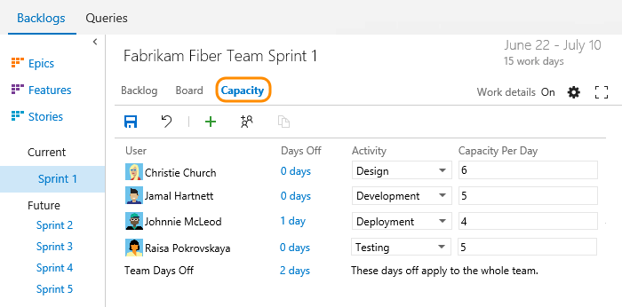
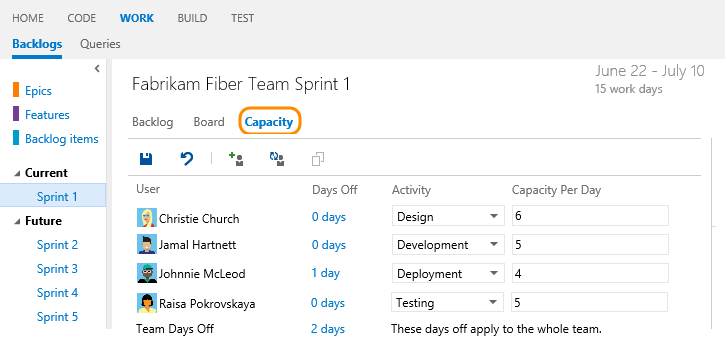
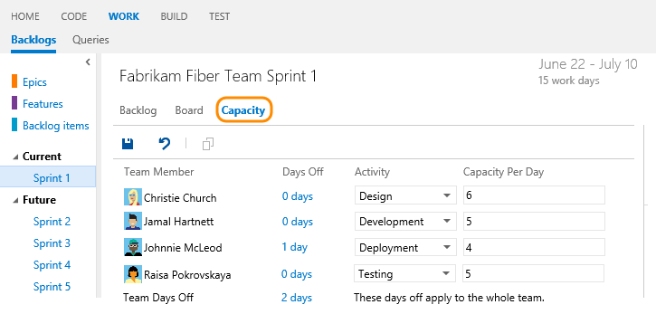
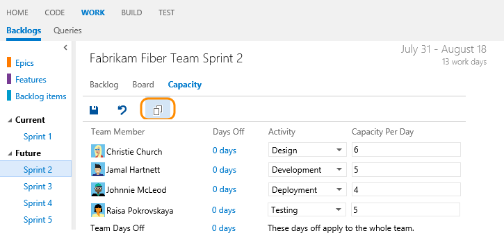
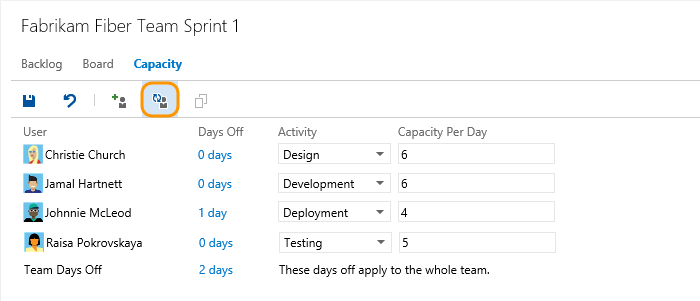
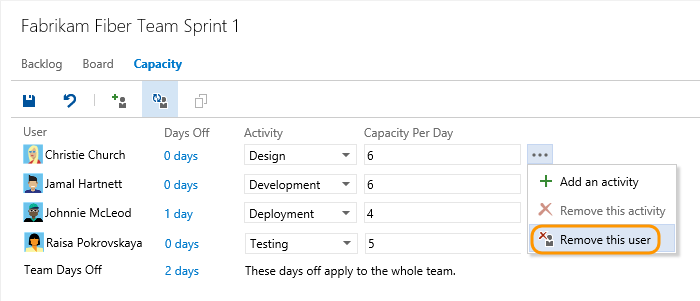
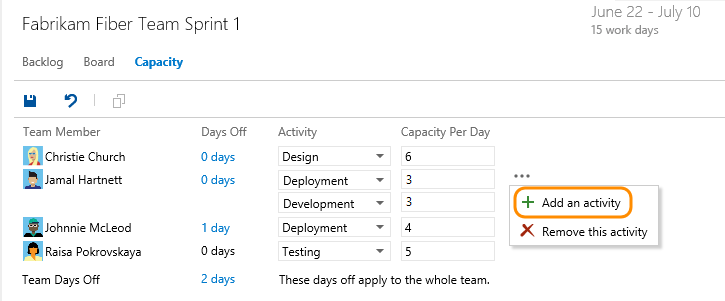
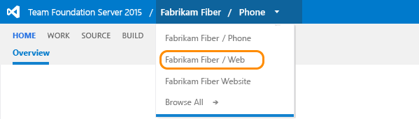
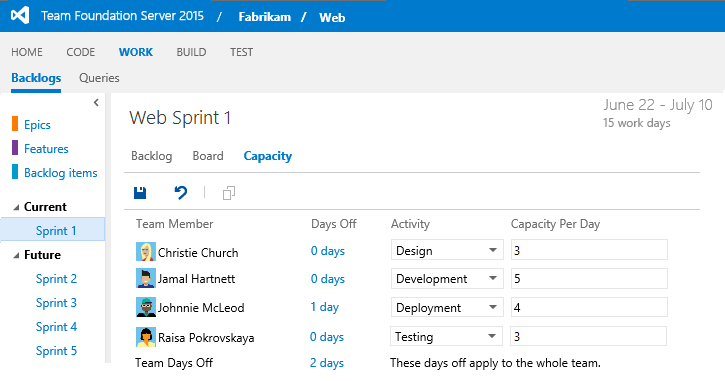
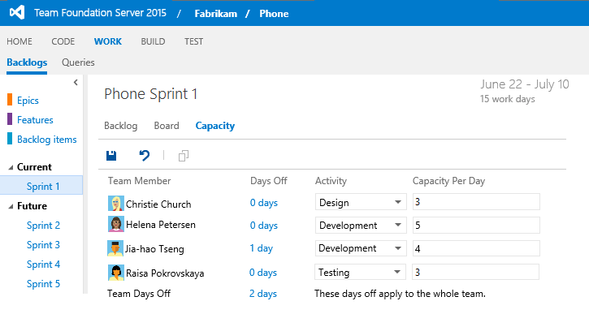

# Capacity planning  

[!INCLUDE [temp](../_shared/version-vsts-tfs-all-versions.md)]

How much work can your team accomplish in a sprint? Using the capacity planning tools, your team can estimate both the amount of work and types of work required to complete their sprint plan. Then, during the sprint, you can [monitor the capacity bars](../scrum/sprint-planning.md#adjust-work) to determine when an individual team member or a team area of activity is on target to finish, or needs help from other team members to finish. 

[Sprint planning](../scrum/sprint-planning.md#set-capacity) introduced the basics of setting your team capacity. Here, we go into more detail to address how to:  

>[!div class="checklist"]      
> * Copy capacity from the previous sprint to the current sprint  
> * Track capacity when performing multiple activities  
> * Add or remove user accounts from capacity planning for a sprint  
> * Track capacity when working on more than one team  

##Set team capacity and activity

Capacity correlates to actual task time - either hours or days. Capacity takes into account variation in work hours by team members as well as holidays, vacation days, and non-working days. 

Because days off and time available for each team member can vary from sprint to sprint, you set capacity for each sprint. The capacity tool helps you make sure your team isn't over or under committed for the sprint. Also, as you work day-to-day, you'll be able to see if your team is on track.

From the Capacity page, enter the capacity and days off for each member of your team. If your team tracks capacity by activity, then also select the Activity for each team member.  

> [!NOTE]  
>The user interface is slightly different depending on the platform and version you work from. 

For example, Christie Church's capacity is 6 hours/day for design work. 

#### VSTS and TFS 2017
 
 

#### TFS 2015.1
 

#### TFS 2015  
 

Most teams specify capacity in terms of hours, however, you can also specify it in days. For example, .5 days would correspond to 4 hours for a typical 8 hour day. Choose the same unit you will use to estimate the time a task will take to complete.

> [!NOTE]  
>For VSTS, the task board always shows "h" for hours. For TFS, you can modify the ProcessConfiguration file for the Remaining Work type field to specify "d" for days, or other preferred label. For details, see [Process configuration XML element reference, Agile tool fields](../customize/reference/process-configuration-xml-element.md#fields).  

If you haven't set up sprints yet for your team, go [here to do that now](../scrum/define-sprints.md).

If you don't see a team member listed, you need to [add them to the team](../scale/multiple-teams.md#add-team-members). Also, you only have to indicate planned days off for the team. You [set weekend days or other recurring days off](#team_settings) under team settings.  

##Copy capacity planning from the previous sprint 

> [!NOTE]  
><b>Feature availability: </b>This feature is available from VSTS and the web portal for TFS 2015.1 and later versions.  

By copying the capacity from the previous sprint, you save time. With the basics defined, all you have to do is adjust the capacity based on individual and team days off and capacity allocation per activity.  

For example, here we choose Sprint 2 and copy the capacity set for Sprint 1. 

 

Notice that only the capacity per day and activity are copied over. Individual and team days off remain unset. The copy operation always copies the latest updates made to the previous sprint. So you can repeat the copy operation if you've made changes to the previous sprint that you want to copy to the latest sprint. 

##Add or remove users  

> [!NOTE]  
><b>Feature availability: </b>These features are available from VSTS  and the web portal for TFS 2015.1 and later versions.  

Click  to add a specific account to your capacity planning, or  to add all missing team members. 

 

To remove a user, click the option from the users Action menu. 

 

##Track capacity when performing multiple activities

> [!NOTE]    
><b>Feature availability: </b>This feature is currently supported only from the web portal for VSTS and TFS 2015 Update 1 or later version.  

Because individual team members have different sets of skills and duties, you can track their activity and capacity for each activity and for each sprint. 

Here, Jamal divides his time between Deployment and Development. 

  

##Track capacity when working on more than one team
If you work on more than one team, you'll want to switch between teams easily and specify your sprint capacity to support each team's sprint activities.  

###Switch your team view
Switch to another team when you work on items for that team. From the web portal, choose Browse All if the name you want doesn't appear.  

  

###Specify sprint capacity for each team you work on
If you work on more than one team during a sprint cycle, you'll probably allocate some percentage of your time to each team.  

For example, both Christie and Raisa split their time between the Web and Phone teams. They therefore allocate 3 hours a day to the Web team, and 3 hours a day to the Phone team.  

  
 
  
 
If your name isn't listed in the capacity view, you need to be added as a team member. 

## Related Scrum notes
Setting capacity and [estimating remaining work for each task](../scrum/sprint-planning.md#define-tasks) provides you with the tools you need to track the amount of work and resources you have allocated sprint over sprint. You can learn more about working with your Scrum tools from these topics:

- [Set working days](../customize/set-working-days.md)
- [Task board](../scrum/task-board.md)
- [Sprint burndown](../scrum/sprint-burndown.md)
- [Velocity](../../report/dashboards/velocity-chart-data-store.md)    
- [Forecasting](../scrum/forecast.md)    
- [Configure team settings](../scale/manage-team-assets.md)

###Customize the pick list of activities or discipline 

> [!NOTE]    
>**Feature availability**: You can customize the pick list of the Activity or Discipline fields if you use the Hosted XML or On-premises process models. To learn more about process models, see [Customize your work tracking experience](../customize/customize-work.md).  

You can add to or modify the items listed for the [Activity](../track/query-numeric.md)(Agile or Scrum) or [Discipline](../track/query-numeric.md) (CMMI) field by [customizing its pick list](../customize/add-modify-field.md). 

> [!NOTE]    
>The set of values listed corresponds to the combined set of all values defined for the field across all team projects in the collection. 
 

### Set recurring days off  
Your sprint planning and tracking tools automatically consider days off when calculating capacity and sprint burndown. Leave those days of the week that your team doesn't work unchecked in your team's Settings, [Working days](../customize/set-working-days.md) page. 

  