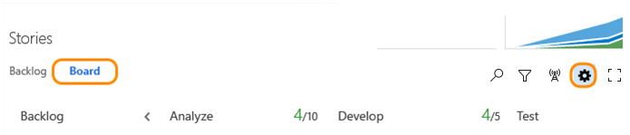
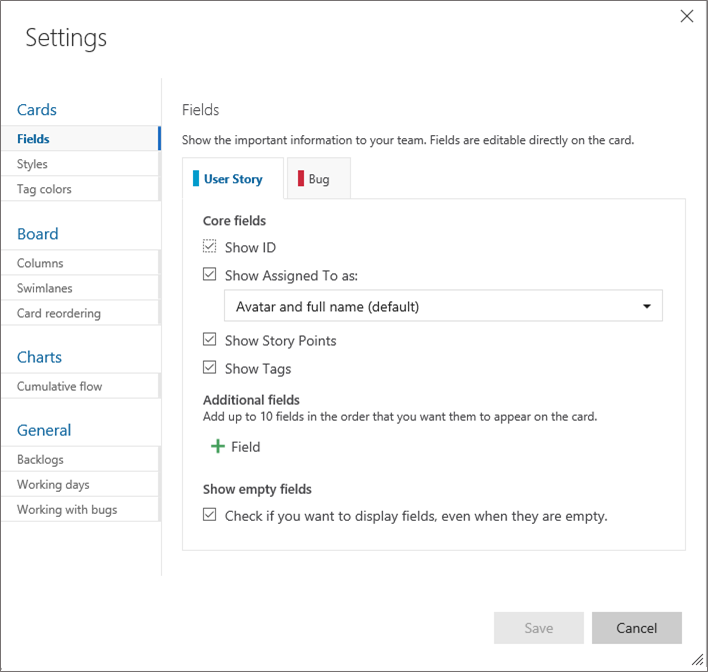

# Configure team settings 

[!INCLUDE [temp](../_shared/version-vsts-tfs-all-versions.md)]

<!--- Still needs work, versioning, and other team settings from the admin context, add something about something, team-specific widgets--> 

Within a project, you [add teams](multiple-teams.md) to support the needs of several feature teams, or an enterprise organized to deliver different products. Each team is then able to configure the Agile tools the way that works for their team, supporting each team to collaborate most effectively in planning and managing their work.  

As a team administrator, you can configure, customize, and manage all team-related activities for your team. These include being able to add team members, add team admins, and configure Agile tools and team assets. Members of the Project Administrators group can manage all team-related activities for all teams. 

Team admin permissions are role-based, unlike project admin permissions which are set through the user interface. Also, because team administrators are members of the Contributor role they have permissions assigned to that role.  

You can configure most of your team settings from the common configuration dialog. 

> [!NOTE]
> **Feature availability:** The common configuration dialog is available from VSTS and the web portal for TFS 2015.1 and later versions.  

1. To open, click , the gear icon, from any team backlog or board to set one or more team settings.  

	For example, from the Kanban board ...  

	   

2. Click a tab under Cards or Board to configure card and Kanban board settings.  

	

	For details on each configuration option, see one of these topics:  

> [!div class="mx-tdBreakAll"]  
> |Cards  | Board  | Charts & widgets |  General  | 
> |-------------|----------|---------|---------|   
> |- [Fields](../customize/customize-cards.md) - [Styles](../customize/customize-cards.md#style-rule) - [Tag colors](../customize/customize-cards.md#color-tags) - [Annotations](../customize/customize-cards.md#annotations) - [Tests](../customize/customize-cards.md#tests) |- [Columns](../kanban/add-columns.md) - [Swimlanes](../kanban/expedite-work.md) - [Card reordering](../customize/reorder-cards.md) |- [Cumulative flow chart & widget](../../report/dashboards/cumulative-flow.md#configure)  -[Lead & Cycle time widgets](../../report/dashboards/cycle-time-and-lead-time.md)  -[Velocity chart and widget](../../report/dashboards/velocity-chart-data-store.md) |-[Backlogs](../customize/select-backlog-navigation-levels.md) - [Working days](../kanban/expedite-work.md) - [Working with bugs](../customize/show-bugs-on-backlog.md) |

## Related articles 

To create additional teams, see [Add teams and team members](multiple-teams.md).  

If team members don't have access to all the features they want, check that they have [the permissions needed for those features](../../organizations/security/set-permissions-access-work-tracking.md).  

### Team name, description, and picture

Team settings also include the team name, description, and team profile image.  

To add a team picture. Open the team administration page and choose the picture icon under Team Profile. The maximum file size is 4 MB. 

