# Add teams and team members  

[!INCLUDE [temp](../_shared/version-vsts-tfs-all-versions.md)]

As your organization grows, you'll want to make sure that you configure your Agile tools to support that growth. To enable each feature team the autonomy it needs to manage their backlog and plan their sprints, they need their own set of team tools. 

>[!NOTE]  
>This topic describes how to add a team or team members to VSTS and TFS. To learn about Microsoft Teams, see the Marketplace extension, [Microsoft Teams Integration](https://marketplace.visualstudio.com/items?itemName=ms-vsts.vss-services-teams). 
>
>For a good understanding on how to remain Agile as you add teams, review the [Scale Agile to Large Teams](https://www.visualstudio.com/learn/scale-agile-large-teams/) article.

<!---
In this topic you'll learn:  

> [!div class="checklist"] 
> * How to add a team, moving from one team to two teams   
> * How to add team members  
> * How to move work items assigned to one team to another team  
> * How to delete a team      
> * Additional permissions you may want to grant team members    
-->

<a id="add-team"> </a>  
## Move from one team to two teams 
As your team grows, you can easily move from one team to two. In this example, we add two feature teams, Email and Voice, and maintain the Fabrikam Fiber team with visibility across each of these two teams.  

If you're not a project administrator, [get added as one](../../security/set-project-collection-level-permissions.md). Only project administrators can add teams.   

### Add two feature teams 

Add and configure two teams, Email and Voice. Here we show you how to add and configure the Email team. 

<!--- 
#### VSTS, TFS 2017  
-->

<a id="add-team-team-services" /> 

1. From the web portal, click the  icon to open the administration page for the team project. If you don't have a team project yet, create one in [VSTS](../../accounts/set-up-vs.md)<!---or set one up in an [on-premises TFS](../../accounts/create-team-project.md)-->.

	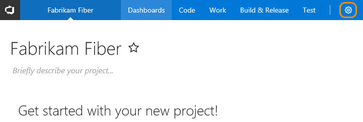

2. Create a new team. Give the team a name, and make sure to select **Create an area path with the name of the team**.

	If you do not select this option, you will have to set the default area path for the team once you create it. You can choose an existing area path or create a new one at that time. Team tools aren't available until the team's default area path is set. 

	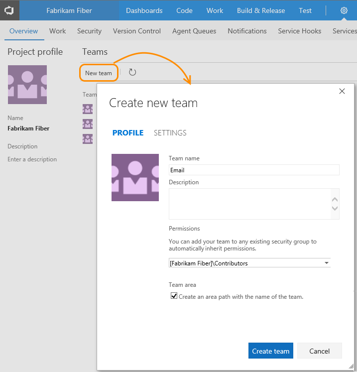

3. Select the team from the Overview tab to configure it. 

	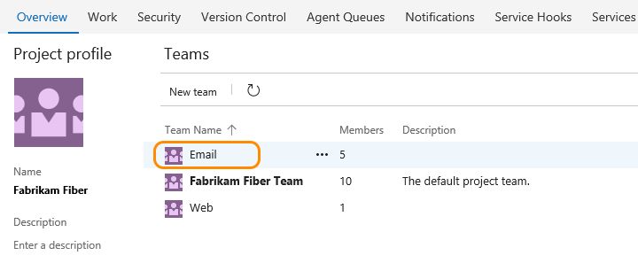

4. To select the set of sprints the team will use, open the **Work>Iterations** page for the team. See [Set team defaults, Select team sprints and default iteration path](set-team-defaults.md#activate).

5. To change the area paths that the team will reference, open the **Work>Areas** page. See [Set team defaults, Set team default area path(s)](set-team-defaults.md#team-area-paths).

<!---
#### TFS 2015, TFS 2013 
<a id="add-team-tfs-2015" />

1. From the web portal, click the  icon to open the administration page for the team project.  

	

2. Create a new team. Give the team a name, and make sure to select **Create an area path with the name of the team**. 

	If you do not select this option, you will have to set the default area path for the team once you create it. You can choose an existing area path or create a new one at that time. Team tools aren't available until the team's default area path is set. 

	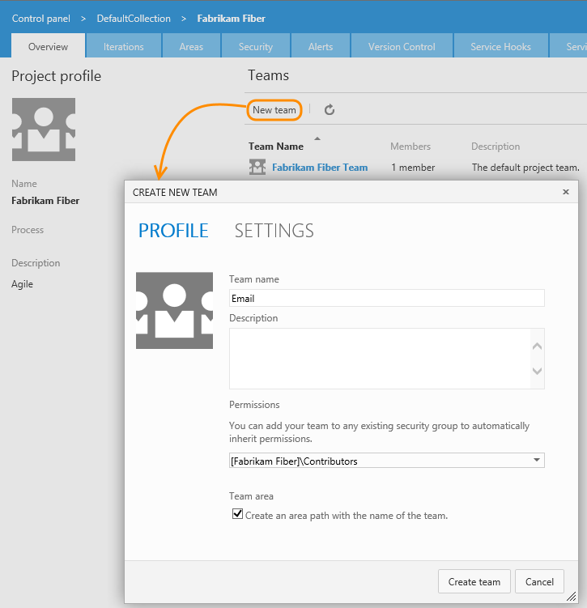

3. Select the team from the Overview tab to configure it.  

	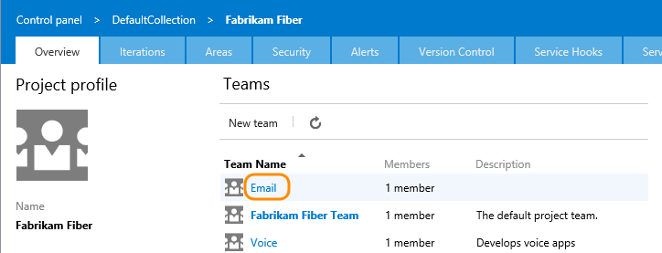

4. To select the set of sprints the team will use, open the **Iterations** page for the team. See [Set team defaults, Select team sprints and default iteration path](set-team-defaults.md#activate).  

5. To change the area paths that the team will reference, open the **Areas** page. See [Set team defaults, Set team default area path(s)](set-team-defaults.md#team-area-paths).  
 
-->     

<a id="add-team-members"> </a>  

## Add team members
If you're moving from one team to two teams, team members already have access to the team project. If you're setting up a team structure for the first time, adding user accounts as team members provides them access to the team project and team assets. Access to the team project is required to support sharing code and planning and tracking work. 

Several Agile tools, like capacity planning and team alerts, and dashboard widgets are team-scoped. That is, they automatically reference the user accounts of team members to support planning activities or sending alerts. 

> [!NOTE]   
> If you use VSTS, you must first [add user accounts to the team project](../../accounts/add-account-users-assign-access-levels.md) or [setup your account to work with Azure AD](../../accounts/access-with-azure-ad.md). This way user accounts will be available to add to a team.
>
>For TFS, the first time you add an account you must enter the full domain name and the alias. Afterwards, you can browse for that name by display name as well as account name. To learn more, see [Set up groups for use in TFS deployments](../../tfs-server/admin/setup-ad-groups.md).

<!---
#### VSTS, TFS 2017  
-->

<a id="add-team-members-team-services" /> 

1. From the Overview tab for your team, add a user account.  

	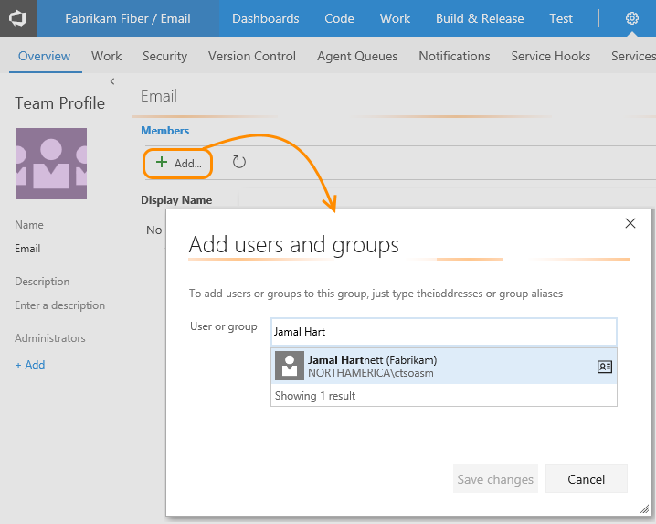

2. Enter the sign-in addresses or display name for each account you want to add. Add them one at a time or all at the same time. 

	

	> [!TIP]    
	> You must enter user and group names one at a time. However, after entering a name, the account is added to the list, and you can type another name in the Identities text box before choosing to save your changes.  
 
3. Now these users are members of the Email team. You can always return to this page to add or remove members. 

	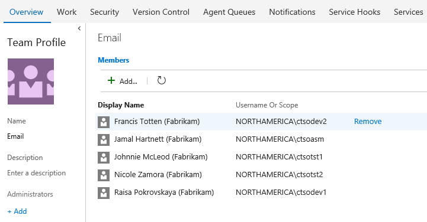 

4. To add an account as a team administrator, click **Add** located in the Team Profile page. For details, see [Configure team settings and add team administrators](manage-team-assets.md).

5. As a last step, send the team URL to newly added team members so they can start contributing to the team.  
	For example:  
	Email team: ```http://vs-2016-test:8080/tfs/DefaultCollection/Fabrikam%20Fiber/Email/_dashboards```   
	Voice team: ```http://fabrikamfiber:8080/tfs/DefaultCollection/Fabrikam%20Fiber/Voice/_dashboards```     

<!---
#### TFS 2015, TFS 2013 
<a id="add-team-members-tfs-2015" />

1. From the Overview tab for your team, add a user account.  

	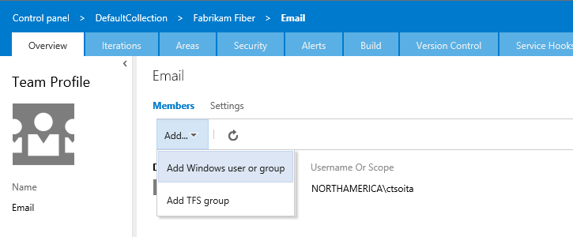 

2. Enter the sign-in addresses or display name for each account you want to add. Add them one at a time or all at the same time. 

	The first time an account is added to TFS, you must enter the full domain name and the alias. Afterwards, you can browse for that name by display name as well as account name. To learn more, see [Set up groups for use in TFS deployments](../../tfs-server/admin/setup-ad-groups.md). </p>

	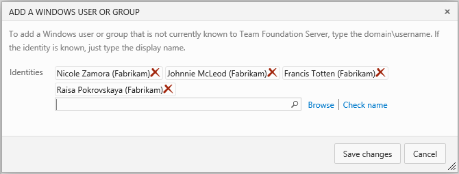 

	> [!TIP]    
	> You must enter user and group names one at a time. However, after entering a name, the account is added to the list, and you can type another name in the Identities text box before choosing to save your changes.  
 
3. Now these users are members of the Email team. You can always return to this page to add or remove members.  

	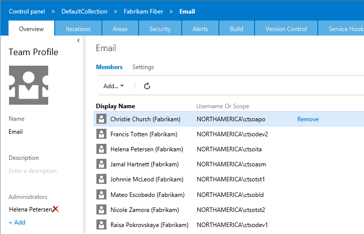

4. To add an account as a team administrator, click **Add** located in the Team Profile page. For details, see [Configure team settings and add team administrators](manage-team-assets.md).</p>

5. As a last step, send the team URL to newly added team members so they can start contributing to the team. 

	For example:   
	Email team: ```http://fabrikamfiber:8080/tfs/DefaultCollection/Fabrikam%20Fiber/Email```   
	Voice team: ```http://fabrikamfiber:8080/tfs/DefaultCollection/Fabrikam%20Fiber/Voice```   
 
-->

## Move work items under teams 
Now that your two feature teams are configured, you'll want to move existing work items from their current assignments to the team's default area path. This way, the work items will show up on each feature team's backlog. 

1.	The quickest way to do this, is to [create a query](../track/using-queries.md) of all work items you want to reassign, multi-select those items belonging to each team, and [bulk edit the area path](../backlogs/bulk-modify-work-items.md). 

	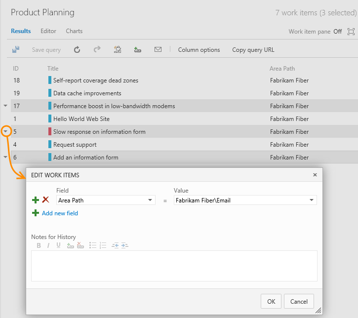 

2.	After you bulk modify, do a bulk save. 
 
	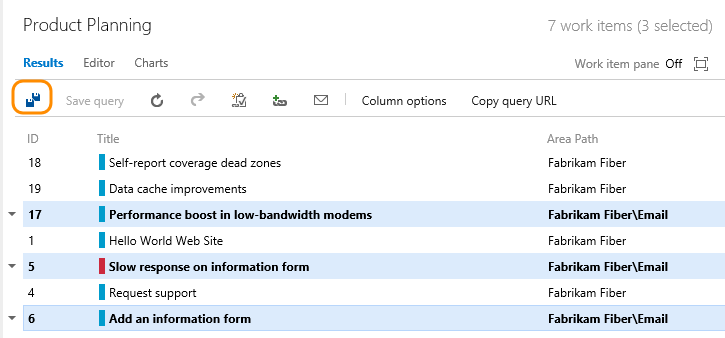 

<a id="include-area-paths"> </a>  

## Configure the default team project  
One last step in moving from one team to two teams requires configuring the default team project to exclude sub-areas.  

1. Open the Areas tab administration page for the team project, and change the setting as shown.  

	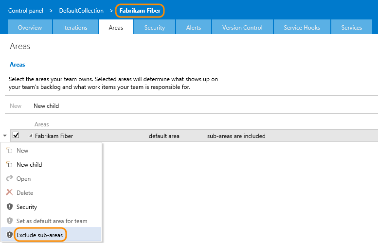 

2.	Refresh the product backlog page for the team, and you'll see only those work items assigned to the Fabrikam\Account Management area path.  

	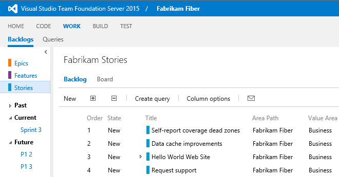 

## Delete a team 

1. To delete a team, open the team project admin context, open the &hellip; context menu for the team you want to delete, and choose the **Delete** option.   

	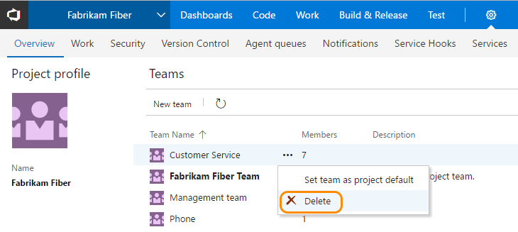  

	You must be a member of the Project Administrators group or be [granted explicit permissions to edit project information](../../security/set-project-collection-level-permissions.md)to delete a team project. 
 
	>[!IMPORTANT]   
	>Deleting a team deletes all team configuration settings, including team dashboards, backlogs, and boards. Data defined for work items assigned to the team are left unchanged. Once deleted, you can't recover the team configurations. 

2. To complete the delete operation, you must type the name of the WIT as shown. 

	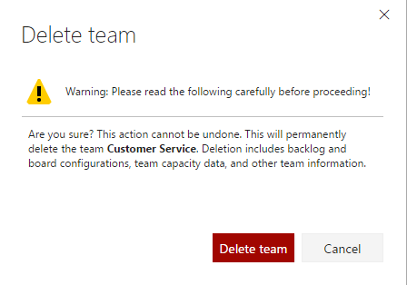  


<a id="grant-add-permissions"></a>  

## Grant team members additional permissions  

For teams to work autonomously, you may want to provide them with permissions that they don't have by default. Suggested tasks include providing team administrators or team leads permissions to:  

- Create and edit child nodes under their default area path
- Create and edit child nodes under an existing iteration node 
- Create shared queries and folders under the Shared Queries folder

For more information on setting the above permissions or restricting access for select users, see [Set permissions and access for work tracking](../../security/set-permissions-access-work-tracking.md).
 
By default, team members inherit the permissions afforded to members of the team project Contributors group. Members of this group can add and modify source code, create and delete test runs, and create and modify work items. They can collaborate with other team members and  [collaborate on a Git team project](../../git/gitquickstart.md) or  [check in work to the team's code base](../../tfvc/check-your-work-team-codebase.md). 

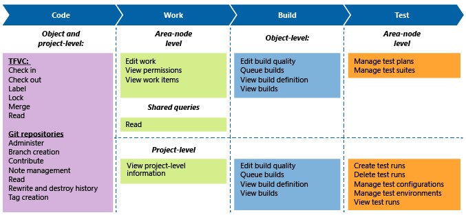  

You can also choose to limit access to select features by making a user a [Stakeholder](../../security/get-started-stakeholder.md) or limiting their access to read-only. For an overview of default permissions and access assignments set for work tracking features and built-in groups, see [Permissions and access for work tracking](../../security/permissions-access-work-tracking.md). 

If your TFS deployment is integrated with a SharePoint product or SQL Server Reports, you'll need to manage membership for those products separately from their websites. 

-  [Set SharePoint site permissions](../../security/set-sharepoint-permissions.md) 
-  [Grant permissions to view or create SQL Server reports in TFS](../../report/admin/grant-permissions-to-reports.md). 


## Try this next 

Once you've created a team, you'll want to configure your Agile tools to support how your team works. Also, consider adding one or more accounts as team administrators. Team admins have the necessary permissions to add team members, add a team picture, and configure and manage all team assets.  

> [!div class="nextstepaction"]
> [Add team administrator](add-team-administrator.md)
> or
> [Configure team settings](manage-team-assets.md)

[!INCLUDE [temp](../_shared/image-differences.md)]  

