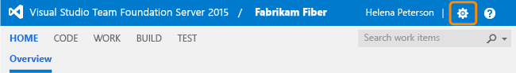
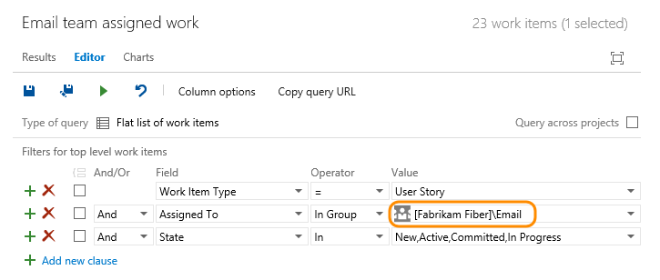

# Add teams and team members  

<b>Team Services | TFS 2017 | TFS 2015 | TFS 2013 </b>  

As your organization grows, you'll want to make sure that you configure your Agile tools to support that growth. To enable each feature team the autonomy it needs to manage their backlog and plan their sprints, they need their own set of team tools. 

>[!NOTE]  
>In this topic you can learn how to add a team or add team members to Team Services or TFS. To learn about Microsoft Teams, see the Marketplace extension, [Microsoft Teams Integration](https://marketplace.visualstudio.com/items?itemName=ms-vsts.vss-services-teams). 
>
>For a good understanding on how to remain Agile as you add teams, review the [Scale Agile to Large Teams](https://www.visualstudio.com/learn/scale-agile-large-teams/) article.


[!INCLUDE [temp](../_shared/image-differences.md)]  

<a id="add-team"> </a>  
## Move from one team to two teams 
As your team grows, you can easily move from one team to two. In this example, we add two feature teams, Email and Voice, and maintain the Fabrikam Fiber team with visibility across each of these two teams.  

If you're not a project administrator, [get added as one](../../setup-admin/add-administrator-tfs.md). Only project administrators can add teams.  


### Add two feature teams 

Add and configure two teams, Email and Voice. Here we show you how to add and configure the Email team. 


<div style="background-color: #f2f0ee;padding-top:10px;padding-bottom:10px;">

<ul class="nav nav-pills" style="padding-right:15px;padding-left:15px;padding-bottom:5px;vertical-align:top;font-size:18px;">
<li style="float:left;" data-toggle="collapse" data-target="#add-team">Add a team to a team project</li> 

<li style="float: right;"><a style="max-width: 374px;min-width: 120px;vertical-align: top;background-color:#AEAEAE;margin: 0px 0px 0px 8px;min-width:50px;color: #fff;border: solid 2px #AEAEAE;border-radius: 0;padding: 2px 6px 0px 6px;outline-style:none;height:32px;font-size:12px;font-weight:400" data-toggle="pill" href="#add-team-tfs-2015">TFS 2015, TFS 2013</a></li>

<li class="active" style="float: right"><a style="max-width: 374px;min-width: 120px;vertical-align: top;background-color:#007acc;margin: 0px 0px 0px 0px;min-width:90px;color: #fff;border: solid 2px #007acc;border-radius: 0;padding: 2px 6px 0px 6px;outline-style:none;height:32px;font-size:12px;font-weight:400" data-toggle="pill" href="#add-team-team-services">Team Services, TFS 2017</a></li>

</ul>
 
<div id="add-team" class="tab-content collapse in fade" style="background-color: #ffffff;margin-left:5px;margin-right:5px;padding: 5px 5px 5px 5px;">


<div id="add-team-team-services" class="tab-pane fade in active"> 

<ol>
<li><p>From the web portal, click the  icon to open the administration page for the team project.</p>

</li>
<li><p>Create a new team. Give the team a name, and make sure to select **Create an area path with the name of the team**.</p> 
<p>If you do not select this option, you will have to set the default area path for the team once you create it. You can choose an existing area path or create a new one at that time. Team tools aren't available until the team's default area path is set.</p> 

</li>
<li><p> Select the team from the Overview tab to configure it.</p>

</li>
<li><p> To select the set of sprints the team will use, open the **Work>Iterations** page for the team. See [Set team defaults, Select team sprints and default iteration path](set-team-defaults.md#activate).</p>
</li>
<li><p>To change the area paths that the team will reference, open the **Work>Areas** page. See [Set team defaults, Set team default area path(s)](set-team-defaults.md#team-area-paths).</p>
</li>
</ol>


</div>


<div id="add-team-tfs-2015" class="tab-pane fade">

<ol>
<li><p>From the web portal, click the  icon to open the administration page for the team project.</p>

</li>
<li><p>Create a new team. Give the team a name, and make sure to select **Create an area path with the name of the team**.</p>
<p>If you do not select this option, you will have to set the default area path for the team once you create it. You can choose an existing area path or create a new one at that time. Team tools aren't available until the team's default area path is set.</p>

</li>
<li><p> Select the team from the Overview tab to configure it.</p>

</li>
<li><p>To select the set of sprints the team will use, open the **Iterations** page for the team. See [Set team defaults, Select team sprints and default iteration path](set-team-defaults.md#activate).</p>
</li>
<li><p>To change the area paths that the team will reference, open the **Areas** page. See [Set team defaults, Set team default area path(s)](set-team-defaults.md#team-area-paths).</p>
</li>
</ol>
</div>
</div>
</div> 
      

<a id="add-team-members"> </a>  

### Add team members
If you're moving from one team to two teams, team members already have access to the team project. If you're setting up a team structure for the first time, adding user accounts as team members provides them access to the team project and team assets. Access to the team project is required to support sharing code and planning and tracking work. 

Several Agile tools, like capacity planning and team alerts, and dashboard widgets are team-scoped. That is, they automatically reference the user accounts of team members to support planning activities or sending alerts. 

>[!NOTE]   
>If you use Team Services, you must first [add user accounts to the team project](../../setup-admin/team-services/add-account-users-assign-access-levels-team-services.md) or [setup your account to work with Azure AD](../../setup-admin/team-services/manage-organization-access-for-your-account-vs.md). This way user accounts will be available to add to a team.
>
>For TFS, the first time you add an account you must enter the full domain name and the alias. Afterwards, you can browse for that name by display name as well as account name. To learn more, see [Set up groups for use in TFS deployments](../../setup-admin/tfs/admin/setup-ad-groups.md).

<div style="background-color: #f2f0ee;padding-top:10px;padding-bottom:10px;">

<ul class="nav nav-pills" style="padding-right:15px;padding-left:15px;padding-bottom:5px;vertical-align:top;font-size:18px;">
<li style="float:left;" data-toggle="collapse" data-target="#add-team-members">Add team members</li> 

<li style="float: right;"><a style="max-width: 374px;min-width: 120px;vertical-align: top;background-color:#AEAEAE;margin: 0px 0px 0px 8px;min-width:50px;color: #fff;border: solid 2px #AEAEAE;border-radius: 0;padding: 2px 6px 0px 6px;outline-style:none;height:32px;font-size:12px;font-weight:400" data-toggle="pill" href="#add-team-members-tfs-2015">TFS 2015, TFS 2013</a></li>

<li class="active" style="float: right"><a style="max-width: 374px;min-width: 120px;vertical-align: top;background-color:#007acc;margin: 0px 0px 0px 0px;min-width:90px;color: #fff;border: solid 2px #007acc;border-radius: 0;padding: 2px 6px 0px 6px;outline-style:none;height:32px;font-size:12px;font-weight:400" data-toggle="pill" href="#add-team-members-team-services">Team Services, TFS 2017</a></li>

</ul>
 
<div id="add-team-members" class="tab-content collapse in fade" style="background-color: #ffffff;margin-left:5px;margin-right:5px;padding: 5px 5px 5px 5px;">


<div id="add-team-members-team-services" class="tab-pane fade in active"> 

<ol>
<li><p>From the Overview tab for your team, add a user account. </p>

</li>
<li><p>Enter the sign-in addresses or display name for each account you want to add. Add them one at a time or all at the same time.</p>

<blockquote><b>Tip: </b>You must enter user and group names one at a time. However, after entering a name, the account is added to the list, and you can type another name in the Identities text box before choosing to save your changes.  
</blockquote>
</li>
<li><p>Now these users are members of the Email team. You can always return to this page to add or remove members.</p>
 
<li><p>To add an account as a team administrator, click **Add** located in the Team Profile page. For details, see [Configure team settings and add team administrators](manage-team-assets.md).</p>
</li>
<li><p>As a last step, send the team URL to newly added team members so they can start contributing to the team. For example: <br/>
Email team: ```http://vs-2016-test:8080/tfs/DefaultCollection/Fabrikam%20Fiber/Email/_dashboards``` <br/>
Voice team: ```http://fabrikamfiber:8080/tfs/DefaultCollection/Fabrikam%20Fiber/Voice/_dashboards```   
</p> 
</li>
</ol>

</div>


<div id="add-team-members-tfs-2015" class="tab-pane fade">

<ol>
<li><p>From the Overview tab for your team, add a user account. </p>
 
</li>
<li><p>Enter the sign-in addresses or display name for each account you want to add. Add them one at a time or all at the same time.</p>
<p>The first time an account is added to TFS, you must enter the full domain name and the alias. Afterwards, you can browse for that name by display name as well as account name. To learn more, see [Set up groups for use in TFS deployments](../../setup-admin/tfs/admin/setup-ad-groups.md). </p>
 
<blockquote><b>Tip:</b> You must enter user and group names one at a time. However, after entering a name, the account is added to the list, and you can type another name in the Identities text box before choosing to save your changes.  
</blockquote>
 
</li>
<li><p>Now these users are members of the Email team. You can always return to this page to add or remove members. </p>

</li>
<li><p>To add an account as a team administrator, click **Add** located in the Team Profile page. For details, see [Configure team settings and add team administrators](manage-team-assets.md).</p>
</li>
<li><p>As a last step, send the team URL to newly added team members so they can start contributing to the team. For example: <br/>
Email team: ```http://fabrikamfiber:8080/tfs/DefaultCollection/Fabrikam%20Fiber/Email``` <br/>
Voice team: ```http://fabrikamfiber:8080/tfs/DefaultCollection/Fabrikam%20Fiber/Voice```   
</p> 
</li>

</ol>
</div>
</div>
</div> 
 

### Move work items under teams 
Now that your two feature teams are configured, you'll want to move existing work items from their current assignments to the team's default area path. This way, the work items will show up on each feature team's backlog. 

1.	The quickest way to do this, is to [create a query](../track/using-queries.md) of all work items you want to reassign, multi-select those items belonging to each team, and [bulk edit the area path](../backlogs/bulk-modify-work-items.md). 

	 

2.	After you bulk modify, do a bulk save. 
 
	 

<a id="include-area-paths"> </a>  

### Configure the default team project  
One last step in moving from one team to two teams requires configuring the default team project to exclude sub-areas.  

1. Open the Areas tab administration page for the team project, and change the setting as shown.  

	 

2.	Refresh the product backlog page for the team, and you'll see only those work items assigned to the Fabrikam\Account Management area path.  

	 

<a id="grant-add-permissions"></a>  

## Grant team members additional permissions  

For teams to work autonomously, you may want to provide them with permissions that they don't have by default. Suggested tasks include providing team administrators or team leads permissions to:  

- [Create and edit child nodes under their default area path](../customize/set-area-paths.md)  
- [Create and edit child nodes under an existing iteration node](../customize/set-area-paths.md)  
- [Create shared queries and folders under the Shared Queries folder](../track/set-query-permissions.md).  
 
By default, team members inherit the permissions afforded to members of the team project Contributors group. Members of this group can add and modify source code, create and delete test runs, and create and modify work items. They can collaborate with other team members and [check in work to the team's code base](https://msdn.microsoft.com/library/ms181407.aspx) or [collaborate on a Git team project](../../git/get-started.md).  

  

If your on-premises TFS deployment includes reporting or SharePoint Products, add users to those resources. See [Add users to a team project](../../setup-admin/add-users.md). 

<a id="team-group"> </a>
###Team group 

You can use this group to filter queries. The name of team groups follows the pattern [Team Project Name]\Team Name. For example, the following query finds work assigned to members of the [Fabrikam Fiber]\Email team group.

 

 


## Try this next 

Once you've created a team, you'll want to configure your Agile tools to support how your team works. Also, consider adding one or more accounts as team administrators. Team admins have the necessary permissions to add team members, add a team picture, and [configure and manage all team assets](manage-team-assets.md).  

If team members don't have access to all the features they want, check that they have [the access level needed for those features](../connect/change-access-levels.md).  


## Related notes

From a specific team admin page, you can rename a team or change the team description. Here are a few other topics related to working with teams: 
 
- [Switch team project or team focus](../how-to/switch-team-context-work.md)  
- [Configure team settings, add team administrators](manage-team-assets.md)  
- [Visibility across teams](visibility-across-teams.md)  
- [Review team plans](review-team-plans.md)    
- [Track work when contributing to several teams](capacity-planning.md)
- [Scaled Agile Framework](scaled-agile-framework.md)   
- [Practices that scale](practices-that-scale.md) 
- [Restrict access to select features and functions](../../setup-admin/restrict-access-tfs.md)   


### Work on more than one team

Can a user account belong to more than one team?  

Yes. When you add user accounts to a team project, you can add them as members of the team project, or you can add them to one or more teams added to the team project. If you work on two or more Scrum teams, you'll want to make sure you, [specify your sprint capacity for each team you work on](capacity-planning.md). 


### Delete a team 

1. To delete a team, open the team project admin context, open the &hellip; context menu for the team you want to delete, and choose the **Delete** option.   

	  

	You must be a member of the Project Administrators group or be [granted explicit permissions to edit project information](../../setup-admin/permissions.md#edit-team-project-level-information-permission) to delete a team project. 
 
	>[!IMPORTANT]   
	>Deleting a team deletes all team configuration settings, including team dashboards, backlogs, and boards. Data defined for work items assigned to the team are left unchanged. Once deleted, you can't recover the team configurations. 

2. To complete the delete operation, you must type the name of the WIT as shown. 

	  

 
 