# Portfolio management 

[!INCLUDE [temp](../_shared/version-vsts-tfs-all-versions.md)]

Portfolio backlogs provide product owners insight into the work performed by several agile feature teams. Product owners can define the high-level goals as Epics or Features, and feature teams can break these down into the user stories they'll prioritize and develop.  

In this topic you'll learn:  

>[!div class="checklist"]    
> * How to support a management view of multiple team progress
> * How feature teams can focus on their team backlog progress  
> * How to assign work from a common backlog
> * How to set up a hierarchical set of teams and backlogs
  

By setting up a team structure like the one shown, you provide each feature team with their distinct backlog to plan, prioritize, and track their work. And, portfolio or product owners can  create their vision, roadmap, and goals for each release, monitor progress across their portfolio of projects, and manage risks and dependencies.  

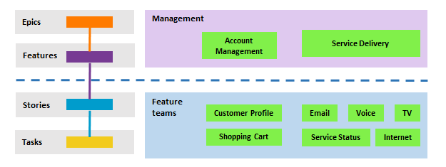 

[Set up a hierarchical team and backlog structure](#set_up) when you want to support:

- Autonomous feature teams that can organize and manage their backlog of work
- Portfolio management views for planning epics and features and monitoring progress of subordinate feature teams
- Assign backlog items to feature teams from a common backlog 

 
[!INCLUDE [image differences](../_shared/image-differences.md)]

## Management view of team progress 

The Fabrikam Account Management portfolio owner has several campaigns to initiate and deliver in the coming year. He creates an epic for each campaign and then breaks each epic down into various features that contribute to each campaign. 

With the hierarchical structure implemented, portfolio owners working in Account Management can view the epic, feature, and product backlogs for their area. 

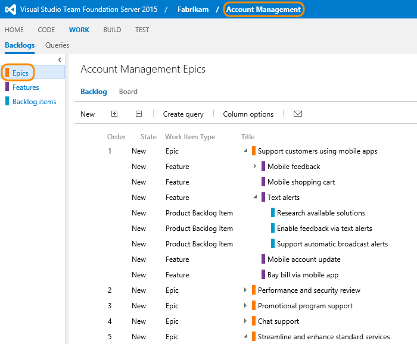 

All work items under the Fabrikam/Account Management area path appear in their backlog view. You can expand a single item or use the expand  and collapse  icons to expand or collapse one level of the hierarchy. 

> [!NOTE]    
>Program managers can gain insight into progress across teams using [Delivery plans](review-team-plans.md). See also [Visibility across teams](visibility-across-teams.md).  

## Feature team backlog ownership and view of progress 

The Customer Profile feature team's view of the backlog only includes those work items assigned to their area path, Fabrikam/Account Management/Customer Profile. Here we show parents which provides a few of the features and epics to which the backlog items belong. Items that are owned by other teams appear with hollow-filled bars. For example, Mobile feedback and Text alerts belong to the Account Management team.   

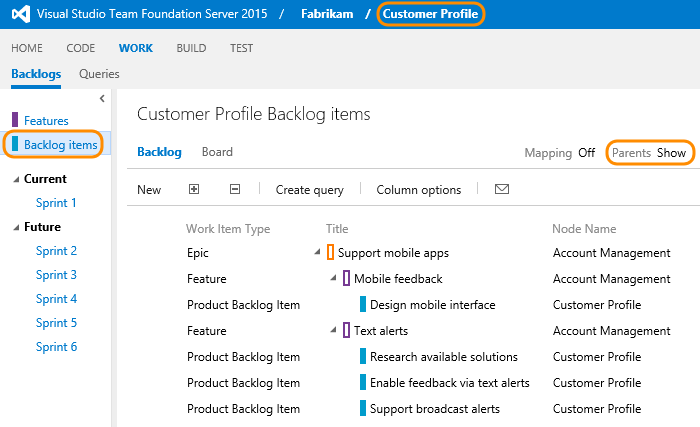 

> [!TIP]    
>Add **Node Name** to the column options to show the team assigned to the work item.   
 
Each feature team has its own team home page, backlog, Kanban board, and task board. These pages only show work relevant to each team, based on assignments made to the work item area and iteration paths.  
 
## Assign work from a common backlog
While the hierarchical team and backlog structure works well to support autonomous teams to take ownership of their backlog, it also supports assigning work to teams from a common backlog. During a sprint or product planning meeting, product owners and development leads can review the backlog and assign select items to various teams.   

In this Account Management view, all Product Backlog Items still under Account Management have yet to be assigned.

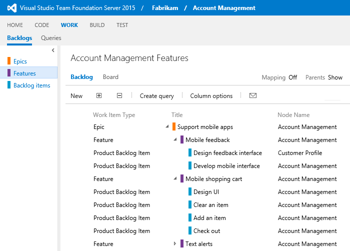 

During the planning meeting, you can open each item, make notes, and assign the item to the team to work on it. 

Here, all backlog items have been assigned to feature teams. While all features and epics remain owned by Account Management. 

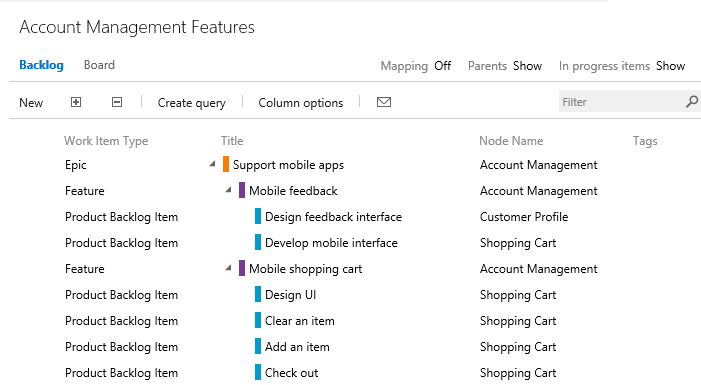

> [!TIP]    
>You can multi-select work items and perform a bulk edit of the area path. In VSTS you can do this from any backlog. From on-premises TFS, you can create a backlog query and [perform bulk updates from the query results](../backlogs/bulk-modify-work-items.md).    

##Set up hierarchical teams and backlogs

The first step is to add a team for each feature team and management area. When you finish, you'll have a set of teams similar to the ones shown.  

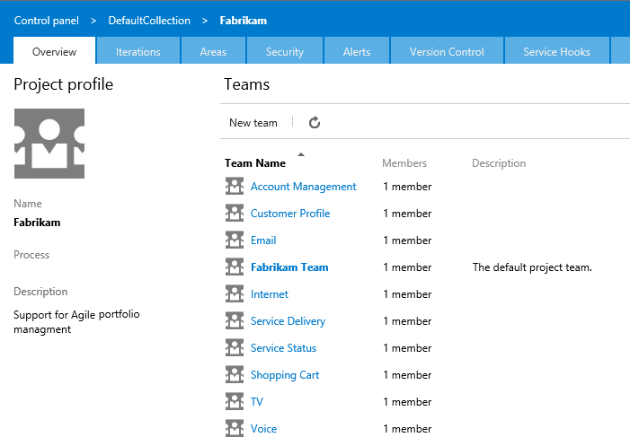

You'll need to be a [project administrator](../../organizations/security/set-project-collection-level-permissions.md) to perform these steps.

1. To add a team, give the team a name, and make sure to select **Create an area path with the name of the team**.

	

	To access this page, choose the  gear icon from your team home page.  

	Repeat this step for all teams and management areas.  

2. In this next step, you want to move the areas paths associated with feature teams from a flat structure to a hierarchical structure. For details on this step, see [Set team default area paths](set-team-defaults.md#team-area-paths) 
	<table>
	<tbody valign="top">
	<tr>
	<th>Flat area structure</th>
	<th>Hierarchical area structure</th>
	</tr>
	<tr>
	<td>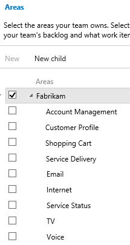 </td>
	<td>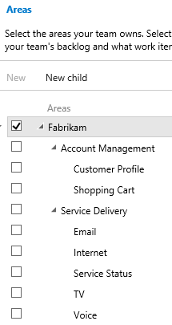</td>
	</tr>
	</tbody>
	</table>

	You do this by opening each area path associated with a feature team and change its location to be under the management area path. For example, here we move the Customer Profile area path to under Account Management

	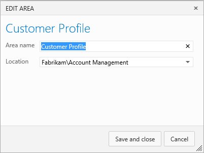  

	Repeat this step for all feature team area paths. 

3. Next, you want to change the area path setting for management areas to include sub-area paths. The default setting for all teams is to exclude sub- area paths. 

	Here we choose to include sub-area paths for the Account Management area.  

	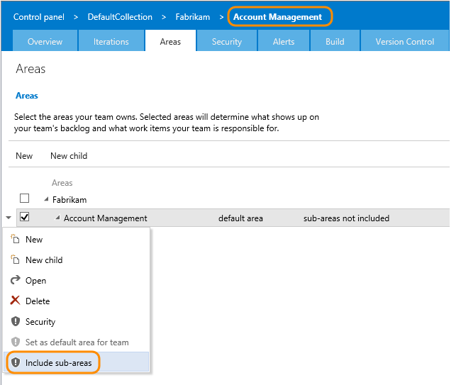 

	Repeat this step for all your management areas. Also, if you want to enable rollup across all feature teams and management areas to the top level area, repeat this step for the default team. In our example, that corresponds to Fabrikam.   

4. Add team administrators for each feature team and management area. You do this from the Overview page of the team admin context.   

	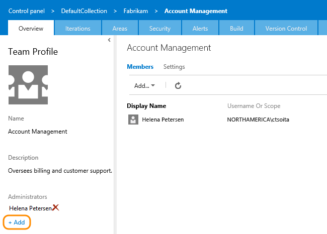  

	Add the account identity, for example the product owner, development lead, or other team member who has primary responsibility for planning and reporting progress.  

	  

	In this way, the team administrators can add additional team admins and team members. They can also configure their team settings and manage their Agile tools and team assets.  

	Optionally, [grant team administrators additional permissions](multiple-teams.md#grant-add-permissions).  

### Define a single sprint cadence for all teams 

If your feature teams use Scrum and work in sprints, you'll want to set up a series of sprints that all teams can use. By default, you'll see a set of predefined sprints. Add more sprints and set their sprint dates as described in [Add iterations and set iteration dates](../../organizations/settings/set-iteration-paths-sprints.md). 

You do this from the team project admin context. 

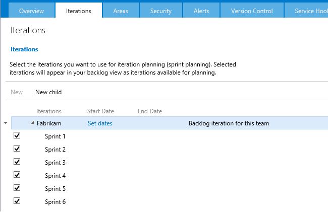 

Here we've defined the start and end dates of the first 6 sprints corresponding to a 3-week cadence.  
 
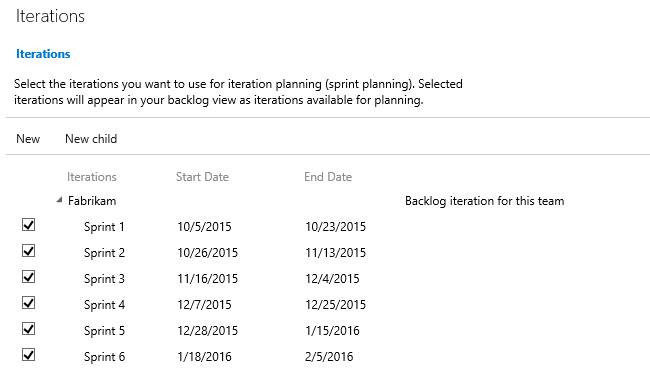

###Customize Agile tools and configure team settings 

These next set of steps can be performed by a team administrator.  
- [Add team members](multiple-teams.md#add-team-members)
- [Select sprints for the team](../../organizations/settings/set-team-defaults.md#activate)
- [Activate backlog levels](../customize/select-backlog-navigation-levels.md) 
- [Show bugs on backlogs and boards](../customize/show-bugs-on-backlog.md) 

See [Configure team settings](manage-team-assets.md) for an overview of all Agile tools and team assets.

## Try this next
With the hierarchical set of teams in place, you're well positioned to start planning and using the Agile tools available. To take the next steps in planning your portfolio of projects, see these articles: 

- [Review team plans](review-team-plans.md)
- [Add management dashboards with multi-team views](visibility-across-teams.md#add-management-dashboards-with-multi-team-views). 
- [Work with multi-team ownership of backlog items](../backlogs/work-multi-team-ownership-backlogs.md)
- [Select backlog navigation levels for your team](../customize/select-backlog-navigation-levels.md) 
- [Track capacity when working on more than one team](../scrum/set-capacity.md#track-capacity-per-team) 

## Related articles
 
- [Create your backlog](../backlogs/create-your-backlog.md)  
- [Kanban](../kanban/kanban-basics.md)
- [assign-work-sprint](../scrum/assign-work-sprint.md)
- [Organize your backlog](../backlogs/organize-backlog.md)
- [Customize your work tracking experience](../customize/customize-work.md)

If you need additional portfolio backlogs&mdash;for example, Scenarios or Initiatives&mdash;you can [add them as well](../customize/add-portfolio-backlogs.md).  

### Track dependencies across teams 

The simplest way to track dependencies is to link work items using  the Related link type. You can then create queries that find work items containing these relationships. 

Additionally, you can use the Predecessor and Successor links when time dependencies factor in. 
 
See [Manage dependencies, link work items to support traceability](../track/link-work-items-support-traceability.md) to learn more.

 